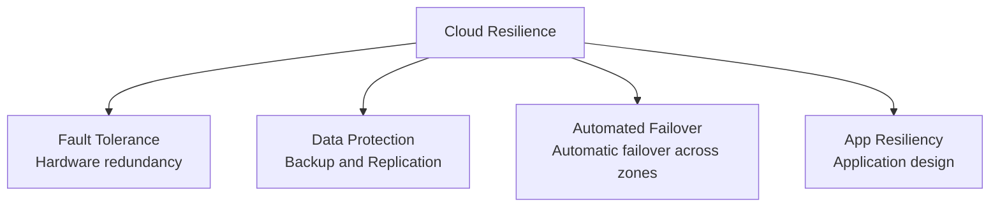
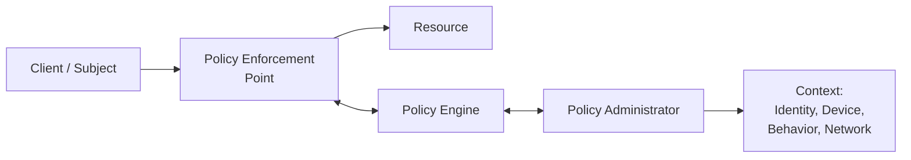
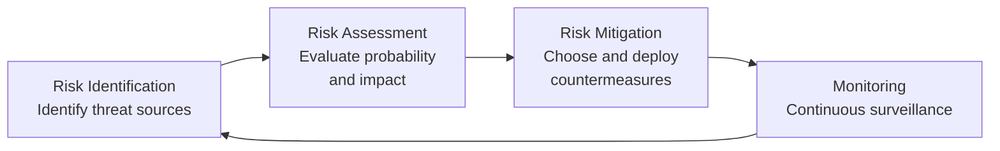

---
tags:
  - università/datacenter-design-and-operation
  - business-continuity
  - security
  - cloud
data: 2026-05-21
lezione: "19 - Business Continuity and Security"
professore: "Antonio Cisternino"
---

# Business Continuity and Security in the Cloud

This lecture covers two *cross-cutting* functions of the cloud reference model: **business continuity** and **security**. Both permeate every level of the stack, from compute to storage, from networking to applications. The lecture also provides a brief overview of **service portfolio management** in the cloud.

---

## Business Continuity

### What It Means and Why It Matters

**Business continuity** (*BC*) is the set of practices that allow an organization to prepare for, respond to, and recover from a service disruption that negatively impacts operations. In plain terms: someone is paying for a service, and if that service goes down, that person has a problem.

The key insight is that in cloud-scale datacenters failures are *physiological*, not exceptions. A single disk has a failure probability of, say, 1 in 10,000 per day. With 10,000 disks, statistically one breaks every day. The challenge is not to eliminate failures, but to **detect the problem, contain its impact, and restore service** without the user ever noticing.

> [!warning] Outages are nearly unforgivable in the cloud
>
> The professor cited the Netflix outage roughly 14 years ago, caused by a tornado that brought down a datacenter in New Jersey. Netflix was not in control of the situation. In the cloud, as with data loss in storage, a prolonged outage is considered extremely serious: direct revenue is lost, customers must be compensated (typically with credits, not cash), and above all, reputation is at stake.

### Service Availability

Availability is measured with a simple formula:

$$
\text{Service Availability} (\%) = \frac{\text{Agreed Service Time} - \text{Downtime}}{\text{Agreed Service Time}} \times 100
$$

The market minimum is **4×9** (99.99%), equivalent to roughly 52 minutes of downtime per year. Cloud contracts often include a *scheduled downtime* clause that does not count as actual downtime: in practice, providers like Microsoft Azure almost never announce planned maintenance, but legally reserve the right to do so.

> [!note] The cloud market as a competitive pressure mechanism
>
> Because most companies use cloud as IaaS, *switchover* to another provider is technically feasible. This creates competitive pressure that incentivizes providers to maintain very high availability levels.

### Causes of Unavailability

- **Hardware failure** (CPU, storage, network components)
- **Software bugs** in applications
- **Data loss**
- **Failure of dependent services**
- **Datacenter or site completely offline** (extreme events: e.g., a drone striking a datacenter in the UAE)
- **IT infrastructure refresh**

*Root cause analysis* in these conditions is complicated because the system is distributed and failures propagate.

![[dcdo_bc_causes_unavailability.png]]
*Fig. — Main causes of unavailability in the cloud.*

### Techniques for Achieving Resilience

The main techniques operate at multiple levels:

*Fig. — The four pillars of cloud resilience.*

> [!tip] Redundancy ≠ substitute for backup
>
> A redundant system that is working can still corrupt data. Redundancy protects against *unavailability*, backup protects against *data corruption or loss*. Both must be used together.

---

## Fault Tolerance: Redundancy and Single Points of Failure

### Single Point of Failure

> [!definition] Single Point of Failure (SPOF)
>
> Any single component whose failure renders the entire system or service unavailable.

A SPOF can exist at the component level (CPU, disk, NIC) but also at the rack or datacenter level. If two servers are replicated but placed in the same rack, the *rack* itself becomes a SPOF: a failure in the rack's PDU (*Power Distribution Unit*) takes down both servers.

The logical solution is to distribute redundant instances across **different racks**, **different zones**, or **different datacenters**.

![[dcdo_bc_spof.png]]
*Fig. — Single Point of Failure at component, rack, and datacenter level.*

### Compute Clustering

> [!definition] Compute Clustering
>
> Technique in which two or more servers (nodes) work together and are presented as a single system, providing high availability and load balancing.

Both Linux and Windows support clustering. Clustering software automatically distributes services across nodes and, upon node failure, reallocates resources to the remaining ones. In virtualization, an **hypervisor cluster** enables live migration of VMs between physical hosts.

![[dcdo_bc_hypervisor_cluster.png]]
*Fig. — Hypervisor cluster: VMs are distributed across physical hosts and migrated automatically upon failure.*

### Active/Active vs Active/Passive

This schema applies at any level: compute, networking, storage.

- **Active/Passive**: one system is on standby. If the active system fails, the passive one takes over. Simpler to implement but wastes resources: the passive system may sit idle for a long time, and might fail to start correctly when needed.
- **Active/Active**: both systems work simultaneously, serving requests. More complex to implement (requires presenting a single logical identity to the outside, coordinating state), but uses resources more efficiently and provides graceful degradation upon failure.

> [!example] Spine-and-Leaf and active/active
>
> In the spine-and-leaf networks discussed in previous lectures, LACP (*Link Aggregation Control Protocol*) allows two physical links toward two distinct switches to behave as a single logical link. If one link fails, bandwidth degrades but traffic continues. This is active/active. With Spanning Tree, there would be one active link and one blocked (active/passive).

![[dcdo_bc_link_switch_aggregation.png]]
*Fig. — Link and switch aggregation in a spine-and-leaf topology with LACP.*

### NIC Teaming and Multipathing

**NIC Teaming** applies the same principle at the network card level: multiple physical NICs are aggregated into a single logical NIC as seen by the operating system or hypervisor. If one NIC fails, traffic continues on the others.

![[dcdo_bc_nic_teaming.png]]
*Fig. — NIC Teaming: multiple physical network cards aggregated into a single logical interface.*

**Multipathing** in storage: the system defines multiple physical paths to a LUN (*Logical Unit Number*). Storage load-balances across all paths and, if one fails, I/O traffic is automatically redirected.

![[dcdo_bc_multipathing.png]]
*Fig. — Multipathing: redundant I/O paths to the same storage LUN.*

### In-Service Software Upgrade (ISSU)

> [!definition] In-Service Software Upgrade (ISSU)
>
> Technique that allows upgrading software on network devices (switches, routers) without interrupting network availability.

It works because high-end network devices have redundant control components (*supervisors* or *routing engines*). Software is upgraded on one engine while the other keeps the network operational. The same principle applies in the datacenter: with three power feeds to each rack, one feed at a time can be taken offline for maintenance without ever powering down the rack.

### RAID, Erasure Coding, and LUN Mirroring

- **RAID** (*Redundant Array of Independent Disks*): distributes data and parity across multiple disks, protecting against the loss of one or more disks depending on the RAID level.
- **Dynamic disk sparing**: automatic replacement of a failed disk with a spare.
- **Erasure coding**: mathematical technique that divides a set of *n* disks into *m* data disks and *k* coding disks. Tolerates multiple failures with optimal space overhead compared to RAID.
- **Mirrored LUN**: a LUN is replicated across two distinct storage systems, providing RAID-1-equivalent resilience at the logical array level.

![[dcdo_bc_erasure_coding.png]]
*Fig. — Erasure coding: data and redundancy symbols distributed across multiple disks.*

![[dcdo_bc_mirrored_lun.png]]
*Fig. — Mirrored LUN: storage replication at the logical array level across distinct sites.*

---

## Availability Zones

To eliminate SPOFs at the datacenter or rack level, **availability zones** are used.

> [!definition] Service Availability Zone
>
> An availability zone is a portion of a datacenter (or an entire datacenter) with its own set of resources, physically and logically isolated from other zones. Zones within the same region are connected via low-latency networking.

The reasoning is: if two instances of the same service exist, they are placed in different zones — part in one datacenter zone, part in another zone or a separate datacenter. Failover between zones can be configured as **active/passive** or **active/active**.

![[dcdo_bc_zone_active_passive.png]]
*Fig. — Active/passive configuration across availability zones: the secondary zone is on standby.*

![[dcdo_bc_zone_active_active.png]]
*Fig. — Active/active configuration across zones: both zones serve requests simultaneously.*

### Zone Failover: Replication vs. Service Failover

Two distinct approaches exist:

1. **Service failover**: when a zone goes down, the service is restarted (*reboot*) in a new zone. There is a brief interruption. Simpler to implement.

2. **VM replication**: the VM is continuously replicated to the other zone (e.g., every 30 seconds). The process is similar to live migration: changes to VM state are tracked and transmitted. Upon failure, a copy with at most 30 seconds of lag is resumed — only the in-memory state of the last 30 seconds is lost, without restarting from scratch.

Replication drastically reduces **RTO** (*Recovery Time Objective*). In service failover, RTO equals service restart time; with replication it is nearly zero.

> [!tip] Key conceptual difference
>
> VM replication preserves transient state (memory). Service failover restarts the process from scratch but from a consistent image. The choice depends on RTO requirements and application complexity.

---

## Data Protection: Backup and Replication

### RPO and RTO

> [!definition] RPO — Recovery Point Objective
>
> How far back in time one can tolerate going upon restoration from backup. Defines how frequently backups are performed (every hour, day, week).

> [!definition] RTO — Recovery Time Objective
>
> How long it takes to restore service from a backup. Depends on the technology used and the volume of data to recover.

### The Technical Challenge of Backup

Backup is conceptually simple (making a copy of data), but technically very complex at scale.

> [!example] Backup time calculation
>
> 1 petabyte = $8 \times 10^6$ gigabits. With a 100 Gbit/s network:
> $$\frac{8 \times 10^6 \text{ Gbit}}{100 \text{ Gbit/s}} = 80{,}000 \text{ s} \approx 22 \text{ hours}$$
> In practice the network is never saturated at 100%, so 3–5 hours is easily reached even for backups of a few hundred TB. This is why many large providers use **dedicated backup networks**, so that backup traffic does not impact production.

**Differential backup** (backing up only data modified since the last backup) is used to reduce daily volume, but a **full backup** is periodically required.

### Backup Optimization Drivers

- **Backup window**: available time window (typically overnight) — a bandwidth × available hours limit applies
- **Retention period**: legal obligations to retain data for a given period. In Italy, service providers must retain certain data for 5 years for judicial authorities.
- **Deduplication**: elimination of redundant data before or after transfer, at the file level (*file-level*) or block level (*fixed-length* or *variable-length block*). Can be performed **source-side** (reducing network traffic) or **target-side** (shifting CPU load to the target).

### Backup Targets

The main backup targets are:
- **Disk library**: faster access, affordable cost today
- **Tape library**: slower access times, but long durability and very low cost per GB — ideal for long-term archives

### Replication

> [!definition] Replication
>
> Process of creating an exact copy of data (*replica*) to ensure service availability.

Replication differs from backup: backup retains historical versions; a replica maintains only the current state (or few versions).

- **Local replication (snapshot)**: a virtual copy of the volume at a given instant (*Point-In-Time*). In virtual storage, a snapshot creates a child disk (*delta disk*) that tracks only the blocks modified relative to the parent disk.
- **Synchronous remote replication**: the write is confirmed to compute only after it has been replicated to the remote site. RPO ≈ 0, but network latency adds significant overhead.
- **Asynchronous remote replication**: the write is confirmed immediately and replication follows later. Finite RPO (depends on lag), but does not slow the system. The most common approach.

> [!tip] Consistency in the distributed case
>
> Synchronous replication guarantees perfect consistency, but if the two sites are distant (high latency), every write waits for the round-trip. *Eventual consistency* is an acceptable alternative: data will eventually be consistent, but software must be developed without assuming instantaneous consistency. This is the typical model for object storage (S3, Azure Blob).

### CDP — Continuous Data Protection

> [!definition] CDP
>
> Advanced replication solution that continuously captures every change to data, allowing the system to be restored to any previous *Point-In-Time* (not just scheduled snapshots).

Key components:
- **Journal volume**: contains all changes since the start of the replication session. Journal size determines how far back in time recovery is possible.
- **CDP appliance**: hardware/software that manages local and remote replication.
- **Write splitter**: intercepts writes to the production volume and duplicates them: one copy goes to the production volume, the other to the journal.

### DRaaS — Disaster Recovery as a Service

In DRaaS mode, a cloud provider offers resources to run the customer's IT services in the event of a disaster. Under normal conditions, customer data is replicated (encrypted) to the provider. In the event of a disaster, VMs are instantiated on the provider's resources from the replicated storage.

![[dcdo_bc_cdp_operations.png]]
*Fig. — CDP Operations: local and remote replication via write splitter and journal volume.*

---

## Application Resiliency

Even when infrastructure is resilient, a poorly designed application can be a SPOF. The professor emphasized that resilience must be designed into the software as well.

### Graceful Degradation

The application maintains limited functionality even when some modules or dependent services are unavailable. The system does not crash entirely but degrades in a controlled manner. Example: an e-commerce site continues accepting orders even when the payment gateway is unreachable, processing them when the gateway becomes available again.

### Retry Logic

If an operation fails due to a transient error, instead of crashing the application, a few seconds are waited and the operation is retried. A retry strategy must define a maximum number of attempts before declaring the service unrecoverable. A successful retry is transparent to the user.

### Persistent Application State Model

Application state is saved outside of memory (in a persistent data repository). If a process crashes, a new process can resume from the saved state without losing all previous work. The professor noted that this pattern is common in mobile applications.

### Event-Driven Processing

Instead of processing requests synchronously, applications read requests from a queue asynchronously. This allows multiple instances to serve requests and makes the system resilient to the loss of one instance: unprocessed requests remain in the queue and are picked up by another instance.

---

## Security

### Why Security in the Cloud Is Critical

Information is an organization's most valuable asset. The fundamental problem of cloud security is **trust**: customers must trust that the provider respects contracts and does not access their data. The professor's formula is:

$$\text{Trust} = \text{Visibility} + \text{Control}$$

The provider must give the customer visibility into what happens to their data and control over who can access it.

> [!note] Criticism of cloud providers and trust
>
> Critics of providers like Microsoft often use the argument "they could read our data." The professor counters that without concrete evidence, no legal action is possible, and that this concern reduces entirely to trust. The technical answer is to increase visibility and control.

### CIA — Confidentiality, Integrity, Availability

> [!definition] CIA
>
> The triple objective of information security:
> - **Confidentiality**: only authorized users can access data
> - **Integrity**: data cannot be modified by unauthorized users
> - **Availability**: authorized users have reliable and timely access to resources

Availability has grown in importance: a DoS (*Denial of Service*) attack that renders data inaccessible is now considered a security attack, not merely an infrastructure problem. If a student needs a degree certificate for a public job application and the university system is down, they are in serious difficulty.

### AAA — Authentication, Authorization, Auditing

A common mistake is confusing authentication with authorization:

- **Authentication**: verifying that the user is who they claim to be (associating a digital identity with a real person)
- **Authorization**: determining what that user is allowed to do, typically via roles
- **Auditing**: verifying that the system is behaving as expected; can be performed by internal or external auditors

Authentication must always precede authorization.

### Defense-in-Depth

A layered approach to security: instead of a single line of defense, multiple layers are built. If one is breached, the next is already waiting. This slows down the attacker and provides time to detect and respond.

![[dcdo_sec_defense_in_depth.png]]
*Fig. — Defense-in-depth: multiple overlapping security layers, from the physical perimeter to the data.*

### Trusted Computing Base (TCB)

> [!definition] TCB
>
> The set of hardware and software components considered trustworthy. Vulnerabilities within the TCB can compromise the entire system. It must be protected with particular care and periodically verified to ensure it has not been compromised.

If the TCB is compromised (e.g., a compromised hypervisor puts all hosted VMs at risk), the situation is critical.

### Velocity of Attack

In a cloud environment with thousands of homogeneous components, an attack can propagate at very high speed. The homogeneity and standardization of platforms amplify the impact of a single vulnerability. Countermeasures require robust *containment* mechanisms.

---

## Cloud Security Threats

The professor listed the main threats according to CSA (*Cloud Security Alliance*) and ENISA:

### Data Leakage

An attacker gains access to the customer's confidential data. Common vectors: password database compromise, exploit of vulnerable applications, poor traffic segregation, incorrect encryption implementation, or a malicious insider.

**Countermeasures**: encryption of data *at rest* (on disk), *in transit* (HTTPS), and in some cases *in memory*. Multi-factor authentication. An interesting technique is **data shredding/threading**: the file is never stored whole on a single system but distributed as fragments across multiple systems — software reassembles the file knowing where the pieces are. If someone steals a disk, they have only a useless fragment.

### Data Loss

Different from leakage: data is lost, not stolen. Causes: accidental deletion by the provider, destruction in natural disasters.

**Countermeasures**: backup and replication.

### Account Hijacking

An attacker obtains a user's credentials and accesses their account.

**Countermeasures**: multi-factor authentication (MFA), IPSec, IDPS, firewall.

### Insecure APIs

APIs are used for provisioning, configuration, monitoring, and orchestration. With the massive adoption of REST APIs, compromising an API can completely bypass the user interface. APIs must be designed following security best practices, reviewed periodically, and accessible only to authorized users.

### Denial of Service (DoS) and Distributed DoS (DDoS)

> [!definition] DDoS
>
> The distributed variant of DoS: the attacker controls a *botnet* (a network of infected computers whose owners are unaware they are participating in the attack) and uses it to concentrate traffic against a target. The master program coordinates agents that launch the attack at the designated moment.

Liability in case of DDoS is debated: if the provider did not implement the required technical countermeasures, they may be held partially responsible; if the attack exceeds any reasonable measure, liability depends on the contract.

**Countermeasure**: imposing limits and restrictions on resource consumption to identify anomalous patterns.

### Malicious Insiders

An internal user deliberately exploits their access to cause harm. The professor cited direct experience with the 2022 breach at the university: the intrusion had entered through the private network of the engineering lab, suggesting a possible insider or exploitation of a library (log4j) in the interval between two waves of patches.

**Countermeasures**: strict access control, auditing, encryption, immediate account disabling after separation, RBAC, background checks.

### Abuse of Cloud Services

Cloud resources are used for unauthorized activities (e.g., installing a Bitcoin miner after compromising the system).

**Countermeasure**: difficult to mitigate with technical tools alone; contracts with explicit clauses on acceptable use are required.

### Shared Technology Vulnerabilities

In multi-tenant environments, vulnerabilities in isolation tools can allow one tenant to compromise another. Classic example: *hyperjacking* — installation of a rogue hypervisor that takes control of the physical system.

**Countermeasure**: protect TCB components.

### Loss of Governance and Compliance

When outsourcing, organizations tend to lose *governance* over how services are managed. The outsourcing chain (provider → sub-provider → sub-sub-provider) makes it difficult to verify compliance with one's own security and compliance requirements.

On **compliance**, the professor recalled the growing regulatory burden over the past 10 years: GDPR (2016), minimum security measures for Italian public administration (2017), AI Act, eIDAS2, NIS2 (enacted as Italian law 138/2024, fully in force from October 2025). IT technicians are becoming increasingly similar to civil engineers: they must know legal constraints in addition to technical ones.

---

## Security Mechanisms

### Physical Security

Physical security is the foundation of everything. Biometric access, badges, CCTV, motion and smoke sensors, 24/7 onsite security. Physical access to servers makes compromise far more likely.

### Identity and Access Management (IAM)

The professor mentioned OAuth, Kerberos, CHAP, OpenID, multi-factor authentication. The key point on MFA: with a second factor, hijacking an identity becomes much harder.

> [!note] Kerberos and Active Directory
>
> Kerberos remains extremely relevant because it is the underlying protocol for Microsoft **Active Directory**, the world's most widely deployed directory service. Active Directory manages users, resources, computers, and storage in enterprise networks.

### Role-Based Access Control (RBAC)

Roles are assigned to users, not direct permissions. Each role has only the privileges required for its duties (*principle of least privilege*). *Separation of duties* ensures that no individual can both specify and execute an action.

### Next-Generation Firewalls

Modern firewalls operate at **layer 7** (the application layer of the OSI model). They do not merely filter by IP/port (layer 4), but reconstruct the complete data flow and make decisions based on content. The University of Pisa uses over 50 firewalls protecting different network segments with differentiated policies.

> [!note] DMZ: an outdated concept
>
> The *Demilitarized Zone* (DMZ) — the classic architecture with a "semi-public" segment between the internet and the internal network — is considered obsolete. The professor hinted at a more modern approach: **Zero Trust Architecture**.

### IDPS — Intrusion Detection and Prevention System

Two detection techniques:
- **Signature-based**: compares traffic against a database of known attack signatures. Effective only for known threats.
- **Anomaly-based**: statistically analyzes events and flags deviations from the norm (e.g., too many failed logins, anomalous bandwidth consumption).

### VPN, VLAN, VSAN, and Zoning

Tools for isolating traffic on shared infrastructure, ensuring tenant separation. **Zoning** in the SAN fabric adds an additional security layer: nodes can communicate only with nodes in the same zone.

---

## Zero Trust Architecture (ZTA)

The old security model assumed: "everything inside the corporate network is safe, everything outside is dangerous." This no longer works for two reasons:
1. BYOD (*Bring Your Own Device*) devices bring potentially compromised hardware onto the corporate network
2. Corporate resources are now distributed across on-premises and multiple clouds

**NIST** (*National Institute of Standards and Technology*) has formalized a new approach with 7 foundational principles.

> [!definition] Zero Trust Architecture
>
> Security model in which no resource, user, or connection is considered inherently trustworthy, regardless of network position. Every access requires explicit authentication and authorization.

*Fig. — ZTA schema: the Policy Enforcement Point decides whether to allow or block access to the resource, based on decisions from the Policy Engine fed by context.*

### The 7 ZTA Principles (per NIST)

1. **Everything is a resource**: data, systems, applications, services — everything is treated as a resource to protect, not just data.

2. **All communications are secured regardless of network location**: there is no "safe" zone in the network. Every communication is potentially compromised.

3. **Per-session access**: access to a resource is granted for a specific session, not permanently. Re-authentication and re-authorization occur at each new session.

4. **Dynamic policy**: access depends not only on identity, but on the observable state of the client: OS version, recent behavior, time of day, device type. Example: a Windows 7 system (no longer patched) can be blocked because it is considered compromised.

5. **Continuous device integrity monitoring**: the *security posture* of all devices connected to the network must be continuously monitored.

6. **Dynamic authentication and authorization**: strictly enforced before every access.

7. **Data collection to improve security posture**: the more information collected on the state of assets, network, and communications, the better the response capability.

> [!example] Behavioral and environmental attributes
>
> If an access token is used in the evening for the first time (behavioral anomaly), the system can block access and require additional verification. The token may have been stolen. This is an example of how context enters the authorization decision.

### Micro-segmentation

ZTA naturally leads to network **micro-segmentation**: many VLANs with different policies instead of a few large zones. This way, if one segment is compromised, the rest of the network is protected by firewalls and policies. Time is gained to detect and counter the threat.

---

## GRC — Governance, Risk and Compliance

> [!definition] GRC
>
> Framework integrating three disciplines:
> - **Governance**: determines an organization's policies, roles, and responsibilities
> - **Risk Management**: identifies, assesses, and mitigates risks
> - **Compliance**: verifies that policies (internal and external/regulatory) are respected

### Risk Management

The process is cyclical:

*Fig. — The Risk Management cycle.*

The key point: **no system is 100% secure**. Even cryptography is theoretically attackable with unlimited resources. The question is not "are we secure?" but "what is the probability of being breached within a given time interval, and is this risk level acceptable for our organization?"

> [!example] Practical risk assessment
>
> University of Pisa: is it highly likely that someone wants to steal inventory data (how many chairs we have)? No. Is it highly likely that someone wants student data? Yes. Security resources are therefore allocated proportionally to actual risk.

### Auditing

Auditing verifies that the system is behaving as expected. It is not simple logging: it can be performed by external organizations that certify compliance. Practical example: the University of Pisa manages digital signatures and is subject to government audits verifying that the implementation conforms to regulations.

---

## Service Portfolio Management (Overview)

Toward the end of the lecture, the professor briefly introduced service portfolio management, to be covered in depth in the next session.

**Service management** in the cloud is profoundly different from traditional on-premises IT, where individual assets are managed ad-hoc. In the cloud, everything is oriented toward **automation**: patching millions of machines, migrating VMs, provisioning servers programmatically. Standardization and homogeneity are essential.

### TCO and ROI

> [!definition] TCO — Total Cost of Ownership
>
> The sum of all costs associated with owning and using an asset over time: purchase cost + recurring operating costs (energy, maintenance, licenses, personnel).

> [!definition] ROI — Return on Investment
>
> $$\text{ROI} = \frac{\text{Gain} - \text{Cost}}{\text{Cost}}$$
>
> A negative ROI means money is being lost on the investment.

In the cloud, calculating the TCO of a service is complex because the service uses hundreds of shared assets. Costs (CAPEX + OPEX) are aggregated per service, a unit is defined, cost per unit is estimated with a margin, and the resulting price is applied to the customer.

> [!warning] Current scenario: rising costs
>
> The professor cited a concrete data point: in 2016 he purchased 100 servers for €1M (€10k/server) that ran all university services. Today the same operation would cost €7M. The surge is driven by component scarcity (GPUs, memory) caused by the explosion of AI. Furthermore, delivery times can reach 6 months from order, requiring very advanced **capacity planning**.

### Supply Chain Management

Supply chain management is critical: terms must be negotiated considering supplier quality and costs, SLA evolution over time, and evolving regulatory requirements. It is work that requires interpersonal skills beyond technical ones.

---

> [!question] Possible exam questions
>
> - What is the difference between backup and replication, and why are both necessary?
> - What are RPO and RTO? How do they influence architectural choices?
> - Describe the difference between active/active and active/passive in a clustering context.
> - What are the 7 principles of Zero Trust Architecture?
> - What is the TCB and why is it important to protect it?
> - Explain the concept of graceful degradation with an example.
> - What are the main cloud security threats according to CSA/ENISA?
> - What is GRC and how is the risk management cycle structured?
> - What changes in service management when transitioning from on-premises IT to cloud?
