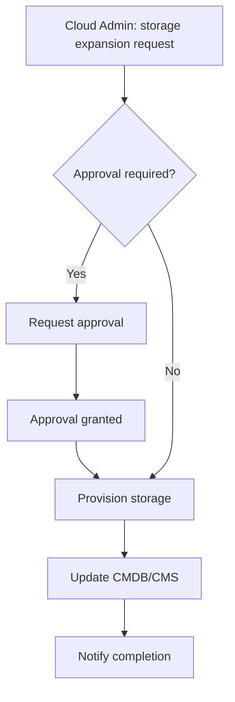
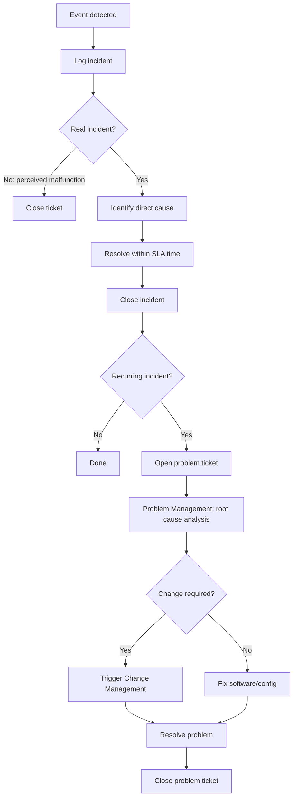

---
tags:
  - università/datacenter-design-and-operation
  - operations
  - service-management
  - monitoring
  - incident-management
  - capacity-planning
data: 2026-05-22
lezione: "20 - Operations and Final Course Considerations"
professore: "Antonio Cisternino"
---

# Operations and Final Course Considerations

This final lecture closes the course by addressing the most procedural and operational part of the cloud: **service operations management** — everything that happens *after* the infrastructure is up and running. If previous lectures built the building blocks of the infrastructure — networking, storage, compute, virtualization — this lecture answers the question: how do you *manage* all of this over time?

---

## Service Operations Management

Once a cloud is operational, someone must be responsible for keeping it running. This does not simply mean "making sure the machines are on": it means ensuring **SLAs are met**, failures are identified and resolved, resources are planned ahead of time, and every change is tracked. If an SLA is violated, the provider pays — literally, in the form of compensation or free service credits.

Typical operations management activities fall into three main categories:

- **Infrastructure configuration management**: knowing at every moment how every system is configured.
- **Resource provisioning**: allocating resources when requested, and de-provisioning when no longer needed.
- **Problem resolution**: identifying and resolving failures before they become SLA violations.

To these is added **capacity planning**: understanding *how many resources will be needed* in the coming months, so there is enough time to procure them before existing ones run out. Capacity planning navigates a delicate balance: too much unused capacity is wasted capex that worsens TCO; too little means violating SLAs.

> [!abstract] Key Operations Processes
>
> The main processes that structure cloud operations are:
> - **Monitoring**: continuously observing the state of the infrastructure
> - **Service Asset and Configuration Management**: inventory and tracking of configurations
> - **Change Management**: governing every change to the system
> - **Capacity Management**: planning resources over time
> - **Performance Management**: ensuring the performance levels promised by SLAs
> - **Incident Management**: responding to unplanned events
> - **Problem Management**: preventing recurrence of incidents
> - **Availability Management**: guaranteeing service availability
> - **Security Monitoring**: detecting and tracking security anomalies

---

## Monitoring

Monitoring is the foundation of everything: without visibility into system state, it is impossible to know whether objectives are being met. In a modern infrastructure there are thousands — sometimes millions — of counters: at the network level, hypervisor, operating system, server BMC. The volume of data is such that manual reading is impossible; software tools are needed to analyze this stream and flag anomalies.

An important but counterintuitive aspect: **every "clean" system generates thousands of errors in its logs**. Systems are designed to tolerate many errors before failing, so the mere presence of warnings in logs does not mean the system is compromised. The real work of monitoring is distinguishing between alarms that indicate a real problem and those that are simply background noise. This requires **historical data** to identify outliers and deviations from the average.

Monitoring covers more than performance counters. At least three types can be distinguished:

- **Configuration monitoring**: detecting misconfigurations, policy violations, unauthorized changes. Even just knowing that *something has changed* — regardless of who did it — is already valuable information.
- **Availability monitoring**: verifying that all services are reachable. In practice, this means monitoring individual hardware components too: at the University of Pisa, for instance, someone checks the status of all cluster disks daily, using automated tools that flag failures or degradation.
- **Security monitoring**: in a public cloud, the target is particularly attractive to attackers — successfully compromising Google, Amazon, or Azure would have enormous impact. For this reason the volume of tracking in a real datacenter is very high; even physical access to the machine room is controlled with biometric sensors.

### Predictive Failure

One of the most interesting capabilities of modern monitoring is **predictive failure analysis**. Manufacturers like Dell embed statistical models into BMCs, built from data collected across millions of drives: when a disk starts exhibiting behavioral patterns associated with imminent failure, the BMC issues a warning *before* the disk actually breaks.

This enables a highly effective operational workflow: open a support ticket, remove the disk from the storage pool (temporarily reducing redundancy but without losing data), replace it, and add it back to the pool. From the user's perspective, nothing happened.

> [!warning] Redundancy Clock
>
> When a failed component is detected — whether via predictive failure or actual failure — the **clock starts ticking**. Redundancy has been reduced; if a second component fails before the first is replaced, the system may lose data or services. Replacement must happen as quickly as possible.

The opposite risk is the **cascade effect**: if a system fails and the failover mechanism shifts load to other nodes, those may become overloaded and fail in turn, triggering a wave of failures that propagates. A real-world case: at Amazon, one system failed, the load was automatically moved to another system that became saturated and collapsed, triggering a chain reaction that took months to resolve — Amazon resorted to physically sending technicians with additional drives into the datacenter, but the rate at which systems consumed storage was faster than the rate at which new drives could be inserted.

### Collection Frequency and the Cost of Monitoring

Monitoring is not free: every compute cycle spent collecting and analyzing metrics is a cycle taken away from productive workload. A balance must be found on collection frequency: too frequent and you are overwhelmed by data; too infrequent and critical events are missed. The same applies to granularity: not all counters are equally useful, and collecting all of them at high frequency is economically unsustainable.

### Bookkeeping and Documentation

In a datacenter, **documentation is mandatory**. The decoupling between hardware and software (typical of virtualization) makes it difficult to physically trace where a given component is located: you cannot simply "follow the cable" because cables are grouped in bundles and virtual systems have no obvious physical location. If a cluster fails, you need to know *immediately* which systems are affected — and that answer must come from documentation, not from manual exploration.

---

## Capacity Monitoring and Capacity Management

**Capacity monitoring** is the process of observing resource utilization over time. The goal is twofold: prevent resources from being exhausted (with consequent SLA violations), and prevent them from being over-provisioned (with consequent capex waste and worsened TCO/ROI).

> [!tip] The Insurance Analogy
>
> Capacity management reasons like an insurance company: statistical estimates are made about expected behavior, a reasonable safety margin is added, and the bet is that not everyone will use resources at maximum simultaneously. **Overbooking** — offering more resources than are physically available, counting on average utilization — is an established practice. If the bet is wrong, you pay the price.

A practical aspect of capacity monitoring is controlling utilization **per service instance**. Sometimes a service consumes far more than expected due to a missing configuration or a contractual loophole exploited by users. A real-world example: Vodafone offered a router with a backup cellular SIM for connectivity outages. The contract did not explicitly prevent using cellular as the primary connection; Cisternino did exactly that, and after a few days Vodafone called because monitoring had flagged the unusual usage — and resolved the issue by installing a fixed line for free.

Operational capacity management techniques include:

- **CPU over-commitment**: assigning more vCPUs than are physically available, counting on non-simultaneous average utilization.
- **Dynamic vCPU scheduling**: automated load balancing.
- **Storage tiering for offline VMs**: when a VM is powered off, its disk is moved to a slower (cheaper) tier. When the VM starts again, storage is live-migrated back to a faster tier — transparently to the user — while in the meantime premium tier space has been conserved.

*Fig. — Typical capacity management workflow for expanding a storage pool.*

---

## Change Management

**Change management** is, among all operational processes, the most underestimated by those new to operations. Students and programmers tend to see it as unnecessary bureaucracy; those who manage production systems know that the first question when something breaks is always: *who touched something?*

The primary objective of change management is to record **every change** to the configuration of every system — whether made by a human or an automated agent. The central tool is the **CMDB** (*Configuration Management Database*), which tracks the configuration state of the entire infrastructure over time.

> [!example] Example: Database Version Upgrade
>
> Upgrading a production database version is a risky operation: the new schema might be incompatible, the upgrade might fail halfway, the database might become unreachable. The standard procedure is:
> 1. **Snapshot** the VM running the database (temporary I/O cost, but rollback is guaranteed)
> 2. Take the service offline
> 3. Perform the upgrade
> 4. Verify correct operation
> 5. **If OK**: delete the snapshot (keeping it has an ongoing cost: every disk access requires multiple lookups through the snapshot chain)
> 6. **If not OK**: roll back from the snapshot, restore the system, analyze the problem before the next attempt

---

## Incident Management and Problem Management

The distinction between **incident** and **problem** is fundamental in the ITIL model that structures operations:

> [!definition] Incident
>
> An incident is an **unplanned event** that interrupts or degrades a service. Incident management is *reactive*: you respond to something that has already happened.

> [!definition] Problem
>
> A problem is a **recurring incident** — or more precisely, the underlying root cause behind multiple incidents. Problem management is *proactive*: you intervene to eliminate the cause and prevent the incident from repeating.

The incident management flow follows these steps:

*Fig. — Relationship between incident management and problem management.*

> [!example] Example: Broken Disk and Exhausted Storage Pool
>
> A disk breaks. The storage pool exhausts its remaining capacity because the redundancy copy was consuming space, now no longer available. A VM stops working.
>
> - **Incident management**: replace the broken disk → the VM comes back online.
> - **Root cause**: the storage pool was already too full; the loss of redundancy consumed the remaining space.
> - **Problem management**: expand the pool (add disks or migrate data to other pools) so that a future disk failure will not exhaust capacity.
>
> Replacing the disk resolves *the symptom*, not *the cause*. Without problem management, the next disk failure will produce the same effect.

A special case of *proactive* problem management is predictive failure: replacing a disk before it breaks means intervening in the cause before the incident even manifests.

> [!note] Incident vs. Problem: the key point
>
> Incident management = **reactive** → resolve the ongoing event.
> Problem management = **proactive** → remove the root cause to prevent recurrence.
> The two flows are distinct but feed each other: incidents populate the problem backlog, and resolved problems reduce incident frequency.

---

## Performance Management and Quality of Service

SLAs typically include performance guarantees (latency, throughput, availability). If the system is overloaded — due to excessive overbooking or an unforeseen bottleneck in the design phase — an SLA can be violated even without anything being formally "broken."

Performance management requires monitoring not only availability parameters but also the bandwidth allocated to VMs on each hypervisor. Inside modern datacenters the network is rarely the bottleneck (25–50 Gbps aggregated per host is the norm), but the VM allocation topology can create situations where the guaranteed bandwidth cannot actually be honored.

---

## Alerting and Reporting

The **alerting** system classifies signals at three levels: informational (no immediate action needed), warning (monitor closely), fatal (service down or SLA violated). Fatal alerts require immediate intervention.

**Reporting** has a non-technical dimension as well. Reports are the documentation that allows:
- Demonstrating to management that a budget cut caused an SLA violation (*"I asked for 5 million for storage, you gave me 4 million, now we are violating SLAs"*).
- Justifying new resource requests with historical data.
- Doing **showback** — even in non-profit contexts like a university, where resources are not billed, usage is still shown to users, creating awareness and incentivizing efficient use.

---

## Final Course Considerations

### The Course Thread

The course followed a trajectory from physical to abstract:

1. **Physical foundations**: energy, cooling, cabling — because a datacenter is first and foremost an energy and heat dissipation problem.
2. **Network**: without a network there are no datacenters, only isolated systems. The network is the *foundation* of the datacenter concept itself.
3. **Fabric and switching**: how data moves internally.
4. **Storage**: principles, technologies, architectures.
5. **Compute**: servers, BMC, GPU, NPU.
6. **Virtualization**: the most important change in the industry in the last 30 years — without virtualization the cloud would not exist.
7. **Cloud**: reference architecture, orchestration, SLA, business continuity, security.
8. **Operations**: how all of this is managed over time.

> [!tip] The Balance Principle
>
> A recurring theme is that **an efficient system is not one with the best component, but a balanced one**. An extremely powerful CPU paired with slow storage still produces a slow system. The bottleneck always limits overall performance. The design of a datacenter — like any computer system — is fundamentally an exercise in balancing heterogeneous components.

### Workload Divergence and AI

Around 2008 workloads began diverging significantly: the requirements of a web server are profoundly different from those of a big data analytics cluster or an AI infrastructure. The idea of buying generic hardware and repurposing it for any workload is over. Today, hardware is designed for specific workloads.

AI in particular requires enormous amounts of memory (for models), ultra-low latency between nodes (for distributed training), and therefore physical proximity of components. This pushes toward ever-greater power concentrations in ever-smaller spaces — megawatts, gigawatts in single buildings — with cooling challenges that are reshaping datacenter architecture itself.

### Exam Information

The exam is oral, with booked slots via a calendar. The professor conducts a conversation in which:

- He **verifies understanding of key concepts**, not mechanical memorization of details.
- He **poses architecture problems** to reason through: given a workload with certain characteristics, how would you organize storage, compute, and network? What type of storage is appropriate? How many nodes?
- He **evaluates the ability to identify wrong solutions**: there is no optimal solution, but there are wrong ones — and the course has provided the tools to recognize them.

> [!example] Exam Question Example (CERN)
>
> *At CERN, the detector produces an aggregated stream of 10 TB/s of data. Only 10% of events are "interesting" and must be stored; 90% are discarded by the computational layer. How would you organize storage, compute, and network? Would you use SAN or NAS? How many frontend nodes are needed? How is the backend dimensioned?*
>
> The goal is not to give a numerically precise answer, but to reason correctly: the frontend must handle 10 TB/s, the backend must ingest 1 TB/s, the storage type depends on the access pattern, the choice between SAN and NAS depends on access granularity and required parallelism.

> [!question] Possible Exam Questions
>
> - What is the difference between an incident and a problem? Give an example.
> - Why is change management fundamental in operations?
> - What is predictive failure and how does it integrate with problem management?
> - Why is powering down a datacenter a risky decision?
> - How does storage tiering work for offline VMs?
> - What is showback? How does it differ from chargeback?
> - Why is balance more important than the individual performance of components?
> - How does capacity management manifest in CPU overbooking?
