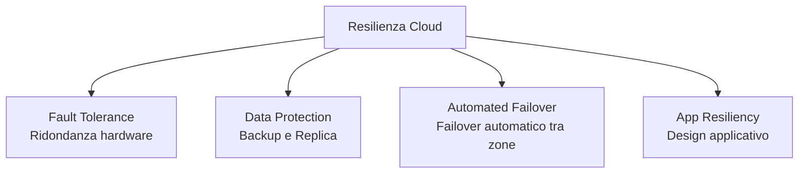
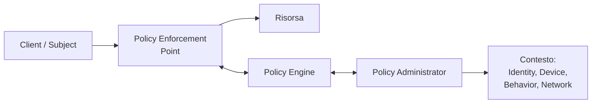
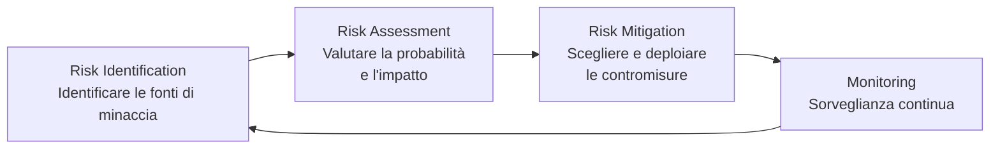

---
tags:
  - università/datacenter-design-and-operation
  - business-continuity
  - security
  - cloud
data: 2026-05-21
lezione: "19 - Business Continuity e Security"
professore: "Antonio Cisternino"
---
# Business Continuity e Security nel Cloud

Questa lezione tratta due funzioni *cross-cutting* del modello di riferimento cloud: la **business continuity** e la **security**. Entrambe permeano tutti i livelli dello stack, dal compute allo storage, dalla rete alle applicazioni. La lezione introduce anche una breve panoramica sulla **gestione del portfolio di servizi** cloud.

---

## Business Continuity

### Cosa significa e perché è critica

La **business continuity** (*BC*) è l'insieme delle pratiche che permettono di prepararsi, rispondere e recuperare da un'interruzione del servizio che impatta negativamente le operazioni. In parole povere: qualcuno ti sta pagando per un servizio, e se il servizio cade, quella persona ha un problema.

Il concetto chiave è che nei datacenter di scala cloud i guasti sono *fisiologici*, non eccezioni. Un singolo disco ha una probabilità di rottura di, diciamo, 1 su 10.000 per giorno. Se hai 10.000 dischi, statisticamente uno si rompe ogni giorno. La sfida non è eliminare i guasti, ma **rilevare il problema, confinarne l'impatto e ripristinare il servizio** senza che l'utente se ne accorga.

> [!warning] L'outage è quasi imperdonabile nel cloud
>
> Il professore ha citato l'outage di Netflix di circa 14 anni fa, causato dall'abbattimento di un datacenter nel New Jersey per un tornado. Netflix non era in controllo della situazione. Nel cloud, come per la perdita di dati nello storage, un'interruzione prolungata è considerata gravissima: si perdono ricavi diretti, si devono rimborsare i clienti (tipicamente con credito, non contante), e soprattutto si rischia la reputazione.

### Disponibilità del servizio

La disponibilità si misura con una formula semplice:

$$
\text{Service Availability} (\%) = \frac{\text{Agreed Service Time} - \text{Downtime}}{\text{Agreed Service Time}} \times 100
$$

L'obiettivo minimo del mercato è il **4×9** (99,99%), pari a circa 52 minuti di downtime all'anno. I contratti cloud contengono spesso una clausola di *scheduled downtime* che non viene conteggiata come downtime effettivo: nella pratica, provider come Microsoft Azure non dichiarano quasi mai manutenzioni programmate, ma si riservano legalmente questa possibilità.

> [!note] Il mercato cloud come meccanismo di pressione
>
> Poiché la maggior parte delle aziende usa il cloud come IaaS, il *switchover* verso un altro provider è tecnicamente possibile. Questo crea una pressione competitiva che incentiva i provider a mantenere altissimi livelli di disponibilità.

### Cause di indisponibilità

- **Guasto hardware** (componenti CPU, storage, rete)
- **Bug software** nelle applicazioni
- **Perdita di dati**
- **Failure di servizi dipendenti**
- **Datacenter o sito completamente offline** (per eventi estremi: es. un drone che colpisce un datacenter negli Emirati Arabi Uniti)
- **Refresh dell'infrastruttura IT**

Il *root cause analysis* in queste condizioni è complicato, perché il sistema è distribuito e i guasti si propagano.

### Tecniche per ottenere resilienza

Le tecniche principali si articolano su più livelli:

*Fig. — Le quattro direttrici della resilienza nel cloud.*

> [!tip] Ridondanza ≠ sostituto del backup
>
> Un sistema ridondante che funziona può comunque corrompere i dati. La ridondanza protegge dalla *indisponibilità*, il backup dalla *corruzione o perdita dei dati*. Le due cose vanno usate insieme.

---

## Fault Tolerance: Ridondanza e Single Points of Failure

### Single Point of Failure

> [!definition] Single Point of Failure (SPOF)
>
> Qualsiasi singolo componente la cui failure rende l'intero sistema o servizio non disponibile.

Lo SPOF può esistere a livello di componente (CPU, disco, scheda di rete) ma anche a livello di rack o di datacenter. Se replico due server ma li metto nello stesso rack, il *rack* stesso diventa uno SPOF: un guasto al PDU (*Power Distribution Unit*) del rack abbatte entrambi i server.

La soluzione logica è distribuire le istanze ridondanti in **rack diversi**, in **zone diverse** o in **datacenter diversi**.

![[dcdo_bc_spof.png]]
*Fig. — Single Point of Failure a livello di componente, rack e datacenter.*

### Compute Clustering

> [!definition] Compute Clustering
>
> Tecnica in cui due o più server (nodi) lavorano insieme e vengono presentati come un singolo sistema, offrendo high availability e load balancing.

Sia Linux che Windows supportano il clustering. Il software di clustering distribuisce automaticamente i servizi tra i nodi e, in caso di guasto di un nodo, rialloca le risorse sugli altri. Nella virtualizzazione, l'**hypervisor cluster** consente di spostare le VM tra host fisici, anche a caldo.

![[dcdo_bc_hypervisor_cluster.png]]
*Fig. — Hypervisor cluster: le VM vengono distribuite tra host fisici e migrate automaticamente in caso di guasto.*

### Active/Active vs Active/Passive

Questo schema si applica a qualsiasi livello: compute, rete, storage.

- **Active/Passive**: uno dei due sistemi è in standby. In caso di guasto del sistema attivo, quello passivo prende il controllo. È più semplice da implementare ma spreca risorse: il sistema passivo può stare spento per lungo tempo, e quando serve potrebbe non avviarsi correttamente.
- **Active/Active**: entrambi i sistemi lavorano contemporaneamente, servendo richieste. È più complesso da implementare (bisogna presentare un'identità logica unica verso l'esterno, coordinare lo stato), ma usa meglio le risorse e garantisce una degradazione graceful in caso di guasto.

> [!example] Spine-and-Leaf e active/active
>
> Nelle reti spine-and-leaf discusse nelle lezioni precedenti, LACP (*Link Aggregation Control Protocol*) permette di avere due link fisici verso due switch distinti che si comportano come un unico link logico. Se un link cade, si degrada la banda ma il traffico continua. Questo è active/active. Con lo Spanning Tree, invece, si avrebbe un link attivo e uno bloccato (active/passive).

![[dcdo_bc_link_switch_aggregation.png]]
*Fig. — Link e switch aggregation in topologia spine-and-leaf con LACP.*

### NIC Teaming e Multipathing

**NIC Teaming** (*NIC teaming*) applica lo stesso principio al livello della scheda di rete: più NIC fisiche vengono aggregate in una singola NIC logica vista dal sistema operativo o dall'hypervisor. Se una NIC fallisce, il traffico continua sulle altre.

![[dcdo_bc_nic_teaming.png]]
*Fig. — NIC Teaming: più schede di rete fisiche aggregate in un'unica interfaccia logica.*

**Multipathing** nello storage: il sistema definisce più percorsi fisici verso una LUN (*Logical Unit Number*). Lo storage bilancia il carico su tutti i percorsi e, in caso di guasto di uno, il traffico I/O viene reindirizzato automaticamente.

![[dcdo_bc_multipathing.png]]
*Fig. — Multipathing: percorsi I/O ridondanti verso la stessa LUN storage.*

### In-Service Software Upgrade (ISSU)

> [!definition] In-Service Software Upgrade (ISSU)
>
> Tecnica che consente di aggiornare il software su dispositivi di rete (switch, router) senza interrompere la disponibilità della rete.

Funziona perché i dispositivi di rete di fascia alta hanno componenti di controllo ridondanti (*supervisor* o *routing engine*). Si aggiorna il software su un motore mentre l'altro mantiene la rete operativa. Lo stesso principio vale nel datacenter: avendo tre linee di alimentazione verso ogni rack, è possibile togliere una linea alla volta per manutenzione senza mai abbassare il rack.

### RAID, Erasure Coding e LUN Mirroring

- **RAID** (*Redundant Array of Independent Disks*): distribuisce dati e parità su più dischi, proteggendo dalla perdita di uno o più dischi a seconda del livello RAID.
- **Dynamic disk sparing**: sostituzione automatica di un disco guasto con un disco spare.
- **Erasure coding**: tecnica matematica che divide un set di *n* dischi in *m* dischi dati e *k* dischi di coding. Permette di tollerare guasti multipli con un overhead di spazio ottimale rispetto al RAID.
- **Mirrored LUN**: una LUN viene replicata su due sistemi storage distinti, offrendo resilienza equivalente al RAID-1 a livello di array logico.

![[dcdo_bc_erasure_coding.png]]
*Fig. — Erasure coding: distribuzione di dati e simboli di ridondanza su più dischi.*

![[dcdo_bc_mirrored_lun.png]]
*Fig. — Mirrored LUN: replica dello storage a livello di array logico su siti distinti.*

---

## Availability Zones

Per eliminare gli SPOF a livello di datacenter o di rack, si usano le **zone di disponibilità** (*Availability Zones*).

> [!definition] Service Availability Zone
>
> Una zona di disponibilità è una porzione del datacenter (o un intero datacenter) con un proprio insieme di risorse, isolata fisicamente e logicamente dalle altre zone. Le zone di una stessa regione sono collegate tramite rete a bassa latenza.

Il ragionamento è: se ho due istanze dello stesso servizio, le posiziono in zone diverse — parte in una zona di un datacenter, parte in un'altra zona o in un datacenter separato. Il failover tra zone può essere configurato in modalità **active/passive** o **active/active**.

![[dcdo_bc_zone_active_passive.png]]
*Fig. — Configurazione active/passive tra zone di disponibilità: la zona secondaria è in standby.*

![[dcdo_bc_zone_active_active.png]]
*Fig. — Configurazione active/active tra zone: entrambe le zone servono richieste simultaneamente.*

### Failover tra zone: replicazione vs. service failover

Esistono due approcci distinti:

1. **Service failover**: quando una zona cade, il servizio viene riavviato (*reboot*) su una nuova zona. C'è una breve interruzione. È più semplice.

2. **Replicazione della VM**: la VM viene replicata continuamente sull'altra zona (es. ogni 30 secondi). Il processo è simile alla live migration: si bookkeepano i cambiamenti dello stato della VM e li si trasmettono. In caso di guasto, si "riprende" una copia che ha al massimo 30 secondi di ritardo — si perde poco più dello stato in-memory degli ultimi 30 secondi, ma non si riavvia dall'inizio.

La replicazione riduce drasticamente il **RTO** (*Recovery Time Objective*). Nel service failover il RTO è il tempo di riavvio del servizio; con la replicazione è quasi nullo.

> [!tip] Differenza concettuale fondamentale
>
> La replicazione della VM mantiene anche lo stato transitorio (la memoria). Il service failover riavvia il processo da zero ma da un'immagine coerente. La scelta dipende dai requisiti di RTO e dalla complessità dell'applicazione.

---

## Data Protection: Backup e Replicazione

### RPO e RTO

> [!definition] RPO — Recovery Point Objective
>
> Quanto indietro nel tempo si può tollerare di tornare in caso di ripristino da backup. Definisce la frequenza con cui si eseguono i backup (ogni ora, ogni giorno, ogni settimana).

> [!definition] RTO — Recovery Time Objective
>
> Quanto tempo ci vuole per ripristinare il servizio da un backup. Dipende dalla tecnologia usata e dalla quantità di dati da recuperare.

### Il problema tecnico del backup

Il backup è concettualmente semplice (fare una copia dei dati), ma tecnicamente molto complesso a scala.

> [!example] Calcolo del tempo di backup
>
> 1 petabyte = $8 \times 10^6$ gigabit. Con una rete da 100 Gbit/s:
> $$\frac{8 \times 10^6 \text{ Gbit}}{100 \text{ Gbit/s}} = 80.000 \text{ s} \approx 22 \text{ ore}$$
> Nella pratica la rete non è mai saturata al 100%, quindi si raggiungono facilmente le 3–5 ore anche per backup di pochi cento TB. Per questo molti provider grandi usano **reti separate per il backup**, in modo che il traffico di backup non impatti la produzione.

Si usa il **differential backup** (backup solo dei dati modificati dall'ultimo backup) per ridurre il volume giornaliero, ma periodicamente è necessario un **full backup**.

### Driver per ottimizzare il backup

- **Backup window**: finestra temporale disponibile (tipicamente la notte) — si ha un limite di banda × ore disponibili
- **Retention period**: obblighi legali a conservare i dati per un certo periodo. In Italia, un service provider è tenuto a conservare certi dati per 5 anni per le autorità giudiziarie.
- **Deduplicazione**: eliminazione dei dati ridondanti prima o dopo il trasferimento, sia a livello di file (*file-level*) sia a livello di blocchi (*fixed-length* o *variable-length block*). Può essere fatta **source-side** (riducendo il traffico di rete) o **target-side** (spostando il carico di CPU sul target).

### Backup target

I principali target per i backup sono:
- **Disk library**: più veloce da accedere, costi contenuti oggi
- **Tape library**: tempi di accesso più lenti, ma lunga durata e costo per GB molto basso — ideale per archivi a lungo termine

### Replicazione

> [!definition] Replicazione
>
> Processo di creazione di una copia esatta dei dati (*replica*) per garantire la disponibilità del servizio.

La replicazione differisce dal backup: il backup conserva versioni storiche, la replica mantiene solo lo stato corrente (o poche versioni).

- **Replicazione locale (snapshot)**: copia virtuale del volume a un dato istante (*Point-In-Time*). Nello storage virtuale, uno snapshot crea un disco figlio (*delta disk*) che traccia solo i blocchi modificati rispetto al disco padre.
- **Replicazione remota sincrona**: la scrittura viene confermata al compute solo dopo che è stata replicata sul sito remoto. RPO ≈ 0, ma la latenza di rete aggiunge overhead significativo.
- **Replicazione remota asincrona**: la scrittura viene confermata subito, la replica avviene in seguito. RPO finito (dipende dal lag), ma non rallenta il sistema. È l'approccio più comune.

> [!tip] Consistency nel caso distribuito
>
> La replicazione sincrona garantisce consistenza perfetta, ma se i due siti sono distanti (alta latenza), ogni write aspetta il round-trip. Si può accettare la *eventual consistency*: si sa che alla fine i dati saranno consistenti, ma si sviluppa il software in modo che non assuma consistenza istantanea. Questo è il modello tipico dell'object storage (S3, Azure Blob).

### CDP — Continuous Data Protection

> [!definition] CDP
>
> Soluzione di replicazione avanzata che cattura in continuo ogni modifica ai dati, permettendo di ripristinare il sistema a qualsiasi *Point-In-Time* precedente (non solo agli snapshot pianificati).

Componenti chiave:
- **Journal volume**: contiene tutte le modifiche dall'inizio della sessione di replicazione. La dimensione del journal determina quanto lontano nel tempo si può tornare.
- **CDP appliance**: hardware/software che gestisce la replicazione locale e remota.
- **Write splitter**: intercetta le scritture al volume di produzione e le duplica: una copia va al volume di produzione, l'altra al journal.

### DRaaS — Disaster Recovery as a Service

In modalità DRaaS, un provider cloud offre risorse per eseguire i servizi IT del cliente in caso di disastro. In condizioni normali, i dati del cliente vengono replicati (in modo cifrato) verso il provider. In caso di disastro, le VM vengono istanziate sulle risorse del provider a partire dallo storage replicato.

![[dcdo_bc_cdp_operations.png]]
*Fig. — CDP Operations: replicazione locale e remota tramite write splitter e journal volume.*

---

## Application Resiliency

Anche se l'infrastruttura è resiliente, un'applicazione mal progettata può essere un SPOF. Il professore ha sottolineato che la resilienza va progettata anche nel software.

### Graceful Degradation

L'applicazione mantiene funzionalità limitate anche quando alcuni moduli o servizi dipendenti non sono disponibili. Il sistema non crolla tutto, degrada in modo controllato. Esempio: un sito e-commerce continua ad accettare ordini anche se il payment gateway è irraggiungibile, processandoli quando il gateway torna disponibile.

### Retry Logic

Se un'operazione fallisce a causa di un errore transiente, invece di crashare l'applicazione, si aspetta qualche secondo e si riprova. Una strategia di retry deve definire un numero massimo di tentativi prima di dichiarare il servizio non recuperabile. Un retry riuscito è trasparente all'utente.

### Persistent Application State Model

Lo stato dell'applicazione viene salvato fuori dalla memoria (in un data repository persistente). Se un processo crasha, un nuovo processo può ripartire dallo stato salvato senza perdere tutto il lavoro precedente. Il professore ha osservato che questo pattern è comune nelle applicazioni mobile.

### Event-Driven Processing

Invece di processare le richieste in modo sincrono, le applicazioni leggono le richieste da una queue in modo asincrono. Questo permette a più istanze di servire le richieste e rende il sistema resiliente alla perdita di un'istanza: le richieste non processate restano in coda e vengono prese da un'altra istanza.

---

## Security

### Perché la sicurezza nel cloud è critica

L'informazione è l'asset più prezioso di un'organizzazione. Il problema fondamentale della sicurezza nel cloud è il **trust**: i clienti devono fidarsi che il provider rispetti i contratti e non acceda ai loro dati. La formula del professore è:

$$\text{Trust} = \text{Visibility} + \text{Control}$$

Il provider deve dare al cliente visibilità su cosa succede ai suoi dati e controllo su chi può accedervi.

> [!note] La critica ai provider cloud e il trust
>
> Chi critica provider come Microsoft spesso usa l'argomento "potrebbero leggere i nostri dati". Il professore ribatte che senza prove concrete non si può agire legalmente, e che questa preoccupazione si riduce interamente al trust. La risposta tecnica è aumentare la visibilità e il controllo.

### CIA — Confidentiality, Integrity, Availability

> [!definition] CIA
>
> Il triplice obiettivo della information security:
> - **Confidentiality**: solo gli utenti autorizzati possono accedere ai dati
> - **Integrity**: i dati non possono essere modificati da utenti non autorizzati
> - **Availability**: gli utenti autorizzati hanno accesso affidabile e tempestivo alle risorse

L'availability ha assunto un peso crescente: un attacco DoS (*Denial of Service*) che rende i dati inaccessibili è ora considerato un attacco alla sicurezza, non solo un problema di infrastruttura. Se hai bisogno del certificato di laurea per una selezione pubblica e il sistema universitario è down, sei in seria difficoltà.

### AAA — Authentication, Authorization, Auditing

Un errore comune è confondere autenticazione e autorizzazione:

- **Autenticazione**: verificare che l'utente sia chi dice di essere (associare un'identità digitale a una persona reale)
- **Autorizzazione**: determinare cosa quell'utente può fare, tipicamente tramite ruoli
- **Auditing**: verificare che il sistema si stia comportando correttamente; può essere eseguito da auditor interni o esterni

L'autenticazione deve sempre precedere l'autorizzazione.

### Defense-in-Depth

Approccio "a strati" alla sicurezza: invece di un'unica linea di difesa, si costruiscono più strati. Se uno viene superato, il prossimo è già in attesa. Questo rallenta l'attaccante e dà tempo per rilevare e rispondere.

![[dcdo_sec_defense_in_depth.png]]
*Fig. — Defense-in-depth: più strati di sicurezza sovrapposti, dal perimetro fisico fino ai dati.*

### Trusted Computing Base (TCB)

> [!definition] TCB
>
> Insieme di componenti hardware e software considerati affidabili. Vulnerabilità all'interno del TCB possono compromettere l'intero sistema. Va protetto con particolare cura e verificato periodicamente per garantire che non sia compromesso.

Se il TCB viene compromesso (es. un hypervisor compromesso mette a rischio tutte le VM ospitate), si è in una situazione critica.

### Velocity of Attack

In un ambiente cloud con migliaia di componenti omogenei, un attacco può propagarsi a velocità elevatissima. L'omogenità e la standardizzazione delle piattaforme amplificano l'impatto di una singola vulnerabilità. Le contromisure richiedono meccanismi robusti di *containment*.

---

## Minacce alla Sicurezza nel Cloud

Il professore ha elencato le principali minacce secondo CSA (*Cloud Security Alliance*) e ENISA:

### Data Leakage (Fuga di Dati)

Un attaccante ottiene accesso ai dati confidenziali del cliente. Vettori comuni: compromissione di database di password, exploit di applicazioni vulnerabili, cattiva segregazione del traffico, implementazione errata della cifratura, o un insider malicious.

**Contromisure**: cifratura dei dati *at rest* (su disco), *in transit* (HTTPS), e in alcuni casi anche *in memory*. Autenticazione multi-fattore. Una tecnica interessante è il **data shredding/threading**: il file non viene mai conservato intero su un singolo sistema ma distribuito in frammenti su più sistemi — il software ricompone il file sapendo dove si trovano i pezzi. Se qualcuno ruba un disco, ha solo un frammento inutilizzabile.

### Data Loss (Perdita di Dati)

Diversa dalla fuga: i dati vengono persi, non rubati. Cause: cancellazione accidentale da parte del provider, distruzione per disastri naturali.

**Contromisure**: backup e replicazione.

### Account Hijacking

Un attaccante ottiene le credenziali di un utente e accede al suo account.

**Contromisure**: autenticazione multi-fattore (MFA), IPSec, IDPS, firewall.

### Insecure APIs

Le API sono usate per provisioning, configurazione, monitoring e orchestrazione. Con l'adozione massiva delle REST API, compromettere un'API può aggirare completamente l'interfaccia utente. Le API devono essere progettate seguendo le best practice di sicurezza, revisionate periodicamente, e accessibili solo agli utenti autorizzati.

### Denial of Service (DoS) e Distributed DoS (DDoS)

> [!definition] DDoS
>
> Variante distribuita del DoS: l'attaccante controlla una *botnet* (rete di computer infetti i cui proprietari non sanno di partecipare all'attacco) e la usa per concentrare il traffico verso un target. Il master program coordina gli agenti che lanciano l'attacco al momento prestabilito.

La responsabilità in caso di DDoS è controversa: se il provider non ha implementato le contromisure tecniche previste, può essere ritenuto parzialmente responsabile; se l'attacco supera qualsiasi misura ragionevole, la responsabilità dipende dal contratto.

**Contromisura**: imporre limiti e restrizioni al consumo di risorse per identificare pattern anomali.

### Malicious Insiders

Un utente interno all'organizzazione usa deliberatamente il proprio accesso per causare danni. Il professore ha citato l'esperienza diretta con la violazione del 2022 all'università: l'ingresso nel sistema era avvenuto dalla rete privata del laboratorio di ingegneria, suggerendo un possibile insider o l'exploit di una libreria (log4j) nell'intervallo tra le due ondate di patch.

**Contromisure**: strict access control, auditing, cifratura, disabilitazione immediata degli account dopo la separazione, RBAC, background check.

### Abuse of Cloud Services

Le risorse cloud vengono usate per attività non autorizzate (es. installazione di un miner di Bitcoin dopo aver compromesso il sistema).

**Contromisura**: difficile da mitigare solo con strumenti tecnici; necessari contratti con clausole esplicite sull'uso accettabile.

### Shared Technology Vulnerabilities

In ambienti multi-tenant, le vulnerabilità degli strumenti di isolamento possono permettere a un tenant di compromettere un altro. Esempio classico: *hyperjacking* — installazione di un hypervisor canaglia che prende il controllo del sistema fisico.

**Contromisura**: proteggere i componenti del TCB.

### Loss of Governance e Compliance

Quando si esternalizza, si tende a perdere il controllo (*governance*) su come i servizi vengono gestiti. La catena di outsourcing (provider → sub-provider → sub-sub-provider) rende difficile verificare il rispetto dei propri requisiti di sicurezza e compliance.

Riguardo alla **compliance**, il professore ha ricordato il crescente peso normativo in 10 anni: GDPR (2016), misure minime di sicurezza per la PA italiana (2017), AI Act, eIDAS2, NIS2 (recepito come legge italiana 138/2024 in piena applicazione da ottobre 2025). I tecnici IT stanno diventando sempre più simili agli ingegneri civili: devono conoscere i vincoli legali oltre a quelli tecnici.

---

## Meccanismi di Sicurezza

### Physical Security

La sicurezza fisica è la base di tutto. Accesso biometrico, badge, CCTV, sensori di movimento e fumo, 24/7 security onsite. Avere accesso fisico ai server rende molto più probabile una compromissione.

### Identity and Access Management (IAM)

Il professore ha menzionato OAuth, Kerberos, CHAP, OpenID, multi-factor authentication. Il punto sull'MFA: con un secondo fattore è molto più difficile hijackare un'identità.

> [!note] Kerberos e Active Directory
>
> Kerberos è ancora estremamente rilevante perché è il protocollo sottostante a **Active Directory** di Microsoft, il directory service più diffuso al mondo. Active Directory gestisce utenti, risorse, computer e storage nelle reti aziendali.

### Role-Based Access Control (RBAC)

Si assegnano ruoli agli utenti, non permessi diretti. Ogni ruolo ha solo i privilegi necessari per le proprie mansioni (*principio del minimo privilegio*). La *separation of duties* garantisce che nessun individuo possa sia specificare un'azione sia eseguirla.

### Next-Generation Firewalls

I firewall moderni operano a **livello 7** (strato applicativo del modello OSI). Non si limitano a filtrare per IP/porta (livello 4), ma ricostruiscono il flusso completo dei dati e prendono decisioni basate sul contenuto. All'università di Pisa sono in uso oltre 50 firewall che proteggono segmenti diversi della rete con policy differenziate.

> [!note] DMZ: un concetto datato
>
> La *Demilitarized Zone* (DMZ) — la classica architettura con un segmento "semi-pubblico" tra internet e la rete interna — è considerata obsoleta. Il professore ha accennato a un approccio più moderno: la **Zero Trust Architecture**.

### IDPS — Intrusion Detection and Prevention System

Due tecniche di rilevamento:
- **Signature-based**: confronta il traffico con un database di firme di attacchi noti. Efficace solo per minacce conosciute.
- **Anomaly-based**: analizza statisticamente gli eventi e segnala deviazioni dalla norma (es. troppi login falliti, consumo anomalo di banda).

### VPN, VLAN, VSAN e Zoning

Strumenti per isolare il traffico su infrastruttura condivisa, garantendo la separazione tra tenant. La **zoning** nel fabric SAN aggiunge un ulteriore livello di sicurezza: i nodi possono comunicare solo con i nodi nella stessa zona.

---

## Zero Trust Architecture (ZTA)

Il vecchio modello di sicurezza assumeva: "tutto dentro la rete aziendale è sicuro, tutto fuori è pericoloso." Non funziona più per due ragioni:
1. I dispositivi BYOD (*Bring Your Own Device*) portano nella rete aziendale device potenzialmente compromessi
2. Le risorse aziendali sono ormai distribuite tra on-premise e cloud multipli

Il **NIST** (*National Institute of Standards and Technology*) ha formalizzato un nuovo approccio con 7 principi fondamentali.

> [!definition] Zero Trust Architecture
>
> Modello di sicurezza in cui nessuna risorsa, nessun utente e nessuna connessione è considerata intrinsecamente attendibile, indipendentemente dalla posizione nella rete. Ogni accesso richiede autenticazione e autorizzazione esplicita.

*Fig. — Schema ZTA: il Policy Enforcement Point decide se consentire o bloccare l'accesso alla risorsa, in base alle decisioni del Policy Engine alimentato dal contesto.*

### I 7 principi ZTA (secondo NIST)

1. **Tutto è una risorsa**: dati, sistemi, applicazioni, servizi — tutto viene trattato come risorsa da proteggere, non solo i dati.

2. **Tutte le comunicazioni sono sicure indipendentemente dalla posizione di rete**: non esiste una zona "safe" nella rete. Ogni comunicazione è potenzialmente compromessa.

3. **Accesso per sessione**: l'accesso a una risorsa viene concesso per una specifica sessione, non in modo permanente. A ogni nuova sessione si ri-autentica e ri-autorizza.

4. **Policy dinamica**: l'accesso dipende non solo dall'identità, ma dallo stato osservabile del client: versione del SO, comportamento recente, orario, tipo di device. Esempio: un sistema Windows 7 (non più patchato) può essere bloccato perché considerato compromesso.

5. **Monitoraggio continuo dell'integrità dei device**: lo stato di sicurezza (*security posture*) di tutti i device connessi alla rete va monitorato costantemente.

6. **Autenticazione e autorizzazione dinamiche**: strettamente applicate prima di ogni accesso.

7. **Raccolta dati per migliorare la postura di sicurezza**: più informazioni si raccolgono sullo stato di asset, rete e comunicazioni, migliore è la capacità di risposta.

> [!example] Attributi comportamentali e ambientali
>
> Se un token di accesso viene usato di sera per la prima volta (anomalia comportamentale), il sistema può bloccare l'accesso e richiedere una verifica aggiuntiva. Il token potrebbe essere stato rubato. Questo è un esempio di come il contesto entra nella decisione di autorizzazione.

### Micro-segmentazione

La ZTA porta naturalmente alla **micro-segmentazione** della rete: molte VLAN con policy diverse invece di poche grandi zone. In questo modo, se un segmento viene compromesso, il resto della rete è protetto da firewall e policy. Si guadagna tempo per rilevare e contrastare la minaccia.

---

## GRC — Governance, Risk and Compliance

> [!definition] GRC
>
> Framework che integra tre discipline:
> - **Governance**: determina le policy, i ruoli e le responsabilità di un'organizzazione
> - **Risk Management**: identifica, valuta e mitiga i rischi
> - **Compliance**: verifica che le policy (interne ed esterne/normative) vengano rispettate

### Risk Management

Il processo è ciclico:

*Fig. — Ciclo di Risk Management.*

Il punto chiave: **nessun sistema è sicuro al 100%**. Anche la crittografia è teoricamente attaccabile con risorse illimitate. La domanda non è "siamo sicuri?" ma "qual è la probabilità di essere violati entro un dato intervallo di tempo, e questo livello di rischio è accettabile per la nostra organizzazione?".

> [!example] Risk Assessment pratico
>
> Università di Pisa: è alta la probabilità che qualcuno voglia rubare i dati d'inventario (quante sedie abbiamo)? No. È alta la probabilità che qualcuno voglia i dati degli studenti? Sì. Quindi si allocano risorse di sicurezza proporzionalmente al rischio reale.

### Auditing

L'auditing verifica che il sistema si stia comportando come previsto. Non è semplice logging: può essere eseguito da organizzazioni esterne che certificano la conformità. Esempio pratico: l'Università di Pisa gestisce firme digitali ed è soggetta ad audit governativi che verificano la conformità dell'implementazione alla normativa.

---

## Service Portfolio Management (cenni)

Verso la fine della lezione, il professore ha introdotto brevemente la gestione del portfolio di servizi, che verrà approfondita nella lezione successiva.

Il **service management** nel cloud è profondamente diverso dall'IT tradizionale on-premise, dove si gestiscono singoli asset in modo ad-hoc. Nel cloud, tutto è orientato all'**automazione**: patchare milioni di macchine, migrare VM, installare server in modo programmato. La standardizzazione e l'omogeneità sono essenziali.

### TCO e ROI

> [!definition] TCO — Total Cost of Ownership
>
> Somma di tutti i costi associati al possesso e all'uso di un asset nel tempo: costo di acquisto + costi operativi ricorrenti (energia, manutenzione, licenze, personale).

> [!definition] ROI — Return on Investment
>
> $$\text{ROI} = \frac{\text{Gain} - \text{Cost}}{\text{Cost}}$$
>
> Se il ROI è negativo, si sta perdendo denaro sull'investimento.

Nel cloud, calcolare il TCO di un servizio è complesso perché il servizio usa centinaia di asset condivisi. Si aggregano i costi (CAPEX + OPEX) per servizio, si definisce un'unità, si stima il costo per unità con un margine, e si ottiene il prezzo da applicare al cliente.

> [!warning] Scenario attuale: costi in aumento
>
> Il professore ha citato un dato concreto: nel 2016 ha acquistato 100 server per 1M€ (10k€/server) che gestivano tutti i servizi dell'università. Oggi la stessa operazione costerebbe 7M€. L'impennata è dovuta alla scarsità di componenti (GPU, memoria) causata dall'esplosione dell'AI. In più, i tempi di consegna possono arrivare a 6 mesi dall'ordine, richiedendo una **capacity planning** molto anticipata.

### Supply Chain Management

La gestione della catena di fornitura è critica: bisogna negoziare termini considerando la qualità e i costi dei fornitori, l'evoluzione degli SLA nel tempo, e i requisiti normativi in evoluzione. È un lavoro che richiede competenze relazionali oltre che tecniche.

---

> [!question] Possibili domande d'esame
>
> - Qual è la differenza tra backup e replicazione, e perché entrambi sono necessari?
> - Cos'è il RPO e il RTO? Come influenzano le scelte architetturali?
> - Descrivi la differenza tra active/active e active/passive in un contesto di clustering.
> - Quali sono i 7 principi della Zero Trust Architecture?
> - Cos'è il TCB e perché è importante proteggerlo?
> - Spiega il concetto di graceful degradation con un esempio.
> - Quali sono le principali minacce alla sicurezza nel cloud secondo CSA/ENISA?
> - Cos'è il GRC e come si articola il ciclo di risk management?
> - Cosa cambia nel service management quando si passa da IT on-premise a cloud?
