# Application Layer of ZigBee (Appunti d'Esame)

## L'Application Framework e gli Endpoints

L'**Application Layer** del protocollo ZigBee si compone di tre elementi fondamentali: l'**Application Framework**, lo **ZigBee Device Object (ZDO)** e l'**Application Support Sublayer (APS)**.

All'interno dell'Application Framework, ogni **Application Object (APO)** è associato a uno specifico **Endpoint**, identificato da un numero compreso tra 1 e 240. L'Endpoint 0 è strettamente riservato allo ZDO. Grazie a questo sistema, un singolo dispositivo ZigBee può eseguire molteplici applicazioni simultaneamente. Ogni APO è identificato in modo univoco dalla combinazione tra l'indirizzo di rete del dispositivo ospitante e il suo numero di endpoint.

Un **Cluster** è una collezione di comandi e attributi che definiscono l'interfaccia per una specifica funzionalità del dispositivo (ad esempio, OnOff). È identificato da un codice a 16 bit.
Un **Application Profile** è la specifica del comportamento di un'intera classe di applicazioni (es. Home Automation).

---

## Tabella APS, Binding e Indirizzamento Indiretto

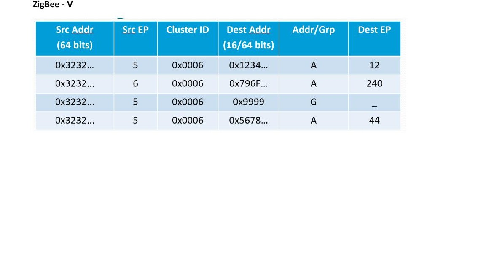
*Fig. — Esempio di APS Binding Table: ogni entry mappa un endpoint sorgente con cluster e destination address/endpoint.*

L'**Application Support Sublayer (APS)** funge da livello di trasporto leggero che eroga Data Service, Binding Service e Group Management. L'APS filtra i pacchetti per scartare quelli destinati a endpoint non registrati o profili non compatibili, e genera gli acknowledgment end-to-end.

La tabella mostra la **APS Binding Table**, il meccanismo con cui ZigBee implementa l'**indirizzamento indiretto**. Un dispositivo sorgente (che conosce solo il proprio endpoint e il cluster di interesse) non ha bisogno di conoscere l'indirizzo di rete del destinatario: consulta la binding table.

Le colonne della tabella sono:
- **Src Addr (64 bit)**: indirizzo MAC a 64 bit del dispositivo sorgente.
- **Src EP**: endpoint sorgente (1–240).
- **Cluster ID**: il cluster di riferimento (es. `0x0006` = OnOff Cluster).
- **Dest Addr (16/64 bit)**: indirizzo di destinazione (short 16 bit o MAC 64 bit).
- **Addr/Grp**: `A` = indirizzo unicast, `G` = indirizzo di gruppo (multicast).
- **Dest EP**: endpoint destinazione (vuoto per i gruppi).

Questo meccanismo è fondamentale: se un dispositivo cambia indirizzo di rete a 16 bit (dopo un reset), l'APS usa la **Address Map Table** (che associa indirizzi 16-bit agli immutabili MAC 64-bit) per ripristinare i binding automaticamente. Il binding può essere configurato solo su esplicita richiesta dello ZDO di un coordinatore o di un router.

---

## Cluster e Binding tra Dispositivi (Modello Client-Server)

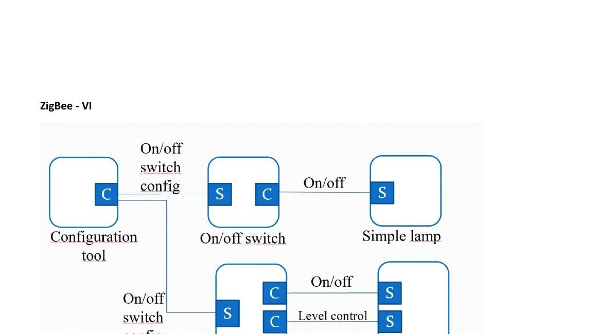
*Fig. — Esempio di binding ZigBee: Configuration tool configura un on/off switch, che controlla una Simple lamp e un Dimmer switch, il quale controlla una Dimmable lamp.*

La **ZigBee Cluster Library (ZCL)** introduce un modello gerarchico Client-Server per l'accesso e la manipolazione di un Dominio Funzionale. Lo schema illustra come il binding colleghi dispositivi tramite cluster. Ogni rettangolo contiene le lettere C (Client) o S (Server) per ciascun cluster supportato.

- **Il Server** è colui che ospita fisicamente lo stato (memorizza gli **attributi**).
- **Il Client** è il dispositivo che invia comandi per manipolare gli attributi sul Server.

Nell'esempio:
- La **Configuration tool** (solo C) si lega all'**On/off switch** (S+C) per configurarlo.
- L'**On/off switch** (come client) controlla la **Simple lamp** (S = solo server OnOff).
- Il **Dimmer switch** (S+C) riceve configurazioni (S) e controlla la **Dimmable lamp** che implementa sia OnOff (S) che Level Control (S).

Il binding è unidirezionale: si va da client a server. Viene creato tramite `BIND.request` allo ZDO e memorizzato nella binding table dell'APS. Un singolo client può essere legato a più server (fan-out).

---

## Lo ZigBee Device Object (ZDO)

Lo **ZDO** è la speciale applicazione gestionale del nodo attaccata all'Endpoint 0. I principali servizi esposti includono:
- **Device e Service Discovery**: recupera indirizzi fisici/rete e informazioni sui servizi.
- **Binding Management**: processa e attua fisicamente tutte le richieste di modifica alle tabelle di binding dell'APS.
- **Node e Network Management**: gestisce join, leave e lo smistamento di informazioni sulle routing table.

```{=latex}
\newpage
```

# IoT Design (Appunti d'Esame)

## Duty Cycle e Efficienza Energetica

La soluzione alla sfida energetica nell'IoT si chiama **duty cycle** (ciclo di lavoro). Il duty cycle è la frazione di un periodo in cui il sistema (o un suo componente) è attivo. L'idea è di sfruttare i periodi di inattività per mettere in sleep tutti i componenti possibili, riducendo al minimo il consumo.
Applicarlo in modo aggressivo è la leva principale per estendere la vita della batteria, attivando ogni componente **solo quando strettamente necessario**.

### Esempio pratico: il codice Arduino e Calcolo del Duty Cycle

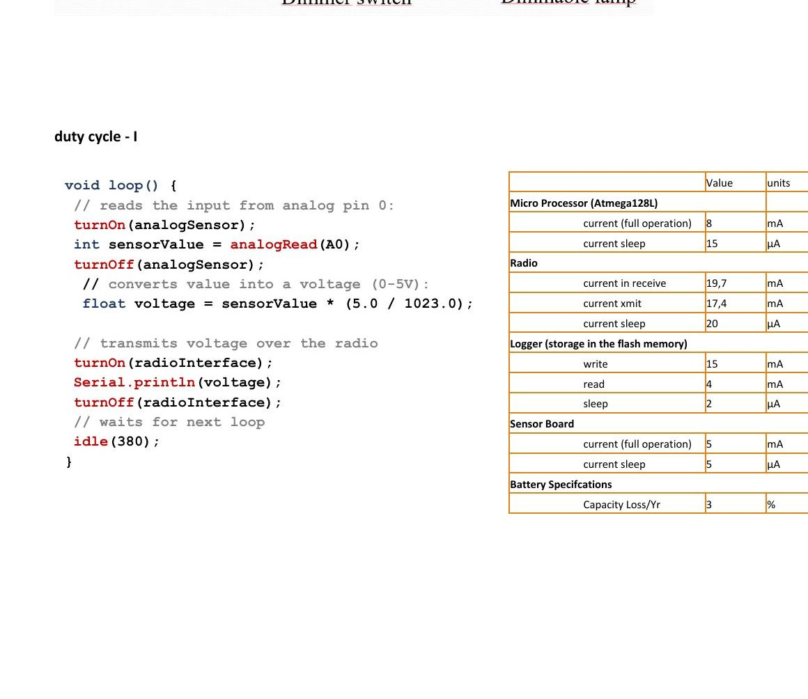
*Fig. — Codice Arduino che implementa il duty cycling selettivo dei componenti (sensore, radio) e tabella dei consumi in mA per componente e stato.*

Il codice mostra il pattern classico per minimizzare i consumi spegnendo esplicitamente ogni componente quando non serve:
```c
void loop() {
    turnOn(analogSensor);   // sensore acceso solo durante lettura
    int sensorValue = analogRead(A0); // lettura
    turnOff(analogSensor);  // sensore spento
    
    float voltage = sensorValue * (5.0 / 1023.0);
    
    turnOn(radioInterface); // radio accesa solo durante trasmissione
    Serial.println(voltage);
    turnOff(radioInterface);
    
    idle(380);  // MCU in sleep per 380 ms
}
```

Usando i valori della tabella (es. Tmote Sky):
- **Processore**: attivo 8 mA, sleep 15 μA
- **Radio**: TX 17.4 mA, RX 19.7 mA, sleep 20 μA
- **Sensore**: attivo 5 mA, sleep 5 μA

Il duty cycle di ciascun componente si calcola come:
$$DC_\text{componente} = \frac{t_\text{attivo}}{T_\text{periodo}}$$

Se le operazioni di sensing + TX durano ~20 ms e il ciclo totale è 400 ms, il duty cycle della radio è $20/400 = 5\%$. La corrente media risultante è molto inferiore alla corrente di picco, estendendo la vita della batteria di ordini di grandezza.
La perdita di capacità della batteria del 3%/anno indica che anche con battery standby c'è un degrado nel tempo.

---

## Effetto del duty cycle sulla vita della batteria

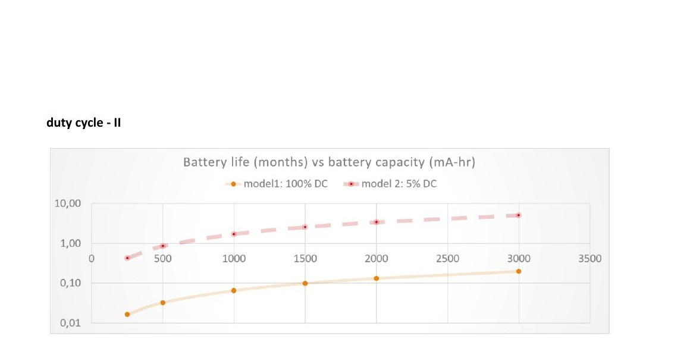
*Fig. — Grafico log-log: vita della batteria (mesi) vs capacità della batteria (mAh) per duty cycle 100% (model1) e 5% (model2).*

Il grafico mostra l'impatto del duty cycle sulla vita della batteria in scala logaritmica. Due modelli a confronto:

- **Model 1 (100% DC)**: il dispositivo è sempre attivo. La vita della batteria scala linearmente con la capacità ma rimane nell'ordine dei mesi (0.01–0.3 mesi per capacità 500–3000 mAh).
- **Model 2 (5% DC)**: il dispositivo è attivo solo il 5% del tempo. La vita si estende di un fattore ~20: con la stessa batteria, si passa da 0.1 a circa 2–8 mesi.

La scala logaritmica rivela che la relazione vita-capacità non è lineare: il duty cycle agisce moltiplicativamente. Ridurre il duty cycle da 100% a 5% equivale a moltiplicare la capacità effettiva della batteria per 20.

**Conclusione progettuale**: per applicazioni IoT con autonomia di anni, ridurre il duty cycle è molto più efficace che aumentare la capacità della batteria. Una batteria da 3000 mAh a 5% DC dura circa 8 mesi; per durare anni si deve abbassare ulteriormente il duty cycle o usare energy harvesting. Ad alti DC, aumentare la capacità della batteria ha un effetto quasi trascurabile.

```{=latex}
\newpage
```

# MAC Protocols (Appunti d'Esame)

Nei sistemi IoT, il protocollo MAC deve minimizzare il consumo energetico riducendo il **duty cycle**. Esistono vari approcci, tra cui la sincronizzazione (S-MAC) e il preamble sampling (B-MAC, X-MAC).

## Sincronizzazione: S-MAC (Sensor-MAC)

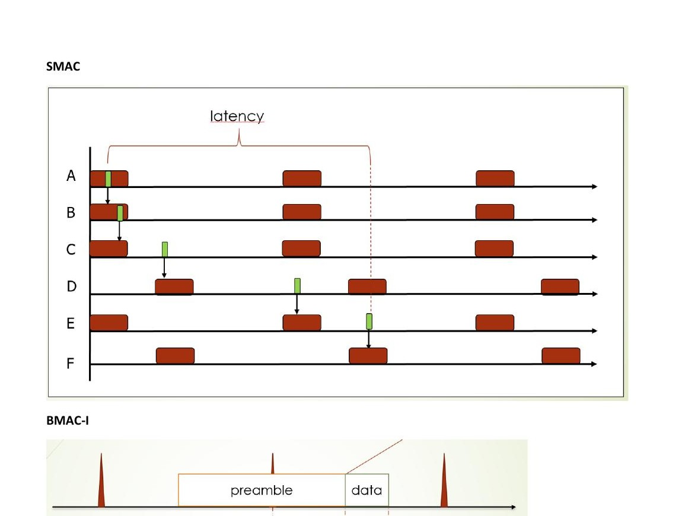
*Fig. — S-MAC: i nodi A–F hanno schedule sincronizzati (verde = listen, rosso = active/TX). La latenza multi-hop si accumula: il pacchetto da A deve aspettare i periodi di ascolto di ogni hop successivo.*

**S-MAC** riduce il consumo energetico tramite **sincronizzazione locale**: nodi vicini si accordano su un periodo di ascolto comune (listen period) e dormono nel resto del tempo.

**Meccanismo**:
1. Ogni nodo trasmette periodicamente un pacchetto **SYNC** che annuncia il proprio schedule.
2. I vicini che ricevono il SYNC adottano lo stesso schedule o mantengono il proprio e memorizzano quello del vicino.
3. Nel **listen period**: esecuzione di CSMA/CA con RTS/CTS prima di trasmettere.
4. Nel **sleep period**: la radio è spenta.

**Problema della latenza multi-hop**: in un percorso multi-hop, ogni nodo deve aspettare il periodo di ascolto del nodo successivo. La latenza totale si accumula ad ogni salto (es. latenza proporzionale a $n \cdot t_{sleep}/2$).
**Adaptive duty cycle**: per mitigare questo, se un nodo riceve un RTS o CTS in sorveglianza, capisce che c'è traffico nelle vicinanze e mantiene la radio accesa per il resto della trasmissione, anticipando che potrebbe essere il prossimo hop.

---

## Preamble Sampling: B-MAC

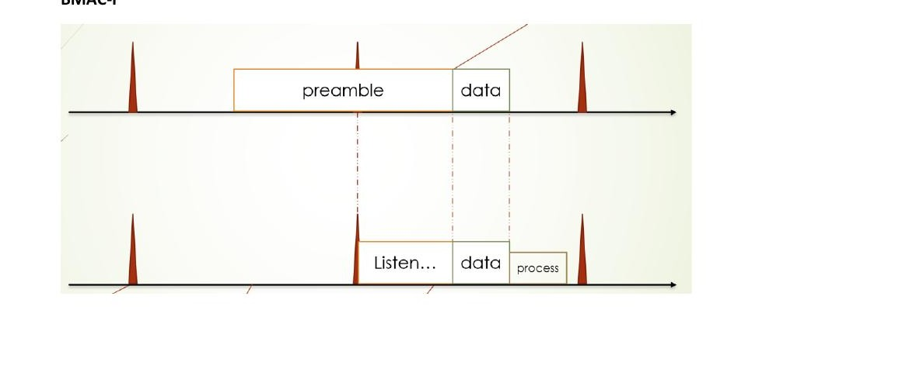
*Fig. — B-MAC: il mittente (in alto) invia un lungo preamble seguito dai data; il ricevitore (in basso) si sveglia, ascolta, individua il preamble, rimane sveglio e riceve i data.*

**B-MAC** usa il **preamble sampling** (Low Power Listening, LPL) ed elimina del tutto la sincronizzazione:

- **Lato ricevitore**: si sveglia periodicamente (ogni $t_{check}$), campiona il canale per un breve istante. Se rileva il preambolo, rimane sveglio e riceve i dati; altrimenti si riaddormenta subito.
- **Lato mittente**: quando deve trasmettere, invia un **preambolo lungo** per una durata $> t_{check}$, per garantire che qualunque sia il momento in cui il ricevitore si sveglia, trovi il preambolo "in aria". Dopo il preambolo, invia i dati effettivi.

**Trade-off e Ottimizzazione**:
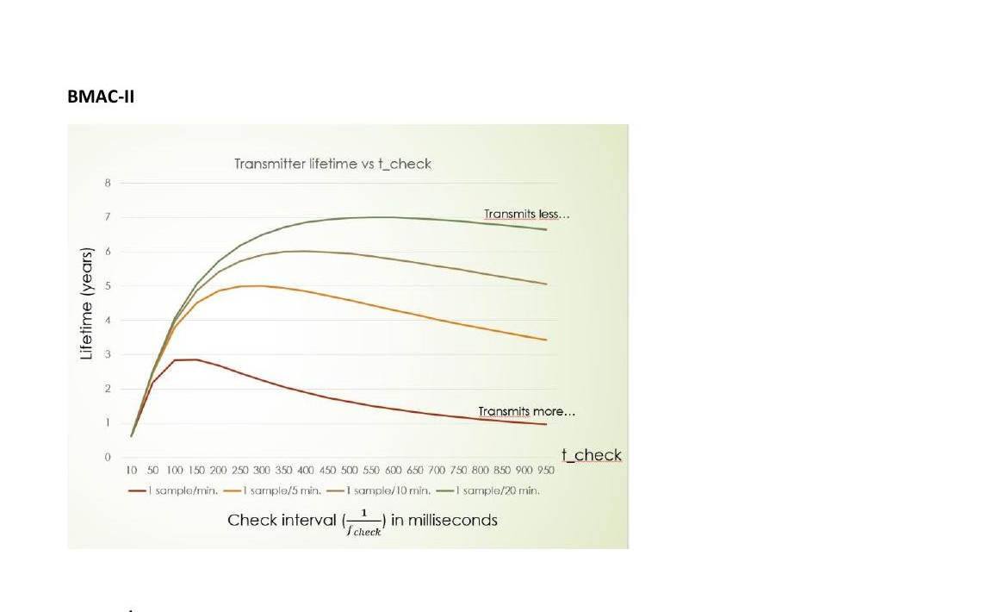
*Fig. — Grafico B-MAC: vita del trasmettitore (anni) vs intervallo di check t_check (ms), per diverse frequenze di campionamento (1 sample/min, 1/5 min, 1/10 min, 1/20 min).*

Il trade-off fondamentale riguarda come la frequenza di trasmissione e $t_{check}$ influenzano la batteria del **trasmettitore**.
Al crescere di $t_{check}$, il preambolo deve essere più lungo, quindi il trasmettitore consuma di più per ogni trasmissione. Tuttavia, la vita del trasmettitore ha un **massimo** per un valore ottimale di $t_{check}$:
- $t_{check}$ troppo breve → il ricevitore si sveglia spesso, preambolo corto (basso overhead per TX ma alto per RX).
- $t_{check}$ troppo lungo → preambolo lunghissimo, overhead troppo alto per il TX.

---

## Evoluzione: X-MAC vs B-MAC

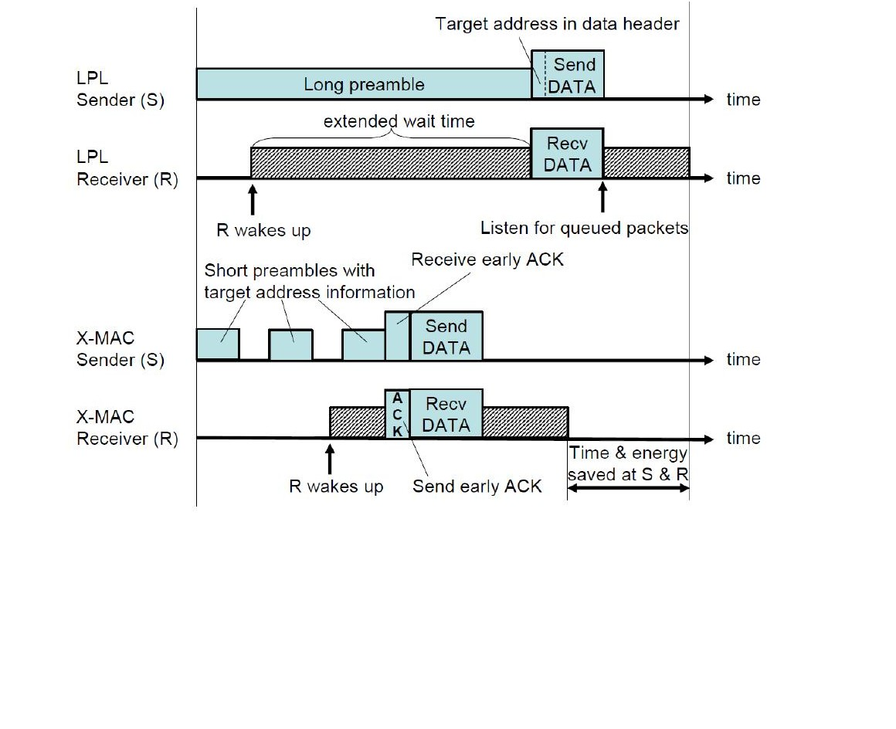
*Fig. — Confronto LPL (B-MAC, righe superiori) e X-MAC (righe inferiori): X-MAC usa preamble corti con indirizzo target; il ricevitore invia early ACK; mittente e ricevitore risparmiano tempo ed energia.*

**X-MAC** migliora B-MAC risolvendo lo spreco energetico del preambolo lungo e l'overhearing (nodi non destinatari che restano svegli inutilmente durante il lungo preambolo):

- **Mittente**: invia una sequenza di **short preambles** (strobe) contenenti ciascuno l'indirizzo del destinatario target.
- **Ricevitore target**: si sveglia, legge il proprio indirizzo nel preambolo, e invia immediatamente un **early ACK**.
- **Mittente**: ricevendo l'ACK, interrompe i preamboli e trasmette subito i dati.
- I **non-destinatari** vedono il proprio indirizzo assente nel preambolo e si riaddormentano subito.

Il risultato è un forte risparmio sia per il mittente (preambolo più corto in media) sia per il ricevitore (meno overhearing).

```{=latex}
\newpage
```

# Lo Standard IEEE 802.15.4

Lo standard IEEE 802.15.4 definisce le specifiche del **physical layer** e del **MAC layer** per le **Low-Rate Wireless Personal Area Network** (*LR-WPAN*, reti personali senza fili a bassa velocità). L'obiettivo è fornire un protocollo radio standardizzato per dispositivi a risorse limitate — sensori, attuatori, nodi IoT — che richiedono bassi consumi energetici piuttosto che elevate velocità di trasmissione.

## IEEE 802.15.4 - I (Struttura del Superframe)

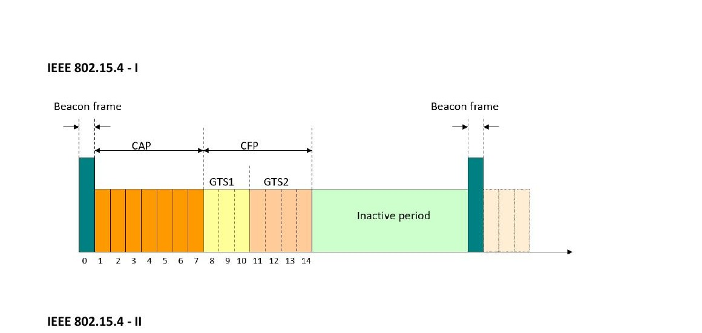
*Fig. — Struttura del superframe IEEE 802.15.4: Beacon frame → CAP (Contention Access Period, slot 0–6) → CFP (Contention Free Period, GTS1 e GTS2, slot 7–11) → Inactive period (slot 12–14) → prossimo Beacon.*

La modalità *beacon-enabled* struttura il tempo in **superframe**, delimitati dall'invio periodico di un frame beacon da parte del PAN coordinator. Il superframe divide il tempo in due porzioni: una **active period** e una **inactive period**. Durante il periodo inattivo il PAN coordinator e i dispositivi connessi possono entrare in modalità a basso consumo (sleep).

La **active period** comprende fino a **16 time slot** di uguale dimensione, suddivisi in:

- **Beacon frame**: il coordinatore trasmette periodicamente un beacon che annuncia l'inizio del superframe, contiene i parametri della rete e la lista dei dispositivi con dati pendenti.
- **CAP** (*Contention Access Period*): fino a 15 slot. I dispositivi competono per il canale usando il protocollo **CSMA-CA a slot** (*slotted CSMA-CA*). Un dispositivo attende un numero casuale di slot; se il canale è occupato riprova dopo un altro backoff casuale; se è libero trasmette e mantiene il canale fino alla fine del frame. Usato per traffico non deterministico (dati aperiodici).
- **CFP** (*Contention Free Period*): opzionale, occupa gli ultimi slot del periodo attivo. Diviso in **GTS** (*Guaranteed Time Slot*), ciascuno assegnato dal PAN coordinator a una specifica applicazione per comunicazioni deterministiche a bassa latenza. Il GTS è accessibile senza CSMA-CA, garantendo latenza deterministica. Ogni CFP può contenere al massimo 7 GTS, ciascuno composto da uno o più slot.

**Inactive period**: tutti i dispositivi (incluso il coordinatore) possono dormire per risparmiare energia. La durata del periodo inattivo determina il duty cycle della rete: un inactive period lungo → basso duty cycle → lunga vita della batteria → latenza più alta.

> [!warning] Il CAP non può essere eliminato
>
> Anche quando è presente il CFP, il CAP è necessario per il mantenimento della rete: gestione di associazioni/disassociazioni, richieste di GTS, ecc. Tutte le transazioni basate su contesa devono completarsi prima dell'inizio del CFP. Un dispositivo che trasmette in un GTS deve completare la trasmissione entro il suo GTS assegnato.

---

## IEEE 802.15.4 - II (Indirect Data Transfer)

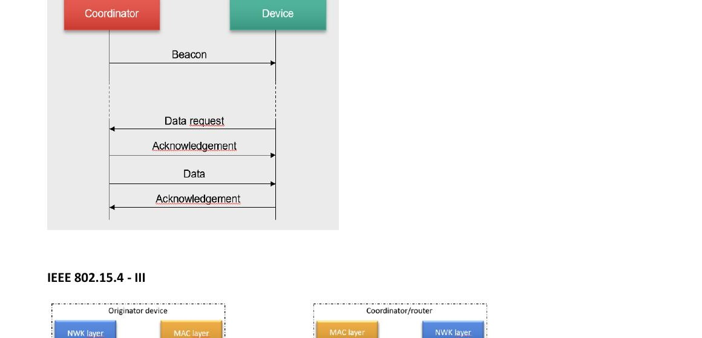
*Fig. — Trasferimento dati indiretto in IEEE 802.15.4: il dispositivo si sveglia al beacon, invia una Data request al coordinatore, riceve ACK e poi i dati.*

Il trasferimento **indiretto** è usato quando il destinatario è un dispositivo che dorme la maggior parte del tempo (RFD, end-device). Il coordinatore non può trasmettere dati in modo asincrono perché il dispositivo potrebbe essere in sleep.

**Da coordinatore a end-device**:
1. Il **coordinatore** memorizza il messaggio e trasmette un **Beacon** che include (nella lista *pending addresses*) l'indirizzo dei dispositivi per cui ha dati in coda.
2. Il **dispositivo**, che dorme la maggior parte del tempo, si sveglia al beacon, ascolta occasionalmente il beacon, legge la lista, se vede il proprio indirizzo invia una **Data request** al coordinatore nel CAP.
3. Il **coordinatore** risponde con un **Acknowledgement** immediato.
4. Il **coordinatore** trasmette i **dati** accodati in uno slot successivo del CAP.
5. Il **dispositivo** risponde con un **Acknowledgement** obbligatorio.
6. Infine il coordinatore rimuove il messaggio dalla lista.

Il device può poi tornare in sleep. Il vantaggio è che il dispositivo non deve rimanere sveglio ad aspettare dati: si sveglia solo al beacon (duty cycle controllato), controlla se ci sono dati per lui, li recupera e dorme di nuovo.

---

## IEEE 802.15.4 - III (Protocollo di Associazione)

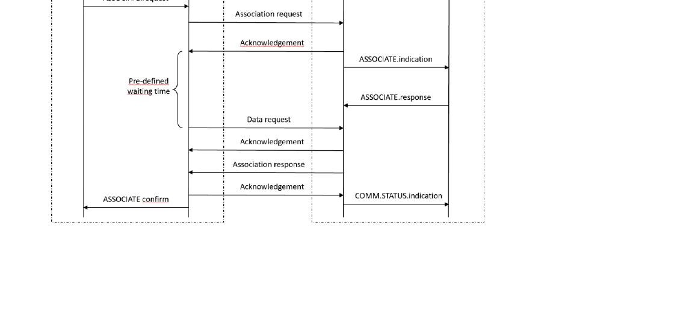
*Fig. — Protocollo di associazione IEEE 802.15.4: sequenza di messaggi tra NWK e MAC layer del dispositivo (sinistra) e del coordinatore/router (destra).*

L'associazione è il processo con cui un dispositivo entra a far parte di una PAN. È pensata per reti beacon-enabled e si compone di una fase sul lato end-device e una sul lato coordinatore. Lo schema mostra il protocollo di **associazione** visto a livello di primitives NWK-MAC.

### Lato End-Device

Il dispositivo che vuole associarsi deve aver identificato in anticipo la PAN di destinazione attraverso il servizio **SCAN** (scansione attiva). 

1. Il NWK del dispositivo emette `ASSOCIATE.request` al proprio MAC layer. Prende come parametri l'identificatore di PAN, l'indirizzo del coordinatore e il proprio indirizzo IEEE a 64 bit esteso.
2. Il MAC invia un **Association request** frame al coordinatore. La richiesta viene inviata nel CAP usando CSMA-CA a slot.
3. Il coordinatore MAC risponde con **Acknowledgement** immediato — ma questo non implica che la richiesta sia stata accettata.

### Lato Coordinatore e Completamento

Dopo aver ricevuto la richiesta, il MAC layer del coordinatore emette **ASSOCIATE.indication** verso il network layer (NWK), che decide se accettare o rifiutare. In caso di accettazione, il NWK layer:

4. Il coordinatore NWK riceve `ASSOCIATE.indication` e prepara la risposta con `ASSOCIATE.response`, selezionando un **indirizzo a 16 bit** che il dispositivo utilizzerà in futuro al posto dell'indirizzo a 64 bit.
5. Il dispositivo aspetta un **pre-defined waiting time** (il coordinatore deve elaborare la richiesta e decidere se accettarla). Il MAC layer invia la risposta di associazione usando **trasmissione indiretta**.
6. Il dispositivo MAC invia una **Data request** per recuperare la risposta del coordinatore.
7. Il coordinatore MAC risponde con **Acknowledgement** + **Association response** (contenente l'indirizzo a 16 bit assegnato e lo status della richiesta).
8. Il dispositivo MAC invia **Acknowledgement** finale.
9. Il dispositivo NWK riceve `ASSOCIATE confirm` con l'indirizzo assegnato.
10. Il coordinatore NWK riceve `COMM.STATUS.indication`, segnalando che l'associazione è conclusa — con successo o con un codice di errore.

```{=latex}
\newpage
```

# Embedded Programming e Arduino

## Modelli di Programmazione per Embedded

Il problema della gestione dell'I/O con memoria limitata ha portato allo sviluppo di diversi modelli di programmazione. I due esempi principali sono il **modello Arduino** (event loop sincrono) e il **modello TinyOS** (eventi + task asincroni).

### Il Modello Arduino

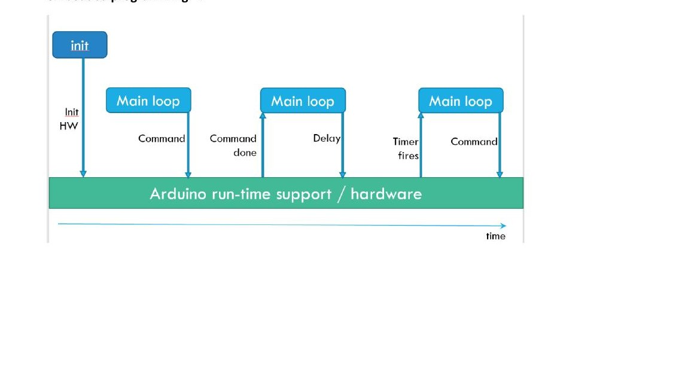
*Fig. — Modello di esecuzione Arduino: init → loop() ripetuto. I comandi attivano l'hardware; delay() aspetta; il timer fires avvia la ripetizione.*

Arduino adotta un approccio estremamente semplice: il lavoro è definito in una singola funzione `loop()`, eseguita ripetutamente da **un unico thread**. Non c'è sospensione del thread, non ci sono context switch. 

1. **init**: la funzione `setup()` viene eseguita una sola volta all'avvio. Inizializza l'hardware, configura i pin, prepara le comunicazioni seriali.
2. **Main loop**: la funzione `loop()` viene invocata ripetutamente all'infinito dal runtime Arduino.
3. **Command**: dentro `loop()`, il codice interagisce con l'hardware tramite comandi sincroni (es. `analogRead()`, `Serial.println()`).
4. **Delay**: `delay(ms)` blocca l'esecuzione per il tempo specificato (busy waiting o sleep), poi il timer fires riavvia il loop.

Il modello è semplice ma **bloccante**: durante `delay()` il processore non può fare altro. Se un'operazione di I/O richiede tempo, si aspetta semplicemente che si completi. Gli interrupt possono intervenire anche durante il delay, ma il thread principale rimane sospeso.

### Il Modello TinyOS

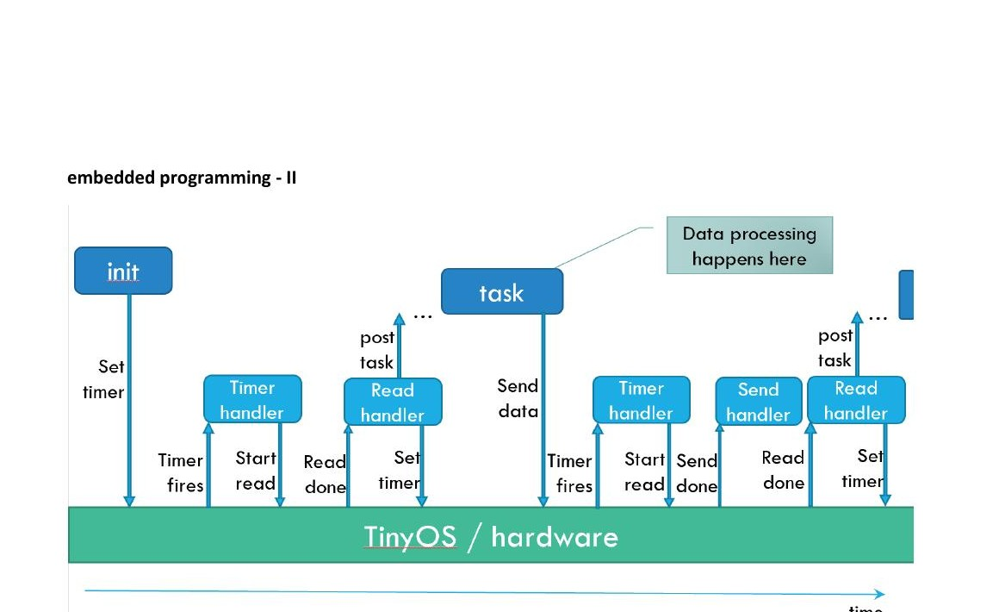
*Fig. — Modello di esecuzione TinyOS: catena di eventi (Timer → Read → task → Send) senza loop bloccante. Il data processing avviene nel task asincrono.*

TinyOS usa un modello **event-driven** con componenti e interfacce, progettato per massimizzare l'efficienza energetica e gestire attività indipendenti senza sprecare memoria per i contesti dei thread. Non esiste un loop bloccante: il sistema è guidato dagli eventi hardware. La catena tipica:

1. **init**: configura timer e hardware.
2. **Timer handler** (evento): scatta quando il timer fires → avvia una lettura dal sensore (`Start read`).
3. **Read handler** (evento): scatta quando la lettura è completata (`Read done`) → posta un task per il processing.
4. **task**: elabora i dati (*Data processing happens here*) → avvia la trasmissione radio. I task sono unità di elaborazione non-preemptive eseguite sequenzialmente. Un task non aspetta mai (salva memoria).
5. **Send handler** (evento): scatta quando la trasmissione è completa → riconfigura il timer per il prossimo ciclo.

**Vantaggi del modello event-driven**:
- Nessun busy waiting: il processore dorme tra un evento e l'altro.
- Nessuno stack multiplo: un unico stack (run-to-completion semantics).
- Efficienza energetica: il MCU è attivo solo durante gli handler.

**Confronto con Arduino**: Arduino è più semplice da programmare (loop sequenziale), ma meno efficiente in termini energetici. TinyOS è ottimale per nodi a basso consumo dove ogni microsecondo di sleep conta.

---

## Interrupt in Arduino

Sebbene il modello base di Arduino sia la lettura sincrona dei sensori nel loop, Arduino offre anche un'interfaccia per gli **interrupt**, che abilita l'accesso asincrono a sensori e attuatori.

### Interrupt Esterni: `attachInterrupt()`

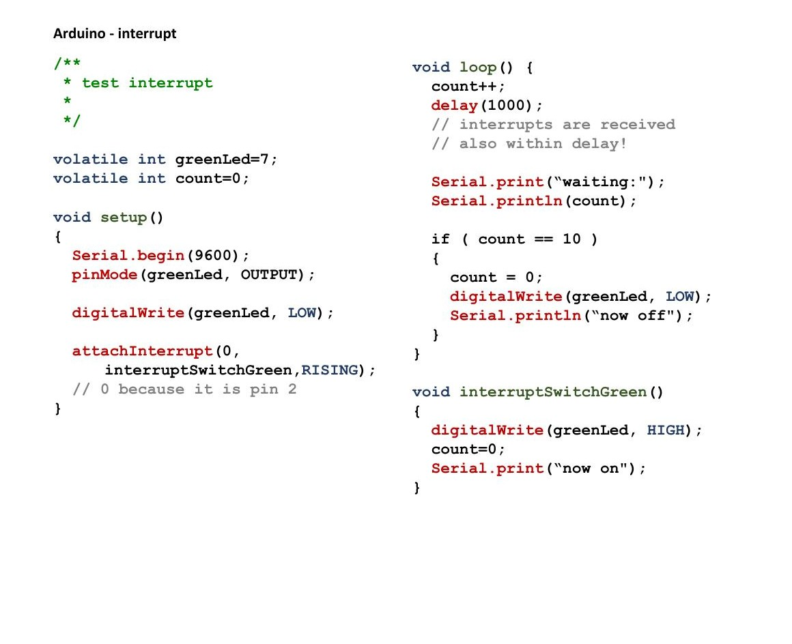
*Fig. — Esempio di programmazione con interrupt su Arduino: attachInterrupt() collega il pin 2 a interruptSwitchGreen(); count viene resettato e il LED acceso all'interrupt.*

```cpp
volatile int greenLed = 7;
volatile int count = 0;

void setup() {
  Serial.begin(9600);
  pinMode(greenLed, OUTPUT);
  digitalWrite(greenLed, LOW);
  attachInterrupt(0, interruptSwitchGreen, RISING); // 0 = pin 2
}

void loop() {
  count++;
  delay(1000);
  // Gli interrupt vengono ricevuti anche dentro delay!
  Serial.print("waiting:");
  Serial.println(count);
  if (count == 10) {
    count = 0;
    digitalWrite(greenLed, LOW);
    Serial.println("now off");
  }
}

void interruptSwitchGreen() {
  digitalWrite(greenLed, HIGH);
  count = 0;
  Serial.print("now on");
}
```

Arduino Uno dispone di **due pin per interrupt esterni**: INT0 (pin 2) e INT1 (pin 3). `attachInterrupt(0, interruptSwitchGreen, RISING)` collega il pin 2 alla funzione `interruptSwitchGreen`, eseguita automaticamente sul fronte di salita del segnale.

**Punti chiave e regole per gli interrupt handler**:
- `delay()` **non funziona** dentro un interrupt handler
- `millis()` **non viene incrementato** dentro un interrupt handler  
- La variabile `count` è dichiarata `volatile`: indica al compilatore di non ottimizzarla in registro (forza la lettura dalla RAM), perché può essere modificata da handler fuori dal flusso normale, garantendo la coerenza del valore.
- Gli interrupt sono ricevuti **anche durante `delay()`**: il delay non disabilita gli interrupt, quindi l'handler può intervenire in qualsiasi momento.
- I handler devono essere **il più brevi possibile**: solo aggiornamento di strutture dati e comandi all'HW.
- **Utilizzo tipico negli embedded IoT**: gli interrupt sono usati per ricevere dati dal sensore (read done), notificare la fine di una trasmissione radio, o rispondere a eventi fisici senza polling continuo, risparmiando energia.

---

## Calcolo del Duty Cycle e Gestione Energetica


*Fig. — Codice Arduino che implementa il duty cycling selettivo dei componenti (sensore, radio) e tabella dei consumi in mA per componente e stato.*

Il **duty cycle** di un componente è la frazione di tempo in cui è attivo rispetto al periodo totale. La strategia fondamentale di risparmio energetico nei dispositivi IoT è attivare ogni componente **solo quando strettamente necessario**.

Il codice mostra il pattern classico:
```
turnOn(analogSensor)   → sensore acceso solo durante lettura
analogRead(A0)         → lettura
turnOff(analogSensor)  → sensore spento

turnOn(radioInterface) → radio accesa solo durante trasmissione
Serial.println(voltage)
turnOff(radioInterface)

idle(380)              → MCU in sleep 380ms
```

> [!example] Calcolo del Duty Cycle
>
> Usando i valori della tabella (es. Tmote Sky):
> - Processore attivo: 8 mA, sleep: 15 μA
> - Radio TX: 17.4 mA, RX: 19.7 mA, sleep: 20 μA
> - Sensore: 5 mA, sleep: 5 μA
> 
> Se le operazioni di sensing + TX durano ~20 ms e il ciclo totale è 400 ms, il duty cycle della radio è 20/400 = 5%. La corrente media risultante è molto inferiore alla corrente di picco, estendendo la vita della batteria di ordini di grandezza.
> Il sistema è attivo solo per circa il 5% del tempo.

### Impatto sulla Vita della Batteria


*Fig. — Grafico log-log: vita della batteria (mesi) vs capacità della batteria (mAh) per duty cycle 100% (model1) e 5% (model2).*

Il grafico mostra l'impatto del duty cycle sulla vita della batteria in scala logaritmica. Due modelli a confronto:

- **Model 1 (100% DC)**: il dispositivo è sempre attivo. La vita della batteria scala linearmente con la capacità ma rimane nell'ordine dei mesi (0.01–0.3 mesi per capacità 500–3000 mAh).
- **Model 2 (5% DC)**: il dispositivo è attivo solo il 5% del tempo. La vita si estende di un fattore ~20: con la stessa batteria, si passa da 0.1 a circa 2–8 mesi.

La scala logaritmica rivela che la relazione vita-capacità non è lineare: il duty cycle agisce moltiplicativamente. Ridurre il duty cycle da 100% a 5% equivale a moltiplicare la capacità effettiva della batteria per 20.

**Conclusione progettuale**: per applicazioni IoT con autonomia di anni, ridurre il duty cycle è molto più efficace che aumentare la capacità della batteria. Una batteria da 3000 mAh a 5% DC dura circa 8 mesi; per durare anni si deve abbassare ulteriormente il duty cycle o usare energy harvesting. La perdita di capacità della batteria del 3%/anno indica che anche con battery standby c'è un degrado nel tempo.

```{=latex}
\newpage
```

# Energy Harvesting IoT

Il problema di fondo dei dispositivi IoT è energetico: alimentarli con una batteria di capacità finita costringe a scegliere tra prestazioni e durata. Una batteria grande permette lunga vita, ma aumenta dimensioni, peso e costo; un processore a basso consumo estende la vita ma limita potenza di calcolo e portata radio. L'**energy harvesting** (raccolta di energia) rappresenta un'alternativa strutturale: invece di ottimizzare il consumo, si raccoglie energia dall'ambiente e si elimina — o si riduce drasticamente — il vincolo della batteria finita.

## Architetture di harvesting e Concetto di Energy Neutrality

### Harvest-Use vs Harvest-Store-Use

**Harvest-Use**: l'energia è raccolta e consumata istantaneamente. Non esiste un buffer. Il dispositivo funziona solo se $P_s(t) \geq P_c(t)$ (potenza sorgente ≥ potenza consumata). Se la sorgente produce meno del necessario il dispositivo si spegne; se produce di più l'eccesso va perduto. Esempi: mulini ad acqua, tag RFID passivi.

**Harvest-Store-Use**: un buffer energetico (batteria ricaricabile o supercapacitore) disaccoppia temporalmente produzione e consumo. L'energia in eccesso ($P_s > P_c$) viene accumulata nel buffer; l'energia in difetto ($P_c > P_s$) viene prelevata dal buffer. Un buffer ideale ha capacità infinita ed efficienza $\eta = 1$. Un buffer reale ha capacità massima $B_{max}$, efficienza $\eta < 1$, e una potenza di leakage $P_{leak}$.

### Concetto di Energy Neutrality

Un dispositivo è **energy neutral** se, in qualsiasi intervallo di tempo, l'energia consumata non supera l'energia raccolta (più la carica iniziale del buffer):

$$\int_0^T P_c(t)\,dt \leq \int_0^T P_s(t)\,dt + B_0 \qquad \forall T$$

Il raggiungimento dell'energy neutrality richiede di adattare il carico in base alla disponibilità energetica prevista — obiettivo del problema di Kansal.

## Analisi Grafica della Potenza e Neutralità Energetica

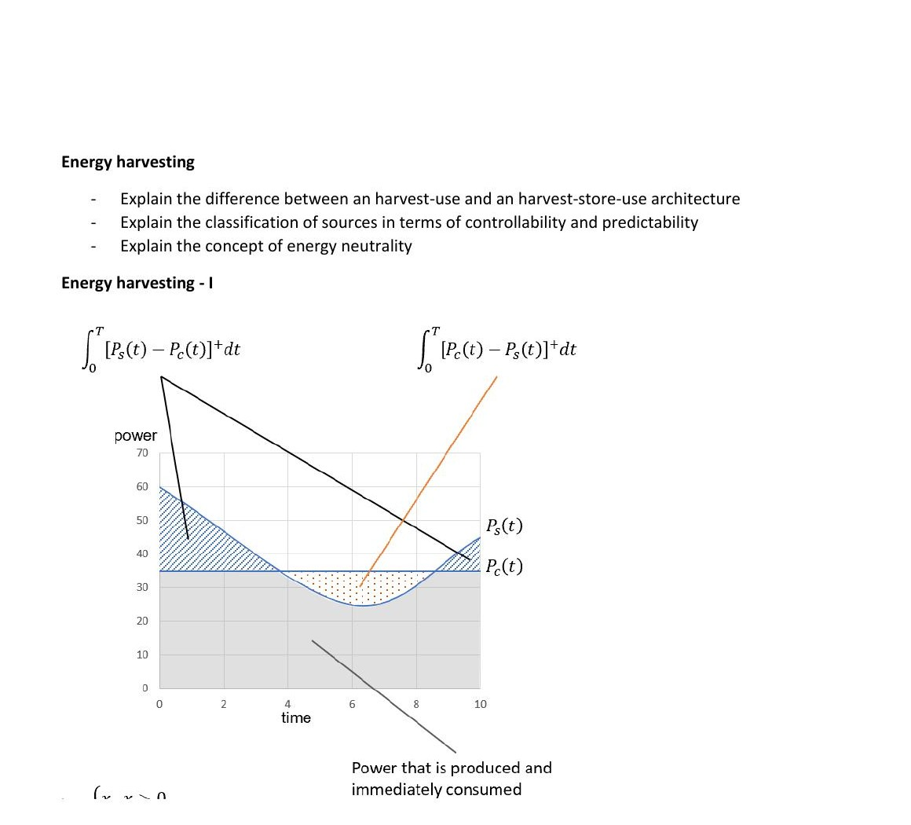
*Fig. — Grafico potenza/tempo: l'area tratteggiata in blu (Ps > Pc) è l'energia raccolta e accumulata nel buffer; l'area punteggiata (Pc > Ps) è l'energia prelevata dal buffer. La retta arancione mostra l'energia immediatamente consumata (Pc=Ps).*

Il grafico mostra due curve di potenza in funzione del tempo:
- $P_s(t)$: potenza prodotta dall'energy harvester (curva decrescente).
- $P_c(t)$: potenza consumata dal dispositivo (curva a forma di U).

Le due aree rappresentano:

$$\int_0^T [P_s(t) - P_c(t)]^+ dt$$

Area in blu (Ps > Pc): energia prodotta in eccesso → accumulata nel buffer. Il buffer si carica.

$$\int_0^T [P_c(t) - P_s(t)]^+ dt$$

Area punteggiata (Pc > Ps): il consumo supera la produzione → energia prelevata dal buffer. Il buffer si scarica.

La retta arancione indica la zona in cui $P_s = P_c$: energia prodotta e immediatamente consumata, senza passare dal buffer. Il sistema è energy neutral se la prima integrale ≥ seconda integrale su tutto l'orizzonte temporale considerato.

## Classificazione delle Sorgenti

Le sorgenti si classificano su due assi:

**Controllabilità**:
- *Completamente controllabile*: energia disponibile su richiesta (torcia shake-to-power, sorgenti RF dedicate).
- *Parzialmente controllabile*: influenzabile ma non deterministica (RFID in ambiente RF non uniforme).
- *Non controllabile*: raccolta solo quando disponibile (sole, vento, calore ambientale).

**Prevedibilità** (per le sorgenti non controllabili):
- *Prevedibile*: esistono modelli affidabili (sole: ciclo giorno/notte + stagioni + meteo).
- *Non prevedibile*: nessun modello affidabile (vibrazioni da terremoti).

## Misurare la carica della batteria

Tutte le tecniche di power management richiedono informazioni fresche sulla carica attuale della batteria e sulla produzione energetica. Entrambe sono quantità non direttamente osservabili e devono essere stimate.

### Stima Stato di Carica tramite ADC

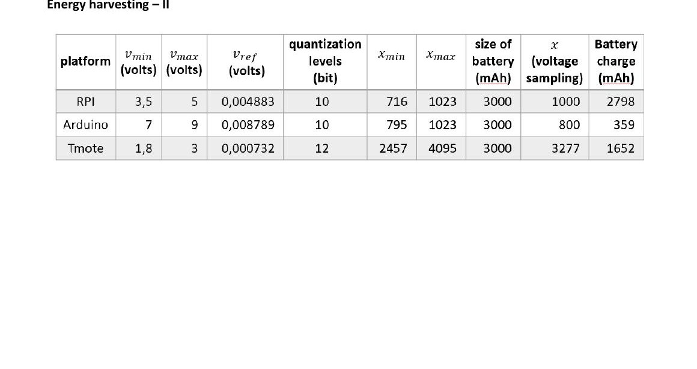
*Fig. — Tabella con parametri di batteria per tre piattaforme (RPI, Arduino, Tmote): tensioni min/max/ref, livelli di quantizzazione, xmin/xmax e stima Battery charge.*

La tabella mostra come misurare lo **stato di carica** (SoC) di una batteria attraverso la sua tensione terminale, per tre piattaforme hardware. L'idea è che la tensione ai terminali di una batteria è approssimabile come monotona (e in molti tratti lineare) rispetto alla carica residua.

Le colonne chiave:
- $v_{min}$, $v_{max}$: range operativo della batteria (es. Arduino: 7–9 V).
- $v_{ref}$: risoluzione della quantizzazione ADC (es. Arduino: 0.008789 V per LSB).
- **quantization levels (bit)**: risoluzione dell'ADC (10 o 12 bit).
- $x_{min}$, $x_{max}$: valori ADC corrispondenti a $v_{min}$ e $v_{max}$.
- **Battery charge (mAh)**: capacità totale della batteria stimata.

Campionando la tensione tramite ADC e mappando il valore digitale $x$ nell'intervallo $[x_{min}, x_{max}]$, si ottiene una stima lineare della carica rimanente:

$$\text{SoC} \approx \frac{x - x_{min}}{x_{max} - x_{min}} \times B_{cap}$$
$$B = B_{min} + \frac{B_{max} - B_{min}}{x_{max} - x_{min}}(x - x_{min})$$

Questa stima è utile per il task scheduler: sa quanta energia ha disponibile e può pianificare i task di conseguenza.

```{=latex}
\newpage
```

# Kansal Problem e Energy Neutrality

## Il Problema di Kansal: Energy Neutrality nei Sistemi IoT

Il problema di **energy management** per dispositivi IoT alimentati da sorgenti rinnovabili è intrinsecamente legato alla natura della sorgente di energia. Kansal considera il caso di sorgenti **prevedibili ma non controllabili**: fonti come l'energia solare sono soggette a variazioni giornaliere e stagionali, ma il loro andamento nel tempo può essere stimato con buona precisione.

L'obiettivo del power management è triplice:
- mantenere il sistema **energy neutral**, cioè fare in modo che la batteria non si esaurisca mai;
- **evitare che il dispositivo si spenga** prima del prossimo ciclo di ricarica;
- **massimizzare le prestazioni** del nodo, ossia la sua utility.

L'approccio consiste nel tener conto del livello attuale e atteso della batteria, modulare dinamicamente le prestazioni del dispositivo (e quindi il carico energetico), garantendo che il dispositivo non scenda sotto le performance minime.

### Approccio Kansal all'Energy Neutrality

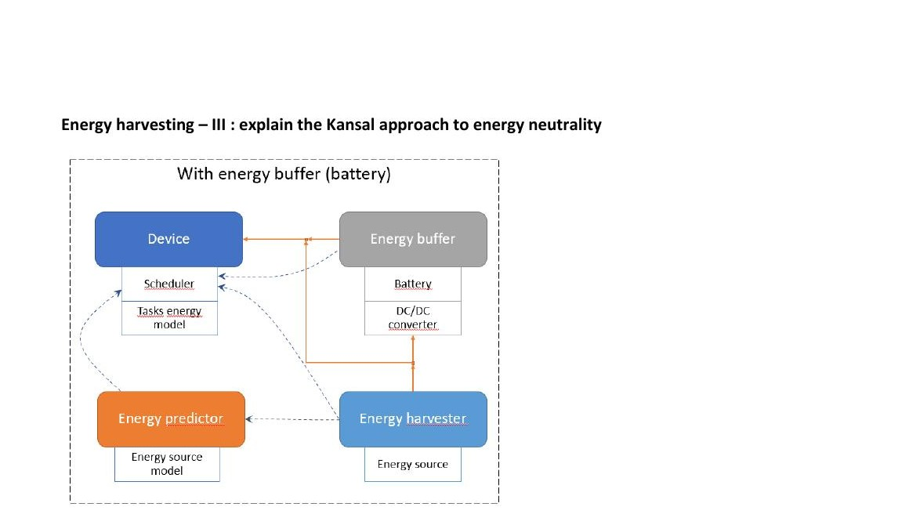
*Fig. — Sistema Kansal: il Device (con Scheduler e Tasks energy model) è alimentato dall'Energy buffer (Battery + DC/DC converter), rifornito dall'Energy harvester. L'Energy predictor stima la disponibilità futura e informa lo Scheduler.*

L'approccio di **Kansal** all'energy neutrality mira a massimizzare le prestazioni del dispositivo garantendo al contempo che la batteria non si scarichi mai completamente (energy neutral operation). L'idea è pianificare dinamicamente il duty cycle del dispositivo slot per slot, sfruttando previsioni sulla produzione futura.

Il sistema è composto da:
- **Energy harvester**: raccoglie energia dalla sorgente (es. pannello solare).
- **Energy buffer (Battery + DC/DC converter)**: accumula l'energia raccolta e la cede al dispositivo quando necessario.
- **Energy predictor** (con Energy source model): stima la quantità di energia che sarà disponibile nel futuro (ad es. usando previsioni meteo per un pannello solare).
- **Device** con **Scheduler** (e Tasks energy model): pianifica quali task eseguire e a quale frequenza, basandosi sia sullo stato attuale della batteria sia sulla predizione energetica futura.

**Idea centrale**: adattare il carico ($P_c$) alla disponibilità energetica prevista. Se le previsioni indicano un giorno soleggiato → il dispositivo può aumentare la frequenza di campionamento. Se le previsioni indicano bassa produzione → il dispositivo riduce l'attività.

**Condizione di energy neutrality di Kansal**:
$$B_T = B_0 + \eta \int_0^T [P_s - P_c]^+ dt - \int_0^T [P_c - P_s]^+ dt \geq B_{min} \quad \forall T$$

Il Kansal problem è quindi un problema di ottimizzazione: massimizzare le prestazioni (es. frequenza di campionamento) soggetto al vincolo di energy neutrality.

---

## Modello Task-Based per l'Energy Neutrality

Kansal modella il carico tramite duty cycle, ma le applicazioni IoT reali sono più complesse. Un'applicazione tipica esegue 4 fasi in ciclo: **Sensing → Storing → Processing → Transmitting**. Ciascuna fase può avere implementazioni alternative con diversi trade-off energia/performance.

Si chiama **task** un'implementazione specifica dell'applicazione sul dispositivo IoT. Un dispositivo ha $n$ task alternative, ciascuna con costo energetico $c_j$ e utility $u_j$.

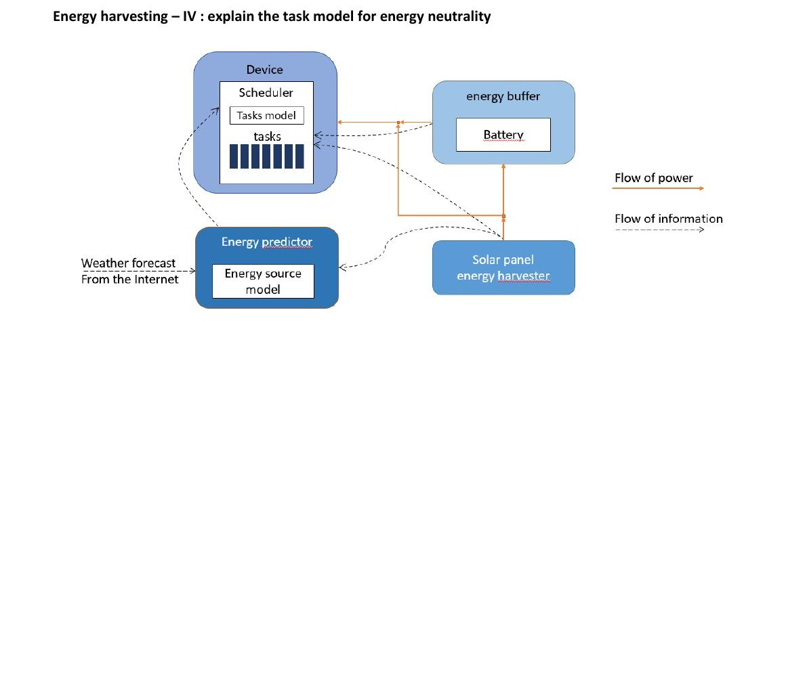
*Fig. — Task model: lo Scheduler pianifica i task in base al Tasks model (energia per task) e alle previsioni energetiche dell'Energy predictor (alimentato da weather forecast e da un Solar panel harvester collegato alla Battery).*

Lo schema espande il sistema Kansal con il dettaglio del **task model**. Rispetto allo schema base, qui è esplicitato il ruolo delle previsioni meteorologiche esterne.

**Componenti**:
- **Tasks model**: specifica il costo energetico di ogni task (es. campionamento = X mJ, trasmissione = Y mJ). Lo Scheduler usa questo modello per stimare quanta energia consumerà ogni operazione.
- **Scheduler**: dato il livello attuale della batteria e la previsione di energia futura, decide:
  - Quali task eseguire nel prossimo periodo.
  - A quale frequenza/duty cycle eseguirli.
  - Obiettivo: massimizzare la qualità del servizio senza violare l'energy neutrality.
- **Energy predictor + Energy source model**: riceve dati dal weather forecast (Internet) e dalle misurazioni del pannello solare per costruire un modello predittivo della produzione energetica futura.
- **Solar panel energy harvester → Battery**: flusso di potenza fisico; informazioni di stato comunicano il livello di carica allo Scheduler.

Lo scheduler assegna esattamente un task per slot, ottimizzando l'utility complessiva e rispettando i vincoli di batteria e la neutralità energetica di fine giornata.

```{=latex}
\newpage
```

# Interoperabilità e Standard nell'IoT

Il concetto di **interoperabilità** rappresenta una delle sfide cruciali nello sviluppo dell'Internet of Things. Implementare una soluzione IoT "dal basso", ovvero dal livello fisico fino all'applicazione, non costituisce di per sé un problema tecnico insormontabile; tuttavia, questo approccio porta spesso alla creazione di quelli che vengono definiti *vertical silos*.

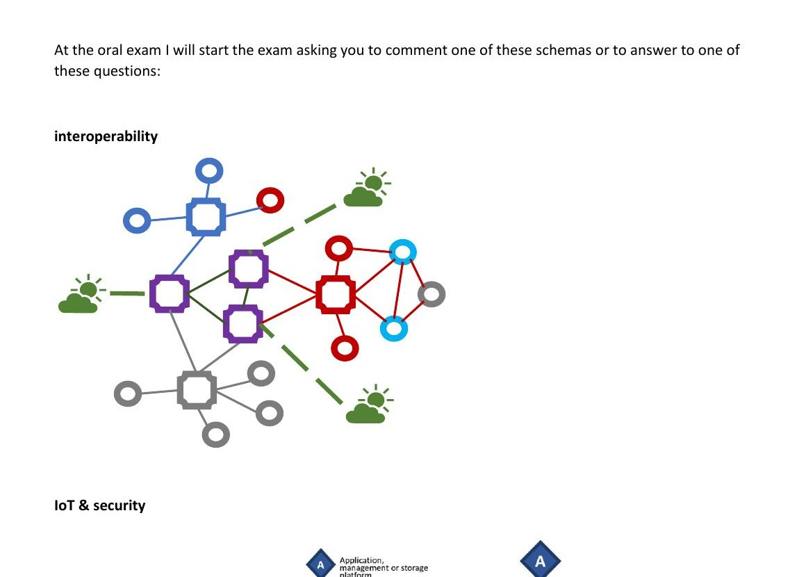
*Fig. — Rete IoT eterogenea: dispositivi di produttori diversi (colori diversi) comunicano attraverso gateway di integrazione.*

Lo schema mostra una rete in cui dispositivi appartenenti a ecosistemi diversi devono comunicare tra loro. Il problema fondamentale è proprio l'**interoperabilità**.

> [!definition] Vertical Silos
>
> In questo modello, una soluzione funziona esclusivamente all'interno del proprio ecosistema: i dispositivi proprietari comunicano solo con l'infrastruttura dello stesso fornitore, rendendo incompatibili i prodotti di terze parti.

Questa strategia di design è spesso intenzionale e risponde a un modello di business basato sul *vendor lock-in*.

> [!definition] Vendor Lock-in
>
> La pratica di "ingabbiare" il cliente con l'obiettivo di prevenire l'utilizzo di componenti di altri produttori e imporre costi elevati per l'eventuale migrazione verso soluzioni alternative. Tale migrazione comporta spesso la completa riprogettazione e il dispiegamento di un nuovo sistema, con il rischio di entrare semplicemente in un altro silos.

Storicamente, il problema dell'interoperabilità risiedeva principalmente a livello hardware, ma nell'IoT moderno la questione si è spostata prevalentemente a livello software. La soluzione universalmente riconosciuta per mitigare queste barriere è l'introduzione e l'adozione di **standard** condivisi.

## La Necessità e la Complessità degli Standard

Gli standard nascono dalla necessità di ridurre i costi di sviluppo tecnologico attraverso accordi tra diversi produttori, in un regime di **coopetition** (cooperazione tra competitor). Solitamente, la standardizzazione avviene quando una tecnologia diventa matura. 

Tuttavia, la proliferazione degli standard (come Wi-Fi, ZigBee, Bluetooth) ha spostato il problema dell'interoperabilità ai livelli middleware e applicativo. Oggi esistono numerosi protocolli di livello applicativo (MQTT, CoAP, LWM2M, ecc.), creando una situazione in cui l'incompatibilità non è solo tra silos verticali, ma anche tra standard differenti.

Per gestire questa eterogeneità si ricorre agli **Application-level gateway**. Questi dispositivi non si limitano a tradurre protocolli di basso livello: mappano comportamenti applicativi differenti l'uno nell'altro, operando come interpreti semantici tra ecosistemi incompatibili.

## Configurazioni di Integrazione

Le architetture IoT possono assumere configurazioni molto diverse in base all'omogeneità dei dispositivi e dei protocolli coinvolti. La tabella seguente riassume i quattro tipi principali:

| Tipo | Fornitore | Protocollo | Necessità di gateway |
|------|-----------|------------|----------------------|
| A | Unico | Unico | No |
| B | Multiplo | Unico (condiviso) | No o minimale |
| C | Multiplo | Diversi | Sì — Integration Gateway per la traduzione |
| D | Multiplo | Eterogenei e distribuiti | Sì — gateway multipli con mappature complesse |

Al crescere della complessità, dal Tipo A al Tipo D, il gateway di integrazione deve gestire un numero esponenziale di mappature tra protocolli allo stesso livello. La sfida non è solo tecnica ma organizzativa: ogni nuovo fornitore o protocollo aggiunto alla rete moltiplica le combinazioni da gestire.

---

## Sicurezza nell'IoT

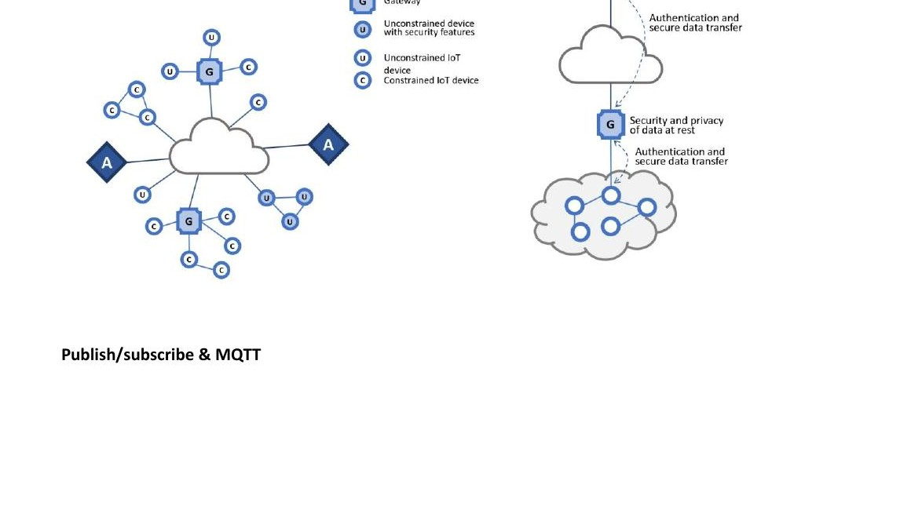
*Fig. — Architettura di sicurezza IoT: dispositivi vincolati (C), gateway (G), applicazioni (A) e relative misure di sicurezza per ogni livello.*

Lo schema mostra un'architettura IoT a strati in cui la sicurezza deve essere garantita a ogni livello: tra dispositivi periferici e gateway (autenticazione + trasferimento sicuro), e tra gateway e cloud/applicazione (sicurezza dei dati a riposo + autenticazione).

La sicurezza nei sistemi cyber-fisici e nell'IoT ha raggiunto un punto di crisi. A differenza dei sistemi IT tradizionali, i dispositivi IoT sono spesso sistemi embedded economici, prodotti con forti incentivi a ridurre costi e tempi di immissione sul mercato (*Time-to-Market*), a discapito della sicurezza. La conseguenza sono centinaia di milioni di dispositivi vulnerabili, privi di meccanismi di patching efficaci.

Le conseguenze variano dall'inserimento di dati falsi nella rete alla compromissione delle operazioni fisiche.

## Requisiti di Sicurezza secondo ITU-T Y.2066

La raccomandazione **Y.2066** dell'ITU-T identifica i requisiti fondamentali per la sicurezza IoT organizzandoli in tre aree concettuali distinte:

1. **Sicurezza della comunicazione**: garantire la riservatezza e l'integrità dei dati in transito o il trasferimento tra dispositivi e piattaforme.
2. **Sicurezza della gestione dei dati**: proteggere riservatezza e integrità quando i dati sono archiviati o elaborati (*data at rest*).
3. **Sicurezza della fornitura del servizio**: prevenire accessi non autorizzati ai servizi e proteggere le informazioni private degli utenti.

A questi si aggiungono l'**autenticazione mutua** (entrambe le parti si verificano reciprocamente) e la capacità di audit di sicurezza.

## Il Ruolo del Gateway nella Sicurezza

In un'architettura IoT, il gateway agisce spesso come punto centrale di applicazione delle policy di sicurezza. 
- Gestisce identificazione e autenticazione di ogni dispositivo connesso.
- Protegge la privacy dei dispositivi periferici.
- Supporta manutenzione, aggiornamento firmware e autodiagnosi remota.
- Applica policy di configurazione dinamiche.

> [!warning] Dispositivi vincolati e limiti di sicurezza
>
> I **dispositivi vincolati** (*constrained devices*) pongono ostacoli concreti, spesso non disponendo di hardware crittografico dedicato, rendendo impraticabile la cifratura dei dati archiviati. Con la diffusione del *Massive IoT*, la privacy diventa una criticità per l'enorme mole di dati sensibili raccolti.

```{=latex}
\newpage
```

# Fondamenti dell'IoT e Architettura del Protocollo MQTT

## Introduzione al Protocollo MQTT

> [!definition] MQTT
>
> **MQTT** (*Message Queuing Telemetry Transport*) è un protocollo di messaggistica leggero di tipo publish/subscribe, progettato per ambienti con risorse limitate e connettività instabile. 

MQTT è stato creato nel 1999. La sua leggerezza si manifesta nel code footprint ridotto, basso consumo di banda e overhead minimo. Dal punto di vista architetturale, MQTT si appoggia su TCP/IP (porta 1883 in chiaro, 8883 con SSL/TLS). 

L'infrastruttura MQTT concentra volutamente la complessità sul lato server (il broker), mantenendo l'implementazione client estremamente semplice. È *data agnostic* (il payload può essere binario, testo, JSON o XML).

---

## Il Paradigma Publish / Subscribe

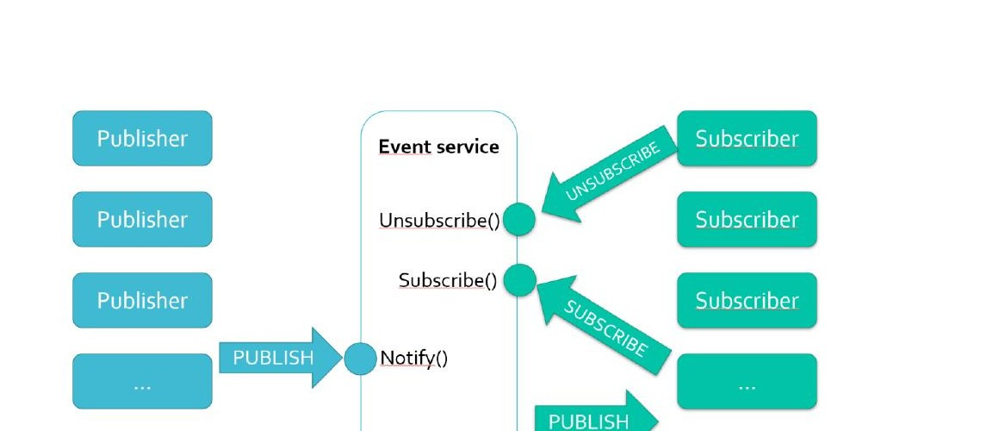
*Fig. — Il paradigma publish/subscribe: i publisher inviano messaggi al broker tramite PUBLISH; i subscriber si registrano (SUBSCRIBE) e ricevono notifiche (PUBLISH dal broker); possono anche disdire (UNSUBSCRIBE).*

A differenza del rigido paradigma client/server, il pub/sub implementa uno schema di interazione *loosely coupled*. Gli attori sono due: i **publisher** (pubblicatori) e i **subscriber** (sottoscrittori), che agiscono entrambi come client senza essere a conoscenza dell'esistenza reciproca. I publisher producono eventi interagendo unicamente con il broker; i subscriber esprimono il proprio interesse verso specifici topic e ricevono notifiche.

> [!tip] Pub/Sub e i tre disaccoppiamenti
>
> Il paradigma **publish/subscribe** introduce tre forme di *decoupling* che lo rendono ideale per l'IoT:
> - **Space decoupling**: publisher e subscriber non si conoscono, non condividono IP né porta.
> - **Time decoupling**: non devono essere operativi contemporaneamente.
> - **Synchronization decoupling**: le operazioni sui client non vengono bloccate durante publish o receive.

Il **broker** è il server dell'infrastruttura: riceve tutti i messaggi, li filtra per topic, li distribuisce ai subscriber interessati. Le operazioni fondamentali sono quattro: *Publish*, *Subscribe*, *Notify*, *Unsubscribe*.

---

## Il Modello MQTT: Connessione e Flusso Operativo

MQTT adotta il paradigma pub/sub con filtraggio basato su **topic**. 

### L'Instaurazione della Connessione
L'interazione inizia con un pacchetto **CONNECT**, contenente parametri come: Client ID, Clean Session, Username/Password, Will flags e KeepAlive. Il broker risponde con un **CONNACK**.

### Gestione e Best Practices dei Topic
Il broker usa il **filtraggio basato su topic** (topic-based filtering). I topic sono stringhe gerarchiche separate da `/` (es. `home/firstfloor/bedroom/temperature`). I subscriber possono usare wildcard:
- **`+`**: sostituisce un singolo livello (es. `home/+/temperature`).
- **`#`**: sostituisce tutti i livelli successivi (es. `home/#`).

Il broker non ispeziona il payload, consentendo cifratura end-to-end.

### Pubblicazione e Struttura dei Messaggi
Il publisher invia messaggi tramite **PUBLISH**, composto da `topicName`, `payload`, `packetId`, `retainFlag`, `dupFlag` e `qos`.

---

## I Meccanismi della Quality of Service (QoS)

MQTT definisce tre livelli di garanzia di consegna dei messaggi tra client e broker:

| Livello | Nome | Garanzia | Meccanismo |
|---------|------|----------|------------|
| QoS 0 | At most once | Nessuna | Nessun ACK |
| QoS 1 | At least once | Almeno una consegna | PUBACK (possibili duplicati) |
| QoS 2 | Exactly once | Esattamente una consegna | 4-way handshake |

### QoS 0 — At Most Once
Modalità *best effort*: il messaggio viene inviato una sola volta senza conferma (ACK) e senza memorizzazione. Adatto per dati che invecchiano rapidamente.

### QoS 1 — At Least Once
Garantisce che il messaggio arrivi almeno una volta. Il broker memorizza il messaggio finché non riceve **PUBACK**. Può generare duplicati.

### QoS 2 — Exactly Once

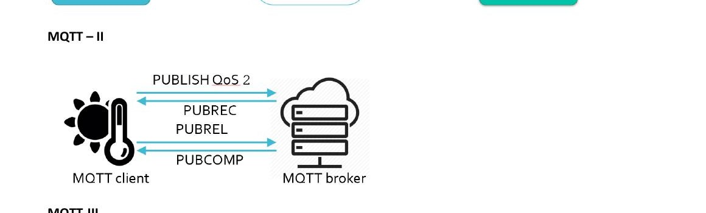
*Fig. — Handshake a quattro fasi del QoS 2 tra MQTT client e broker: PUBLISH → PUBREC → PUBREL → PUBCOMP.*

QoS 2 è il livello più affidabile e garantisce la consegna esattamente una volta, senza duplicati. Il costo è un handshake a quattro fasi:
1. **PUBLISH**: il client invia il messaggio al broker.
2. **PUBREC** (*Publish Received*): il broker conferma la ricezione e memorizza il messaggio.
3. **PUBREL** (*Publish Release*): il client autorizza il broker a procedere con la consegna effettiva.
4. **PUBCOMP** (*Publish Complete*): il broker conferma l'avvenuta consegna.

Il PUBREC garantisce che il messaggio non vada perso; PUBREL + PUBCOMP garantiscono che non venga consegnato due volte. Due fasi non sarebbero sufficienti perché si genererebbero duplicati in caso di ritrasmissione.

```{=latex}
\newpage
```

# MQTT: Meccanismi di Affidabilità

Questa sezione approfondisce i meccanismi che rendono il protocollo MQTT robusto in contesti IoT: sessioni persistenti, messaggi trattenuti, testamento e keep alive.

## Meccanismi di Affidabilità

### Sessioni Persistenti

Quando un dispositivo IoT si disconnette (per sleep, copertura persa, reset), rischia di perdere le sottoscrizioni attive e i messaggi pubblicati durante l'assenza. Le **persistent session** risolvono questo problema.

> [!definition] Sessione Persistente (*Persistent Session*)
>
> Meccanismo attivato impostando `cleanSession = false` nel CONNECT. Il broker conserva per quel `clientId`:
> - Tutte le sottoscrizioni attive
> - I messaggi non consegnati con QoS 1 o 2
> - I messaggi in attesa di completamento del flusso QoS 2

Alla riconnessione con lo stesso `clientId`, la sessione viene ripristinata automaticamente. Il broker segnala la presenza di una sessione precedente tramite il flag *Session Present* nel CONNACK.

### Messaggi Trattenuti (*Retained Messages*)

Nel pub/sub classico, un nuovo subscriber non sa quando arriverà il primo messaggio. I **retained message** risolvono questo: un messaggio pubblicato con `retainFlag = true` viene conservato dal broker (uno per topic). 

Ogni nuovo subscriber riceve immediatamente l'ultimo messaggio trattenuto al momento dell'iscrizione, senza aspettare la prossima pubblicazione fisiologica.

> [!example] Esempio: stato di un dispositivo domestico
>
> Un dispositivo pubblica il proprio stato su `home/devices/device1/status` con payload `"ON"` e `retainFlag = true`. Un nuovo client che si iscrive riceve immediatamente `"ON"`.

### Last Will & Testament

Quando un dispositivo si disconnette *normalmente* (DISCONNECT), può notificare gli altri esplicitamente. Per le **disconnessioni anomale** (crash, timeout, interruzione di rete) non esiste tale possibilità.

> [!definition] Last Will & Testament
>
> Messaggio pre-configurato consegnato al broker al momento del CONNECT. Se il broker rileva una disconnessione anomala, pubblica quel messaggio automaticamente. Il testamento ha topic, payload, QoS e retained flag propri.

Il broker invia il testamento in quattro circostanze: 
- Errore di I/O sulla connessione.
- Mancato invio di PINGREQ entro il keep alive.
- Chiusura brusca TCP senza DISCONNECT.
- Chiusura forzata per errore di protocollo.

Se il client si disconnette con DISCONNECT regolare, il testamento viene scartato.

> [!tip] Pattern potente
>
> Un dispositivo pubblica il proprio stato (`"ON"`) come retained message. Configura anche un testamento con payload `"OFF"` e retain flag attivo sullo stesso topic. Se va in crash, il broker pubblica automaticamente `"OFF"` come retained message — tutti i client (connessi e futuri) vedono lo stato corretto.

### Keep Alive

TCP può mantenere una connessione apparentemente attiva anche quando il peer è irraggiungibile. Il **Keep Alive** risolve questo problema: il client dichiara un intervallo (campo a 16 bit nel CONNECT) entro cui si impegna a inviare almeno un pacchetto. 

Se non lo fa, il broker chiude la connessione e invia il testamento. Il client invia **PINGREQ** se non ha altro traffico; il broker risponde con **PINGRESP**. Il valore `0` disabilita il meccanismo.

```{=latex}
\newpage
```

# The ZigBee Standard — Part 1 (Appunti d'Esame)

## Architettura a Strati e Application Layer

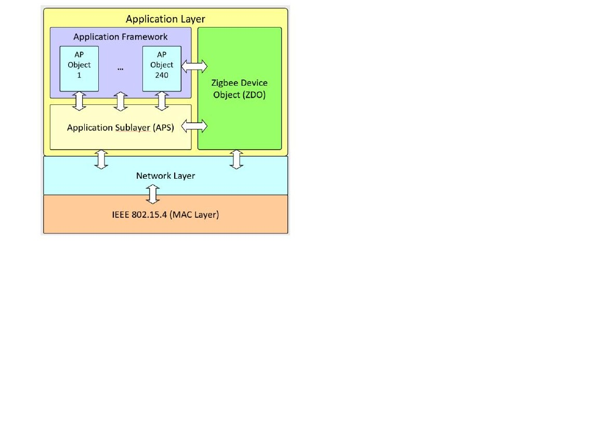
*Fig. — Stack protocollare ZigBee: dall'IEEE 802.15.4 (MAC) fino all'Application Layer, con Application Framework, ZDO e APS.*

ZigBee è costruito sopra lo standard IEEE 802.15.4 (PHY + MAC). Sopra questi livelli, ZigBee aggiunge il Network Layer e l'Application Layer. Il livello applicativo è articolato in tre componenti:

- **Application Framework**: ospita fino a 240 **Application Objects (APO)**, ciascuno associato a un endpoint (numerato da 1 a 240). Ogni APO è identificato univocamente dalla coppia `<indirizzo di rete, endpoint>`. Più APO sullo stesso dispositivo possono corrispondere ad applicazioni diverse che operano simultaneamente.
- **ZigBee Device Object (ZDO)**: occupa l'endpoint 0 ed è la componente gestionale del nodo. Fornisce:
  - Device & Service Discovery (trova altri nodi e i loro servizi)
  - Binding Management (crea/modifica le binding table dell'APS)
  - Network Management (gestisce join/leave e routing table)
- **Application Support Sublayer (APS)**: fa da intermediario tra APO/ZDO e il Network Layer. Fornisce:
  - *Data Service*: trasmissione messaggi con acknowledgment end-to-end
  - *Binding Service*: creazione di connessioni logiche tra endpoint
  - *Group Management*: indirizzamento multicast tramite Group Table

L'APS filtra i pacchetti per endpoint e profile ID, scartando quelli non destinati ad applicazioni registrate.

---

## Topologie di Rete e Routing

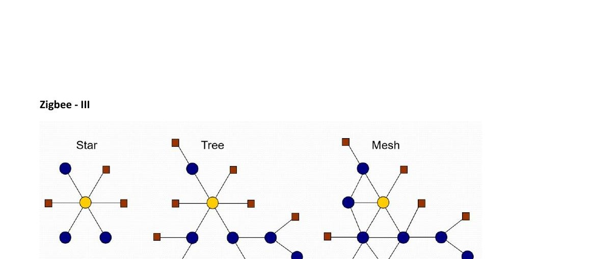
*Fig. — Le tre topologie ZigBee: Star (sinistra), Tree (centro), Mesh (destra). Nodo giallo = coordinatore, nodi blu = router, nodi rossi = end-device.*

Il Network Layer definisce tre ruoli distinti: il **Network Coordinator** (FFD che crea la rete), i **Router** (FFD con capacità di instradamento) e gli **End-device** (RFD o FFD senza capacità di routing).

ZigBee supporta tre topologie di rete:
- **Star (Stella)**: tutti i dispositivi comunicano direttamente con il coordinatore. Si mappa direttamente sulla struttura IEEE 802.15.4 e supporta il meccanismo del superframe/beacon. Semplice ma non scalabile: ogni dispositivo deve essere nel raggio radio del coordinatore.
- **Tree (Albero)**: il coordinatore è la radice, i router sono nodi interni, gli end-device sono foglie. Può usare il superframe. Il routing segue la struttura gerarchica (tree routing): i pacchetti salgono verso la radice e poi scendono verso la destinazione. Il vantaggio è la semplicità; lo svantaggio è la rigidità e i percorsi spesso subottimali.
- **Mesh**: topologia più flessibile in cui i router possono comunicare direttamente tra loro indipendentemente dalla struttura ad albero. Usa mesh routing (ispirato ad AODV, Route Discovery Protocol con RREQ/RREP). Non supporta il beaconing. È più robusto: percorsi alternativi sono disponibili se un link cade.

> [!tip] Coesistenza
> Tree routing e Mesh routing possono coesistere nella stessa rete: ogni router mantiene sia la logica ad albero che la routing table mesh, passando dinamicamente dall'uno all'altro.

---

## Ingresso in una Rete Esistente (Join through Association)

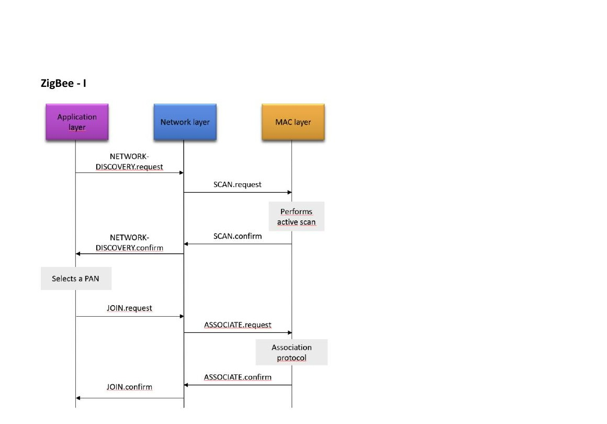
*Fig. — Sequenza di primitives tra Application Layer, Network Layer e MAC Layer durante il processo di join di un dispositivo ZigBee.*

Lo schema mostra il processo con cui un dispositivo si unisce a una rete ZigBee esistente attraverso il meccanismo di **associazione** (iniziativa child-side). Si tratta di un'interazione a tre livelli (Application, Network, MAC) tramite service primitives:

1. **Application layer** emette `NETWORK-DISCOVERY.request` al Network Layer.
2. **Network Layer** emette `SCAN.request` al MAC: viene eseguito un active scan per trovare le PAN disponibili.
3. **MAC** esegue lo scan e risponde con `SCAN.confirm`.
4. **Network Layer** risponde all'applicazione con `NETWORK-DISCOVERY.confirm`, che elenca le PAN trovate.
5. **Application layer** sceglie una PAN e invia `JOIN.request` al Network Layer (indicando se aggregarsi come router o end-device).
6. **Network Layer** seleziona un nodo genitore P nel vicinato (nelle reti a stella P è il coordinatore; in quelle ad albero/mesh P può essere router o coordinatore) e avvia il protocollo di associazione MAC tramite `ASSOCIATE.request`.
7. **MAC** esegue il protocollo di associazione: il coordinatore/router assegna un **indirizzo breve a 16 bit** al nuovo dispositivo.
8. **MAC** risponde con `ASSOCIATE.confirm` → **Network Layer** risponde con `JOIN.confirm` all'applicazione, rendendo operativo l'indirizzo per comunicazioni successive.

---

## Struttura ad Albero e Indirizzamento

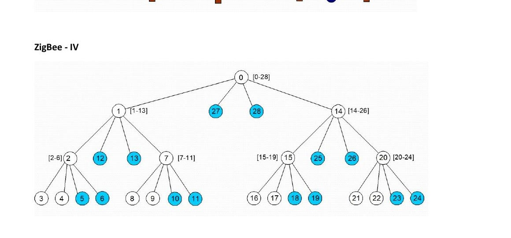
*Fig. — Albero di indirizzi ZigBee con $R_m=2$, $D_m=2$, $L_m=3$: ogni nodo gestisce un intervallo di indirizzi calcolato con la formula $C_{skip}$.*

Le relazioni genitore-figlio stabilite durante il joining costruiscono una topologia logica ad albero, sfruttata per l'assegnazione sistematica e decentralizzata degli indirizzi di rete.
Il coordinatore viene configurato con tre parametri:
- $R_m$: massimo numero di router figli per nodo
- $D_m$: massimo numero di end-device figli per nodo
- $L_m$: profondità massima dell'albero

La dimensione del blocco di indirizzi assegnato a un router a profondità $d$ è data dalla formula:
$$C_{skip}(d) = \begin{cases} 1 & \text{se } d = L_m \\ 1 + R_m \cdot C_{skip}(d+1) + D_m & \text{altrimenti} \end{cases}$$

Il valore $C_{skip}(d)$ rappresenta il numero totale di indirizzi (incluso il proprio) che ogni router alla profondità $d$ deve riservare per sé e per i suoi discendenti. 
Se un router ha indirizzo $A$ e si trova a profondità $d$:
- I suoi figli router ricevono in ordine: $A+1$, $A+1+C_{skip}(d+1)$, $A+1+2 \cdot C_{skip}(d+1)$, …
- I suoi end-device ricevono gli indirizzi successivi a tutti i blocchi riservati ai router.

> [!example] Nell'immagine: $R_m=2$, $D_m=2$, $L_m=3$
> - $C_{skip}(3)=1$
> - $C_{skip}(2)=5$
> - $C_{skip}(1)=13$
> - $C_{skip}(0)=29$
> Coordinator (addr=0) gestisce [0–28]. Il primo figlio router riceve addr=1 e gestisce [1–13]; il secondo figlio router riceve addr=14 e gestisce [14–26]. Gli end-device del coordinator ricevono 27 e 28.

**Vantaggio**: Completamente decentralizzato, nessun rischio di collisione, nessun coordinamento globale necessario.
**Svantaggio**: Rigido — se un sottoalbero è saturo, nuovi dispositivi non possono aggiungersi tramite quel nodo anche se ci fosse necessità. La connettività fisica può comunque formare una mesh.

```{=latex}
\newpage
```

