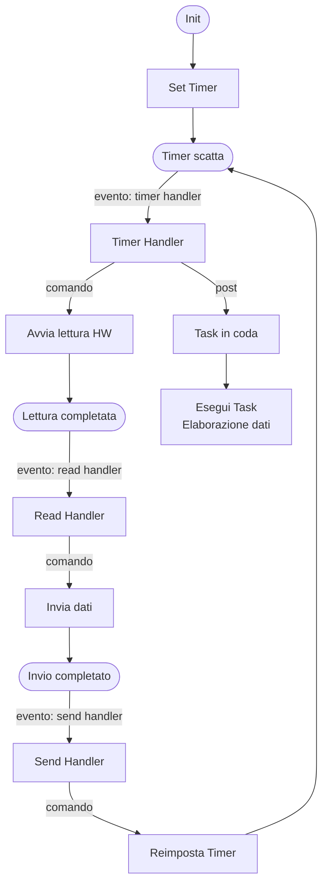
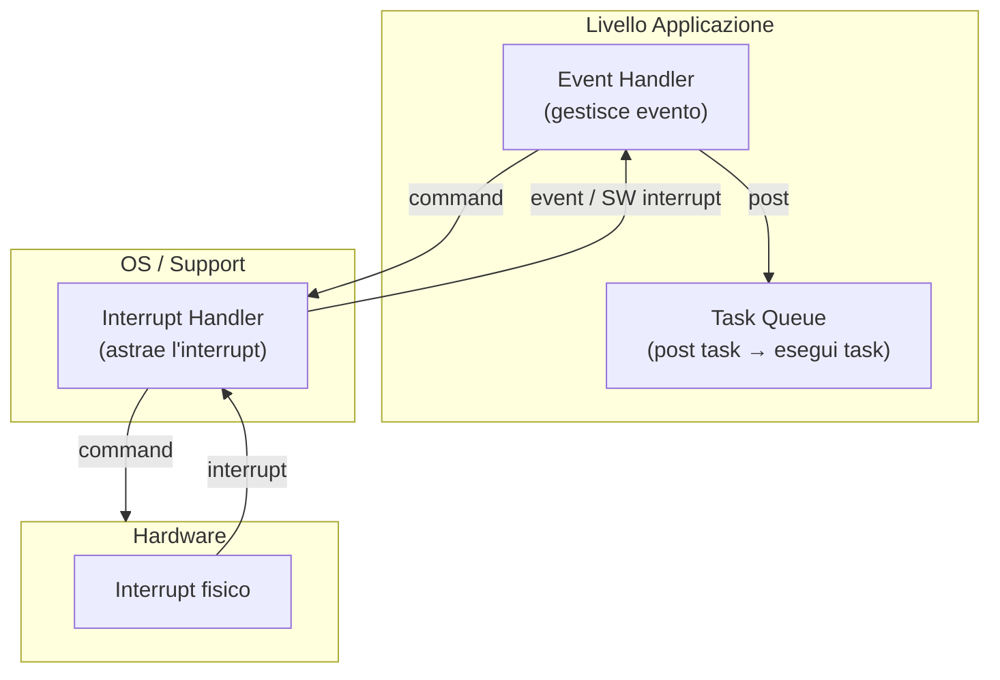

---
tags:
  - università/mobile-and-cyber-physical-systems
  - embedded-systems
  - arduino
  - microcontroller
  - iot
data: 2026-04-17
lezione: Embedded Programming e Arduino
professore: Stefano Chessa
---
# Embedded Programming e Arduino

Gli **sistemi embedded** (*embedded systems*) rappresentano una categoria fondamentale nell'informatica moderna, specialmente nel contesto dei sistemi cyber-fisici e dell'IoT. A differenza dei personal computer, progettati per eseguire un insieme arbitrario e variabile di applicazioni, un sistema embedded è costruito per svolgere **una funzione dedicata e specifica**. Questa differenza non è solo funzionale ma architetturale: hardware e software vengono progettati insieme in parallelo, in quello che si chiama **co-design hardware-software**.

## Sistemi Embedded e Microcontrollori

> [!definition] Sistema Embedded
>
> Un sistema embedded è un sistema computazionale progettato per svolgere una funzione dedicata. Hardware e software sono co-progettati, e il sistema può includere anche componenti meccanici. Il cuore di un sistema embedded è tipicamente un **microcontrollore**.

Il microcontrollore è un singolo chip che integra al suo interno un microprocessore, memoria e interfacce di I/O. È ottimizzato per il controllo di periferiche e interagisce con il dispositivo elettromeccanico nel quale è "embedded" per fornire controllo. Proprio per questo scopo di controllo, un sistema embedded ha spesso vincoli di **real-time**: la correttezza temporale è importante quanto quella funzionale.

I microcontrollori possono essere classificati in base alla loro flessibilità:

| Tipo | Descrizione | Esempi |
|---|---|---|
| General purpose | Adattabili a più applicazioni embedded | Arduino Uno (ATmega328) |
| ASIC | *Application-Specific Integrated Circuits*, progettati per prodotti specifici | Chip in elettrodomestici |
| SoC | *System on a Chip*, termine più ampio, include anche processori per smartphone | Qualcomm Snapdragon |

I microcontrollori sono usati in una vasta gamma di applicazioni: allarmi, wearable, giocattoli, sensori industriali, e molte altre. Le piattaforme più popolari per prototyping e didattica sono **Arduino** e **Raspberry Pi**.

---

## Sfide della Programmazione su Sistemi Embedded

Programmare per sistemi embedded introduce vincoli che non esistono nello sviluppo software tradizionale. Comprendere queste sfide è fondamentale per scrivere codice corretto ed efficiente.

### Risorse Hardware Limitate

La prima differenza rispetto ai PC tradizionali riguarda la memoria: un tipico microcontrollore dispone di pochissima RAM (es. Arduino Uno ha solo 2 KB di SRAM per i dati e 32 KB di memoria Flash per il programma). Non esiste in genere un filesystem, e l'interfaccia utente è ridotta a pochi LED o bottoni. In molti casi **non è presente un sistema operativo** (sistemi *bare-metal*): esiste una sola applicazione che gestisce direttamente gli interrupt.

### Correttezza Temporale

> [!warning] Real-Time è un requisito funzionale
>
> In molti sistemi embedded la correttezza temporale è parte integrante dei requisiti funzionali, non solo una questione di prestazioni. Un sistema GPS che identifica correttamente tutti i waypoint ma li segnala in ritardo è **inutile**.

### Alta Affidabilità

I sistemi embedded operano spesso in ambienti ostili o imprevedibili. Un requisito comune è la disponibilità *four nines* (99.99%), che corrisponde a non più di 9 secondi di downtime al giorno. Questo è particolarmente difficile da garantire quando eventi ambientali imprevedibili possono alterare la sequenza di esecuzione.

### Gestione Efficiente della Memoria

La memoria è costosa in termini economici e fisici. Un programmatore embedded deve riuscire a far stare il proprio codice nello spazio disponibile, il che richiede un approccio particolarmente creativo e disciplinato.

### Power Management

In molti sistemi embedded, specialmente quelli alimentati a batteria, la gestione dell'energia è critica. La capacità di entrare in uno stato di basso consumo quando il sistema è inattivo è una caratteristica imprescindibile.

---

## Sistemi Operativi per Sistemi Embedded

Le funzionalità del sistema operativo variano enormemente in base alle capacità hardware del dispositivo. Nello scenario più semplice (*bare-metal*), il supporto real-time è fornito da librerie collegate staticamente al codice applicativo. In sistemi più potenti si può usare Linux embedded o un RTOS (*Real-Time Operating System*) come ROS.

### Cross-Compilazione

Poiché il microcontrollore non ha le risorse per eseguire un compilatore, lo sviluppo avviene su un PC host tramite **cross-compilazione**: il codice viene scritto e compilato su un PC per la piattaforma di destinazione. Il programmatore specifica la piattaforma target (es. Arduino Uno, MicaZ, T-Mote) e il codice viene compilato e collegato staticamente alle librerie del sistema operativo.


*Fig. — Pipeline di sviluppo per sistemi embedded: dal codice sorgente all'eseguibile nel firmware.*

L'eseguibile finale include il codice del programmatore, le librerie del sistema operativo e tutta la logica di inizializzazione. La funzione `main` è tipicamente fornita dall'OS e si occupa di invocare le funzioni di inizializzazione scritte dal programmatore, dopodiché attiva i task che implementano le funzionalità del dispositivo.

---

## Organizzazione del Software Embedded

Il lavoro di un sistema embedded è **ciclico** per natura, il che definisce un **duty cycle**. Il ciclo tipico consiste in:

1. Lettura dai trasduttori (sensori)
2. Presa di decisione
3. Controllo degli attuatori
4. Eventuale comunicazione con altri dispositivi

Questi passi vengono eseguiti in un **control loop**, una funzione invocata dal main dopo l'inizializzazione e ripetuta indefinitamente. A basso livello, il codice interagisce con l'hardware tramite **comandi** e **interrupt**: un comando attiva l'hardware (es. avvia una lettura da un sensore), mentre un interrupt segnala che il comando è stato completato.

> [!tip] Differenza nei sistemi convenzionali vs embedded
>
> In un OS convenzionale, i comandi sono system call: se c'è da aspettare, il thread viene sospeso e il kernel gestisce gli interrupt riattivando i thread sospesi. Questo richiede uno stack per ogni thread. In un sistema embedded con poca RAM (es. Arduino 1 ha 4 KB), salvare il contesto di più thread diventa un problema critico.

---

## Modelli di Programmazione per Embedded

Il problema della gestione dell'I/O con memoria limitata ha portato allo sviluppo di diversi modelli di programmazione. I due esempi principali sono il **modello Arduino** (event loop sincrono) e il **modello TinyOS** (eventi + task asincroni).

### Il Modello Arduino

Arduino adotta un approccio estremamente semplice: il lavoro è definito in una singola funzione `loop()`, eseguita ripetutamente da **un unico thread**. Non c'è sospensione del thread, non ci sono context switch. Se un'operazione di I/O richiede tempo, si aspetta semplicemente che si completi. Se serve un ritardo, si usa `delay()` che mette il thread in attesa per il tempo specificato.

```mermaid
%%{init: {"flowchart": {"useMaxWidth": true}}}%%
flowchart LR
    A([Init]) --> B[Init HW]
    B --> C[loop&#40;&#41;]
    C --> D[Comando]
    D --> E[Attesa<br/>completamento]
    E --> F[Delay]
    F --> G[Attesa<br/>delay]
    G --> C
```



*Fig. — Modello di esecuzione Arduino: singolo thread, nessuna sospensione, polling sincrono.*

> [!note] Pro e contro del modello Arduino
>
> Il modello è semplice e si adatta bene ad attività di sensing e controllo. Include librerie per molti attuatori. Tuttavia non è stato pensato per le comunicazioni asincrone, anche se le versioni recenti includono librerie (e hardware) per questo scopo. Per le comunicazioni via linea seriale, Arduino offre anche la gestione asincrona tramite **interrupt**.

### Il Modello TinyOS

[[TinyOS]] adotta un approccio diverso, progettato per massimizzare l'efficienza energetica e gestire attività indipendenti senza sprecare memoria per i contesti dei thread. Il modello si basa su tre elementi:

> [!definition] Comandi, Eventi e Task in TinyOS
>
> - **Comandi**: funzioni per programmare e attivare l'hardware (verso il basso nella gerarchia).
> - **Eventi**: astrazioni degli interrupt sotto forma di *upcall* — il programmatore definisce un handler per ogni evento. Gli eventi possono pre-emptare i task.
> - **Task**: unità di elaborazione non-preemptive eseguite sequenzialmente. Un task non aspetta mai (salva memoria). Se un event handler richiede elaborazione complessa, posta un task.



*Fig. — Flusso di esecuzione TinyOS: eventi gestiti immediatamente, elaborazione delegata ai task.*

### Il Modello degli Eventi: Tre Livelli

Il modello a eventi in TinyOS (e per analogia in Arduino con gli interrupt) si struttura in tre livelli:



*Fig. — Modello a tre livelli: hardware genera interrupt, OS li astrae in eventi, l'applicazione li gestisce con handler e task.*

> [!warning] Rischio di interferenza
>
> Un event handler opera in contesto di interrupt, quindi ha accesso diretto alle strutture dati dell'OS/support. Bisogna fare molta attenzione a non corrompere queste strutture. Per questo gli event handler devono essere **il più corti possibile**: aggiornano strutture dati, inviano comandi all'HW, e se serve altro lavoro postano un task.

---

## Arduino: Case Study

### La Scheda Arduino Uno

Arduino è una piattaforma open-source di prototipazione elettronica basata su hardware flessibile e software facile da usare. Il concetto "Arduino" comprende il **dispositivo** (la scheda), l'**IDE** di sviluppo e il **forum** della community.

La versione più diffusa è **Arduino Uno**, basata sul microcontrollore AVR **ATmega328**:


*Fig. — Arduino Uno: microcontrollore ATmega328 con connettori digitali, analogici, SPI, UART e interrupt esterni.*

| Memoria | Dimensione | Uso |
|---|---|---|
| SRAM | 2 KB | Dati (variabili, stack) |
| EEPROM | 1 KB | Dati non volatili |
| Flash | 32 KB | Programma (firmware) |

La scheda espone pin **digitali** (con supporto PWM), pin **analogici** (input), pin per la comunicazione **SPI** (*Serial Peripheral Interface*), linee **UART** (TX/RX) e due pin dedicati agli **interrupt esterni** (pin 2 e 3, corrispondenti a INT0 e INT1).

### L'IDE Arduino e la Cross-Compilazione

L'ambiente di sviluppo Arduino (scaricabile da arduino.cc) è scritto in Java e si basa su Processing, avr-gcc e altri tool open-source. Per configurare un nuovo progetto è necessario:

1. Scaricare e installare il software Arduino
2. Collegare il dispositivo via USB
3. Selezionare il tipo di scheda (`Tools → Board`)
4. Selezionare la porta di connessione (`Tools → Port`)
5. Scrivere il codice (*sketch*) e caricarlo

### Linguaggio e Struttura degli Sketch

> [!definition] Terminologia Arduino
>
> - **Sketch**: un programma scritto per girare su una scheda Arduino
> - **Pin**: un ingresso o uscita connesso a qualcosa (es. output verso un LED, input da un potenziometro)
> - **Digital**: valore binario HIGH o LOW (on/off)
> - **Analog**: valore in un range, tipicamente 0–1023 (es. luminosità LED, velocità motore)

Il linguaggio Arduino è derivato dal **C** ed è strutturato in tre parti principali:

```cpp
void setup() {
  // Codice di inizializzazione: eseguito UNA sola volta
  // all'avvio o dopo un reset
}

void loop() {
  // Codice principale: eseguito ripetutamente
  // per tutta la durata del funzionamento
}
```

La funzione `setup()` viene invocata una volta sola all'avvio e serve per configurare i pin (input/output), inizializzare la linea seriale, ecc. La funzione `loop()` implementa il control loop discusso in precedenza ed è il cuore dell'applicazione.

### Funzioni Principali della Libreria Arduino

| Categoria | Funzioni |
|---|---|
| I/O Digitale | `pinMode()`, `digitalRead()`, `digitalWrite()` |
| I/O Analogico | `analogReference()`, `analogRead()`, `analogWrite()` |
| I/O Avanzato | `tone()`, `shiftOut()`, `shiftIn()`, `pulseIn()` |
| Tempo | `millis()`, `micros()`, `delay()`, `delayMicroseconds()` |
| Matematica | `min()`, `max()`, `abs()`, `sin()`, `cos()`, `random()` |
| Bit/Byte | `lowByte()`, `highByte()`, `bitRead()`, `bitWrite()` |
| Interrupt | `attachInterrupt()`, `detachInterrupt()`, `interrupts()`, `noInterrupts()` |
| Comunicazione | `Serial`, `Stream` |

### Esempio: Lettura Analogica e Digitale

Il codice seguente legge un segnore analogico dal pin A0 e lo converte in tensione; controlla il pin digitale 2 (button); se il button è premuto, accende il LED sul pin 13 e stampa la tensione sulla seriale.

```cpp
const int buttonPin = 2;   // pin del pulsante
const int ledPin = 13;     // pin del LED
int buttonState = 0;       // stato del pulsante

void setup() {
  Serial.begin(9600);           // inizializza seriale a 9600 bps
  pinMode(ledPin, OUTPUT);      // LED come output
  pinMode(buttonPin, INPUT);    // pulsante come input
}

void loop() {
  buttonState = digitalRead(buttonPin);

  if (buttonState == HIGH) {        // se il pulsante è premuto
    digitalWrite(ledPin, HIGH);      // accende il LED
    int sensorValue = analogRead(A0);            // legge [0, 1023]
    float voltage = sensorValue * (5.0 / 1023.0); // converte in [0, 5V]
    Serial.println(voltage);
  } else {
    digitalWrite(ledPin, LOW);       // spegne il LED
  }
}
```

> [!example] Calcolo del Duty Cycle
>
> Dato il seguente loop:
> ```cpp
> void loop() {
>   int sensorValue = analogRead(A0);  // 2 ms
>   Serial.println(sensorValue);       // 5 ms
>   delay(100);                        // 100 ms
> }
> ```
> - Tempo attivo = 2 + 5 = **7 ms**
> - Periodo totale = 2 + 5 + 100 = **107 ms**
> - **Duty cycle = 7/107 ≈ 6.5%**
>
> Il sistema è attivo solo per circa il 7% del tempo — spazio per ottimizzare il consumo energetico.

---

## Interrupt in Arduino

Sebbene il modello base di Arduino sia la lettura sincrona dei sensori nel loop, Arduino offre anche un'interfaccia per gli **interrupt**, che abilita l'accesso asincrono a sensori e attuatori.

### Tipi di Interrupt

Arduino prevede tre tipi di interrupt:

- **External**: segnale esterno connesso a un pin
- **Timer**: interno ad Arduino, gestito dal runtime
- **Device**: segnale interno proveniente da un dispositivo (ADC, seriale, ecc.)

Gli interrupt interni (Timer e Device) sono gestiti direttamente dal runtime di Arduino. Il programmatore si occupa principalmente degli **interrupt esterni**.

### Interrupt Esterni: `attachInterrupt()`

```cpp
attachInterrupt(interrupt#, func-name, mode);
```

Arduino Uno dispone di **soli due pin per interrupt esterni**: INT0 (pin 2) e INT1 (pin 3). Le modalità di trigger disponibili sono:

| Modalità | Descrizione |
|---|---|
| `RISING` | L'interrupt scatta quando il pin passa da LOW a HIGH |
| `FALLING` | L'interrupt scatta quando il pin passa da HIGH a LOW |
| `CHANGE` | L'interrupt scatta ad ogni cambio di stato |
| `LOW` | L'interrupt scatta continuamente finché il pin è LOW |
| `HIGH` | L'interrupt scatta continuamente finché il pin è HIGH |

> [!warning] `LOW` e `HIGH` non richiedono un cambio di stato
>
> Con le modalità `LOW` e `HIGH`, l'interrupt si attiva **ripetutamente** finché il pin rimane in quello stato, anche senza variazioni. Usarle con cautela.

### Esempio con Interrupt Esterno

Il circuito collega un pulsante al pin digitale 2 (con resistore da 10 KΩ) e un LED verde al pin digitale 7 (con resistore da 220 Ω):


*Fig. — Circuito di esempio: pulsante sul pin 2 (INT0) con resistore pull-down 10KΩ, LED verde sul pin 7 con resistore 220Ω.*

```cpp
volatile int greenLed = 7;
volatile int count = 0;

void setup() {
  Serial.begin(9600);
  pinMode(greenLed, OUTPUT);
  digitalWrite(greenLed, LOW);
  attachInterrupt(0, interruptSwitchGreen, RISING); // 0 = pin 2
}

void loop() {
  count++;
  delay(1000);
  // Gli interrupt vengono ricevuti anche dentro delay!
  Serial.print("waiting:");
  Serial.println(count);
  if (count == 10) {
    count = 0;
    digitalWrite(greenLed, LOW);
    Serial.println("now off");
  }
}

void interruptSwitchGreen() {
  digitalWrite(greenLed, HIGH);
  count = 0;
  Serial.print("now on");
}
```

> [!warning] Regole per gli interrupt handler
>
> - `delay()` **non funziona** dentro un interrupt handler
> - `millis()` **non viene incrementato** dentro un interrupt handler  
> - Tutte le variabili condivise tra il loop e l'interrupt handler devono essere dichiarate `volatile` — questa direttiva al compilatore forza la lettura dalla RAM anziché da un registro, garantendo la coerenza del valore
> - I handler devono essere **il più brevi possibile**: solo aggiornamento di strutture dati e comandi all'HW
> - Per disabilitare tutti gli interrupt: `noInterrupts()` / `interrupts()`
> - Per rimuovere un interrupt specifico: `detachInterrupt()`

---

## Gestione Energetica in Arduino

I microcontrollori come l'ATmega328P (cuore di Arduino Uno) offrono diversi **sleep mode** per ridurre il consumo energetico quando il sistema è inattivo. Questi possono essere attivati tramite la libreria **Low Power** (`#include "LowPower.h"`).

I meccanismi di wake-up disponibili sono: interrupt interni, interrupt esterni o reset di sistema.

### Modalità di Sleep dell'ATmega328P

| Modalità | Cosa rimane attivo | Wake-up |
|---|---|---|
| **Idle** | SPI, UART, I2C, watchdog, contatori, comparatore analogico | Qualsiasi interrupt esterno o interno |
| **ADC Noise Reduction** | ADC, interrupt esterno, UART, I2C, watchdog, contatori | Reset, interfaccia seriale, interrupt specifici |
| **Power-Down** | Solo I2C, watchdog, interrupt esterno | Reset, interfaccia seriale, interrupt specifici (no timer) |
| **Power-Save** | Come Power-Down + timer/counter se abilitato | Come Power-Down + timer overflow |
| **Standby** | Come Power-Down + oscillatore esterno attivo | Come Power-Down |
| **Extended Standby** | Come Power-Save + oscillatore esterno attivo | Come Power-Save |

### Idle Sleep Mode

```cpp
#include "LowPower.h"

// Nessun setup richiesto per la libreria

void loop() {
  // ... lavoro utile ...
  LowPower.idle(SLEEP_8S, ADC_OFF, TIMER2_OFF, TIMER1_OFF,
                TIMER0_OFF, SPI_OFF, USART0_OFF, TWI_OFF);
  // si risveglia automaticamente dopo 8 secondi
}
```

I periodi di sleep predefiniti disponibili vanno da `SLEEP_15MS` fino a `SLEEP_FOREVER`. Non è obbligatorio spegnere tutto: si può lasciare attivo ciò che serve con `ADC_ON`, `TIMER0_ON`, ecc.

### Power-Down Mode

La modalità Power-Down è quella a minor consumo: ferma tutti i clock generati e lascia attivi solo i moduli asincroni.

```cpp
#include "LowPower.h"

void loop() {
  // ... lavoro utile ...
  
  // Sleep fisso (wake-up automatico dopo 8s)
  LowPower.powerDown(SLEEP_8S, ADC_OFF, BOD_OFF);
  
  // oppure: sleep fino a interrupt esterno
  attachInterrupt(0, wakeUp, LOW);
  LowPower.powerDown(SLEEP_FOREVER, ADC_OFF, BOD_OFF);
  detachInterrupt(0);
  
  // ripresa dell'esecuzione qui
}
```

> [!tip] Quando usare Power-Down vs Power-Save
>
> Se il timer/counter non è necessario, preferire sempre **Power-Down** rispetto a Power-Save: consuma meno e la differenza ha senso solo se si ha bisogno di wake-up da timer overflow.

---

> [!question] Possibili domande d'esame
>
> - Quali sono le principali differenze tra un sistema embedded e un PC general purpose?
> - Cosa si intende per co-design hardware-software?
> - Descrivere le sfide principali della programmazione embedded (timing, affidabilità, memoria, energia).
> - Come funziona la cross-compilazione? Cosa contiene l'eseguibile finale?
> - Descrivere il modello di esecuzione di Arduino. Perché non usa thread multipli?
> - Confrontare il modello Arduino con il modello TinyOS: eventi, comandi e task.
> - Calcolare il duty cycle di un dato sketch Arduino.
> - Quali tipi di interrupt esistono in Arduino? Descrivere `attachInterrupt()` e le modalità di trigger.
> - Perché le variabili condivise tra loop e interrupt handler devono essere `volatile`?
> - Descrivere le modalità di sleep dell'ATmega328P e i loro trade-off.
> - Scrivere un frammento di codice che configuri INT0 su CHANGE e gestisca il risveglio da sleep con un interrupt esterno.
