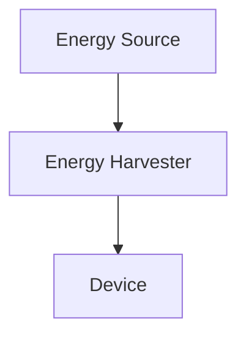
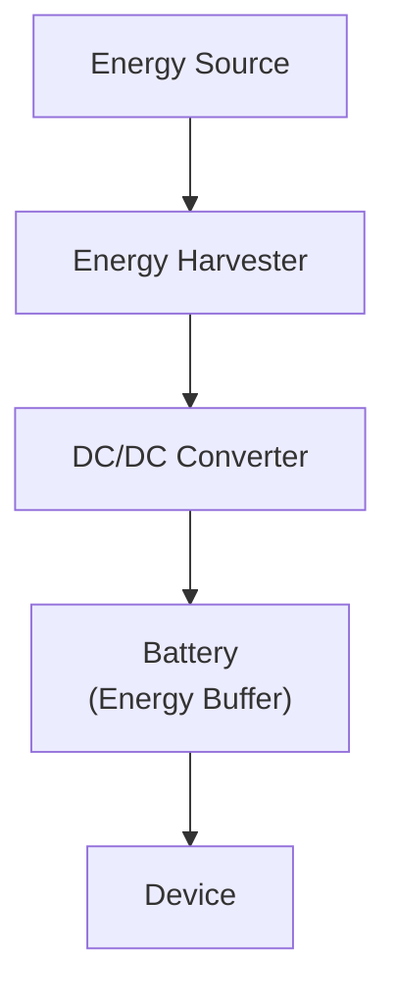
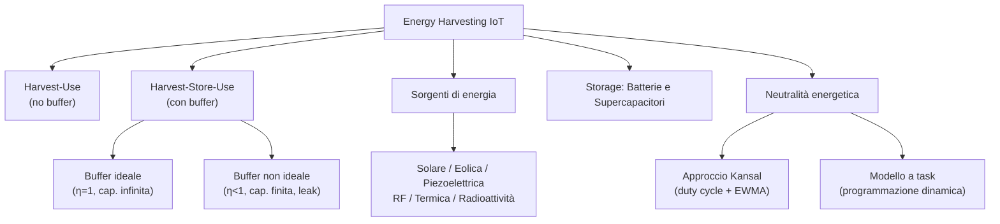

---
tags:
  - università/mobile-and-cyber-physical-systems
  - energy-harvesting
  - iot
  - energy-neutrality
data: 2026-04-22
lezione: "Energy Harvesting IoT"
professore: "Stefano Chessa"
---
# Energy Harvesting IoT

Il problema di fondo dei dispositivi IoT è energetico: alimentarli con una batteria di capacità finita costringe a scegliere tra prestazioni e durata. Una batteria grande permette lunga vita, ma aumenta dimensioni, peso e costo; un processore a basso consumo estende la vita ma limita potenza di calcolo e portata radio. L'**energy harvesting** (raccolta di energia) rappresenta un'alternativa strutturale: invece di ottimizzare il consumo, si raccoglie energia dall'ambiente e si elimina — o si riduce drasticamente — il vincolo della batteria finita.

Se la sorgente è abbondante e disponibile in modo continuo o periodico, il dispositivo può funzionare «per sempre». Questa prospettiva sposta l'obiettivo del progettista dalla massimizzazione della vita utile alla massimizzazione delle prestazioni a parità di disponibilità energetica.

---

## Definizioni fondamentali

Tre concetti strutturano l'intero dominio:

- **Energy source** (sorgente di energia): la fonte primaria (sole, vento, vibrazioni, ecc.) da cui l'energia viene estratta.
- **Harvesting source** (tecnologia di raccolta): il componente fisico — cella solare, turbina, cristallo piezoelettrico, antenna — che converte la sorgente in energia elettrica. La produzione varia nel tempo e in funzione delle condizioni ambientali, ed è generalmente al di fuori del controllo del progettista.
- **Load** (carico): l'energia consumata dal dispositivo per le proprie attività. Un dispositivo IoT ha molteplici sottosistemi (processore, radio, storage, trasduttori/ADC), ciascuno con stati propri e consumi differenti; il carico varia quindi nel tempo a seconda delle attività in esecuzione.

> [!definition] Harvesting System
>
> Un sistema che supporta un carico variabile alimentato da una sorgente di harvesting variabile, anche quando la potenza istantanea della sorgente non corrisponde al carico.

Il problema chiave è il **disaccoppiamento** tra produzione e consumo: la sorgente produce quando l'ambiente lo consente, il dispositivo consuma quando deve eseguire i propri task.

### Bilanciamento tra offerta e domanda

Esistono due approcci principali per adeguare produzione e consumo:

1. **Adattare il carico** alla disponibilità energetica — ad esempio riducendo la frequenza di campionamento.
2. **Usare un buffer energetico** — una batteria ricaricabile o un supercapacitore che accumula l'eccesso e lo cede nei momenti di deficit.

In pratica nessuno dei due approcci è sufficiente da solo: il carico non può essere ridotto arbitrariamente senza compromettere la funzionalità, e il buffer è fisicamente limitato e non ideale (ha perdite ed efficienza di carica $< 1$).

---

## Architetture di harvesting

### Harvest-Use

*Fig. — Architettura Harvest-Use: la sorgente alimenta direttamente il dispositivo senza buffer.*

Nell'architettura **Harvest-Use** l'energia è raccolta esattamente quando serve. Non esiste un buffer: la potenza prodotta $P_s(t)$ viene consumata istantaneamente. Il dispositivo è operativo solo se:

$$P_s(t) \geq P_c(t)$$

Questo comporta due forme di spreco:
- Quando $P_s(t) < P_c(t)$: il dispositivo si spegne per mancanza di energia.
- Quando $P_s(t) > P_c(t)$: l'eccesso $P_s(t) - P_c(t)$ va perduto.

Variazioni brusche della produzione possono causare oscillazioni accensione/spegnimento. Esempi tipici: mulini ad acqua, tag RFID passivi.

### Harvest-Store-Use

*Fig. — Architettura Harvest-Store-Use: l'energia in eccesso viene accumulata nel buffer e prelevata nei momenti di deficit.*

Nell'architettura **Harvest-Store-Use** l'energia raccolta viene immagazzinata nel buffer ogni volta che è disponibile e prelevata quando la produzione è insufficiente o i task del dispositivo richiedono più energia. Il buffer disaccoppia temporalmente produzione e consumo.

#### Buffer ideale

Un buffer ideale ha capacità infinita, nessuna perdita ed efficienza di carica $\eta = 1$. In queste condizioni il dispositivo è sempre operativo se, per ogni intervallo $(0, T]$:

$$\int_0^T P_c(t)\,dt \leq \int_0^T P_s(t)\,dt + B_0 \qquad \forall T \in (0, \infty)$$

dove $B_0$ è la carica iniziale del buffer. La batteria accumula la potenza prodotta in eccesso $[P_s(t) - P_c(t)]^+$ e cede quella prodotta in difetto $[P_c(t) - P_s(t)]^+$.

#### Buffer non ideale

Un buffer reale ha capacità massima $B_{\mathrm{max}}$, efficienza di carica $\eta < 1$ e potenza di leakage $P_{\mathrm{leak}}(t)$. La carica $B_T$ al tempo $T$ deve soddisfare due equazioni:

**Conservazione dell'energia (necessaria e sufficiente):**

$$B_T = B_0 + \eta\int_0^T [P_s - P_c]^+\,dt - \int_0^T [P_c - P_s]^+\,dt - \int_0^T P_{\mathrm{leak}}\,dt \geq 0$$

**Capacità finita (sufficiente, non necessaria):**

$$B_{\mathrm{max}} \geq B_0 + \eta\int_0^T [P_s - P_c]^+\,dt - \int_0^T [P_c - P_s]^+\,dt - \int_0^T P_{\mathrm{leak}}\,dt$$

> [!note] Asimmetria tra le due condizioni
>
> La condizione di capacità finita è sufficiente ma non necessaria: un dispositivo può sprecare energia in eccesso (se la sorgente produce più di quanto il buffer possa contenere) senza violare la conservazione dell'energia.

> [!example] Esercizio sul buffer non ideale
>
> Dispositivo con $\eta = 95\%$, $B_0 = 400\,\mathrm{mAh}$, leakage trascurabile.
>
> Intervallo $[0, 4s]$: $P_s = 80\,\mathrm{mA}$, $P_c = 150\,\mathrm{mA}$ — il consumo supera la produzione.
> - Produzione: $80 \times \frac{4}{3600} = 0.089\,\mathrm{mAh}$; Consumo: $150 \times \frac{4}{3600} = 0.167\,\mathrm{mAh}$
> - $B_4 = 400 + 0.089 - 0.167 = 399.922\,\mathrm{mAh}$
>
> Intervallo $[4s, 10s]$: $P_s = 80\,\mathrm{mA}$, $P_c = 20\,\mathrm{mA}$ — la produzione supera il consumo, il buffer si ricarica.
> - Produzione: $80 \times \frac{6}{3600} = 0.133\,\mathrm{mAh}$; Consumo: $20 \times \frac{6}{3600} = 0.033\,\mathrm{mAh}$
> - $B_{10} = 399.922 + 0.95(0.133 - 0.033) = 400.017\,\mathrm{mAh}$

---

## Fonti di energia e classificazione

Le sorgenti si classificano su due assi: **controllabilità** e **prevedibilità**.

| Controllabilità | Descrizione | Esempi |
|---|---|---|
| Completamente controllabile | L'energia è disponibile su richiesta | Torcia shake-to-power, sorgenti RF dedicate |
| Parzialmente controllabile | Influenzabile ma non deterministica | Tag RFID in ambiente RF non uniforme |
| Non controllabile | Raccolta solo quando disponibile | Sole, vento, termica ambientale |

Le sorgenti non controllabili si classificano ulteriormente in:

| Prevedibilità | Descrizione | Esempi |
|---|---|---|
| Prevedibile | Esistono modelli affidabili | Sole (ciclo giorno/notte, stagioni, meteo) |
| Non prevedibile | Nessun modello affidabile | Vibrazioni da terremoti |

> [!tip] Implicazione progettuale
>
> La prevedibilità è fondamentale per la pianificazione energetica: se la sorgente è prevedibile si possono pianificare le attività del dispositivo. Se non lo è, è difficile garantire qualsiasi livello di prestazione.

### Tabella comparativa delle sorgenti principali

| Sorgente | Caratteristiche | Energia disponibile | Tecnologia | Efficienza | Energia raccolta |
|---|---|---|---|---|---|
| Solare | Amb., non contr., prevedibile | 100 mW/cm² | Celle solari | 15% | 15 mW/cm² |
| Vento | Amb., non contr., prevedibile | — | Anemometro | — | 1200 mWh/day |
| Vibrazioni (industria) | Controllabile | — | Piezoelettrico, induzione | — | 100 μW/cm² |
| Movimento umano | Controllabile | 19 mW – 67 W | Piezoelettrico | 7.5–11% | 2.1 mW – 5 W |
| Termica (umana) | Non contr., prevedibile | 20 mW/cm² | Termocoppia | — | 30 μW/cm² |
| Termica (industriale) | Controllabile | 100 mW/cm² | Termocoppia | — | 1–10 mW/cm² |
| RF (stazione base) | Controllabile | 0.3 μW/cm² | Antenna | — | 0.1 μW/cm² |
| Radioattività | — | 60 mW/cm³ | Decadimento radioattivo | — | — |

### Radio Frequency (RF) harvesting

Quando un campo RF attraversa una bobina antenna, si genera una tensione AC. I **tag RFID passivi** si alimentano esclusivamente con l'energia RF del reader: il reader trasmette il segnale, il tag raccoglie l'energia sufficiente per elaborare e rispondere. Non richiedono alcuna batteria.

### Piezoelettrico

I materiali piezoelettrici convertono la deformazione meccanica in differenza di potenziale:
- **PVDF** (PolyVinylidene Fluoride): film flessibili, adatti a superfici dinamiche.
- **PZT** (Lead Zirconate Titanate): ceramiche rigide, alta resa.

Applicazioni pratiche: solette per scarpe che alimentano un tag RFID attivo durante la camminata; pulsanti wireless che trasmettono a 15 m con una singola pressione, senza batteria.

### Energia eolica per IoT

Le micro-turbine per IoT hanno raggio di pochi centimetri, massa ~100 g e operano a velocità del vento basse. La potenza generata è massima quando la resistenza del carico eguaglia la resistenza interna del generatore (principio del massimo trasferimento di potenza). A 10 m/s una micro-turbina tipica eroga ~40 mW.

### Energia solare

La produzione di un pannello dipende dall'irradianza solare, che varia con la latitudine, il giorno dell'anno e le condizioni meteorologiche.

*Fig. — Produzione solare giornaliera (Wh/day) e irradianza oraria a Madrid e Amburgo per le quattro stagioni. Madrid raggiunge ~25 Wh/day in estate; Amburgo è più attenuata e stagionalmente più variabile.*

La variabilità stagionale è estrema: la **soluzione classica** è sovradimensionare il pannello e la batteria per coprire il caso peggiore (tipicamente dicembre alle latitudini settentrionali).

*Fig. — Produzione oraria stimata del pannello KL-SUN3W a Madrid, mese per mese (0–24 h). I mesi estivi raggiungono ~3 Wh per slot orario; dicembre e gennaio sono quasi trascurabili.*

Nella realtà, la produzione effettiva diverge nettamente dalla stima nelle giornate nuvolose:

*Fig. — Produzione reale (triangoli rossi) vs stimata EWMA (quadrati blu), per slot da 10 minuti. Giornata molto nuvolosa: la produzione reale è fortemente discontinua e inferiore alla stima.*

> [!warning] Complementarità sole–vento
>
> Il sole produce continuamente ma solo di giorno; il vento produce in modo irregolare ma anche di notte. La combinazione delle due sorgenti aumenta la copertura temporale.

*Fig. — Potenza (watt) su 12 giorni: sopra, pannello solare (picchi giornalieri regolari); sotto, turbina eolica (picchi irregolari, anche notturni). Fonte: Sharma et al., IEEE Secon 2010.*

> [!warning] Energia harvesting ≠ operatività garantita
>
> Una notte senza vento con batteria quasi scarica può causare lo spegnimento del dispositivo. Il progettista deve dimensionare il sistema per il caso peggiore ragionevole, non per il caso medio.

---

## Tecnologie di storage

### Batterie ricaricabili

Le batterie sono celle di immagazzinamento in cui la reazione chimica interna è reversibile (si può ricaricare invertendo il flusso di corrente).

| Tipo | Tensione nom. (V) | Densità energetica (Wh/kg) | Efficienza (%) | Self-discharge (%/mese) | Cicli |
|---|---|---|---|---|---|
| SLA (Sealed Lead Acid) | 6 | 26 | 70–92 | 20 | 500–800 |
| NiCd | 1.2 | 42 | 70–90 | 10 | 1500 |
| NiMH | 1.2 | 100 | 66 | 20 | 1000 |
| **Li-ion** | 3.7 | 165 | **99.9** | <10 | 1200 |

La Li-ion è la tecnologia preferita per IoT: altissima efficienza, bassissimo self-discharge, elevata densità energetica.

### Supercapacitori

| Parametro | Valore |
|---|---|
| Densità energetica | 5 Wh/kg |
| Efficienza | 97–98% |
| Self-discharge | 5.9%/giorno |
| Cicli di ricarica | **Infiniti** |

I supercapacitori non richiedono circuiti di carica complessi. Sono ideali quando l'energia è disponibile a intervalli regolari o quando la sorgente è molto variabile (*jitter*). La modalità **trickle charge** mantiene il condensatore pieno caricandolo alla stessa velocità con cui si scarica.

---

## Misurare la carica della batteria

Tutte le tecniche di power management richiedono informazioni fresche sulla carica attuale della batteria e sulla produzione energetica. Entrambe sono quantità non direttamente osservabili e devono essere stimate.

### Relazione tensione–carica

La tensione a circuito aperto di una batteria decresce al diminuire della carica. Nell'intervallo operativo la relazione è approssimativamente **lineare** (la dipendenza dalla tecnologia specifica è reale: non sempre vale).

*Fig. — Tensione a circuito aperto (V) vs stato di carica (0–1) per nove batterie Li-ion nuove. La relazione è quasi lineare tra 3.4 V e 4.2 V.*

Sfruttando la linearità, si usa un **ADC** a $d$ bit per leggere la tensione e risalire alla carica. Dati $v_{\mathrm{min}}, v_{\mathrm{max}}$ (tensioni corrispondenti a $B_{\mathrm{min}}, B_{\mathrm{max}}$) e la tensione di riferimento $v_{\mathrm{ref}}$:

$$x_{\mathrm{max}} = 2^d - 1 \qquad x_{\mathrm{min}} = \mathrm{ROUND}\!\left(\frac{v_{\mathrm{min}}}{v_{\mathrm{ref}}}(2^d - 1)\right)$$

Per una tensione misurata $v$, il valore ADC è:

$$x = \mathrm{ROUND}\!\left(\frac{v}{v_{\mathrm{ref}}}(2^d - 1)\right)$$

e la carica corrispondente:

$$B = B_{\mathrm{min}} + \frac{B_{\mathrm{max}} - B_{\mathrm{min}}}{x_{\mathrm{max}} - x_{\mathrm{min}}}(x - x_{\mathrm{min}})$$

> [!example] Esempi su piattaforme reali ($B_{\mathrm{min}} = 300\,\mathrm{mAh}$)
>
> | Piattaforma | $v_{\mathrm{min}}$ | $v_{\mathrm{max}}$ | $v_{\mathrm{ref}}$ | ADC (bit) | $x_{\mathrm{min}}$ | $x_{\mathrm{max}}$ | Battery (mAh) | Campione $x$ | Carica (mAh) |
> |---|---|---|---|---|---|---|---|---|---|
> | Raspberry Pi | 3.5 V | 5 V | 0.00488 V | 10 | 716 | 1023 | 3000 | 1000 | 2798 |
> | Arduino | 7 V | 9 V | 0.00879 V | 10 | 795 | 1023 | 3000 | 800 | 359 |
> | Tmote | 1.8 V | 3 V | 0.000732 V | 12 | 2457 | 4095 | 3000 | 3277 | 1652 |

> [!example] Esercizio — Stima della carica da output ADC
>
> Un dispositivo campiona la tensione della batteria con un ADC a **10 bit**. La batteria ha una carica massima di **2000 mAh** e una tensione massima (batteria piena) di **10 V**. Quando la tensione scende a **8 V** la carica residua è **200 mAh** e il dispositivo non è più alimentabile.
>
> Calcolare la carica della batteria quando l'ADC restituisce: **920**, **830**, **1023**.
>
> **Soluzione**
>
> Con $d = 10$ bit si ha $2^d - 1 = 1023$ e $v_{\mathrm{ref}} = v_{\mathrm{max}} = 10\,\mathrm{V}$.
>
> $$x_{\mathrm{max}} = 1023 \qquad x_{\mathrm{min}} = \mathrm{ROUND}\!\left(\frac{8}{10} \times 1023\right) = \mathrm{ROUND}(818{,}4) = 818$$
>
> La carica si ricava per interpolazione lineare tra $(x_{\mathrm{min}},\, B_{\mathrm{min}})$ e $(x_{\mathrm{max}},\, B_{\mathrm{max}})$:
>
> $$B = B_{\mathrm{min}} + \frac{x - x_{\mathrm{min}}}{x_{\mathrm{max}} - x_{\mathrm{min}}} \cdot (B_{\mathrm{max}} - B_{\mathrm{min}})$$
>
> | $x$ | Calcolo | $B$ (mAh) |
> |---|---|---|
> | 920 | $200 + \dfrac{920 - 818}{1023 - 818} \times 1800 = 200 + \dfrac{102}{205} \times 1800$ | **≈ 1096** |
> | 830 | $200 + \dfrac{830 - 818}{1023 - 818} \times 1800 = 200 + \dfrac{12}{205} \times 1800$ | **≈ 305** |
> | 1023 | $200 + \dfrac{1023 - 818}{1023 - 818} \times 1800 = 200 + 1800$ | **2000** |

### Stima della produzione energetica

Se si conosce il consumo $p_c(t)$ in un intervallo $[t_1, t_2]$ e si misura la carica agli estremi, la produzione $E_s$ si stima come:

$$E_s = \int_{t_1}^{t_2} p_c(t)\,dt + [E(t_2) - E(t_1)]^+$$

Questo presuppone un buffer ideale. I limiti sono: errori di misura della carica si propagano sulla stima di $E_s$; intervalli troppo lunghi non distinguono quando l'energia era disponibile; la stima di $p_c(t)$ può non essere precisa. Il metodo alternativo è misurare direttamente corrente e tensione all'uscita della sorgente con circuiti elettronici dedicati.

---

## Neutralità energetica

> [!definition] Dispositivo energy-neutral
>
> Un dispositivo è **energy neutral** se riesce a mantenere il livello di prestazione desiderato indefinitamente, senza mai esaurire la batteria.

Questo obiettivo è radicalmente diverso dalla classica massimizzazione della vita utile: qui si mira a prestazioni indefinitamente sostenute, modulando il carico in funzione della disponibilità energetica.

Nascono due sotto-problemi complementari:
1. **Energy-Neutral Operation**: come pianificare le attività in modo che, in qualsiasi finestra temporale, l'energia consumata non superi quella raccolta?
2. **Maximum Performance**: dato l'ambiente di harvesting, qual è il massimo livello di prestazione sostenibile garantendo la neutralità energetica?

In sistemi IoT distribuiti il problema si complica: le prestazioni globali dipendono dalla distribuzione spazio-temporale dell'energia raccolta da ciascun nodo, e dalle dipendenze tra nodo e server nella elaborazione dei dati.

---

## Approccio di Kansal alla neutralità energetica

Kansal affronta il caso di sorgenti **non controllabili ma prevedibili** (tipicamente il sole). L'idea è pianificare dinamicamente il duty cycle del dispositivo slot per slot, sfruttando previsioni sulla produzione futura.

L'approccio si concentra su fonti non controllabili ma prevedibili perché:
- Le fonti non prevedibili rendono impossibile qualsiasi garanzia di prestazione.
- Le fonti controllabili rendono il problema banale (si produce energia quando serve).

### Condizioni formali

**Condizione 1 — Produzione:** l'energia prodotta in $[0, T]$ è vincolata linearmente:

![[Pasted image 20260512144552.png]]

$$\rho_s T - \sigma \leq E_s(T) \leq \rho_s T + \sigma$$

**Condizione 2 — Carico:** l'energia consumata in $[0, T]$ è vincolata superiormente:

![[Pasted image 20260512144607.png]]

$$E_c(T) \leq \rho_c T + \delta$$

> [!theorem] Teorema di Kansal
>
> Se valgono le Condizioni 1 e 2, e il buffer ha efficienza $\eta$ e leakage $\rho_l$, sono condizioni **sufficienti** per la neutralità energetica:
> 1. $\eta\,\rho_s \geq \rho_c + \rho_l$ — il tasso di produzione netta supera consumo più leakage.
> 2. $B_0 \geq \sigma + \delta$ — la carica iniziale copre le oscillazioni nel caso peggiore.
> 3. $B_{\mathrm{max}} \geq B_0$ — la carica iniziale è fisicamente ammissibile.

---

## Riepilogo

*Fig. — Mappa concettuale della lezione.*

> [!question] Possibili domande d'esame
>
> - Qual è la differenza tra architettura Harvest-Use e Harvest-Store-Use? In quale caso si applica ciascuna?
> - Scrivi le equazioni di conservazione dell'energia e di capacità finita per un buffer non ideale. Qual è la differenza tra condizione necessaria e sufficiente?
> - Classifica le sorgenti di energia per controllabilità e prevedibilità. Perché la prevedibilità è importante per la pianificazione?
> - Come si misura la carica di una batteria tramite ADC? Ricava la formula di conversione da campione ADC a carica in mAh.
> - Enuncia il teorema di Kansal: quali sono le tre condizioni sufficienti per la neutralità energetica?
> - Descrivi l'algoritmo di Kansal nei due casi (sovrapproduzione e sottoproduzione). Come funziona l'adattamento dinamico?
> - Come funziona il filtro EWMA per la previsione della produzione energetica solare?
> - Cos'è il modello a task? In cosa supera l'approccio di Kansal?
> - Qual è la complessità del problema di ottimizzazione a task? Come si risolve con la programmazione dinamica?
