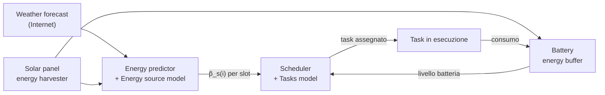

---
tags:
  - università/mobile-and-cyber-physical-systems
  - energy-harvesting
  - energy-neutrality
  - kansal
  - scheduling
  - iot
data: 2026-05-12
lezione: "Energy Harvesting – Kansal's Problem e Task-based Model"
professore: "Stefano Chessa"
---
# Kansal's Problem: Energy Neutrality nei Sistemi IoT

## Il Contesto del Problema

Il problema di **energy management** per dispositivi IoT alimentati da sorgenti rinnovabili è intrinsecamente legato alla natura della sorgente di energia. Kansal considera il caso di sorgenti **prevedibili ma non controllabili**: fonti come l'energia solare sono soggette a variazioni giornaliere e stagionali, ma il loro andamento nel tempo può essere stimato con buona precisione. L'approccio non si estende a sorgenti imprevedibili (problema troppo difficile, impossibile garantire performance) né a sorgenti controllabili (problema banale: basta produrre energia su richiesta).

L'obiettivo del power management è triplice:
- mantenere il sistema **energy neutral**, cioè fare in modo che la batteria non si esaurisca mai;
- **evitare che il dispositivo si spenga** prima del prossimo ciclo di ricarica;
- **massimizzare le prestazioni** del nodo, ossia la sua utility.

L'approccio consiste nel tener conto del livello attuale e atteso della batteria, modulare dinamicamente le prestazioni del dispositivo (e quindi il carico energetico), garantendo che il dispositivo non scenda sotto le performance minime.

---

## Modello Formale: le Due Condizioni

### Condizione 1 — Produzione di Energia

La quantità totale di energia prodotta nell'intervallo $[0, T]$ è definita come:

$$
E_T = \int_T P_s(t) \, dt
$$

dove $P_s(t)$ è la potenza istantanea della sorgente. Kansal assume che questa quantità sia **bounded** da un corridoio lineare: esistono due costanti reali $\rho_s$ e $\sigma$ tali che:

$$
\rho_s \cdot T - \sigma \leq E_T \leq \rho_s \cdot T + \sigma
$$

Il parametro $\rho_s$ rappresenta il **trend medio** di produzione (la pendenza), mentre $\sigma$ è il **burst bound** che cattura la variabilità a breve termine attorno alla retta di tendenza.

![Grafico Condizione 1 – Energia prodotta nell'intervallo [0,T] bounded tra due rette](images/lezione-28-kansal-problem-e-energy-neutrality-img-01.jpg)
*Fig. 1 — La curva blu mostra l'energia prodotta cumulativa $E_T$ che oscilla tra le due rette tratteggiate $\rho_s T \pm \sigma$.*

### Condizione 2 — Consumo (Load)

Analogamente, il consumo totale $L_T$ nell'intervallo $[0, T]$ è:

$$
L_T = \int_T P_c(t) \, dt
$$

e si assume anch'esso bounded (da sopra) da una retta lineare parametrizzata da $\rho_c$ e $\delta$:

$$
0 \leq L_T \leq \rho_c \cdot T + \delta
$$

Il consumo può essere modulato dal sistema (è una variabile controllata), mentre la produzione è data dalla natura.


*Fig. 2 — Il consumo cumulativo $L_T$ rimane al di sotto della retta $\rho_c T + \delta$.*

---

## Il Teorema di Kansal

> [!theorem] Condizione sufficiente per Energy Neutrality
>
> Se le assunzioni sulle condizioni 1 e 2 valgono, e la batteria è caratterizzata da:
> - **efficienza di carica** $\eta$ (frazione dell'energia prodotta effettivamente immagazzinata)
> - **leakage** $\rho_{leak}$ (perdita di energia per autoscarica)
>
> allora una condizione **sufficiente** per la neutralità energetica del sistema è:
>
> $$
> \begin{cases}
> \eta \rho_s \geq \rho_c + \rho_{leak} \\
> B_0 \geq \eta\sigma + \delta \\
> B_{max} \geq B_0
> \end{cases}
> $$
>
> Le tre condizioni garantiscono rispettivamente che: (1) il trend di produzione (con efficienza) superi il trend di consumo più la perdita; (2) la carica iniziale sia sufficiente nel caso peggiore; (3) la carica iniziale richiesta sia ammissibile rispetto alla capacità massima.

---

## Utility e Duty Cycle

L'approccio pratico di Kansal per soddisfare la condizione 2 è modulare il **duty cycle** del dispositivo. Ridurre il duty cycle riduce il consumo energetico (relazione quasi lineare), ma un duty cycle del 0% non ha senso operativo. Si definisce quindi una funzione di **utility** $u(dc)$ che misura il valore applicativo del duty cycle:

$$
u(dc) = \begin{cases}
0 & \text{se } dc < dc_{min} \\
\alpha \cdot dc + \beta & \text{se } dc_{min} \leq dc \leq dc_{max} \\
u_M & \text{se } dc > dc_{max}
\end{cases}
$$

La funzione è piatta a zero sotto $dc_{min}$ (il dispositivo non funziona abbastanza bene da essere utile), lineare nella zona operativa, e satura a $u_M$ sopra $dc_{max}$ (aumentare il duty cycle non porta ulteriori benefici). Il sistema quindi non vuole azzerare il consumo, ma trovare un duty cycle che massimizzi l'utility pur rimanendo energy neutral.


*Fig. 3 — La funzione $u(dc)$: segmento piatto a $u_m$, rampa lineare, plateau a $u_M$.*

> [!example] Calcolo dei parametri α e β
>
> Dati: $dc_{max} = 90\%$, $dc_{min} = 50\%$, $u_M = 100$, $u_m = 10$.
>
> $$
> \alpha = \frac{u_M - u_m}{dc_{max} - dc_{min}} = \frac{90}{40} = 2.25
> $$
>
> $$
> \beta = u_m - \alpha \cdot dc_{min} = 10 - 2.25 \cdot 50 = -102.5
> $$
>
> Quindi: $u(dc) = 2.25 \cdot dc - 102.5$ nella zona lineare.

Analogamente, se il consumo di potenza è lineare nel duty cycle — $p(dc) = \rho \cdot dc + \sigma$ — e si conoscono $p_{max}$ e $p_{min}$ corrispondenti a $dc_{max}$ e $dc_{min}$:

$$
\rho = \frac{p_{max} - p_{min}}{dc_{max} - dc_{min}} = \frac{4}{40} = 0.1, \quad \sigma = p_{min} - \rho \cdot dc_{min} = -4
$$

Con i valori dell'esempio ($p_{max} = 5\,\text{mA}$, $p_{min} = 1\,\text{mA}$): $p(dc) = 0.1 \cdot dc - 4$.

> [!tip] Esempio applicativo
>
> In un sistema di rilevamento di intrusi: campionare a frequenza più alta aumenta la capacità di rilevamento (utility alta), ma sotto una soglia minima il campionamento è troppo rado per essere utile. Sopra una soglia massima, l'intruso è comunque lento abbastanza da essere rilevato — ulteriore sampling è spreco.

---

## Il Problema di Ottimizzazione

Il sistema è descrito da tre grandezze che variano nel tempo in modo interdipendente:
- la **produzione** varia in modo non controllato ma prevedibile;
- il **carico** varia in funzione del duty cycle (controllato);
- la **carica della batteria** varia di conseguenza.

L'obiettivo è trovare l'assegnamento di duty cycle che massimizzi l'utility totale mantenendo la neutralità energetica.

### Discretizzazione Temporale

Invece di lavorare in continuo, Kansal discretizza il tempo in **slot** (tipicamente 24 slot di 1 ora per una giornata). Questo semplifica lo scheduling e rende il sistema più stabile: si assegna un duty cycle per slot, lo scheduler gira una volta al giorno (es. a mezzanotte), e le previsioni meteorologiche forniscono le stime di produzione per ogni slot.

---

## Previsione della Produzione: EWMA

Per stimare la produzione futura, Kansal adotta un filtro **EWMA** (Exponentially Weighted Moving Average, *media mobile esponenzialmente pesata*): l'ipotesi è che la produzione nello stesso slot del giorno successivo sarà simile a quella del giorno corrente.

Definendo $p_j(i)$ la produzione misurata nello slot $i$ del giorno $j$, e $\tilde{p}_j(i)$ la produzione stimata, la previsione per il giorno successivo è:

$$
\tilde{p}_{j+1}(i) = \alpha \cdot p_j(i) + (1 - \alpha) \cdot \tilde{p}_j(i)
$$

con $\alpha < 1$ parametro (costante o adattivo). La stima è dunque una media pesata della misura più recente e della stima precedente: più $\alpha$ è vicino a 1, maggior peso si dà alla misura più recente.

> [!note] Esperimenti con Heliomote
>
> Gli esperimenti di Kansal su nodi sensori reali con pannello solare (un cosiddetto "Heliomote") mostrano che: la produzione giornaliera ha un profilo a campana centrato a mezzogiorno, l'errore EWMA è basso nelle ore notturne e massimo attorno a mezzogiorno (maggiore variabilità), e la produzione è altamente ripetibile giorno dopo giorno.


*Fig. 4 — Dall'alto: (1) profili di produzione giornaliera sovrapposti per molti giorni; (2) errore del predittore EWMA; (3) energia raccolta su 70 giorni consecutivi con ciclo giorno/notte visibile.*

---

## L'Algoritmo di Kansal

L'algoritmo assegna il duty cycle a ogni slot in base alla produzione attesa $\tilde{p}_s(i)$. Supponiamo di conoscere $p_{max}$ (consumo al duty cycle massimo) e $p_{min}$ (consumo al duty cycle minimo). Si definiscono due insiemi di slot:

$$
S = \{i : \tilde{p}_s(i) \geq p_{max}\} \quad \text{(slot "di sole" — produzione abbondante)}
$$
$$
D = \{i : \tilde{p}_s(i) < p_{max}\} \quad \text{(slot "bui" — produzione insufficiente)}
$$

**Prima assegnazione (soluzione iniziale):**

```
// Step 1: assegnamento iniziale
for each slot i:
    if i ∈ S:
        dc_i = dc_max   // massimo duty cycle nei sun slot
    else:
        dc_i = dc_min   // minimo duty cycle nei dark slot
```

A questo punto si calcola il **surplus residuo** $p_{res} = B(k+1) - B(1)$:

### Caso 1 — Sovraproduzione ($p_{res} > 0$)

C'è energia avanzata alla fine del giorno. L'algoritmo la usa per alzare il duty cycle in alcuni dark slot, partendo da quelli con indice più piccolo:

```c
// p_res > 0: surplus di energia
// p_diff = p_max - p_min (differenza di consumo tra dc_max e dc_min)

while (p_res > p_diff) {
    // prendi il dark slot con indice minore (ancora a dc_min)
    let i = min_index(D with dc_i == dc_min);
    dc_i = dc_max;
    p_res -= p_diff;
}

if (p_res > 0) {
    // p_res non basta per un altro slot al massimo:
    // alza parzialmente il dc del prossimo slot
    let i = min_index(D with dc_i == dc_min);
    dc_i = DutyCycle(p_min + p_res);
    // DutyCycle(p) = (p - sigma) / rho  [inversa di p(dc)]
}
```

### Caso 2 — Sottoproduzione ($p_{res} < 0$)

Manca energia alla fine del giorno. L'algoritmo riduce uniformemente il duty cycle in tutti i sun slot per compensare:

```c
// p_res < 0: underproduction
// |S| = numero di sun slot

if ((p_max - p_min) / |S| < abs(p_res) / |S|) {
    return -1;  // impossibile: anche riducendo tutti i sun slot non basta
}

for each i ∈ S {
    // abbassa il dc di ogni sun slot della stessa quantità
    dc_i = DutyCycle(p_max - abs(p_res) / |S|);
}
```

La riduzione è uniforme per mantenere equità tra le ore di luce.

> [!tip] Proprietà dell'algoritmo
>
> - **Ottimalità**: la soluzione prodotta è ottimale per il problema di massimizzazione dell'utility.
> - **Semplicità**: nessun solver di programmazione lineare richiesto — solo confronti e operazioni aritmetiche.
> - **Memoria ridotta**: adatto a processori a bassa potenza.
> - **Adattamento dinamico**: se la produzione reale si discosta significativamente dalla previsione durante la giornata, il ciclo di ottimizzazione viene rieseguito per i restanti slot con la stessa logica.

> [!warning] Limiti dell'algoritmo di Kansal
>
> - Basato su **scaling lineare del duty cycle**: le frequenze di campionamento risultanti sono in genere irregolari, il che può essere problematico per alcune applicazioni (es. serie temporali con campionamento non uniforme).
> - Modella solo la modulazione del duty cycle: **non è adatto** a scenari con scelte tra trasduttori alternativi, algoritmi di elaborazione diversi, o comportamenti più complessi.

---

## Esercizio Risolto — Esercizio 1

> [!example] Esercizio 1
>
> Dati: $dc_{max}=90\%$, $p_{max}=5\,\text{mA}$, $u(dc_{max})=100$; $dc_{min}=50\%$, $p_{min}=1\,\text{mA}$, $u(dc_{min})=10$.
>
> Dalle formule già calcolate:
> $$p(dc) = 0.1 \cdot dc - 4, \quad u(dc) = 2.25 \cdot dc - 102.5$$
>
> Produzione per slot: $\tilde{p}_s = [0, 0, 0, 2, 6, 11, 10, 7, 3, 0, 0, 0]$.

**Step 1 — Assegnamento iniziale:**

$S = \{5, 6, 7, 8\}$ (produzione $\geq p_{max} = 5$), $D = \{1,2,3,4,9,10,11,12\}$.

| Slot | 1 | 2 | 3 | 4 | 5 | 6 | 7 | 8 | 9 | 10 | 11 | 12 |
|------|---|---|---|---|---|---|---|---|---|----|----|-----|
| $\tilde{p}_s(i)$ | 0 | 0 | 0 | 2 | 6 | 11 | 10 | 7 | 3 | 0 | 0 | 0 |
| $dc_i$ | 50 | 50 | 50 | 50 | 90 | 90 | 90 | 90 | 50 | 50 | 50 | 50 |
| $u(\cdot)$ | 10 | 10 | 10 | 10 | 100 | 100 | 100 | 100 | 10 | 10 | 10 | 10 |
| $p(\cdot)$ | 1 | 1 | 1 | 1 | 5 | 5 | 5 | 5 | 1 | 1 | 1 | 1 |

Totale prodotto: 39. Totale consumato: $8 \times 1 + 4 \times 5 = 28$. **Surplus $p_{res} = 11 > 0$ → Caso 1.**

**Step 2 — Uso del surplus:**

$p_{diff} = 5 - 1 = 4$. Con $p_{res} = 11$: si possono portare $\lfloor 11/4 \rfloor = 2$ dark slot al massimo (slot 1 e 2). $p_{res}$ residuo: $11 - 8 = 3$.

**Step 3 — Residuo parziale:**

$p_{res} = 3 < 4$. Prossimo dark slot: slot 3. Nuovo consumo: $p_{min} + p_{res} = 1 + 3 = 4$.
$$dc = \frac{p - \sigma}{\rho} = \frac{4 + 4}{0.1} = 80\%, \quad u(80) = 2.25 \cdot 80 - 102.5 = 77.5$$

**Soluzione finale:**

| Slot | 1 | 2 | 3 | 4 | 5 | 6 | 7 | 8 | 9 | 10 | 11 | 12 |
|------|---|---|---|---|---|---|---|---|---|----|----|-----|
| $\tilde{p}_s(i)$ | 0 | 0 | 0 | 2 | 6 | 11 | 10 | 7 | 3 | 0 | 0 | 0 |
| $dc_i$ | **90** | **90** | **80** | 50 | 90 | 90 | 90 | 90 | 50 | 50 | 50 | 50 |
| $u(\cdot)$ | **100** | **100** | **77.5** | 10 | 100 | 100 | 100 | 100 | 10 | 10 | 10 | 10 |
| $p(\cdot)$ | **5** | **5** | **4** | 1 | 5 | 5 | 5 | 5 | 1 | 1 | 1 | 1 |

---

## Esercizio Risolto — Esercizio 2

> [!example] Esercizio 2 (variante con $p_{min} = 2\,\text{mA}$)
>
> Dati: $dc_{max}=90\%$, $p_{max}=5\,\text{mA}$; $dc_{min}=50\%$, $p_{min}=2\,\text{mA}$.
>
> Nuove formule:
> $$\rho = \frac{5-2}{90-50} = 0.075, \quad \sigma = 2 - 0.075 \cdot 50 = -1.75$$
> $$p(dc) = 0.075 \cdot dc - 1.75, \quad u(dc) = 2.25 \cdot dc - 102.5 \text{ (invariata)}$$
>
> Produzione per slot: $\tilde{p}_s = [0, 0, 1, 3, 5, 8, 4, 3, 2, 0, 0, 0]$.

**Step 1 — Assegnamento iniziale:**

$S = \{5, 6\}$ (produzione $\geq 5$), $D = \{1,2,3,4,7,8,9,10,11,12\}$.

| Slot | 1 | 2 | 3 | 4 | 5 | 6 | 7 | 8 | 9 | 10 | 11 | 12 |
|------|---|---|---|---|---|---|---|---|---|----|----|-----|
| $\tilde{p}_s(i)$ | 0 | 0 | 1 | 3 | 5 | 8 | 4 | 3 | 2 | 0 | 0 | 0 |
| $dc_i$ | 50 | 50 | 50 | 50 | 90 | 90 | 50 | 50 | 50 | 50 | 50 | 50 |
| $u(\cdot)$ | 10 | 10 | 10 | 10 | 100 | 100 | 10 | 10 | 10 | 10 | 10 | 10 |
| $p(\cdot)$ | 2 | 2 | 2 | 2 | 5 | 5 | 2 | 2 | 2 | 2 | 2 | 2 |

Totale prodotto: 26. Totale consumato: $10 \times 2 + 2 \times 5 = 30$. **$p_{res} = -4 < 0$ → Caso 2.**

**Step 2 — Caso 2:**

$|S| = 2$. Verifica ammissibilità: $(p_{max} - p_{min})/|S| = 3/2 = 1.5$. $|p_{res}|/|S| = 2$. Poiché $1.5 < 2$... attenzione: la verifica dell'algoritmo è $(p_{max} - p_{min})/|S| < |p_{res}|$ (non diviso $|S|$). $(5-2)/2 = 1.5 < 4$: la condizione di inammissibilità **non scatta**. L'algoritmo è ammissibile.

Per ogni sun slot: abbasso il consumo di $|p_{res}|/|S| = 4/2 = 2$ unità.
Nuovo consumo per sun slot: $p_{max} - 2 = 3$.
$$dc = \frac{3 + 1.75}{0.075} = \frac{4.75}{0.075} = 63.3\% \approx 63\%$$
$$u(63.3) = 2.25 \cdot 63.3 - 102.5 = 42.4$$

> [!note] Nota sulla soluzione delle slide
>
> Le slide approssimano a $dc = 70\%$ (arrotondamento). Con $dc = 70\%$: $p = 0.075 \cdot 70 - 1.75 = 3.5\,\text{mA}$, $u = 2.25 \cdot 70 - 102.5 = 55$. Questa non è un'approssimazione accurata del caso 2 (produce un residuo di $-1$ invece di 0). Il calcolo esatto dà $dc = 63.3\%$.

**Soluzione finale (esatta):**

| Slot | 1 | 2 | 3 | 4 | 5 | 6 | 7 | 8 | 9 | 10 | 11 | 12 |
|------|---|---|---|---|---|---|---|---|---|----|----|-----|
| $\tilde{p}_s(i)$ | 0 | 0 | 1 | 3 | 5 | 8 | 4 | 3 | 2 | 0 | 0 | 0 |
| $dc_i$ | 50 | 50 | 50 | 50 | **63.3** | **63.3** | 50 | 50 | 50 | 50 | 50 | 50 |
| $u(\cdot)$ | 10 | 10 | 10 | 10 | **42.4** | **42.4** | 10 | 10 | 10 | 10 | 10 | 10 |
| $p(\cdot)$ | 2 | 2 | 2 | 2 | **3** | **3** | 2 | 2 | 2 | 2 | 2 | 2 |

---

## Modello Task-Based per la Neutralità Energetica

Kansal modella il carico tramite duty cycle, ma le applicazioni IoT reali sono più complesse. Un'applicazione tipica esegue 4 fasi in ciclo: **Sensing → Storing → Processing → Transmitting**. Ciascuna fase può avere implementazioni alternative con diversi trade-off energia/performance.

> [!example] Alternative implementative
>
> - Scegliere tra **trasduttori diversi** (risoluzione differente, consumo diverso)
> - Disabilitare l'elaborazione locale e trasmettere i dati grezzi (risparmio di computazione, più traffico di rete)
> - Variare la frequenza di campionamento
> - Usare più trasduttori per aumentare l'utility
> - Comunicare con frequenza e affidabilità diverse

Si chiama **task** un'implementazione specifica dell'applicazione sul dispositivo IoT. Un dispositivo ha $n$ task alternative, ciascuna con costo energetico $c_j$ e utility $u_j$.

### Architettura del Sistema Task-Based


*Fig. 5 — Architettura del sistema: il predittore stima la produzione, lo scheduler assegna un task per slot ottimizzando utility e neutralità energetica.*

### Formulazione Matematica

Tempo slottato con $k$ slot (es. 24 ore, 1 slot/ora). Lo scheduler assegna **esattamente un task per slot**: $x_{i,j} = 1$ se il task $j$ è assegnato allo slot $i$.

Definizioni per ogni slot $i$:
- $\tilde{p}_s(i)$: produzione attesa (da previsione meteorologica)
- $p_c(i)$: consumo del task assegnato allo slot
- $p_s^+(i) = [p_s(i) - p_c(i)]^+$: eccesso di produzione → ricarica batteria
- $p_c^-(i) = [p_c(i) - p_s(i)]^+$: deficit → scarica batteria
- $\eta$: efficienza di carica della batteria

Il livello di batteria alla fine dello slot $i$ è:

$$
B(i+1) = \min\{B_{max},\; B(i) + \eta \cdot p_s^+(i) - p_c^-(i)\}
$$

Il capping a $B_{max}$ modella la saturazione della batteria.

### Problema di Ottimizzazione

$$
\max \sum_{i=1}^{k} \sum_{j=0}^{n} x_{i,j} \cdot u_j
$$

soggetto a:

| Vincolo | Significato |
|---------|-------------|
| $\sum_j x_{i,j} = 1 \; \forall i$ | Esattamente un task per slot |
| $B(1) \leq B(k+1)$ | Neutralità energetica |
| $B_{min} \leq B(i) \; \forall i$ | La batteria non scende mai sotto la soglia minima |
| $B(i+1) = \min\{B_{max}, B(i) + \eta p_s^+(i) - p_c^-(i)\} \; \forall i$ | Equazione di stato della batteria |

---

## Soluzione con Programmazione Dinamica

Il problema di ottimizzazione task-based è **NP-Hard** (si riduce a una variante del problema dello zaino). Tuttavia esiste una soluzione **pseudo-polinomiale** basata su programmazione dinamica, praticabile su piattaforme a bassa potenza.

### Ricorrenza

Lo stato del sistema è la coppia $(i, b)$: slot corrente e livello di batteria all'inizio di quello slot. La funzione $opt(i, b)$ è l'utility ottimale ottenibile dagli slot $i$ a $k$ partendo con livello $b$.

**Caso base** (ultimo slot $k$):

$$
opt(k, b) = \max_{j=1,\ldots,n} \{u_j : b + \eta \cdot p_s^+(k) - p_c^-(k) \geq B(1)\}
$$

Solo i task che garantiscono la neutralità energetica alla fine del giorno ($B(k+1) \geq B(1)$) sono ammissibili.

**Passo ricorsivo** (slot $i < k$):

$$
opt(i, b) = \max_{j=1,\ldots,n} \{u_j + opt(i+1, B^j(i+1)) : B^j(i+1) \geq B_{min}\}
$$

dove $B^j(i+1)$ è il livello di batteria residuo a fine slot $i$ se si assegna il task $T_j$. La ricorsione procede **all'indietro** dall'ultimo slot al primo (approccio backward).

### Complessità

| | Complessità |
|--|--|
| **Tempo** | $O(k \cdot \text{BatteryLevels})$ |
| **Memoria** | $O(\text{BatteryLevels})$ (con ottimizzazioni) |

Il livello di batteria in pratica è discretizzato dall'ADC. Con ADC a 10 bit e range operativo 3.4–4.2 V su batteria da 2000 mAh, i livelli discreti vanno da 828 a 1024 (197 livelli). La complessità è quindi controllabile scegliendo il numero di slot e la granularità della batteria.

> [!note] Praticabilità su hardware IoT
>
> Su Arduino Uno con 288 slot e ~200 livelli di batteria, il tempo di esecuzione è ~0.8 secondi. Su Raspberry Pi è nell'ordine dei decimi di secondo. Su Linux x86 è nell'ordine dei millisecondi. Tutti e tre i casi sono pienamente compatibili con una schedulazione giornaliera a mezzanotte.

---

## Risultati Sperimentali

### Tempi di Esecuzione


*Fig. 6 — Tempo medio di esecuzione del codice C in funzione del numero di slot. Arduino Uno (verde) scala più rapidamente; Raspberry PI (blu) rimane entro 0.15 s; Linux x86 (rosso) è pressoché piatto. Batteria da 2000 mAh, ADC 10 bit, 197 livelli.*

### Simulazioni (Piattaforma Tmote)

I test simulano applicazioni con duty cycle tra 2% e 46% su batteria KL-SUN3W da 2000 mAh, variando il numero di slot da 24 a 288, per tutti i mesi dell'anno.


*Fig. 7 — In alto: utility percentuale per mese al variare del numero di slot (tutti i mesi convergono a 100% con slot sufficienti). In basso: livello medio di batteria residua (rimane ben sopra $B_{min}$, garantendo neutralità energetica).*


*Fig. 8 — Andamento del livello di batteria nel corso della giornata per mese: scende durante le ore notturne, risale durante le ore di sole. In estate l'escursione è minima; in inverno è massima ma rimane entro i limiti ammissibili.*

---

## Riferimenti

- Aman Kansal, Jason Hsu, Sadaf Zahedi, *Power management in energy harvesting sensor networks*, ACM Transactions on Embedded Computing Systems, 6(4), September 2007.
- A. Caruso, S. Chessa, S. Escolar, X. del Toro, J.C. Carlos López, *A Dynamic Programming Algorithm for High-Level Task Scheduling in Energy Harvesting IoT*, IEEE Internet of Things Journal, 5(3):2234–2248 (2018).

---

> [!question] Possibili domande d'esame
>
> - Enuncia il teorema di Kansal: quali sono le tre condizioni sufficienti per la neutralità energetica?
> - Descrivi la funzione di utility $u(dc)$ e spiega come si calcolano i parametri $\alpha$ e $\beta$.
> - Descrivi l'algoritmo di Kansal nei due casi (sovraproduzione e sottoproduzione) e applica l'algoritmo a una tabella di produzione fornita.
> - Qual è il ruolo del filtro EWMA nella previsione della produzione energetica?
> - Cos'è un "task" nel modello task-based e perché il problema di ottimizzazione è NP-Hard?
> - Scrivi la ricorrenza di programmazione dinamica per il modello task-based e discutine la complessità.
> - Quali sono i limiti dell'algoritmo di Kansal rispetto al modello task-based?
