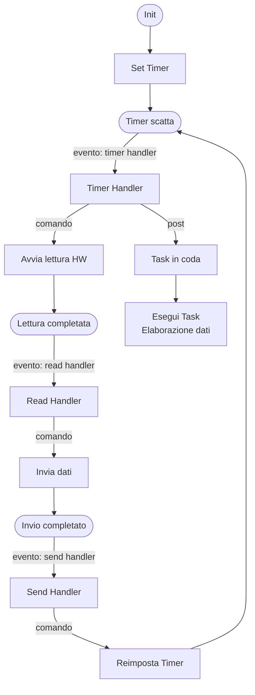
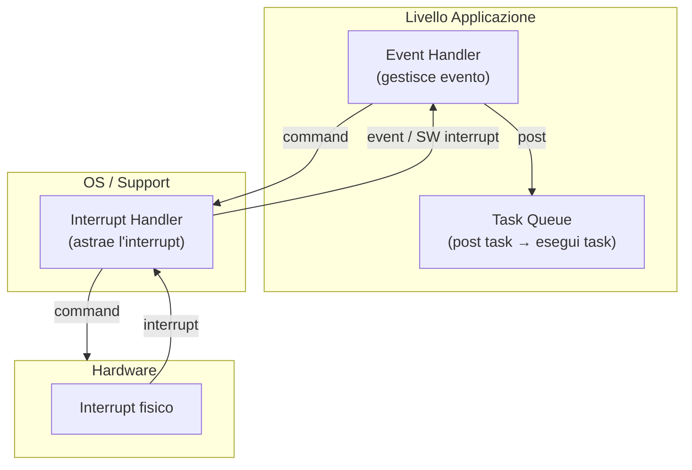

# 01 - Fondamenti IoT e Progettazione

## 1. Introduzione ai Cyber-Physical Systems e IoT

I sistemi cyber-fisici (**Cyber-Physical Systems**, CPS) vivono e connettono due mondi distinti: possiedono sensori e attuatori per interagire con il mondo fisico e, contemporaneamente, sono entità cibernetiche dotate di capacità di elaborazione, memoria e comunicazione per agire nel ciberspazio. L'**Internet of Things** (IoT) rappresenta una "incarnazione" concreta di questi sistemi, implementando quelli che vengono definiti **ambienti intelligenti** (*smart environments*).

> [!definition] Cyber-Physical System (CPS)
>
> Sistema che integra capacità computazionali e di comunicazione con il controllo diretto del mondo fisico tramite sensori e attuatori. La componente cibernetica e quella fisica sono inseparabili e si influenzano reciprocamente.

In un ambiente intelligente, gli oggetti (*smart objects*) assumono una duplice natura fisica e cibernetica. Dal punto di vista fisico, qualsiasi oggetto è soggetto a esperienze tangibili: può essere posizionato in luoghi diversi, spostato ed è esposto ai rischi dell'ambiente esterno, come danni, furti o manomissioni. Questi dispositivi sono caratterizzati da posizionamento libero, dimensioni ridotte, diverse forme (*form factor*) e gusci protettivi. La mobilità è garantita da capacità di comunicazione wireless e alimentazione a batteria, rendendoli spesso consapevoli della propria posizione (*position-aware*). L'esposizione all'ambiente esterno impone ridondanza, sicurezza e costi contenuti.

Un ambiente si definisce "smart" principalmente in relazione all'utente finale: è in grado di riconoscere il contesto, le attività e le situazioni, comprendendo i bisogni dell'utente al momento giusto e fornendo servizi — anche fisici — tramite attuatori o robot. Le caratteristiche comuni di questi ambienti includono la pervasività e la natura non intrusiva dei dispositivi cyber-fisici. Il concetto di "smart" si estende però anche alla gestione, al dispiegamento (*deployment*) e alla manutenzione del sistema stesso: un sistema intelligente deve essere sostenibile, flessibile, sicuro e facile da usare.

### Le Quattro Generazioni di Internet

L'IoT rappresenta l'ultimo sviluppo di Internet e del computing, interconnettendo dispositivi intelligenti che vanno dagli elettrodomestici ai sensori minuscoli, integrando ricetrasmettitori mobili negli oggetti di uso quotidiano. Internet supporta la loro connettività, solitamente verso sistemi cloud, abilitando nuove forme di comunicazione tra persone e cose, e tra le cose stesse. Gli oggetti forniscono informazioni sensoriali, agiscono sul loro ambiente e, in alcuni casi, modificano se stessi come parte di un sistema più ampio.

È possibile identificare quattro generazioni di Internet in base ai sistemi finali supportati:

| Generazione | Tecnologia | Dispositivi tipici | Caratteristiche |
|---|---|---|---|
| Information Technology (IT) | Cablata | PC, server | Elaborazione e storage centralizzati |
| Operational Technology (OT) | Cablata/industriale | Macchinari, sistemi di controllo | Automazione di processi industriali |
| Personal Technology | Wireless | Smartphone, tablet | Connettività mobile personale |
| Sensor/Actuator Technology (IoT) | Wireless, batteria | Sensori, attuatori monoscopo | Bassa potenza, bassa banda, sistemi embedded |

L'IoT è guidato principalmente da dispositivi embedded a bassa potenza, bassa larghezza di banda ed energia limitata, ma include anche apparecchi come telecamere di sicurezza ad alta risoluzione che richiedono elevate capacità di streaming.

### Architettura a Livelli dell'IoT

Ogni dispositivo IoT è composto da sensori e attuatori, un microcontrollore, un'interfaccia wireless e un software che contiene la logica di business. L'architettura IoT è strutturata a livelli sovrapposti che rispecchiano la separazione tra mondo fisico, rete e applicazioni.

Alla base si trova il livello di **Percezione**, costituito dagli oggetti fisici e dai sensori che raccolgono dati dall'ambiente. Sopra di esso si trova il livello di **Comunicazione**, che gestisce le tecnologie di rete e wireless responsabili del trasporto dei dati. Seguono il livello di gestione delle risorse e dei servizi e il livello di gestione dei dati e della conoscenza, che comprende storage e *data analytics*. Al vertice vi sono i servizi specifici del dominio applicativo, come Smart Industry, Smart Energy o Smart Transport. Parallelamente a tutti i livelli opera la sicurezza, che non è un componente isolato ma una proprietà trasversale all'intera architettura.

> [!note] Sensori al livello di percezione
>
> I sensori possono monitorare parametri molto diversi a seconda del contesto. Per il tracciamento degli asset si utilizzano geolocalizzazione GNSS, prossimità NFC o rilevamento dell'orientamento tramite giroscopi. Per la logistica di magazzino si impiegano tecnologie come il Time of Flight (UWB) o l'Angle of Arrival (Bluetooth) per la localizzazione precisa al chiuso.

***

## 2. Piattaforme IoT, Astrazione e Gestione dei Dati

Le **piattaforme IoT** agiscono come strati software tra i dispositivi e le applicazioni, distribuendo le funzionalità tra i dispositivi stessi, i gateway e i server nel cloud. Queste piattaforme offrono un insieme di funzionalità critiche che coprono l'intero ciclo di vita dei dispositivi e dei dati.

### Identificazione, Discovery e Device Management

L'**identificazione** fornisce un metodo univoco per riconoscere le entità all'interno di una piattaforma. Esistono diversi standard a seconda del contesto operativo: gli indirizzi IP per Internet, l'**MSISDN** nella telefonia, gli **URI** sul web, l'**OID** nelle telecomunicazioni e gli **UUID** nei sistemi informatici (molto utilizzati anche nello standard Bluetooth).

La **discovery** è il meccanismo attraverso il quale la piattaforma individua dispositivi, risorse o servizi all'interno di un'infrastruttura IoT, permettendo di interrogarne in modo dinamico le proprietà e le caratteristiche offerte.

La fase di **gestione dei dispositivi** (Device Management) parte dall'inizializzazione e configurazione, attività che includono il pairing, la definizione delle impostazioni di sicurezza con la relativa distribuzione delle chiavi crittografiche, la calibrazione dei trasduttori e la localizzazione spaziale degli endpoint. La piattaforma IoT si occupa anche di gestire l'aggiornamento automatico del software e del firmware, di monitorare in tempo reale lo stato dell'hardware (come il livello batteria o la temperatura) e di effettuare diagnostica per guasti. Questi processi si appoggiano spesso su standard come **OMA DM** e **OMA LWM2M** per terminali e sensori, e **BBF TR-069** per apparecchiature destinate agli utenti finali.

### Astrazione, Semantica e Composizione dei Servizi

L'**astrazione** e la **virtualizzazione** nascondono la complessità fisica dell'hardware per trattare i dispositivi IoT come veri e propri servizi, introducendo concetti architetturali chiave come il **digital twin** per l'Industry 4.0.

> [!definition] Digital Twin
>
> Il digital twin è una rappresentazione virtuale di un oggetto o sistema fisico, mantenuta sincronizzata con la sua controparte reale. Nell'Industry 4.0 permette di simulare, monitorare e ottimizzare il comportamento dei dispositivi fisici senza interagire direttamente con essi.

La **semantica** attribuisce significato strutturato ai dati raccolti, permettendo di rappresentare il contesto operativo degli apparati per abilitare un ragionamento logico e favorire l'elaborazione dei flussi informativi da parte dell'intelligenza artificiale.

La **service composition** si incarica di aggregare i servizi di svariati dispositivi IoT e di componenti software preesistenti per dare origine a funzionalità composite o catene di data analytics complesse.

### Database NoSQL e MongoDB

I flussi informativi ad alta intensità tipici dell'IoT richiedono soluzioni di archiviazione flessibili e performanti, motivo per cui ci si affida sovente ai database **NoSQL**, pensati per applicazioni real-time e scenari Big Data. I sistemi NoSQL offrono prestazioni eccellenti scalando in modo orizzontale su cluster di macchine e hanno un design più snello e destrutturato rispetto all'approccio relazionale SQL classico.

**MongoDB**, ad esempio, salva le proprie entità non come record tabellari ma come documenti formattati in una sintassi molto vicina al JSON, potendo incorporare array e oggetti nidificati per ridurre l'esecuzione di operazioni costose come le join. I documenti vengono logicamente raggruppati in **collection** — assimilabili alle tabelle — pur non dovendo condividere necessariamente la medesima struttura rigida. Le query su un database MongoDB consentono l'applicazione flessibile di criteri di filtraggio, l'utilizzo di proiezioni e modificatori per l'ordinamento.

***

## 3. Architetture di Rete: Edge, Fog e Cloud

Le problematiche di latenza, affidabilità e larghezza di banda nell'IoT vengono affrontate distribuendo l'elaborazione su diversi livelli di rete, ciascuno con caratteristiche e responsabilità distinte.

> [!definition] Cloud
>
> Livello centrale dell'architettura, caratterizzato da data center cablati e tempi di risposta transazionali. Adatto per l'archiviazione a lungo termine e l'elaborazione computazionalmente pesante.

> [!definition] Edge
>
> Livello periferico della rete aziendale, costituito dai dispositivi IoT stessi (sensori e attuatori) o dai gateway che li interconnettono. Opera con tempi di risposta nell'ordine dei millisecondi, offrendo la possibilità di azioni locali real-time.

> [!definition] Fog Computing
>
> Livello intermedio tra Edge e Cloud. I dispositivi Fog sono fisicamente vicini all'Edge e convertono i flussi di dati di rete in informazioni adatte all'archiviazione o all'elaborazione di alto livello, riducendo il volume di dati inviati al cloud e garantendo tempi di risposta in tempo reale.

Lo scopo del Fog è eseguire l'elaborazione il più vicino possibile ai sensori — valutazione, formattazione, riduzione dei dati — alleggerendo così il traffico verso il cloud e abbattendo la latenza per le applicazioni che richiedono risposte immediate.

> [!tip] Intuizione chiave
>
> La scelta tra Edge, Fog e Cloud non è esclusiva: le architetture IoT moderne sfruttano tutti e tre i livelli in modo complementare, assegnando a ciascuno il tipo di elaborazione più adatto alle sue caratteristiche.

***

## 4. Intelligenza Artificiale, Machine Learning e Blockchain

L'**Intelligenza Artificiale** (AI) nell'IoT mira a rendere i sistemi capaci di comportamenti intelligenti, ricercando modelli comportamentali ottimali. Il **Machine Learning** (ML) permette ai sistemi di imparare dai dati (*training set*) per associare input a output, generalizzando poi su dati mai visti prima, e si divide in:
- **Unsupervised Learning**: cerca in autonomia pattern nascosti nei dati.
- **Supervised Learning**: impara da esempi in cui sono forniti sia l'input sia l'output desiderato.
- **Reinforcement Learning**: evolve attraverso un meccanismo di rinforzo o ricompensa.

> [!note] TinyML
>
> Il paradigma **TinyML** permette di miniaturizzare e implementare modelli di Machine Learning direttamente su processori IoT a bassa potenza, portando capacità inferenziali all'edge senza dipendere da connettività cloud.

### Federated Learning

> [!definition] Federated Learning
>
> Un'architettura di intelligenza artificiale distribuita che ovvia alla necessità del ML tradizionale di accentrare tutti i dati su un singolo server. Ciascun dispositivo edge addestra autonomamente il proprio modello usando i propri dati in locale. Solo i parametri aggiornati vengono inoltrati a un server di aggregazione che ricompila un nuovo modello globale e lo propaga nuovamente a tutti gli endpoint.

Questo approccio offre enormi vantaggi in scalabilità e privacy. Tuttavia, è soggetto ad attacchi di **poisoning** (avvelenamento):
- **Data poisoning**: l'avversario corrompe i dati locali inserendo falle volontarie.
- **Model poisoning**: l'avversario manipola i gradienti prima di inviarli all'aggregatore centrale.
Per difendersi si applicano metodologie di anomaly detection, reputation systems e auditing tramite Blockchain.

### IoT e Blockchain

La **Blockchain** offre un registro pubblico distribuito in cui nessuna entità governa in maniera centralizzata lo storico delle transazioni. Le iscrizioni sono *tamper-evident* (non modificabili) e certificano un unico punto della verità. Uno scenario d'uso frequente è la **supply chain**: reti di sensori analizzano lo stato delle merci per tutte le fasi di transito e firmano le conformità tramite **smart contract** direttamente sul registro distribuito condiviso tra le aziende della catena logistica.

***

## 5. Interoperabilità e Standard

L'**interoperabilità** rappresenta una delle sfide cruciali nello sviluppo dell'Internet of Things. L'assenza di standardizzazione produce architetture in totale isolamento.

> [!definition] Vertical Silos
>
> In questo modello, una soluzione funziona esclusivamente all'interno del proprio ecosistema: i dispositivi proprietari comunicano solo con l'infrastruttura dello stesso fornitore, rendendo incompatibili i prodotti di terze parti.

> [!definition] Vendor Lock-in
>
> La pratica di "ingabbiare" il cliente con l'obiettivo di prevenire l'utilizzo di componenti di altri produttori e imporre costi elevati per l'eventuale migrazione verso soluzioni alternative.

### Tecnologie Wireless e Standard di Riferimento

Il panorama delle tecnologie wireless è differenziato in base al rapporto tra raggio di copertura e velocità di trasmissione:
- **IEEE 802.11 (Wi-Fi)**: originariamente a 2.4 GHz (1-2 Mbps), evoluto in bande 5 GHz con velocità di oltre 400 Mbps e forte gestione del Quality of Service (QoS).
- **IEEE 802.15.4 e ZigBee**: definiscono i livelli fisico, MAC e applicativi per reti a basso consumo. ZigBee è progettato specificamente per reti di sensori a bassa potenza e basso throughput (fino a 115 Kbps), con duty cycle ridottissimo (~1%). Supporta configurazioni multi-hop.
- **Bluetooth e BLE**: offrono data rate superiore, orientati alla comunicazione personale e multimediale a corto raggio. Usa topologia master-slave in *piconet*.
- **Reti cellulari**: dal 1G al 4G LTE, con riduzione della latenza sotto i 20 ms.

### Il Paradigma 5G

> [!tip] Il 5G come cambio di paradigma
>
> Il 5G non rappresenta solo un incremento di velocità, ma un cambiamento profondo che abilita categorie di scenari d'uso radicalmente diverse, ciascuna con requisiti tecnici incompatibili tra loro.

| Macro-area | Sigla | Applicazione tipica | Requisiti Chiave |
|---|---|---|---|
| Enhanced Mobile Broadband | eMBB | Video HD, realtà virtuale | Altissima velocità, larghezza di banda |
| Massive Machine Type Communication | mMTC | Smart city, decine di migliaia di sensori | Scala immensa, dispositivi a basso consumo |
| Ultra-Reliable Low Latency Communications | URLLC | Automazione industriale, guida autonoma | Affidabilità e latenza vitali (non la velocità) |

### La Necessità degli Standard e i Gateway

Gli standard nascono per ridurre i costi in regime di **coopetition** (cooperazione tra competitor). Tuttavia, la loro proliferazione (MQTT, CoAP, LWM2M) ha spostato le incompatibilità ai livelli middleware e applicativo.

Per gestire questa eterogeneità si ricorre agli **Application-level gateways** o integration gateways. Non si limitano a tradurre pacchetti: mappano comportamenti applicativi differenti l'uno nell'altro, operando come interpreti semantici tra ecosistemi incompatibili.

| Tipo | Fornitore | Protocollo | Necessità di gateway |
|------|-----------|------------|----------------------|
| A | Unico | Unico | No |
| B | Multiplo | Unico (condiviso) | No o minimale |
| C | Multiplo | Diversi | Sì — Integration Gateway per la traduzione |
| C/II | Multiplo (consumer) | Diversi | Sì — ecosistemi come Google Home o Alexa |
| D | Multiplo | Eterogenei e distribuiti | Sì — gateway multipli con mappature complesse |

***

## 6. Sicurezza nell'IoT

La sicurezza nei sistemi cyber-fisici ha raggiunto un punto di crisi. A differenza dei sistemi IT tradizionali, i dispositivi IoT sono spesso sistemi embedded economici (**constrained devices**), prodotti con forti incentivi a ridurre i costi (Time-to-Market). Sono frequentemente affetti da vulnerabilità per le quali non esiste meccanismo di patching sistematico, e mostrano debolezze basilari come password hard-coded.

### Requisiti di Sicurezza secondo ITU-T Y.2066

La raccomandazione **Y.2066** dell'ITU-T identifica i requisiti fondamentali organizzandoli in tre aree concettuali:
1. **Sicurezza della comunicazione**: garantire riservatezza e integrità dei dati durante la trasmissione tra dispositivi e piattaforme.
2. **Sicurezza della gestione dei dati**: proteggere riservatezza e integrità quando i dati sono archiviati o elaborati (*data at rest*).
3. **Sicurezza della fornitura del servizio**: prevenire accessi non autorizzati ai servizi e proteggere la privacy.

A questi si aggiunge l'implementazione dell'**autenticazione mutua** tra dispositivi (più robusta di quella a una via) e l'auditing tracciabile.

### Il Ruolo del Gateway nella Sicurezza

Essendo i dispositivi vincolati spesso incapaci di implementare forte crittografia, il **gateway** agisce come punto centrale di applicazione delle policy:
- Gestisce l'identificazione e l'autenticazione di ogni dispositivo connesso.
- Assicura la protezione della privacy e decodifica i flussi criptati.
- Esegue diagnostica e supporta l'aggiornamento remoto del firmware.
- Gestisce configurazioni di policy di sicurezza locali o remote.

***

## 7. IoT Design

### Anatomia di un nodo IoT

Un dispositivo IoT tipico è un sistema a basso costo, bassa potenza e di piccole dimensioni. I suoi componenti essenziali sono un **microprocessore** (spesso un MCU da pochi MHz come l'ATmega128L), una piccola quantità di **memoria**, un **ricetrasmettitore radio** (Wireless NIC) e una **scheda sensori** (sensor board) che può misurare accelerazione, pressione, umidità, luce, temperatura, GPS e molto altro. A queste si aggiungono eventuali **attuatori** e una fonte di energia, tipicamente una batteria o celle solari.

> [!definition] Nodo IoT (Mote)
>
> Un dispositivo IoT è un sistema embedded autonomo, composto da processore, memoria, radio e sensori, progettato per operare con risorse molto limitate di calcolo, memoria, banda e soprattutto energia.

### Principali sfide nel design

Il design di un nodo IoT è vincolato da quattro risorse finite: potenza di calcolo, memoria, capacità della batteria e larghezza di banda. Da questi vincoli discendono le sfide principali:
- **Efficienza energetica**: ottimizzare ogni operazione.
- **Adattabilità**: protocolli e nodi devono rispondere a condizioni variabili di rete e alimentazione.
- **Protocolli a bassa complessità e overhead**: le risorse limitate impongono stack MAC e routing molto leggeri.
- **Comunicazione multi-hop**: instradamento necessario tra nodi intermedi.
- **Mobilità e pre-processing**: elaborare dati sull'edge riduce i consumi della radio.

### La Legge di Moore e l'IoT

> [!definition] Legge di Moore
>
> Il numero di transistor che possono essere integrati economicamente in un chip cresce esponenzialmente, raddoppiando circa ogni due anni.

La Legge di Moore non ha un'unica lettura:
1. **Stesse dimensioni, più prestazioni, stesso costo**: PC desktop e server.
2. **Stesso costo, metà dimensioni**: wearable.
3. **Stesse prestazioni, metà costo**: questa è l'applicazione chiave in IoT dove si deployano milioni di nodi e il costo unitario è dominante.

> [!tip] Intuizione chiave
>
> La Legge di Moore va usata per rendere i nodi IoT **più piccoli e più economici**, non necessariamente più potenti. La sfida del design efficiente rimane, perché la crescita della capacità delle batterie è molto più lenta di quella dei transistor.

### Efficienza Energetica: Il problema Intel vs Duracell

C'è un'asimmetria fondamentale: le prestazioni dei processori crescono esponenzialmente, mentre la capacità energetica delle batterie rimane quasi piatta. Più il nodo può "fare", più la batteria diventa il collo di bottiglia.

*Fig. — Il confronto "Intel vs Duracell": le curve di processore, HD e memoria crescono esponenzialmente nel tempo, mentre quella della batteria rimane quasi orizzontale. Il gap energetico si allarga progressivamente.*

### Dove va l'energia: laptop vs sensore

*Fig. — Ripartizione del consumo in un laptop: lo schermo domina con il 48%.*

*Fig. — Ripartizione del consumo in un sensore wireless: la radio (NIC) e processore pesano il 40% ciascuno, mentre il sensing pesa il 20%. Non essendoci schermo, la radio diventa il componente critico.*

**Consumi della radio:**
- Sleep mode: ~10 mA
- **Listen mode (in ascolto): ~180 mA**
- Receive mode: ~200 mA
- Transmit mode: ~280 mA

> [!warning] Radio accesa = energia sprecata
>
> Il consumo in modalità listen è paragonabile a quello in ricezione, e ordini di grandezza superiore allo sleep. La radio deve essere spenta il più possibile. Anche tenere la radio accesa e in attesa è proibitivo.

### Duty Cycle

> [!definition] Duty Cycle (DC)
>
> Il duty cycle è la frazione di un periodo in cui il sistema (o un suo componente) è attivo: $DC = \frac{t_{attivo}}{T_{periodo}}$.

Applicare duty cycle aggressivi (es. 1-5%) è la leva principale per estendere la vita della batteria, disattivando hardware non necessario in ogni porzione di firmware. Il consumo medio è dettato da $E = dc \cdot C_{active} + (1 - dc) \cdot C_{idle}$.

*Fig. — Diagramma stati/energia vs tempo per un codice di esempio con turnOn e turnOff dei componenti. Il lungo periodo di idle (380 ms su 400 ms) abbassa drasticamente il consumo medio.*

*Fig. — Vita della batteria vs capacità. Un modello con DC al 5% ha una vita 10-15 volte superiore a uno con DC al 100%.*

*Fig. — Vita del sensore vs duty cycle: la curva scende molto rapidamente. Ridurre il DC da 3% a 1% genera incrementi molto più incisivi rispetto all'aumentare la batteria da 2000 a 3000 mAh.*

Spegnere la radio tuttavia è una **decisione globale** che richiede protocolli MAC IoT specializzati per permettere la comunicazione sincrona e il risveglio coordinato.

*Fig. — Specifiche hardware complete di una Mote-class sensor.*

*Fig. — Tabella di confronto tra il modello DC 100% e il modello DC 5%.*

*Fig. — Rappresentazione grafica degli stati. DC 5% trascorre quasi tutto il tempo idle.*

*Fig. — Il duty cycle non specifica la posizione dell'attività nel tempo; questo offre flessibilità per la sincronizzazione MAC tra nodi.*

***

## 8. Case Study: Biologging e Activity Recognition

Il biologging rappresenta uno dei casi d'uso più concreti dell'IoT nel mondo naturale. Il progetto **Tortoise@** automatizza il rilevamento delle attività di nidificazione delle tartarughe con ML embedded su dispositivi a bassa potenza.

> [!definition] Biotelemetria vs Bio-logging
>
> **Biotelemetria**: i dati raccolti vengono trasmessi in tempo reale.
> **Bio-logging**: i dati vengono memorizzati internamente per recupero fisico, ed eventualmente trasmessi solo quando richiesto.

### Pipeline del Biologging e On-Board Intelligence
Il monitoraggio con accelerometri e GPS continui esaurirebbe in fretta le batterie. 
**Approccio innovativo**: spostare l'elaborazione (Machine Learning) **on-board**, analizzare in locale, e trasmettere via radio **solo il risultato semantico**.

*Fig. — Il flusso completo del biologging.*

*Fig. — L'elaborazione e memorizzazione solo dei risultati riduce drasticamente traffico radio e consumi.*

### Il progetto Tortoise@
Il sistema serve a ritrovare i nidi deposti individuando il segnale accelerometrico dello scavo:
- Lo scavo produce un pattern caratteristico imparabile.
- Le tartarughe nidificano in giorno in luoghi caldi.

*Fig. — Il sistema invia notifiche GPS agli erpetologi appena riconosce il nido.*

*Fig. — Macchina a stati finiti: usa sensori luce/temperatura molto economici come "gate" per azionare i dispendiosi accelerometri solo quando ha senso.*

### Classificazione
Sensori MicaZ a 1Hz su asse X, finestre asincrone e sincrone.

**Risultati (Task asincrono 300 sec)**:

- La rete **IDNN** ottiene il 95% di accuratezza richiedendo solo **0,3 KB** di RAM, battendo le CNN che ne chiedono 3,5 KB. Su MCU piccoli è essenziale. SVM richiede decine di KB per i vettori.

**Risultati (Task sincrono in streaming)**:

- Con **Echo State Network (ESN)**, accuratezza 93% con appena **0,1 KB di RAM**.

> [!abstract] Sintesi del risparmio
>
> Rispetto al cloud che richiede di trasmettere e/o memorizzare 13 MB, Tortoise@ on-board conserva max 3 KB alla volta e usa il modulo radio solo poche volte in 4 mesi. 

***

## 9. Embedded Programming e Arduino

Gli **sistemi embedded** sono progettati per svolgere una funzione dedicata, tramite co-design hardware-software, che integra microprocessori (microcontrollori) operanti a basso livello per fornire il controllo del dispositivo ospite. A causa dei vincoli (spesso senza un OS vero e proprio), si richiedono requisiti stringenti di **Real-Time** (la correttezza temporale è essenziale quanto quella logica) e di alta tolleranza ai fault.

### Cross-Compilazione e Modelli di Esecuzione

Poiché scarseggia RAM (es. Arduino Uno ha solo 2 KB), usare multipli thread dotati di stack separati non è sostenibile. Due modelli principali emergono:

### Il Modello Arduino
Event loop sincrono a singolo thread. `loop()` viene iterato indefinitamente.

```mermaid
%% CAPTION: Modello di esecuzione di Arduino basato su singolo thread, esecuzione sequenziale e polling sincrono.
%%{init: {"flowchart": {"useMaxWidth": true}}}%%
flowchart LR
    A([Init]) --> B[Init HW]
    B --> C[loop&#40;&#41;]
    C --> D[Comando]
    D --> E[Attesa<br/>completamento]
    E --> F[Delay]
    F --> G[Attesa<br/>delay]
    G --> C
```

### Il Modello TinyOS
Progettato per efficienza e modularità asincrona senza thead overhead. Sviluppato in tre entità:
- **Comandi**: funzioni down-ward verso l'hardware.
- **Eventi**: up-call che astraggono interrupt pre-emptando il flusso.
- **Task**: coda sequenziale non-preemptive per il lavoro deferito dagli event handlers.

### Arduino e Interrupt Esterni
La piattaforma Arduino Uno basa tutto sul ATmega328.

Oltre al bloccante `delay()`, offre gestione asincrona tramite gli **interrupt esterni** (`attachInterrupt()`) sui pin digitali 2 e 3.
Regole vitali per i gestori di interrupt (*handler*):
- Devono essere rapidissimi, delegando tutto il lavoro extra.
- Dentro l'handler `delay()` o le funzioni basate su `millis()` non funzionano.
- Le variabili modificate nell'handler e lette nel loop devono essere marcate come `volatile` in C, imponendo letture forzate in RAM.

### Sleep Mode in Arduino
L'ATmega328P supporta vari Sleep mode gestibili tramite *LowPower.h*. Il più utile e profondo per azzerare il DC in inattività è **Power-Down**, che spegne il clock principale consentendo risvegli unicamente tramite interrupt esterni.

***

## 10. Domande d'esame frequenti

- Cos'è un Cyber-Physical System e in cosa si distingue da un sistema puramente informatico o fisico?
- Descrivere le quattro generazioni di Internet e le caratteristiche che differenziano l'IoT.
- Quali funzionalità offre una piattaforma IoT e perché è necessario uno strato software intermedio?
- Cosa si intende per vendor lock-in e vertical silos?
- Quali sono le tre macro-categorie di scenari d'uso del 5G?
- Descrivere le configurazioni di integrazione Tipo A, B, C e D: quando è necessario un gateway applicativo?
- Quali sono i requisiti di sicurezza (ITU-T Y.2066) e qual è il ruolo del gateway?
- Quali sono le differenze tra Edge, Fog e Cloud Computing nell'IoT?
- Come funziona il Federated Learning e quali sono i principali attacchi a cui è soggetto?
- Perché i database NoSQL sono preferiti ai DB relazionali nei contesti IoT?
- Quali sono le tre interpretazioni della Legge di Moore e come si applicano all'IoT?
- Perché tenere la radio in modalità "listen" è quasi costoso quanto ricevere dati?
- Come si calcola il duty cycle di un componente e qual è il trade-off tra edge processing e offloading in cloud?
- Qual è la differenza tra biotelemetria e bio-logging?
- Come funziona la macchina a stati di Tortoise@ per ottimizzare l'efficienza energetica e confronta IDNN, CNN, ESN e SVM.
- Quali sono le principali differenze tra un sistema embedded e un PC general purpose e in cosa consiste il co-design?
- Confrontare il modello Arduino con il modello TinyOS (eventi, comandi e task).
- Quali regole vanno rispettate nello scrivere un Interrupt Handler (es. `volatile`, blocchi)?
- Descrivere le modalità di sleep dell'ATmega328P.
