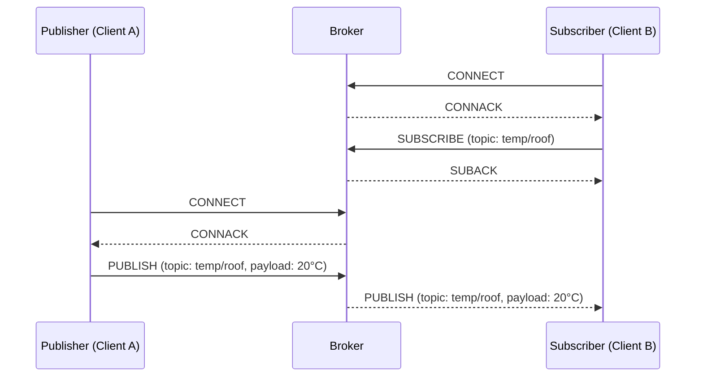
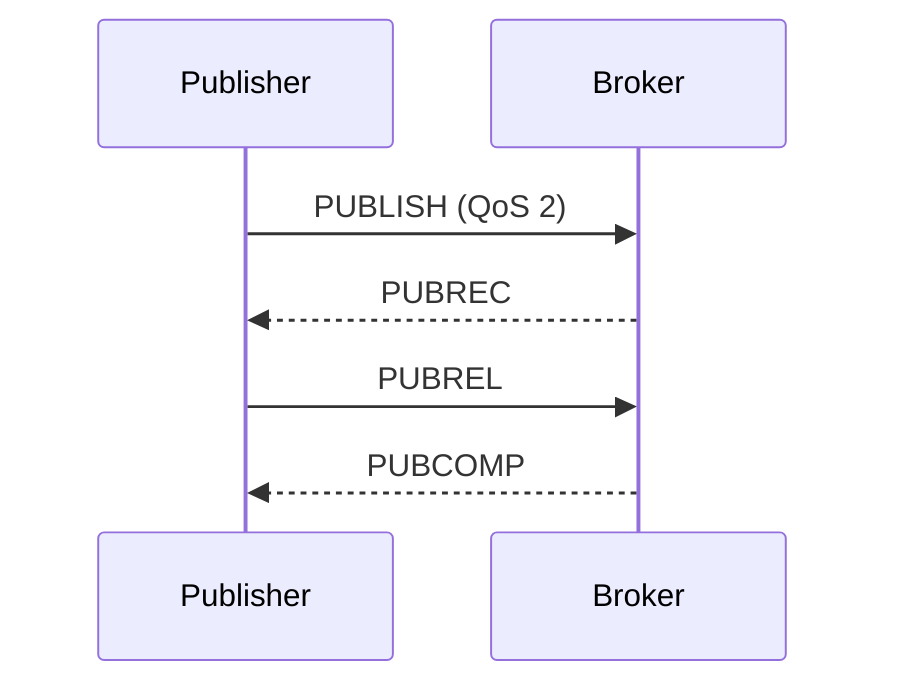

# 02 - Protocolli Applicativi (MQTT e CoAP)

Questa lezione analizza l'evoluzione delle architetture di rete e degli stack di protocolli pensati per l'Internet of Things, culminando con un'analisi strutturale del protocollo MQTT e del protocollo CoAP. Vengono esplorati i paradigmi di comunicazione, le logiche di connessione, la strutturazione dei topic e i meccanismi di affidabilità.

## I Requisiti dell'IoT e la Conventional Internet Protocol Suite

Perché un oggetto diventi a tutti gli effetti un dispositivo IoT deve essere connesso a Internet. Tradizionalmente, i sistemi si interfacciano alla rete globale tramite la **Internet protocol suite** convenzionale, strutturata sul binomio TCP/IP affiancato da un livello applicativo come HTTP. Questa suite si articola su tre livelli: il **livello di rete** (**IP** per indirizzamento e routing best-effort); il **livello di trasporto** (**TCP** per garanzie di consegna o **UDP** per minor overhead); il **livello applicativo** (**HTTP** con architettura client/server).

Questo stack è stato pensato per dispositivi *resource-rich*. Per i nodi IoT risulta troppo pesante: operano su reti instabili (*lossy*), con hardware a bassissimo consumo energetico (*low power*) e risorse estremamente limitate (*constrained*). Questi vincoli impongono una ridefinizione completa dei requisiti:

| Requisiti di Rete | Impatto sul Networking |
|---|---|
| **Scalabilità / Ridondanza** | Necessità di reti multi-hop e architetture mesh. |
| **Sicurezza** | Deve essere configurabile in base alle capacità dei singoli dispositivi. |
| **Indirizzamento** | Richiede uno spazio di indirizzamento scalabile e protocolli a basso overhead. |
| **Requisiti del Dispositivo** | **Impatto sul Livello Applicativo** |
| **Basso consumo / A batteria** | Progettazione di applicazioni con basso duty-cycle. |
| **Capacità limitata (memoria/CPU)** | Necessità di protocolli con footprint minimo e bassa complessità. |
| **Basso costo** | Aumenta la richiesta di affidabilità, introducendo ulteriori vincoli fisici. |

***

## Introduzione al Protocollo MQTT

> [!definition] MQTT
>
> **MQTT** (*Message Queuing Telemetry Transport*) è un protocollo di messaggistica leggero di tipo publish/subscribe, progettato per ambienti con risorse limitate e connettività instabile. Standardizzato da OASIS (versione di riferimento 3.1.1).

Ideato nel 1999, la sua leggerezza si manifesta in tre modi: code footprint ridotto, basso consumo di banda e overhead di pacchetto minimo. MQTT si appoggia su TCP/IP operando sulla **porta 1883** in chiaro e sulla **porta 8883** in **SSL/TLS** (che introduce un overhead computazionale significativo per le MCU).

Il protocollo concentra la complessità sul lato server (il broker), mantenendo l'implementazione client semplice. È *data agnostic* (non si cura del payload) e implementa meccanismi di garanzia della consegna (QoS).

***

## Il Paradigma Publish / Subscribe

> [!tip] Pub/Sub e i tre disaccoppiamenti
>
> Il paradigma introduce tre forme di *decoupling* ideali per l'IoT:
> - **Space decoupling**: publisher e subscriber non si conoscono (non condividono IP/porta).
> - **Time decoupling**: non devono essere operativi contemporaneamente.
> - **Synchronization decoupling**: le operazioni sui client non sono bloccanti durante publish o receive.

Il paradigma pub/sub è *loosely coupled*. I **publisher** e i **subscriber** agiscono come client. Il **broker** riceve tutti i messaggi, li filtra e li distribuisce. Le operazioni cardine sono quattro: *Publish*, *Subscribe*, *Notify* e *Unsubscribe*.

La scalabilità è superiore rispetto all'architettura client/server. Le modalità di filtraggio sono tre: **topic-based** (MQTT), **content-based** (il broker ispeziona il payload, ma impedisce la cifratura), e **type-based** (filtraggio semantico, richiede forte integrazione col linguaggio).
Publisher e subscriber devono accordarsi *a priori* sui topic, e il publisher non può assumere che ci sia qualcuno in ascolto.

***

## Il Modello MQTT: Connessione e Flusso Operativo

*Fonte: Wikimedia Commons — Il flusso completo: Client A si connette, Client B si sottoscrive, Client A pubblica.*

L'infrastruttura opera ai livelli 5-6 (ISO/OSI), sopra TCP. I dispositivi devono conoscere hostname e porta del broker in anticipo.

### L'Instaurazione della Connessione
Il client invia il pacchetto **CONNECT**:
- **Client ID** (obbligatorio): univoco. Se vuoto, richiede *Clean Session* a `true`.
- **Clean Session** (opzionale): `false` richiede una *persistent session* (salva stato, iscrizioni e QoS ≥ 1).
- **Username/Password** (opzionali): per autenticazione (in chiaro senza TLS).
- **Will flags** (opzionali): testamento per disconnessioni anomale.
- **KeepAlive** (opzionale): timeout (in secondi) entro cui inviare almeno un pacchetto (ping).

Il broker risponde con **CONNACK** (Connect Acknowledgement), contenente i flag *Connection Accepted/Refused* e *Session Present*.

### Sottoscrizione e Ricezione
Un client invia **SUBSCRIBE** contenente un `packetId` e l'elenco dei topic con il QoS richiesto. Il broker risponde con **SUBACK** (ritorna `128` per fallimento, o `0`, `1`, `2` per successo col *maximum QoS granted*). Per revocare si usa **UNSUBSCRIBE** (risposta **UNSUBACK**).

### Gestione e Best Practices dei Topic
Gerarchia separata dal carattere `/`. I subscriber possono usare le **wildcard**:
- **`+`**: sostituisce un singolo livello (es. `home/+/presence`).
- **`#`**: sostituisce tutti i livelli successivi (es. `home/#`).
I topic che iniziano con `$` sono riservati al broker per statistiche (es. `$SYS/broker/uptime`).

> [!warning] Best practices per i topic
> - Non iniziare il topic con `/` (es. `/home`).
> - Non usare spazi; mantenere le stringhe corte; usare ASCII/UTF-8.
> - Includere il `clientId` (es. `sensor1/temperature`) per limitare i permessi.
> - Usare topic specifici anziché aggregati.
> - Evitare l'abuso del wildcard `#`.

### Pubblicazione
Messaggio **PUBLISH**:
- **topicName**: stringa del topic di destinazione.
- **payload**: dati (binari, testo, JSON).
- **packetId**: 16 bit, usato per QoS > 0.
- **retainFlag**: se attivo, il broker conserva l'ultimo messaggio per i nuovi subscriber.
- **dupFlag**: duplicato per ritrasmissioni.
- **qos**: livello di Quality of Service.

***

## I Meccanismi della Quality of Service (QoS)

Il QoS regola la garanzia di consegna. È importante notare che il QoS tra publisher e broker è indipendente da quello tra broker e subscriber. I messaggi sono tracciati da un `packetId` a 16 bit.

> [!abstract] I tre livelli QoS a confronto
>
> | Livello | Nome | Garanzia | Meccanismo | Duplicati |
> |---|---|---|---|---|
> | **QoS 0** | At most once | Nessuna | Nessun ACK, no mem. | No |
> | **QoS 1** | At least once | Almeno una | PUBACK | Possibili |
> | **QoS 2** | Exactly once | Esattamente una| Handshake a 4 fasi | No |

- **QoS 0**: Modalità *best effort*. Ottima per dati che invecchiano rapidamente.
- **QoS 1**: Il broker memorizza il messaggio e risponde con **PUBACK**. Se l'ACK non arriva, si ritrasmette con `dupFlag` attivo (possibili duplicati).
- **QoS 2**: Elimina duplicati e garantisce singola consegna. Comporta un handshake a quattro fasi: **PUBLISH** → **PUBREC** → **PUBREL** → **PUBCOMP**.

***

## Meccanismi di Affidabilità Avanzati

### Sessioni Persistenti
Se *Clean Session* è `false`, il broker salva per il `clientId` le sottoscrizioni e i messaggi non consegnati (QoS 1/2). Anche il **client** deve salvare i messaggi non-acked.
Non vanno usate se si pubblica solo a QoS 0 o se perdere messaggi vecchi è tollerabile.

### Messaggi Trattenuti (*Retained Messages*)
Messaggi inviati con **`retainFlag = true`**. Il broker ne mantiene uno per topic e lo invia istantaneamente a ogni nuovo iscritto (utile per trasmettere lo stato attuale senza aspettare nuovi aggiornamenti, es. dispositivo "ON"). Indipendenti dalle sessioni persistenti.

### Last Will & Testament (Testamento)
Configurato durante la connessione (CONNECT) con i parametri `lastWillTopic`, `lastWillQoS`, `lastWillMessage` e `lastWillRetain`. Se il client si disconnette *anormalmente*, il broker pubblica il messaggio. Avviene per 4 cause: errore di I/O, PINGREQ mancato (keep alive), chiusura TCP brusca, errore protocollo lato broker. (Se la disconnessione è tramite DISCONNECT, viene scartato).

### Keep Alive
Mitiga il problema di TCP di non accorgersi dei peer offline. Il client invia **PINGREQ** entro l'intervallo specificato in CONNECT, e il broker risponde con **PINGRESP**.

***

## Struttura dei Pacchetti MQTT

Ogni **MQTT Control Packet** comprende:
1. **Fixed Header** (min 2 byte):
   - **Byte 1**: Tipo pacchetto (4 bit) + Flag (4 bit). Es. nel PUBLISH i flag indicano DUP, QoS e Retain. Negli altri spesso è `0,0,0,0` (eccetto PUBREL/SUBSCRIBE/UNSUBSCRIBE che usano `0,0,1,0`).
   - **Byte 2+**: *Remaining Length* (lunghezza variabile).
2. **Variable Header**: Presente solo in alcuni pacchetti (es. `packet identifier` di 2 byte per QoS > 0).
3. **Payload**: Es. il `client identifier` in CONNECT. È assente nei pacchetti di controllo (PINGREQ, DISCONNECT, ACK QoS).

I tipi principali: CONNECT(1), CONNACK(2), PUBLISH(3), PUBACK-PUBREC-PUBREL-PUBCOMP(4-7), SUBSCRIBE(8), SUBACK(9), ecc.

***

## Implementazione Pratica: MQTT su Arduino

La libreria **PubSubClient** è la più diffusa: limitata volontariamente per leggerezza (niente SSL/TLS, no QoS 2, max 128 byte payload).
- Si istanzia con broker IP, porta e un **callback** (funzione eseguita event-driven all'arrivo dei messaggi).
- API base: `connect(...)`, `publish(...)`, `subscribe(...)`, `disconnect()`.
- L'esecuzione ciclica di **`loop()`** è essenziale per mandare i PINGREQ (mantenere attiva la connessione) e processare la callback.

***

## MQTT vs HTTP e il Problema della Scalabilità

HTTP impone connessioni client/server simmetriche e rigide (comunicazioni 1-a-1). Con molti dispositivi, **HTTP non scala bene**.
MQTT scala sul broker, che gestisce il *fan-out* senza gravare sui client, scambiando pacchetti compatti (byte vs documenti testuali voluminosi di HTTP).

> [!warning] Limiti strutturali di MQTT
> 1. Il broker è un **single point of failure**.
> 2. L'overhead del broker può crescere eccessivamente su reti enormi.
> 3. L'uso di **TCP** richiede risorse maggiori, causa *wake-up time* alti e maggior consumo di batteria rispetto a protocolli UDP.

***

## CoAP: L'Alternativa per Reti Vincolate

Per dispositivi con bassissime risorse (RAM/ROM) e reti lossy (es. 6LoWPAN a 10 kbit/s), **CoAP** (*Constrained Application Protocol*, RFC 7252) rimpiazza MQTT.

Abbraccia un paradigma **client/server**, dove i sensori operano da *server* e i software centrali da *client*. Usa un'architettura **REST** (GET, PUT, POST, DELETE) per accedere alle risorse esposte.

> [!abstract] Caratteristiche Tecniche di CoAP
> - Utilizza **UDP/IP** al posto di TCP, annullando l'overhead di instaurazione connessione.
> - Formati compatti e *resource directory* integrata per la discovery.
> - Sicurezza nativa robusta (livelli RSA 3072 bit).
> - Supporta anche un modello asincrono parziale.

> [!tip] Quando scegliere CoAP vs MQTT
> - Scegli **MQTT** per massimo disaccoppiamento (spazio/tempo) e in presenza di un broker affidabile.
> - Scegli **CoAP** per reti ultra-vincolate (UDP), per evitare il broker centrale (peer-to-peer) e per sicurezza crittografica *by default*.

***

> [!question] Possibili domande d'esame
> - Limiti dello stack TCP/IP per l'IoT e requisiti imposti.
> - Paradigma publish/subscribe, i tre disaccoppiamenti e differenze col client/server.
> - Ruolo del broker, filtraggio messaggi e gestione topic.
> - Parametri CONNECT (Clean Session, Last Will, KeepAlive).
> - Wildcard MQTT (`+` e `#`) e best practices dei topic.
> - Differenze e funzionamento dei livelli QoS (0, 1, 2) e l'handshake a 4 fasi.
> - Differenza tra sessione persistente e retained message.
> - I quattro scenari di innesco del Last Will & Testament.
> - Struttura dei pacchetti (Fixed Header, Variable, Payload).
> - Limiti della libreria PubSubClient per Arduino (es. assenza QoS 2).
> - Architettura e limiti di MQTT vs HTTP (single point of failure, TCP vs UDP).
> - CoAP: differenze con MQTT, paradigma REST, l'uso di UDP e in quali scenari preferirlo.
