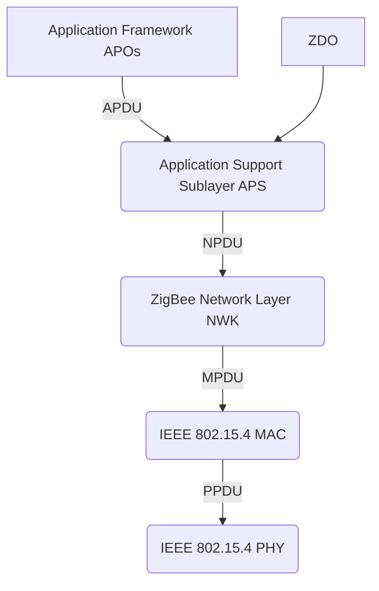

# Livello MAC e Reti WSN

## 1. Protocolli MAC per Reti Wireless Multi-hop (Lezione 17)

### Il problema dell'efficienza energetica

Nei sistemi IoT e nelle reti di sensori wireless, il protocollo MAC non ha come unico obiettivo l'arbitrazione dell'accesso al mezzo: deve minimizzare il consumo energetico. Il radio transceiver è il componente più energivoro; la strategia fondamentale è ridurne il **duty cycle** (la frazione di tempo in cui rimane attivo).

> [!tip] Intuizione chiave
> Un nodo con la radio sempre accesa scarica la batteria rapidamente. Un nodo con la radio sempre spenta risparmia energia ma non può comunicare. Il protocollo MAC deve trovare il compromesso tra energia, latenza e banda.

Approcci per ridurre il consumo:

| Approccio | Descrizione | Esempi |
|---|---|---|
| Sincronizzazione dei nodi | I nodi si svegliano contemporaneamente | S-MAC, IEEE 802.15.4 |
| Preamble sampling | Preambolo lungo, campionamento periodico | B-MAC, X-MAC, BoX-MAC |
| Polling | Master coordina slave tramite beacon | Bluetooth, IEEE 802.15.4 |

### Sincronizzazione: S-MAC

S-MAC (*Sensor MAC*) è progettato per reti wireless multi-hop. L'idea è che i nodi vicini si accordino su un periodo di ascolto condiviso per poi tornare in sleep.
- **Sincronizzazione locale**: Ogni nodo trasmette frame SYNC in broadcast per annunciare la propria schedule. Nodi adiacenti adottano schedule comuni creando "isole di sincronizzazione".
- **Comunicazione**: Un nodo trasmette durante il periodo di ascolto del ricevitore. Esegue il carrier sense (RTS/CTS) prima di trasmettere. S-MAC usa l'*adaptive duty cycle*: se un nodo sente un RTS/CTS, mantiene la radio accesa per velocizzare i salti multi-hop.

*Fig. — Il frame Sync e Data trasmessi nel periodo di attività.*

*Fig. — Consumo energetico totale in funzione del traffico.*

**Latenza multi-hop e Clock Drift:** La latenza si accumula (proporzionale a $n \times T_{listen\_period}$) se le schedule nei salti successivi non sono allineate. Per contrastare il clock drift (deriva hardware), i frame SYNC periodici mantengono i nodi allineati nel tempo.

### Preamble Sampling: B-MAC

B-MAC (*Berkeley MAC*) elimina la necessità di coordinazione temporale sfruttando il *Low-Power Listening* (LPL). Il ricevitore attiva la radio periodicamente per brevissimi istanti per campionare il canale. Il mittente, quando deve trasmettere, invia un preambolo molto lungo (la cui durata deve essere superiore al periodo di sleep del ricevitore) seguito dal frame dati.

**Modello energetico**:
Siano:
- $f_d$ = frequenza di trasmissione dei dati (Hz)
- $f_c$ = frequenza di campionamento del preambolo
- $p_t, p_r, p_i$ = potenza in trasmissione, ricezione, idle.

Per il **trasmittente**, il duty cycle è:
$$DC_{data} = f_d \cdot (t_{preamble} + t_{frame})$$
$$DC_{check} = f_d \cdot t_{check}$$
L'energia consumata in $t$ secondi:
$$E_T(t) = t \left[ p_t \cdot DC_{data} + p_r \cdot DC_{check} + p_i \cdot (1 - DC_{data} - DC_{check}) \right]$$

Per il **ricevitore**:
$$DC_{data} = f_c \cdot (t_{listen} + t_{data})$$
$$DC_{check} = f_c \cdot t_{check}$$
$$E_R(t) = t \left[ p_r \cdot DC_{data} + p_r \cdot DC_{check} + p_i \cdot (1 - DC_{data} - DC_{check}) \right]$$

Il preambolo lungo costa molta energia in trasmissione, ma garantisce grandissimi risparmi per tutti i ricevitori in ascolto, che necessitano di campionamenti piccolissimi. B-MAC ha un solo parametro di setup: l'intervallo di check.

### Evoluzioni: X-MAC e BoX-MAC

**X-MAC**: Ottimizza il costo in trasmissione dividendo il lungo preambolo in brevi frame ripetuti contenenti l'ID del destinatario. Quando il ricevitore si sveglia e legge il proprio ID, interrompe immediatamente il trasmettitore inviando un ACK precoce, spingendolo a inviare il frame effettivo e risparmiando energia.

**BoX-MAC**: Un'ulteriore evoluzione in cui il "preambolo" diventa il frame dati stesso, ripetuto in loop. Il ricevitore intercetta un frammento, aspetta l'inizio della replica successiva, la riceve per intero e manda l'ACK per fermare il mittente. È eccellente per reti di sensori che scambiano frame molto leggeri.

### Polling

Tipico di Bluetooth e **IEEE 802.15.4** (combinato con la sincronizzazione). L'architettura è asimmetrica: un nodo master annuncia messaggi pendenti tramite *beacon*, i nodi slave possono tenere la radio spenta a piacimento e si svegliano per prelevare il messaggio dal master inviando una richiesta esplicita.

***

## 2. Lo Standard IEEE 802.15.4 (Lezione 18)

Fornisce le specifiche del **Physical layer** e del **MAC layer** per reti **LR-WPAN** (Low-Rate Wireless Personal Area Network). Opera con dispositivi a risorse limitate, garantendo consumi ridotti, coesistenza con Wi-Fi (802.11) e Bluetooth (802.15.1).

### Physical Layer

Opera in bande libere da licenza:
| Banda | Regione | Data rate | Canali |
|---|---|---|---|
| 868–868.6 MHz | Europa | 20 kbps | 1 (canale 0) |
| 902–928 MHz | Nord America | 40 kbps | 10 (canali 1–10) |
| 2400–2483.5 MHz | Mondiale | 250 kbps | 16 (canali 11–26) |

Eroga *Data Service* per ricezione/trasmissione e *Management Service* per funzioni fisiche:
- **Energy Detection (ED)**: Misura l'energia sul canale (su una finestra di 8 simboli) con soglia di 10 dB sopra la sensibilità radio.
- **Link Quality Indicator (LQI)**: Stima della qualità del frame ricevuto per alimentare le logiche di routing.
- **Clear Channel Assessment (CCA)**: Verifica se il canale è libero tramite 3 modalità (tramite ED, tramite Carrier Sense, o combinazione logica).

![[Pasted image 20260408111308.png]]
*Fig. — L'ottima resistenza di 802.15.4 al rumore (BER vs SNR).*

**Struttura della PPDU** (PHY Protocol Data Unit):
- *SHR*: Synchronization Header (preambolo e SFD).
- *PHR*: PHY Header (lunghezza, max 127 byte).
- *PHY Payload*: PSDU.

### MAC Layer: Dispositivi e Topologie

Esistono due classi di nodi:
- **RFD (Reduced Function Device)**: Logica minima, destinato agli end-device (sensori). Può associarsi a un solo nodo padre FFD.
- **FFD (Full Function Device)**: Logica MAC completa. Può agire da Router, da *PAN Coordinator* (che crea la rete) o da end-device generico.

Le topologie supportate sono **Stella** (Coordinator al centro, comunicazioni dirette solo verso di lui) e **Peer-to-Peer** (FFD connessi in mesh/albero, RFD appesi come foglie).

### Accesso al Canale e Superframe

**Modalità Beacon-Enabled**:
Il coordinatore trasmette beacon periodici definendo un **Superframe**. Il superframe è diviso in periodo attivo (in cui si comunica) e inattivo (tutti in sleep).
Il periodo attivo contiene fino a 16 slot suddivisi in:
- **CAP (Contention Access Period)**: accesso tramite *slotted CSMA-CA*.
- **CFP (Contention Free Period)**: opzionale, slot garantiti **GTS** assegnati a dispositivi specifici per determinismo temporale.

> [!warning] Il CAP non può essere eliminato
> Il CAP è indispensabile per gestire messaggi asincroni (associazioni, richieste GTS) e deve esistere anche se è presente il CFP.

**Modalità Non Beacon-Enabled**:
Nessun superframe. Usa **unslotted CSMA-CA**. I coordinatori devono restare sempre accesi. L'end-device preleva dati tramite polling al coordinatore.

### Associazione e Sicurezza
Il MAC fornisce una suite di primitive: `DATA`, `ASSOCIATE`, `SCAN`, `GTS`, `POLL`.
L'associazione si basa su: Scansione (`SCAN`), richiesta dell'end-device al PAN Coordinator (`ASSOCIATE.request`), accettazione del coordinatore con assegnazione di short address a 16-bit (`ASSOCIATE.response` via polling indiretto).

A livello MAC è integrato il supporto base per la sicurezza (chiavi simmetriche fornite dal network layer): controllo accessi, cifratura dati (link o group key), integrità e "Sequential Freshness" per evitare attacchi di replay.

***

## 3. Lo Standard ZigBee: Network Layer (Lezioni 9)

ZigBee è il protocollo delle reti IoT concepito dalla *ZigBee Alliance* su basi IEEE 802.15.4, offrendo self-healing, basso costo, lunga durata batterie e scalabilità. Costruisce sopra PHY e MAC i propri **Network (NWK)** e **Application Layer**.

![[Pasted image 20260309111850.png]]
![[Pasted image 20260309111918.png]]

![[Pasted image 20260309111946.png]]

### Formazione della Rete e Indirizzamento ad Albero
La rete ha tre ruoli logici: **Network Coordinator** (FFD, crea la rete), **Router** (FFD, instrada traffico), **End-Device** (RFD/FFD).
La creazione della PAN (*Network Formation*) è eseguita dal Coordinator con un energy/active scan per trovare canali liberi. Sceglie un PAN ID, si autoassegna l'indirizzo $0\times0000$ e avvia i beacon.

L'**ingresso** in rete avviene tramite *Join through Association* (device avvia scansione e si associa al padre) oppure *Direct Join* (un nodo forza l'aggregazione al figlio conosciuto).

**Allocazione degli Indirizzi (Tree Structure)**:
ZigBee pre-distribuisce blocchi di indirizzi per assegnazioni veloci e scalabili, evitando collisioni. I parametri hardware del coordinator sono fissi: $R_m$ (max router figli), $D_m$ (max end-device figli), $L_m$ (profondità massima albero).
La grandezza del blocco per un router a profondità $d$ è $C_{skip}(d)$:
$$
C_{skip}(d) = \begin{cases} 1 & \text{se } d = L_m \\ 1 + R_m \cdot C_{skip}(d+1) + D_m & \text{altrimenti} \end{cases}
$$
I figli router riceveranno gli indirizzi saltando segmenti pari a $C_{skip}(d+1)$.

### Routing
ZigBee supporta instradamento differenziato, e le logiche possono coesistere:
- **Tree Routing**: segue i rami logici dell'albero formati in fase di join. È compatibile col beaconing ma può usare cammini non ottimali.
- **Mesh Routing**: ispirato ad AODV. Usa la **Routing Table** per inoltri diretti. In caso di rotta mancante, usa il *Route Discovery Protocol* diffondendo in broadcast messaggi `RREQ` per trovare la destinazione. Il `RREP` torna indietro memorizzando il "Residual Cost" nelle routing table. Molto flessibile e robusto, ma non permette una rete globalmente sincronizzata a superframe.

***

## 4. Application Layer: ZDO, APS e ZCL (Lezione 12)

![[Pasted image 20260317144430.png|412]]

Il livello Applicativo poggia su tre pilastri:
1. **Application Framework ed Endpoints**: Fino a 240 applicazioni coesistenti (APO) su un singolo device. Ogni applicazione risiede in un endpoint numerato da 1 a 240. L'Endpoint 0 è sempre fisso e riservato al componente ZDO.
2. **ZigBee Device Object (ZDO)**: È il manager che controlla localmente la logica della rete: offre i servizi di *Device e Service Discovery* all'utente, gestisce le direttive di *Binding* e assicura il *Node Management* secondo il proprio ruolo hardware.
3. **Application Support Sublayer (APS)**: È il "Transport layer" di ZigBee. Filtra indirizzi, assicura la ricezione tramite conferme applicative end-to-end, e memorizza le tabelle multicast (Group Management).

### La ZigBee Cluster Library (ZCL) e i Profili
Un **Cluster** è l'unità base funzionale: definisce formalmente i **Comandi** attuabili e gli **Attributi** di stato esposti. È identificato da 16-bit (es. OnOff Cluster $0\times0006$).
Un **Application Profile** raggruppa comportamenti per interoperabilità (es. Home Automation `0104`).
*Device IDs* identificano visivamente il dispositivo (una lampadina o termostato) ma NON servono per il Service Discovery.

La **ZCL** è un archivio enorme di cluster pre-confezionati dalla ZigBee Alliance per evitare che le industrie reinventino la logica applicativa. Supporta un'architettura **Client/Server** in cui il *Dynamic Attribute Reporting* spinge in automatico le variazioni al client risparmiando l'energia di un continuo polling in lettura.

### APS Binding e Indirizzamento Indiretto
Il **Binding** (servito dal livello APS) crea una connessione virtuale persistente tra un cluster su un nodo e uno remoto, pur non conoscendone le coordinate logiche a priori. Dispositivi basici si limitano a inviare dati verso un endpoint generico. L'APS layer sfrutta la **Binding Table** combinata con l'**Address Map Table** (che fissa la traduzione tra indirizzo fisico MAC e quello volatile NWK 16-bit) per instradare a livello software il pacchetto. Anche in caso di riavvio logico della rete, il ponte applicativo non si spezza mai.

![[Pasted image 20260317150017.png]]

**Esempio Applicativo (Indoor Localization)**:
Tramite l'analisi dell'RSSI radio è supportato il *Remote Positioning* (le ancore recepiscono e computano i segnali mobili) o il *Self Positioning* (il mobile triangola i fari delle ancore). In ZigBee, tramite l'*RSSI Location Cluster*, paradossalmente il nodo mobile si atteggia a "Server" del Cluster, in quanto sorgente dei dati logici, e il nodo ancorato legge come "Client".

***

## 5. ZigBee Security (Lezione 13)

ZigBee definisce un framework imperativo basato su: *key establishment*, *key transport*, *frame protection* e *device management*. La logica fondamentale prevede che **il livello che origina il messaggio debba essere colui che provvede alla messa in sicurezza**. Quasi tutto il traffico subisce cifratura a livello NWK per proteggere dal "theft of service" (tranne i fisiologici messaggi aperti per l'associazione iniziale). Il framework impone severe routine di gestione per le perdite di sincronizzazione crittografiche o overflow.

### Architettura di Sicurezza
- **NWK Layer**: Si assicura che ogni hop sia cifrato e integro e inserisce contatori anti-replay (*Freshness*).
- **APS Layer**: Eroga i servizi crittografici veri e propri, cifra carichi di lavoro end-to-end e trasporta in via logica le chiavi.
- **ZDO**: Il manager strategico che dirige le policy e ordina all'APS le manovre da fare.

**Chiavi a 128-bit**:
1. **Network key**: Usata su base collettiva.
2. **Link keys**: Sessioni dirette tra un nodo A e un nodo B (per comunicazioni esclusive).
3. **Master key**: Non è usata per cifrare traffico dati vivo, ma viene sfruttata da algoritmi hash unidirezionali per generare in autonomia nuove Link Keys.

### Symmetric-Key Key Establishment (SKKE) e Trust Center
SKKE è il processo gestito dal livello APS che permette a due nodi di ricavare una nuova Link Key per derivazione tramite una sequenza *challenge-response* di scambio di numeri effimeri aleatori e hash applicati a un pre-segreto (Trust Provisioning). I nodi derivano la chiave, poi confermano per scrupolo di aver ottenuto lo stesso match.

In ogni rete blindata c'è e deve esserci **un solo Trust Center** designato, autorizzato a validare l'ingresso nella rete e ad erogare centralmente il materiale crittografico ai nodi al momento del *join* (sfruttando chiavi Master per aprire prima tunnel provvisori se necessario). Nelle reti domestiche, le funzioni del Trust Center sono semplicemente incluse e assorbite dal Coordinator.

***
> [!summary] Domande d'esame e Concetti Chiave di Riepilogo
> - Compromesso MAC: energia vs. latenza e throughput. Differenza tra Sync (S-MAC), Preamble Sampling (B-MAC, X-MAC, BoX-MAC) e Polling.
> - B-MAC: necessità di un preambolo più lungo della finestra di sleep. X-MAC riduce il tempo interrompendolo al read dell'ID; BoX-MAC ripete in catena il pacchetto stesso.
> - IEEE 802.15.4: Bande libere (es. 2.4 GHz globale). Ruoli (FFD, RFD). Formato superframe: l'indispensabilità del CAP a prescindere dal CFP/GTS. Protocollo di Associazione MAC.
> - Architettura ZigBee: I tre livelli superiori (NWK, ZDO, APS, Application Framework). $C_{skip}(d)$ nell'indirizzamento ad albero statico. Mesh Routing (RREQ/RREP stile AODV) contro Tree Routing (supporta beaconing ma rotta fissa).
> - ZDO (Endpoint 0), ZCL e Profiling. Il binding indiretto tramite APS. Il concetto di Client/Server nel Reporting dinamico.
> - Sicurezza NWK e Trust Center univoco in rete per distribuzione e validazione delle chiavi crittografiche (Network, Link e Master Key). SKKE challenge-response.
