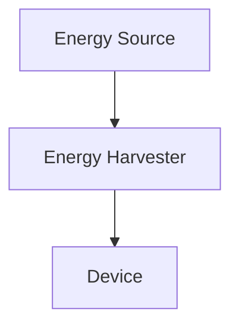
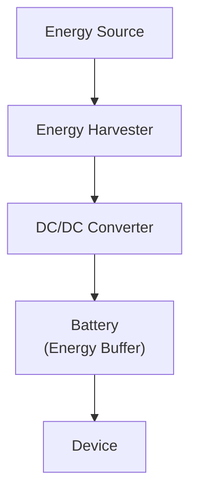
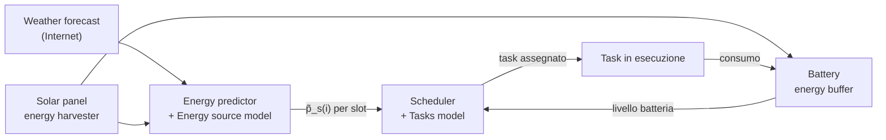
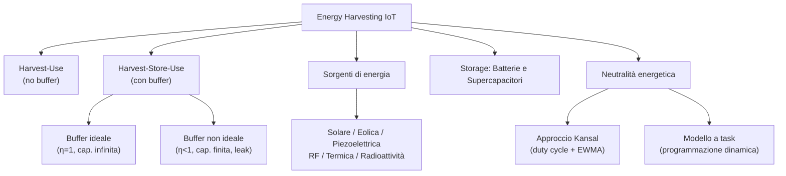

# Gestione Energetica: Energy Harvesting e Neutralità

Il problema di fondo dei dispositivi IoT è energetico: alimentarli con una batteria di capacità finita costringe a scegliere tra prestazioni e durata. Una batteria grande permette lunga vita, ma aumenta dimensioni, peso e costo; un processore a basso consumo estende la vita ma limita potenza di calcolo e portata radio. L'**energy harvesting** (raccolta di energia) rappresenta un'alternativa strutturale: invece di ottimizzare il consumo, si raccoglie energia dall'ambiente e si elimina — o si riduce drasticamente — il vincolo della batteria finita.

Se la sorgente è abbondante e disponibile in modo continuo o periodico, il dispositivo può funzionare «per sempre». Questa prospettiva sposta l'obiettivo del progettista dalla massimizzazione della vita utile alla massimizzazione delle prestazioni a parità di disponibilità energetica.

***

## Definizioni fondamentali

Tre concetti strutturano l'intero dominio:

- **Energy source** (sorgente di energia): la fonte primaria (sole, vento, vibrazioni, ecc.) da cui l'energia viene estratta.
- **Harvesting source** (tecnologia di raccolta): il componente fisico — cella solare, turbina, cristallo piezoelettrico, antenna — che converte la sorgente in energia elettrica. La produzione varia nel tempo e in funzione delle condizioni ambientali, ed è generalmente al di fuori del controllo del progettista.
- **Load** (carico): l'energia consumata dal dispositivo per le proprie attività. Un dispositivo IoT ha molteplici sottosistemi (processore, radio, storage, trasduttori/ADC), ciascuno con stati propri e consumi differenti; il carico varia quindi nel tempo a seconda delle attività in esecuzione.

> [!definition] Harvesting System
>
> Un sistema che supporta un carico variabile alimentato da una sorgente di harvesting variabile, anche quando la potenza istantanea della sorgente non corrisponde al carico.

Il problema chiave è il **disaccoppiamento** tra produzione e consumo: la sorgente produce quando l'ambiente lo consente, il dispositivo consuma quando deve eseguire i propri task.

Esistono due approcci principali per adeguare produzione e consumo:
1. **Adattare il carico** alla disponibilità energetica — ad esempio riducendo la frequenza di campionamento.
2. **Usare un buffer energetico** — una batteria ricaricabile o un supercapacitore che accumula l'eccesso e lo cede nei momenti di deficit.

In pratica nessuno dei due approcci è sufficiente da solo: il carico non può essere ridotto arbitrariamente senza compromettere la funzionalità, e il buffer è fisicamente limitato e non ideale (ha perdite ed efficienza di carica $< 1$).

***

## Architetture di harvesting

### Harvest-Use

*Fig. — Architettura Harvest-Use: la sorgente alimenta direttamente il dispositivo senza buffer.*

Nell'architettura **Harvest-Use** l'energia è raccolta esattamente quando serve. Non esiste un buffer: la potenza prodotta $P_s(t)$ viene consumata istantaneamente. Il dispositivo è operativo solo se:

$$P_s(t) \geq P_c(t)$$

Questo comporta due forme di spreco:
- Quando $P_s(t) < P_c(t)$: il dispositivo si spegne per mancanza di energia.
- Quando $P_s(t) > P_c(t)$: l'eccesso $P_s(t) - P_c(t)$ va perduto.

### Harvest-Store-Use

*Fig. — Architettura Harvest-Store-Use: l'energia in eccesso viene accumulata nel buffer e prelevata nei momenti di deficit.*

Nell'architettura **Harvest-Store-Use** l'energia raccolta viene immagazzinata nel buffer ogni volta che è disponibile e prelevata quando la produzione è insufficiente o i task del dispositivo richiedono più energia. Il buffer disaccoppia temporalmente produzione e consumo.

#### Buffer ideale e non ideale

Un buffer ideale ha capacità infinita, nessuna perdita ed efficienza di carica $\eta = 1$. Il dispositivo è sempre operativo se la carica prodotta più quella iniziale eccede il consumo per ogni intervallo:
$$\int_0^T P_c(t)\,dt \leq \int_0^T P_s(t)\,dt + B_0 \qquad \forall T \in (0, \infty)$$

Un buffer reale ha capacità massima $B_{\mathrm{max}}$, efficienza $\eta < 1$ e potenza di leakage $P_{\mathrm{leak}}(t)$. La carica $B_T$ al tempo $T$ deve soddisfare:
**Conservazione dell'energia (necessaria e sufficiente):**
$$B_T = B_0 + \eta\int_0^T [P_s - P_c]^+\,dt - \int_0^T [P_c - P_s]^+\,dt - \int_0^T P_{\mathrm{leak}}\,dt \geq 0$$

**Capacità finita (sufficiente, non necessaria):**
$$B_{\mathrm{max}} \geq B_0 + \eta\int_0^T [P_s - P_c]^+\,dt - \int_0^T [P_c - P_s]^+\,dt - \int_0^T P_{\mathrm{leak}}\,dt$$

> [!example] Esercizio sul buffer non ideale
> Dispositivo con $\eta = 95\%$, $B_0 = 400\,\mathrm{mAh}$, leakage trascurabile.
> Intervallo $[0, 4s]$: $P_s = 80\,\mathrm{mA}$, $P_c = 150\,\mathrm{mA}$. Consumo supera produzione.
> Produzione = $0.089\,\mathrm{mAh}$, Consumo = $0.167\,\mathrm{mAh}$. $B_4 = 400 + 0.089 - 0.167 = 399.922\,\mathrm{mAh}$
> Intervallo $[4s, 10s]$: $P_s = 80\,\mathrm{mA}$, $P_c = 20\,\mathrm{mA}$. Produzione supera consumo.
> Produzione = $0.133\,\mathrm{mAh}$, Consumo = $0.033\,\mathrm{mAh}$. $B_{10} = 399.922 + 0.95(0.133 - 0.033) = 400.017\,\mathrm{mAh}$

***

## Fonti di energia e classificazione

Le sorgenti si classificano su due assi: **controllabilità** e **prevedibilità**.

| Controllabilità | Descrizione | Esempi |
|---|---|---|
| Completamente controllabile | L'energia è disponibile su richiesta | Torcia shake-to-power, sorgenti RF dedicate |
| Parzialmente controllabile | Influenzabile ma non deterministica | Tag RFID in ambiente RF non uniforme |
| Non controllabile | Raccolta solo quando disponibile | Sole, vento, termica ambientale |

Le sorgenti non controllabili si classificano in prevedibili (sole) e non prevedibili (vibrazioni sismiche). La prevedibilità è fondamentale per la pianificazione energetica.

### Dettaglio delle Tecnologie
- **RF harvesting**: I tag RFID passivi si alimentano esclusivamente con l'energia RF del reader.
- **Piezoelettrico**: Converte deformazione meccanica in differenza di potenziale (es. solette per scarpe, pulsanti wireless).
- **Energia solare ed Eolica**: Il sole produce in modo dipendente da latitudine, meteo e stagioni, con forte variabilità. La combinazione sole-vento (vento notturno, sole diurno) aumenta la copertura temporale, sebbene un harvesting non garantisca l'operatività continua per casi peggiori se mal dimensionati.

### Tecnologie di storage

- **Batterie Li-ion**: Preferite per l'IoT grazie a efficienza altissima (99.9%), bassissimo self-discharge e alta densità.
- **Supercapacitori**: Ricariche infinite, efficienza elevata. Ideali con energia disponibile a intervalli o forte jitter, tenuti carichi con trickle charge.

***

## Misurare la carica e la produzione

Tutte le tecniche di power management richiedono info fresche sulla carica della batteria e la produzione.

La tensione a circuito aperto di una batteria decresce in modo circa **lineare** nel range operativo.

Tramite un ADC a $d$ bit si legge la tensione per risalire alla carica:
$$x_{\mathrm{max}} = 2^d - 1 \qquad x_{\mathrm{min}} = \mathrm{ROUND}\!\left(\frac{v_{\mathrm{min}}}{v_{\mathrm{ref}}}(2^d - 1)\right)$$
$$x = \mathrm{ROUND}\!\left(\frac{v}{v_{\mathrm{ref}}}(2^d - 1)\right)$$
$$B = B_{\mathrm{min}} + \frac{B_{\mathrm{max}} - B_{\mathrm{min}}}{x_{\mathrm{max}} - x_{\mathrm{min}}}(x - x_{\mathrm{min}})$$

> [!example] Esercizio — Stima della carica da output ADC
> ADC a 10 bit, max carica 2000 mAh a 10V (batteria piena). A 8V residuo 200 mAh (min).
> Con $d = 10$ bit si ha $2^d - 1 = 1023$ e $v_{\mathrm{ref}} = 10\,\mathrm{V}$.
> $x_{\mathrm{max}} = 1023$, $x_{\mathrm{min}} = 818$.
> Se ADC è 920: $B = 200 + \frac{920 - 818}{1023 - 818} \cdot 1800 \approx 1096$ mAh.
> Se ADC è 830: $B = 200 + \frac{830 - 818}{1023 - 818} \cdot 1800 \approx 305$ mAh.
> Se ADC è 1023: $B = 2000$ mAh.

***

## Neutralità energetica e Approccio di Kansal

> [!definition] Dispositivo energy-neutral
> Un dispositivo è **energy neutral** se riesce a mantenere il livello di prestazione desiderato indefinitamente, senza mai esaurire la batteria.

L'obiettivo è triplice: rimanere energy neutral, evitare lo spegnimento e **massimizzare la utility**. 

Kansal affronta il problema per sorgenti **non controllabili ma prevedibili** (es. solare), modulando dinamicamente il duty cycle del dispositivo tramite pianificazione slottata.

### Modello Formale: le Due Condizioni

**Condizione 1 — Produzione di Energia:**
L'energia totale $E_T = \int_T P_s(t) \, dt$ è bounded da un corridoio lineare:
$$\rho_s \cdot T - \sigma \leq E_T \leq \rho_s \cdot T + \sigma$$
Dove $\rho_s$ è il trend medio e $\sigma$ il burst bound.

**Condizione 2 — Consumo (Load):**
Il consumo $L_T = \int_T P_c(t) \, dt$ è bounded dall'alto:
$$0 \leq L_T \leq \rho_c \cdot T + \delta$$

> [!theorem] Teorema di Kansal (Condizione sufficiente)
> Se le due condizioni valgono, con efficienza di carica $\eta$ e leakage $\rho_{leak}$, il sistema è energy neutral se:
> 1. $\eta \rho_s \geq \rho_c + \rho_{leak}$ (trend di produzione copre consumo e perdita)
> 2. $B_0 \geq \eta\sigma + \delta$ (carica iniziale sufficiente ai burst)
> 3. $B_{max} \geq B_0$ (ammissibilità fisica)

### Utility e Duty Cycle

Il sistema modula il **duty cycle (dc)** per limitare il consumo e massimizzare una funzione **utility $u(dc)$**:

$$u(dc) = \begin{cases} 0 & \text{se } dc < dc_{min} \\ \alpha \cdot dc + \beta & \text{se } dc_{min} \leq dc \leq dc_{max} \\ u_M & \text{se } dc > dc_{max} \end{cases}$$

Il consumo di potenza si modella come lineare $p(dc) = \rho \cdot dc + \sigma$.

### Previsione: EWMA
Si utilizza il filtro **EWMA** per stimare la produzione slot per slot:
$$\tilde{p}_{j+1}(i) = \alpha \cdot p_j(i) + (1 - \alpha) \cdot \tilde{p}_j(i)$$
La produzione di oggi aiuta a stimare quella di domani. L'errore è più alto attorno a mezzogiorno, ma in generale la produzione solare è ripetibile giorno per giorno.

### L'Algoritmo di Kansal

Assegnazione iniziale: per gli slot "di sole" ($S$, in cui produzione $\ge p_{max}$) il dc è $dc_{max}$. Negli slot "bui" ($D$, produzione $< p_{max}$) il dc è $dc_{min}$. 
Poi si calcola il **surplus residuo** $p_{res} = B(k+1) - B(1)$.

1. **Caso 1 — Sovraproduzione ($p_{res} > 0$):**
   Usa l'energia avanzata per alzare al massimo il dc dei dark slot, uno per volta. Il residuo finale alza parzialmente l'ultimo dark slot toccato.
2. **Caso 2 — Sottoproduzione ($p_{res} < 0$):**
   Manca energia. Controlla che una riduzione uniforme sui sun slot ($|p_{res}|/|S|$) basti (entro $p_{max} - p_{min}$). Se sì, abbassa uniformemente il duty cycle in tutti i sun slot.

> [!tip] Proprietà
> È ottimale, semplice, leggero. Se la produzione reale differisce, lo scheduler riadatta la pianificazione dinamicamente per i restanti slot. Limite: si modella solo il dc, ma non scelte tra trasduttori, protocolli, algoritmi.

#### Esercizio Risolto 1 (Surplus)
Dati: $dc_{max}=90\%, p_{max}=5, u=100$; $dc_{min}=50\%, p_{min}=1, u=10$. Formule: $p(dc)=0.1\cdot dc - 4$, $u(dc)=2.25\cdot dc - 102.5$.
Slot $\tilde{p}_s = [0, 0, 0, 2, 6, 11, 10, 7, 3, 0, 0, 0]$.
Slot di sole ($S$): 5, 6, 7, 8 (qui partono a $p_{max}=5$). Gli altri partono a $p_{min}=1$.
Prodotto = 39. Consumato = $8 \times 1 + 4 \times 5 = 28$. $p_{res} = 11 > 0$.
$p_{diff} = 4$. Con 11 surplus, posso portare $11//4 = 2$ dark slot (1 e 2) al massimo. Restano 3 di surplus, usati per lo slot 3, portandolo a un consumo di $1+3=4$.
Per lo slot 3, il $dc = (4+4)/0.1 = 80\%$, $u = 77.5$.

#### Esercizio Risolto 2 (Deficit)
Stessi dati base, ma $p_{min}=2$. Nuove formule: $\rho=0.075, \sigma=-1.75$.
Slot $\tilde{p}_s = [0, 0, 1, 3, 5, 8, 4, 3, 2, 0, 0, 0]$.
Slot di sole: 5, 6. Gli altri a $p_{min}=2$. 
Prodotto = 26. Consumato = $10 \times 2 + 2 \times 5 = 30$. $p_{res} = -4 < 0$.
Controllo ammissibilità: $(5-2) > 4/2 \rightarrow 3 > 2$. Ammissibile.
Abbasso consumo dei sun slot di $|p_{res}|/|S| = 4/2 = 2$. Consumo dei sun slot diventa $5-2=3$.
$dc$ dei sun slot: $dc = (3+1.75)/0.075 = 63.3\%$. L'utility è $42.4$.

***

## Modello Task-Based per la Neutralità Energetica

Kansal non modella la complessità di vere applicazioni IoT che hanno diverse fasi (Sensing $\rightarrow$ Storing $\rightarrow$ Processing $\rightarrow$ Transmitting) ciascuna con diverse opzioni (trasduttori vari, invio grezzo o elaborato, frequenze). Si passa quindi al concetto di **Task**, cioè una combinazione di opzioni, con costo energetico $c_j$ e utility $u_j$.

*Fig. — Architettura del sistema task-based.*

### Formulazione e Programmazione Dinamica
Lo scheduler assegna **esattamente un task per slot** ($x_{i,j}=1$), massimizzando l'utility totale $\sum \sum x_{i,j} u_j$ sotto i vincoli che la batteria non si esaurisca mai e alla fine della giornata il livello non sia inferiore a quello iniziale ($B(k+1) \ge B(1)$).

Il problema è **NP-Hard** ma si risolve in modo esatto in tempo **pseudo-polinomiale** usando la programmazione dinamica, esplorando a ritroso (backward) gli slot $i$ e i livelli di batteria discretizzati $b$:

$$opt(i, b) = \max_{j=1,\ldots,n} \{u_j + opt(i+1, B^j(i+1)) : B^j(i+1) \geq B_{min}\}$$

La complessità temporale è $O(k \cdot \text{BatteryLevels})$. Discretizzando la batteria in ~200 livelli con l'ADC, il problema si risolve in frazioni di secondo anche su Arduino, risultando perfetto per una schedulazione giornaliera.

***

## Riepilogo

> [!question] Possibili domande d'esame
> - Qual è la differenza tra architettura Harvest-Use e Harvest-Store-Use?
> - Scrivi le equazioni di conservazione dell'energia per un buffer non ideale.
> - Classifica le sorgenti per controllabilità e prevedibilità.
> - Come si stima la carica via ADC? Derivare la formula.
> - Quali sono le tre condizioni sufficienti del Teorema di Kansal per l'energy neutrality?
> - Descrivi l'algoritmo di Kansal nei casi di sovraproduzione e sottoproduzione con un esempio.
> - Descrivi la funzione utility $u(dc)$ in Kansal e calcola $\alpha, \beta$.
> - Cos'è il modello a task, come migliora Kansal e come risolve la complessità NP-Hard (Dynamic Programming)?
