# Lezione 10 - (Lab) Mobile networks

La mobilità nelle reti di telecomunicazione moderne si estende lungo un ampio spettro: dall'assenza totale di spostamento fino a scenari in cui un dispositivo attraversa reti di operatori diversi mantenendo attive le proprie sessioni. Questo capitolo analizza le architetture che rendono possibile tale mobilità — in particolare nelle reti 4G/5G — esaminando i meccanismi di registrazione, i due approcci di routing (indiretto e diretto) e le procedure di _handover_ tra stazioni base.

## Lo Spettro della Mobilità e la Home Network

Dal punto di vista infrastrutturale, la mobilità non è una proprietà binaria ma uno spettro continuo. L'estremo di maggiore interesse è l'**alta mobilità**: un dispositivo che cambia rete mantenendo attive le connessioni in corso. Per gestire questo livello di mobilità è indispensabile il concetto di **home network**: una fonte autorevole e centralizzata che registra la posizione attuale del dispositivo e dalla quale le altre entità di rete possono ottenerla.

Nelle reti cellulari **4G/5G** la home network corrisponde alla rete dell'operatore con cui l'utente ha sottoscritto il contratto (es. Verizon, Orange). Il database centrale che memorizza identità e servizi abilitati è l'**Home Subscriber Server (HSS)**. L'identità globale del dispositivo è codificata nella **SIM card**.

Quando il dispositivo lascia la copertura del proprio operatore entra in una **visited network** (roaming). La rete visitata ha accordi commerciali con altre reti per garantire accesso ai dispositivi in transito. Durante le operazioni in roaming il dispositivo mantiene il proprio indirizzo permanente associato alla home network, ma ottiene temporaneamente un indirizzo IP locale nel range della rete visitata, tipicamente assegnato tramite NAT.

## Routing Indiretto (Triangle Routing)

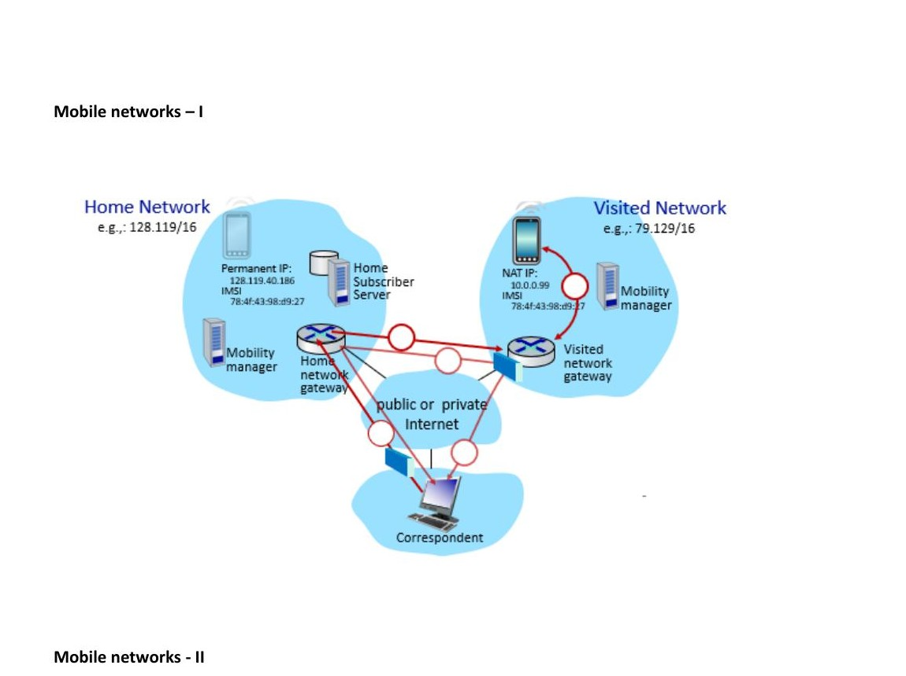

Nel **routing indiretto** (o *triangle routing*) — modalità standard per le reti 4G LTE e per Mobile IP — l'idea di base è che quando il Correspondent vuole inviare dati al dispositivo mobile:

1. Il Correspondent invia il pacchetto all'**indirizzo permanente** del mobile, che appartiene alla home network.
2. Il **Home network gateway** (o P-GW) riceve il pacchetto, lo **incapsula** in un tunnel (tipicamente usando il protocollo GTP — *GPRS Tunneling Protocol*) e lo forwarda al Visited network gateway (S-GW/P-GW locale).
3. Il **Visited network gateway** decapsula il pacchetto, applica la traduzione **NAT** (perché il dispositivo ha un IP locale) e lo consegna al dispositivo.
4. Le risposte del dispositivo possono seguire il percorso inverso oppure essere inviate direttamente al Correspondent.

Il percorso forma un **triangolo**: Correspondent → Home → Visited → Mobile, anche se Correspondent e mobile fossero fisicamente vicini. Questo è il costo dell'approccio, ma il vantaggio è notevole: ogni cambio di rete visitata è completamente **trasparente** per il Correspondent. La nuova rete si registra presso l'HSS e l'endpoint del tunnel viene aggiornato silenziosamente lato home network, senza che il Correspondent debba fare nulla.

> [!note] Continuità delle sessioni TCP
>
> Quando il dispositivo si sposta in una nuova rete visitata, possono andare persi alcuni datagrammi in transito. Tuttavia le sessioni TCP rimangono attive: dal punto di vista del corrispondente, la posizione del mobile è un dettaglio interno alla home network gestito trasparentemente dal meccanismo di tunneling.

## Routing Diretto

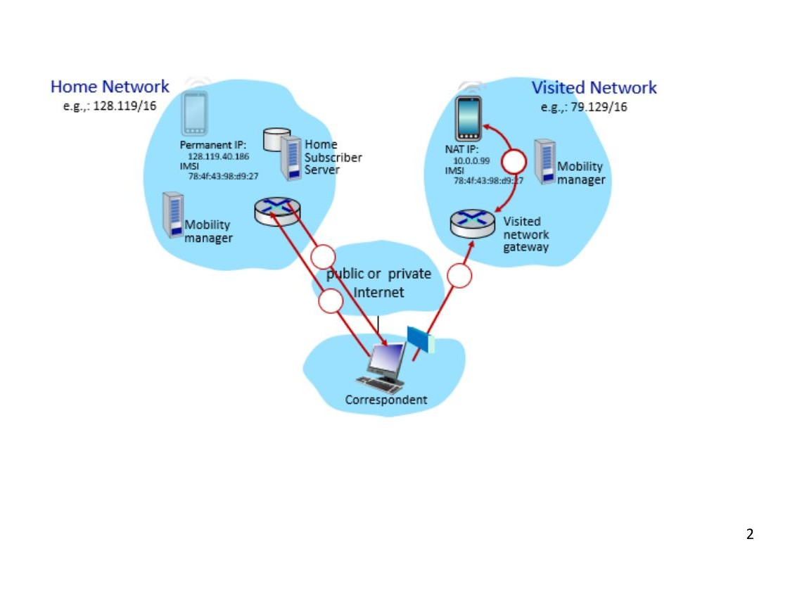

Nel **routing diretto**, l'alternativa al triangle routing per le reti mobili, il Correspondent non invia i pacchetti all'indirizzo permanente del mobile, ma ottiene prima il suo **care-of address** nella rete visitata. La procedura è la seguente:

1. Il Correspondent interroga l'**HSS** della home network (tramite un protocollo apposito) per ottenere l'indirizzo corrente del dispositivo mobile nella rete visitata (il care-of address).
2. Il Correspondent invia i pacchetti **direttamente** al care-of address nella visited network, bypassando la home network.
3. Il Visited network gateway riceve il pacchetto e lo consegna al dispositivo mobile.

**Vantaggi rispetto al routing indiretto:** il percorso è più corto (nessun triangolo), la latenza è ridotta, e non si sovraccarica inutilmente la home network.

**Svantaggi e problemi:** l'approccio **non è trasparente** per il Correspondent, che deve eseguire attivamente la query all'HSS. Inoltre, se il dispositivo cambia rete visitata durante una sessione attiva, il Correspondent ha interrogato l'HSS **solo all'inizio della sessione** e non conosce il nuovo care-of address. Servono quindi meccanismi aggiuntivi per aggiornare dinamicamente il flusso dati (es. forwarding dalla vecchia visited network alla nuova, o re-query dell'HSS), a differenza del routing indiretto dove è sufficiente cambiare l'endpoint del tunnel.

> [!tip] Confronto diretto vs indiretto
>
> | Aspetto | Routing Indiretto | Routing Diretto |
> |---|---|---|
> | Percorso pacchetti | Triangolo (via home) | Diretto alla visited |
> | Trasparenza per Correspondent | Sì | No (deve interrogare HSS) |
> | Gestione cambio rete | Automatica (re-tunnel) | Complessa (deve aggiornare il Correspondent) |
> | Latenza | Maggiore (percorso più lungo) | Minore |
> | Adottato in LTE/4G | Sì (per default) | Solo con ottimizzazione esplicita |

## L'Architettura Pratica: Mobilità nelle Reti 4G e Handover

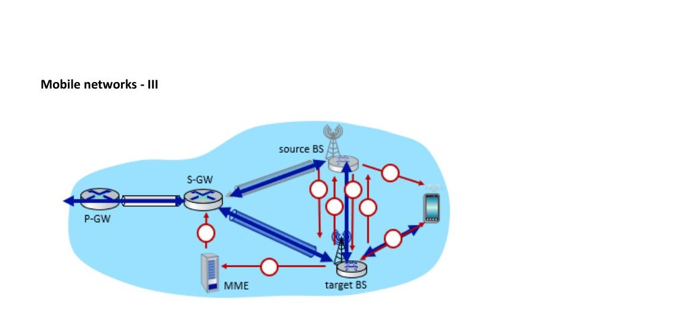

Quando un dispositivo entra in una rete 4G visitata, la gestione della mobilità e la transizione tra celle sono gestite tramite un'architettura ben definita.

**Architettura del piano dati:** quando il dispositivo è associato a una BS, il traffico dati fluisce attraverso due tunnel GTP in cascata:
- **Tunnel BS ↔ S-GW**: connette la Base Station corrente al Serving Gateway. Quando il dispositivo cambia Base Station, non occorre ricreare il tunnel — è sufficiente aggiornare l'indirizzo IP dell'endpoint sul lato BS.
- **Tunnel S-GW ↔ P-GW**: connette il Serving Gateway al PDN Gateway (il gateway verso Internet nella home network), realizzando il routing indiretto.

**Procedura di handover tra Base Station:** l'handover si attiva quando il dispositivo si sposta e la qualità del segnale sulla BS corrente degrada. La procedura completa si articola in sette passi:

1. La **source BS** rileva il degrado del segnale (o il sovraccarico) e decide di avviare l'handover. Sceglie la **target BS** (sulla base delle misure di segnale riportate dal dispositivo) e le invia una **Handover Request**.
2. La **target BS** pre-alloca le risorse radio necessarie e risponde con un **Handover Request ACK** contenente i parametri di configurazione per il dispositivo.
3. La **source BS** notifica al dispositivo il cambio imminente; da questo momento il dispositivo può già trasmettere tramite la nuova BS — dal punto di vista del dispositivo l'handover è già avvenuto.
4. La **source BS** smette di trasmettere al dispositivo e inizia a **forwardare** i datagrammi in arrivo verso la target BS (che li recapita al dispositivo via radio).
5. La **target BS** informa l'**MME** (*Mobility Management Entity*) di essere la nuova BS per il dispositivo.
6. L'**MME** istruisce lo **S-GW** di aggiornare l'endpoint del tunnel dati alla nuova target BS. La source BS riceve conferma e può liberare le proprie risorse radio.
7. Il traffico fluisce ora attraverso il **nuovo tunnel** dalla target BS allo S-GW, mentre il tunnel S-GW ↔ P-GW rimane invariato.

> [!tip] Chi decide l'handover?
>
> È un punto classico da esame: sia la decisione di avviare l'handover sia la scelta della target BS spettano alla **source BS** — non all'MME. L'MME viene coinvolto solo nella fase finale per aggiornare il piano dati. Questo riflette la separazione tra control plane (MME gestisce la mobilità a livello di rete) e data plane (le BS gestiscono la qualità del segnale radio).

```{=latex}
\newpage
```

# Software Defined Networking (SDN)

Questo paradigma architetturale segna il definitivo passaggio da un sistema di protocolli puramente distribuiti a un framework di controllo di rete completamente programmabile.

> [!definition] Software Defined Networking
>
> Il **Software Defined Networking** è un approccio alla gestione delle reti che sfrutta potenti meccanismi di astrazione per abilitare configurazioni e operazioni dinamiche ed efficienti a livello programmatico. La caratteristica distintiva è la separazione netta tra **control plane** e **data plane**.

---

## La Separazione tra Data Plane e Control Plane

> [!definition] Data Plane e Control Plane
>
> Il **Data Plane (Forwarding)** è l'atto meccanico e istantaneo di smistare ogni singolo pacchetto in transito su una porta d'uscita del router. Il **Control Plane (Routing)** è il processo decisionale, su scale temporali molto più dilatate, attraverso cui si mappa il tragitto completo sorgente-destinazione.

Nel tradizionale instradamento IP entrambi coesistono in un modello **per-router control plane** fortemente accoppiato: gli algoritmi risiedono in ogni nodo e calcolano localmente le tabelle di forwarding in modo decentralizzato. Tale struttura fu ideata per garantire resilienza, ma rende le moderne operazioni di _Traffic Engineering_ estremamente difficili. I link weight sono l'unico "manopola di controllo" disponibile. Si considerino tre scenari concreti su una rete con nodi u, v, w, x, y, z:

> [!example] Tre scenari impossibili con il routing tradizionale
>
> **Scenario 1 — Percorso specifico**: l'operatore vuole che il traffico da u a z segua il percorso u→v→w→z anziché il percorso più breve u→x→y→z. L'unica leva è ridefinire i link weight affinché l'algoritmo calcoli quella rotta — ma non esiste garanzia che il risultato sia quello voluto senza effetti collaterali sugli altri flussi.
>
> **Scenario 2 — Load balancing**: l'operatore vuole dividere il traffico da u a z equamente tra i due percorsi u→v→w→z e u→x→y→z. Non è possibile con il routing basato su destinazione: l'algoritmo converge su un unico percorso minimo.
>
> **Scenario 3 — Routing per-flusso**: il nodo w vuole instradare verso z in modo diverso il traffico blu (proveniente da u) rispetto al traffico rosso (proveniente da x). Non è possibile con il forwarding basato sulla sola destinazione (LS, DV): la decisione dipende unicamente dall'indirizzo di destinazione, non dal flusso.

---

## Il Paradigma SDN: Centralizzazione Logica e Programmabilità

La grande innovazione del SDN è il **Logically Centralized Control Plane**: un controller interroga e supervisiona remotamente la topologia globale calcolando le tabelle di forwarding per tutti i nodi. Mentre nel modello classico ogni tabella è rigidamente calcolata come $T_{i} = SPF(Topology, link\_weights)$ ignorando metriche esterne, nel modello SDN il controller calcola la funzione globale:

$$
\mathcal{F}: S(t) \rightarrow \{T_1, T_2, \ldots, T_n\}
$$

dove le tabelle di uscita derivano dallo stato $S(t)$ che ingloba in tempo reale topologia, traffico totale e vincoli di policy.

> [!important] Architettura SDN e astrazione Match-Action
>
> Il SDN poggia su pilastri imprescindibili: una demarcazione netta tra data plane e control plane; il control plane definisce il comportamento strategico della rete mentre il data plane applica le direttive ai pacchetti fisici; l'uso di switch elementari ad alte prestazioni governati tramite l'astrazione **match-action** orientata ai flussi (es. OpenFlow); il ricorso totale a protocolli aperti e programmabili.

Il controller SDN comunica su due assi. La **Southbound API** (tipicamente OpenFlow) è l'interfaccia verso il basso tra il controller e gli switch del data plane, tramite cui vengono installate le regole di forwarding nell'hardware. La **Northbound API** è l'interfaccia verso l'alto che dialoga con le applicazioni di gestione (bilanciamento, routing avanzato, access control), sviluppabili autonomamente da terze parti indipendentemente dai produttori hardware.

> [!warning] L'illusione del server singolo
>
> Sebbene logicamente centralizzato, il _SDN Controller_ è fisicamente implementato come un sistema fortemente distribuito. Ciò assicura tolleranza agli errori, elevata scalabilità e robustezza contro guasti singoli critici.

---

## Architettura SDN: I Tre Componenti

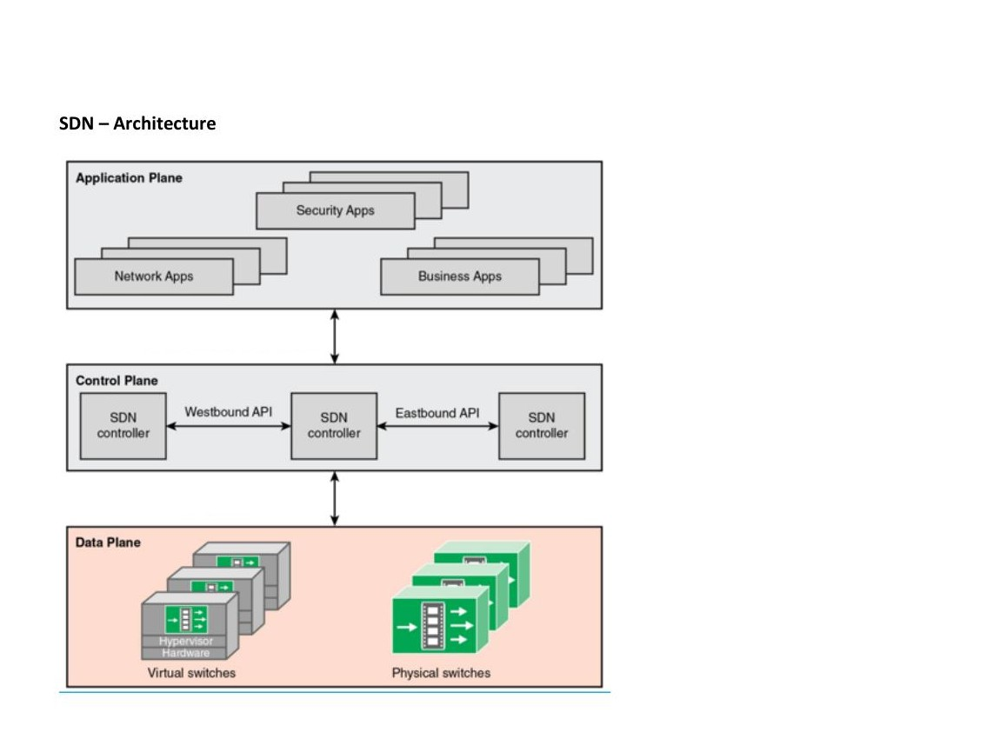

Questo schema illustra l'**architettura a tre livelli di SDN**, che realizza la separazione netta tra data plane, control plane e application plane. L'architettura si articola in tre livelli distinti con ruoli ben separati:

### Data-Plane Switches (Livello inferiore)

Contiene gli switch del data plane, che possono essere sia fisici (hardware commodity a basso costo) sia virtuali (Open vSwitch su hypervisor). Sono dispositivi semplici e veloci: il loro unico compito è applicare meccanicamente le regole di forwarding (match-action) ai pacchetti in transito secondo le flow table installate dal controller. Non calcolano nulla autonomamente. Le flow table vengono calcolate e installate da remoto dal controller, non localmente. Lo switch espone un'API standardizzata (tipicamente OpenFlow) che definisce cosa è controllabile dall'esterno e cosa no, e un protocollo per comunicare con il controller.

### SDN Controller / Control Plane (Livello centrale)

Il controller SDN svolge il ruolo di **sistema operativo di rete**: mantiene una visione aggiornata dello stato globale della rete (topologia, link attivi, tabelle di forwarding). È il punto di mediazione tra le applicazioni che esprimono policy di alto livello e gli switch che le devono applicare. Contiene il controller SDN, o meglio una **rete di controller SDN** distribuiti. Sebbene appaia come un'entità logicamente centralizzata (ha una visione globale della rete), è implementato fisicamente come sistema distribuito per garantire performance, scalabilità, tolleranza ai guasti e robustezza. Il controller mantiene: la topologia della rete, le statistiche dei flussi, i link attivi, le tabelle di forwarding. Comunica verso il basso con il Data Plane tramite la **Southbound API** (tipicamente OpenFlow), e verso l'alto con le applicazioni tramite la **Northbound API**. I controller comunicano tra loro tramite **Westbound/Eastbound API** per sincronizzare lo stato globale.

### Network-Control Applications / Application Plane (Livello superiore)

Le applicazioni di controllo (*network-control applications*) sono il vero "cervello" della rete: implementano le funzioni di controllo (routing, access control, load balancing, monitoraggio, rilevamento anomalie, …) sfruttando i servizi e le API esposte dal controller. Il punto chiave è che sono **unbundled**: possono essere sviluppate e fornite da terze parti indipendentemente dai produttori hardware e software del controller. Questo disaccoppiamento abilita un ecosistema aperto in cui l'innovazione a livello applicativo è indipendente dall'hardware sottostante. Le applicazioni esprimono policy di alto livello al controller tramite la Northbound API.

> [!note] Il valore dell'architettura a livelli
>
> La separazione in tre piani replica il principio dei livelli di astrazione di Internet. Ogni livello si può evolvere indipendentemente: nuovi algoritmi di routing nel Control Plane, nuove applicazioni nell'Application Plane, nuovo hardware nel Data Plane — senza impatto sugli altri livelli. Questo è il vantaggio principale rispetto alle reti tradizionali con logica chiusa nell'hardware proprietario.

```{=latex}
\newpage
```

# Software Defined Networking (SDN) — Architettura

Il Software Defined Networking è un paradigma architetturale che separa nettamente il **piano di controllo** (*control plane*) dal **piano dati** (*data plane*). Questa separazione permette di programmare il comportamento della rete in modo centralizzato, eliminando la rigidità dei dispositivi di rete tradizionali che incorporano sia la logica di instradamento che la funzione di forwarding. 

## Il Paradigma SDN e la Separazione dei Piani

Le funzioni di rete a livello network si dividono in due categorie temporalmente molto diverse: il **forwarding** (spostare pacchetti dall'input all'output appropriato) avviene su scala temporale dei pacchetti (*fast timescales*), mentre il **routing** (determinare il percorso dei pacchetti da sorgente a destinazione) avviene su scala degli eventi di controllo (*slow timescales*). In una rete tradizionale, queste due funzioni sono tightly coupled nello stesso dispositivo.

### Esempio di rete gestita con SDN

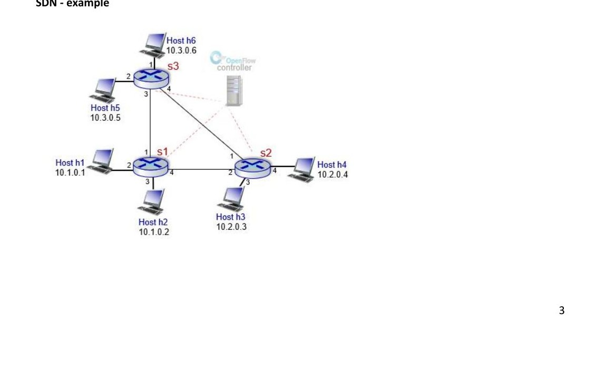

Questo schema è un esempio concreto di rete gestita con SDN per mostrare come il **control plane centralizzato** possa implementare politiche impossibili con il routing tradizionale.

Nell'architettura mostrata, il **controller OpenFlow** mantiene una visione globale della topologia: conosce tutti gli switch, tutte le loro porte, e dove si trovano i vari host. Le flow table degli switch s1, s2, s3 vengono popolate **dal controller**, non calcolate localmente dagli switch.

**Traffic Engineering con SDN:** supponiamo che il controller voglia bilanciare il traffico da h1 (10.1.0.1) verso h4 (10.2.0.4) su due percorsi:
- Percorso A: h1 → s1 → s2 → h4
- Percorso B: h1 → s1 → s3 → s2 → h4

Con il routing IP tradizionale questo è impossibile: l'algoritmo SPF converge su un solo percorso minimo. Con SDN, il controller installa regole diverse in s1 per flussi diversi (es. dividendo per porta sorgente TCP), realizzando il load balancing.

**Forwarding basato su flusso:** il controller può distinguere il traffico h1→h4 dal traffico h2→h4 e applicare politiche diverse. Ad esempio:
- Traffico h1→h4: percorso s1→s2, priorità alta
- Traffico h2→h4: percorso s1→s3→s2, priorità normale

Questo è il **routing per-flusso**, impossibile nel routing tradizionale destination-based.

**Topology discovery:** il controller scopre la topologia inviando pacchetti LLDP (*Link Layer Discovery Protocol*) tramite gli switch. Ogni switch incapsula un pacchetto LLDP e lo invia su tutte le porte; quando un altro switch lo riceve, lo invia al controller, che così ricostruisce le connessioni tra switch.

---

## Architettura SDN a Tre Livelli


L'architettura SDN è organizzata in tre livelli che realizza la separazione netta tra data plane, control plane e application plane.

**Data Plane (Livello inferiore):** contiene gli switch del data plane, che possono essere sia fisici (hardware commodity a basso costo) sia virtuali (Open vSwitch su hypervisor). Sono dispositivi semplici: il loro unico compito è applicare meccanicamente le regole di forwarding (match-action) ai pacchetti in transito secondo le flow table installate dal controller. Non calcolano nulla autonomamente. L'API per il controllo (es. OpenFlow) definisce cosa è controllabile e cosa non lo è.

**Control Plane (Livello centrale):** contiene il controller SDN, o meglio una **rete di controller SDN** distribuiti (*network operating system*). Sebbene appaia come un'entità logicamente centralizzata (ha una visione globale della rete), è implementato fisicamente come sistema distribuito per garantire tolleranza ai guasti e scalabilità. Il controller mantiene: la topologia della rete, le statistiche dei flussi, i link attivi, le tabelle di forwarding. Comunica verso il basso con il Data Plane tramite la **Southbound API** (tipicamente OpenFlow), e verso l'alto con le applicazioni tramite la **Northbound API**. I controller comunicano tra loro tramite **Westbound/Eastbound API** per sincronizzare lo stato globale.

**Application Plane (Livello superiore):** contiene le applicazioni di controllo della rete (*network-control applications*), il vero "cervello" del sistema. Sono **unbundled**: possono essere sviluppate da terze parti indipendentemente dai produttori hardware e software del controller. Esempi: load balancer, firewall, traffic engineering, monitoraggio, rilevamento anomalie. Le applicazioni esprimono policy di alto livello al controller tramite la Northbound API.

---

## SDN Data Plane

Il data plane è composto da dispositivi di forwarding — switch fisici e virtuali — che trasportano e processano i dati secondo le decisioni del control plane. 

### Forwarding Generalizzato e Match-Action

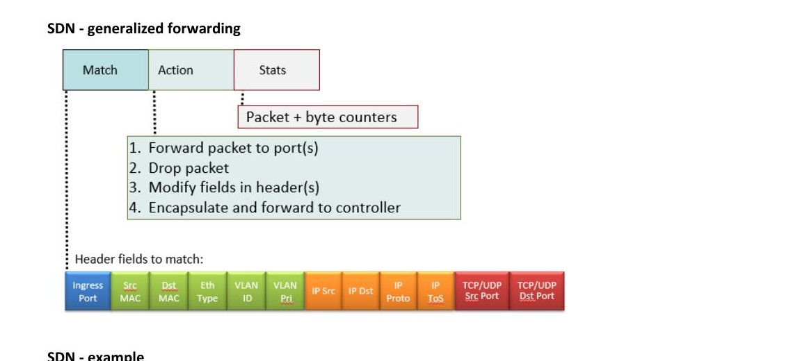

Questo schema illustra il concetto di **forwarding generalizzato** (*generalized forwarding*) in SDN, che è l'astrazione fondamentale che rende il data plane programmabile.

Nell'approccio tradizionale, i router inoltrano i pacchetti basandosi **solo sull'indirizzo IP di destinazione** (*destination-based forwarding*). OpenFlow generalizza questo concetto con l'astrazione **match-action**: ogni pacchetto viene confrontato con le regole nella flow table, e quando c'è un match, viene eseguita l'azione corrispondente.

**I campi di match** possono essere qualsiasi combinazione dei seguenti:
- Livello 1: **Ingress Port** (la porta fisica da cui è arrivato il pacchetto)
- Livello 2 (Datalink): Src MAC, Dst MAC, Eth Type, VLAN ID, VLAN Priority
- Livello 3 (Rete): IP Src, IP Dst, IP Protocol, IP ToS
- Livello 4 (Trasporto): TCP/UDP Src Port, TCP/UDP Dst Port

Questo consente di distinguere flussi in base a qualsiasi combinazione di questi campi: non solo la destinazione IP, ma anche il protocollo, le porte, le VLAN, ecc. Si parla di **flow-based forwarding**.

**Le azioni possibili** sono:
1. **Forward to port(s)**: invia il pacchetto su una o più porte (forwarding normale, broadcast, multicast).
2. **Drop**: scarta il pacchetto (firewall, access control).
3. **Modify fields in header**: modifica campi dell'intestazione prima di forwardare (NAT, QoS marking, VLAN tagging).
4. **Encapsulate and forward to controller**: invia il pacchetto al controller SDN per una decisione centralizzata (usato per pacchetti non matchati da nessuna regola — *table-miss*).

**Stats**: ogni entry mantiene contatori di pacchetti e byte, utili per monitoring e traffic engineering.

> [!tip] Generalità del match-action
>
> L'astrazione match-action è sufficientemente generale da esprimere: routing IP (match su IP dst), load balancing (match su src/dst + hash), firewall (match su src/dst/protocol + drop), NAT (match + modify). Un singolo modello unifica dispositivi che nelle reti tradizionali richiederebbero apparati separati.

---

### OpenFlow Switch e Flow Table Pipeline

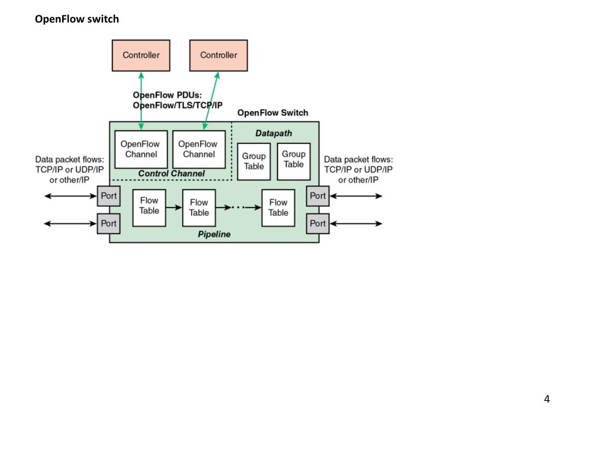

Lo schema illustra l'architettura interna di uno switch OpenFlow, distinguendo il **piano dati interno** (*Datapath*) dal **canale di controllo** (*Control Channel*).

**Ports:** lo switch ha porte fisiche su cui arrivano e partono i data packet flow (TCP/IP, UDP/IP, altri). Sono le interfacce verso la rete esterna.

**Pipeline di Flow Table:** quando un pacchetto entra in una porta, viene processato attraverso una catena (*pipeline*) di Flow Table in sequenza, dalla tabella 0 in poi. In ogni tabella si cerca un match con le regole installate dal controller:
- Se c'è un match → si esegue l'azione (forward, drop, modify, ecc.) e si passa alla tabella successiva o si finalizza.
- Se non c'è match → si applica la regola di *table-miss* (tipicamente: invia al controller per una decisione).

**Group Tables:** le Group Tables consentono azioni più complesse che non si possono esprimere con le semplici Flow Table: ad esempio la replica di un pacchetto su più porte (multicast/broadcast), il fast-failover (selezionare automaticamente una porta alternativa se quella principale è down), o il load balancing su un gruppo di porte.

**Control Channel:** è il canale sicuro (tipicamente TLS su TCP) attraverso cui lo switch OpenFlow comunica con il controller. Il canale usa il **protocollo OpenFlow** per scambiarsi tre tipi di messaggi:
- **Controller → Switch**: *Flow-Mod* (installa/modifica/cancella una flow entry), *Packet-Out* (invia un pacchetto da una porta specifica), *Stats-Request*.
- **Switch → Controller**: *Packet-In* (invia un pacchetto al controller quando non c'è match), *Flow-Removed* (notifica la scadenza di una entry), *Port-Status*, *Stats-Reply*.
- **Bidirezionali**: *Hello* (handshake iniziale), *Echo Request/Reply* (keepalive).

> [!note] Multi-controller
>
> Uno switch OpenFlow può connettersi a più controller per ridondanza: uno è il controller primario, gli altri sono di backup. Se il controller primario va offline, il backup prende il controllo senza interruzione del servizio.

---

## SDN Control Plane e Interazione con il Data Plane

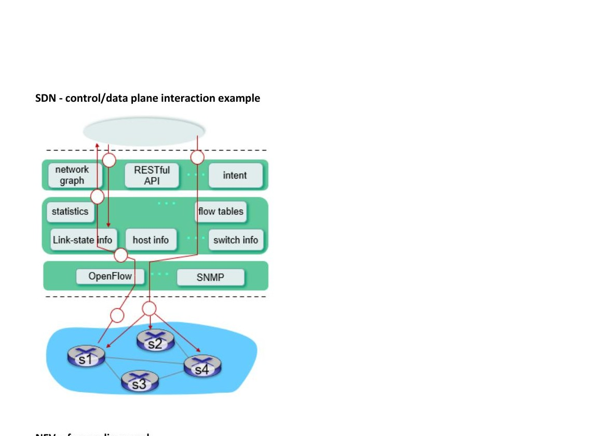

Questo schema mostra come il controller SDN interagisce concretamente con il data plane, evidenziando le due direzioni di comunicazione: **southbound** (controller → switch) e **northbound** (switch → controller).

**Il controller SDN mantiene internamente:**
- **Network graph**: un grafo della topologia completo, aggiornato in tempo reale. Ogni nodo è uno switch o un host, ogni arco è un link con la sua capacità.
- **Link-state info**: lo stato di ogni link (attivo/down, latenza, utilizzo) raccolto tramite LLDP o SNMP.
- **Host info**: la posizione di ogni host nella rete (a quale porta di quale switch è connesso).
- **Switch info**: le caratteristiche di ogni switch (numero di porte, OpenFlow version, capabilities).
- **Statistics**: contatori di pacchetti e byte per ogni flow entry, per traffic engineering e monitoring.
- **Flow tables**: le regole di forwarding da installare negli switch.

**Interfaccia verso le applicazioni (Northbound):**
- **RESTful API**: le applicazioni di rete (routing, load balancing, ACL) interrogano e modificano lo stato del controller tramite API REST.
- **Intent**: alcune implementazioni supportano un livello di astrazione più alto, dove le applicazioni esprimono "intenzioni" (es. "garantisci 10 Mbps di banda tra h1 e h2") che il controller traduce in flow rules.

**Interfaccia verso gli switch (Southbound):**
- **OpenFlow**: protocollo principale per installare le flow rule e ricevere packet-in dagli switch.
- **SNMP** (*Simple Network Management Protocol*): usato per raccogliere statistiche di gestione dagli switch (link status, error counters, ecc.) anche da switch non necessariamente OpenFlow.

### Topology Discovery con LLDP

La topology discovery in reti OpenFlow si basa sul **Link Layer Discovery Protocol (LLDP)**, standardizzato da IEEE nel 2005 e 2009. 

Il processo si svolge in quattro passi:
1. Il controller genera un **Packet-Out** per ogni porta attiva su ogni switch scoperto, incapsulando al suo interno un frame LLDP con il Chassis ID e il Port ID dello switch sorgente.
2. Quando uno switch OF riceve un messaggio Packet-Out con un frame LLDP, lo **forwarda** sulla porta specificata nel Port ID verso lo switch adiacente.
3. Lo switch adiacente, ricevendo il frame LLDP su una porta non di controllo, lo **incapsula in un Packet-In** indirizzato al controller, includendo i propri Switch ID e Port ID come metadata.
4. Il controller riceve il Packet-In ed **estrae le informazioni**: conosce ora lo Switch ID e Port ID del frame LLDP (mittente originale) e lo Switch ID e Port ID del Packet-In (ricevente). Da questi dati deduce che esiste un link tra quei due switch su quelle specifiche porte.

```{=latex}
\newpage
```

# Network Function Virtualization

La **Network Function Virtualization** (NFV) rappresenta uno dei cambiamenti di paradigma più significativi nell'ingegneria delle reti degli ultimi anni. L'idea fondamentale è semplice ma rivoluzionaria: spostare le funzioni di rete — firewall, bilanciatori di carico, gateway — dall'hardware proprietario dedicato a software eseguito su infrastruttura virtualizzata generica. 

---

## NFV: l'idea fondamentale

### Decoupling tra funzioni e hardware

Il principio cardine di NFV è il **disaccoppiamento** (*decoupling*) tra le funzioni di rete e l'hardware su cui girano. Le funzioni non sono più implementate in appliance fisiche dedicate, ma come **software** eseguito su infrastruttura virtualizzata standard (macchine virtuali o container su server COTS — *Commercial Off-The-Shelf*).

> [!definition] VNF — Virtualized Network Function
>
> Una **Virtualized Network Function** (VNF) è l'implementazione software di una funzione di rete tradizionalmente realizzata in hardware dedicato (firewall, load balancer, NAT, ecc.), eseguita su risorse virtualizzate (VM o container).

---

## NFV — Forwarding Graph

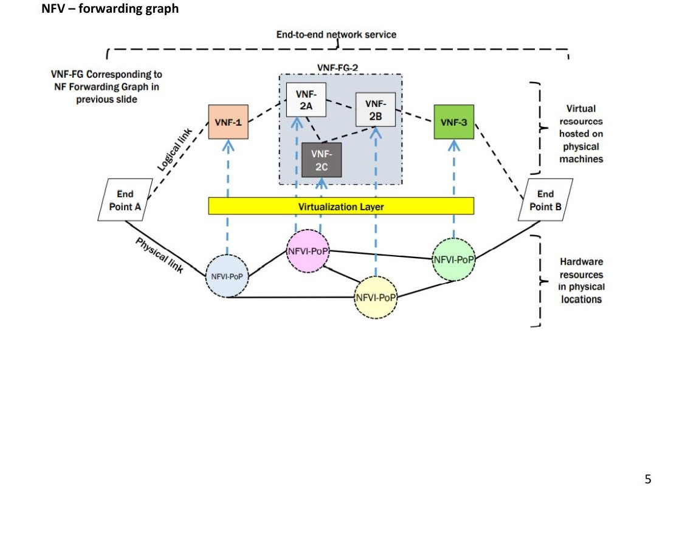

Questo schema rappresenta il concetto di **VNF Forwarding Graph** (VNF-FG), che è il modo in cui NFV formalizza un servizio di rete end-to-end.

**L'idea fondamentale di NFV:** invece di implementare funzioni di rete (firewall, NAT, load balancer, media gateway) in hardware proprietario dedicato, NFV le implementa come software — chiamate **VNF** (*Virtualized Network Functions*) — eseguito su infrastruttura hardware commodity (server COTS). Il decoupling tra funzione e hardware porta flessibilità, scalabilità e riduzione dei costi.

**Il Forwarding Graph:** un servizio di rete non è una singola funzione, ma una **composizione di funzioni** applicate in sequenza al traffico. Il grafo mostra:
- Il traffico entra da **End Point A**, passa attraverso **VNF-1**, poi attraverso il sotto-grafo **VNF-FG-2** (che a sua volta compone internamente VNF-2A → VNF-2B e VNF-2C in parallelo), poi attraverso **VNF-3**, e infine raggiunge **End Point B**.
- I link logici (tratteggiati) rappresentano connettività virtuale: due VNF sono logicamente connesse, ma possono fisicamente trovarsi su macchine diverse.

**I grafi sono nidificati:** VNF-FG-2 è esso stesso un sotto-grafo all'interno del grafo principale. Questo consente la riusabilità: VNF-FG-2 può essere istanziato in altri servizi senza ridefinirlo.

**L'infrastruttura fisica (NFVI):** le VNF girano su nodi fisici chiamati **NFVI-PoP** (*Network Function Virtualization Infrastructure Point of Presence*). Sono server COTS distribuiti geograficamente, interconnessi da una rete di trasporto fisica. La **Virtualization Layer** (hypervisor o container engine) astrae le risorse fisiche e consente a più VNF di condividere lo stesso hardware.

**Il problema del VNF placement:** dato il grafo logico del servizio, occorre decidere dove deployare fisicamente ogni VNF nell'infrastruttura. Questo è un problema di ottimizzazione NP-hard che considera: latenza end-to-end, capacità dei nodi, banda dei link, costi di deployment, requisiti di QoS per ogni slice di rete.

---

## NFV — Management and Orchestration

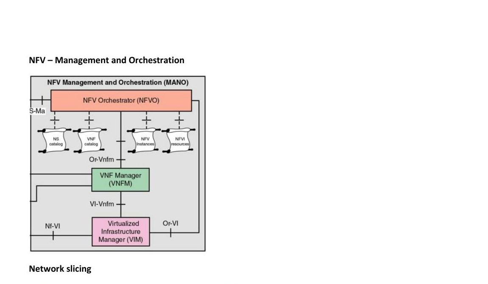

Questo schema mostra il framework di **gestione e orchestrazione NFV** standardizzato da ETSI, che è il "piano di controllo" dell'ecosistema NFV.

**NFV Orchestrator (NFVO):** è il componente di più alto livello. Ha due responsabilità principali:
1. **Network services orchestration**: gestisce il ciclo di vita dei **Network Service (NS)** end-to-end, ovvero istanzia, aggiorna e termina l'intero VNF Forwarding Graph. Può istanziare nuovi VNFM se necessario.
2. **Resource orchestration**: gestisce le risorse globali dell'NFVI, allocandole ai servizi in base alle policy e ai requisiti di QoS.
Il NFVO mantiene due repository: il **NS Catalog** (template dei servizi di rete come Network Service Descriptor) e il **VNF Catalog** (descrittori di ogni VNF, i VNFD).

**VNF Manager (VNFM):** gestisce il **ciclo di vita delle istanze VNF** singole:
- **Istanziazione**: crea una nuova istanza VNF su una VM o container nell'NFVI.
- **Scaling**: aumenta o riduce la capacità di una VNF (scaling out/in orizzontale, scaling up/down verticale) in base al carico.
- **Healing**: rileva e gestisce i fault delle VNF (auto-healing o assistito).
- **Terminazione**: distrugge l'istanza quando non serve più.
Il VNFM comunica con il NFVO tramite **Or-Vnfm** e con il VIM tramite **Vi-Vnfm** (o **Ve-Vnfm** verso le VNF stesse).

**Virtualized Infrastructure Manager (VIM):** controlla e gestisce le risorse fisiche e virtuali dell'NFVI (compute, storage, network). Piattaforme IaaS come **OpenStack** fungono da VIM. Il VIM alloca VM o container alle VNF, configura la rete virtuale (vSwitch, VLAN), e monitora l'utilizzo delle risorse. Un MANO può orchestrare più VIM distribuiti geograficamente.

**Le interfacce di riferimento:**
- **Or-Vi** (NFVO → VIM): l'orchestratore può richiedere risorse direttamente al VIM.
- **S-Ma**: collega sistemi OSS/BSS dell'operatore (Operations Support System / Business Support System) al MANO per l'integrazione con i sistemi aziendali.

> [!note] Implementazioni open source
>
> Le principali implementazioni open source del MANO sono **OSM** (*Open Source MANO*, promossa da ETSI) e **ONAP** (*Open Network Automation Platform*, Linux Foundation). Entrambe sono usate nelle reti 5G commerciali.

```{=latex}
\newpage
```

# Teoria dei Segnali: Serie di Fourier

## Serie di Fourier: dal Tempo alla Frequenza

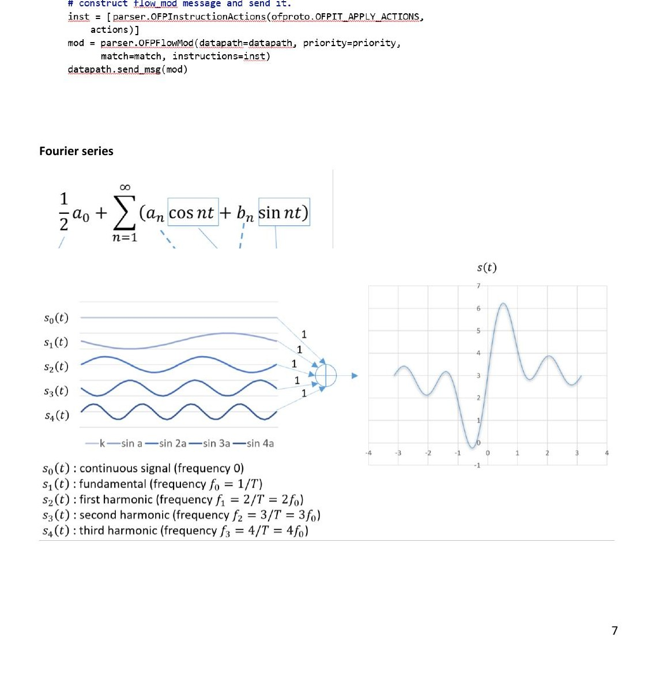

Questo schema illustra il concetto fondamentale della **Serie di Fourier**: qualsiasi segnale periodico può essere decomposto in una somma (infinita) di funzioni sinusoidali a frequenze multiple della frequenza fondamentale.

### L'Intuizione Fondamentale

Un segnale periodico può essere visto come una sovrapposizione di componenti sinusoidali, ciascuna con frequenza, ampiezza e fase specifiche. Questo cambio di prospettiva — dal dominio del tempo al **dominio della frequenza** — è cruciale perché il canale trasmissivo agisce in modo diverso su componenti a frequenza diversa. Sapere quali frequenze compongono un segnale — cioè conoscere il suo **spettro** — permette di:
- Predire come il segnale si deformerà attraverso il canale.
- Dimensionare la **banda** necessaria (quante armoniche servono per rappresentare il segnale fedelmente).
- Progettare filtri per rimuovere componenti indesiderate.

La serie di Fourier decompone una funzione come somma di infinite funzioni oscillanti a frequenze diverse. È formalmente un cambio di coordinate: dal dominio del tempo a quello della frequenza. La base di questa decomposizione è un insieme di funzioni ortogonali.

### Segnali Periodici Continui

Un segnale continuo $s(t): \mathbb{R} \to \mathbb{R}$ è **periodico con periodo $T$** se
$$s(t) = s(t + T) \quad \forall t \in \mathbb{R}$$
I segnali periodici si possono studiare interamente nell'intervallo $[0, T]$. La frequenza fondamentale è $f = 1/T$.

### Definizione della Serie di Fourier

Data una funzione continua $s(t): \mathbb{R} \to \mathbb{R}$ periodica in $[-\pi, \pi]$:
$$s(t) = \frac{1}{2} a_0 + \sum_{n=1}^{\infty} \left( a_n \cos(nt) + b_n \sin(nt) \right)$$
con coefficienti:
$$a_0 = \frac{1}{\pi} \int_{-\pi}^{\pi} s(t)\, dt \qquad a_n = \frac{1}{\pi} \int_{-\pi}^{\pi} s(t) \cos(nt)\, dt \qquad b_n = \frac{1}{\pi} \int_{-\pi}^{\pi} s(t) \sin(nt)\, dt$$

**Interpretazione fisica:** Ogni segnale periodico è la "somma di sinusoidi". Il termine $\frac{1}{2} a_0$ è la **componente continua** (il valor medio del segnale). I termini successivi sono le **armoniche**: la **fondamentale** con frequenza $f_0 = 1/T$, la **prima armonica** con frequenza $f_1 = 2/T = 2f_0$, la seconda armonica a $3f_0$, e così via.

### Condizioni di Dirichlet

La serie di Fourier non è definita per qualsiasi funzione. Le **condizioni di Dirichlet** garantiscono l'esistenza della serie: è sufficiente che il segnale sia *piecewise continuous* (composta da un numero finito di pezzi continui su ogni sottointervallo finito, con limite finito nei punti di discontinuità). In corrispondenza delle discontinuità la serie converge alla media dei limiti sinistro e destro.

### Fenomeno di Gibbs

Quando la serie di Fourier approssima una funzione con discontinuità (come un'onda quadra), si osserva un **overshoot** intorno ai punti di salto che non scompare mai, per quanto si aumenti il numero di armoniche. Questo è il **fenomeno di Gibbs**: l'errore rimane del ~9% dell'ampiezza del salto, indipendentemente dall'ordine di troncamento. Le oscillazioni nel tratto piatto si riducono, ma il picco al salto rimane costante.

```{=latex}
\newpage
```

# Network Slicing con SDN

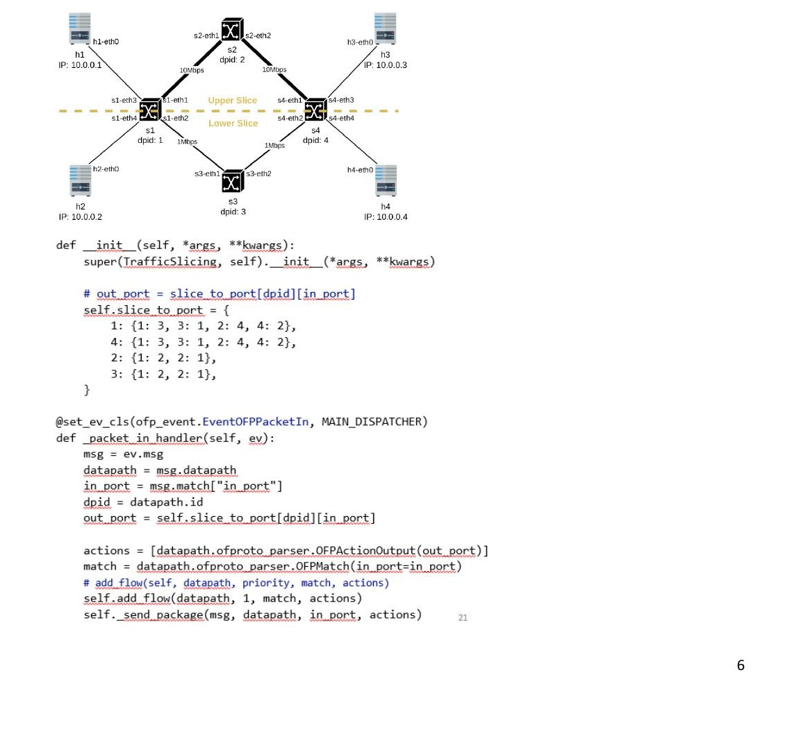

## Contesto: il 5G e la necessità del Network Slicing

Il 5G non è semplicemente un incremento di velocità rispetto al 4G: è una riprogettazione fondamentale dell'architettura di rete, motivata dalla coesistenza di tre categorie di servizio con requisiti radicalmente diversi tra loro:
- **mMTC (massive Machine Type Communications)**: comunicazione tra un numero elevatissimo di dispositivi (fino a 200.000/km²), IoT a bassa potenza. I requisiti dominanti sono la massima efficienza energetica e la scalabilità.
- **URLLC (Ultra-Reliable Low-Latency Communications)**: servizi che richiedono simultaneamente bassissima latenza (≤ 5 ms o ≤ 1 ms) e alta affidabilità (es. guida autonoma, controllo industriale).
- **eMBB (Enhanced Mobile Broadband)**: servizi ad alta densità di dati (streaming 4K/8K, realtà aumentata), dove il requisito primario è l'alta capacità di trasmissione.

La coesistenza di questi tre profili rende impossibile ottimizzare un'unica rete per tutti contemporaneamente. La soluzione è il **network slicing**: sulla stessa infrastruttura fisica vengono create più reti virtuali logiche separate (*slice*), ognuna ottimizzata per il proprio caso d'uso, con le proprie caratteristiche di QoS, banda, latenza e isolamento. La separazione logica garantisce che i requisiti di una slice non vengano degradati dalle altre.

## Il concetto di Network Slicing

Il network slicing sfrutta le risorse dell'infrastruttura fisica per creare multiple **sotto-reti virtuali** (slice), ciascuna delle quali si comporta come una rete indipendente.

Senza SDN, separare il traffico richiederebbe VLAN, configurazione manuale di ogni switch, o hardware dedicato. Con **SDN** (Software-Defined Networking), è sufficiente un controller centralizzato che installa le regole di forwarding appropriate per ogni flusso, realizzando lo slicing in software.

## Topologia dell'esperimento

L'esperimento implementa il network slicing usando l'emulatore **ComNetsEmu** e il controller SDN **Ryu** (scritto in Python).

La topologia è un **anello di quattro switch** (S1, S2, S3, S4) con quattro host (h1, h2, h3, h4).
L'obiettivo è imporre un **partizionamento rigido** della topologia per creare due slice indipendenti:
- **Upper Slice**: h1 ↔ h3, interconnessi esclusivamente tramite i link a 10 Mbps (il percorso via S2).
- **Lower Slice**: h2 ↔ h4, interconnessi esclusivamente tramite i link a 1 Mbps (il percorso via S3).

## Implementazione con Ryu: TrafficSlicing

Il cuore dell'implementazione del Network Slicing nel codice Python per il controller Ryu è il dizionario `slice_to_port`. Per ogni switch (identificato dal `dpid`) e per ogni porta di ingresso (`in_port`), specifica la porta di uscita:

```python
self.slice_to_port = {
    1: {1: 3, 3: 1, 2: 4, 4: 2},  # S1 (dpid=1)
    4: {1: 3, 3: 1, 2: 4, 4: 2},  # S4 (dpid=4)
    2: {1: 2, 2: 1},               # S2 (dpid=2)
    3: {1: 2, 2: 1},               # S3 (dpid=3)
}
```

Il gestore `_packet_in_handler` viene chiamato dal controller Ryu ogni volta che uno switch riceve un pacchetto che non ha una flow entry corrispondente (*packet-in*). Il controller legge il `dpid` dello switch e la porta di ingresso, cerca nel dizionario la porta di uscita, installa una **flow rule** nello switch (con `self.add_flow`) e forwarda il pacchetto:

```python
def _packet_in_handler(self, ev):
    msg = ev.msg
    datapath = msg.datapath
    in_port = msg.match["in_port"]
    dpid = datapath.id

    out_port = self.slice_to_port[dpid][in_port]

    actions = [datapath.ofproto_parser.OFPActionOutput(out_port)]
    match = datapath.ofproto_parser.OFPMatch(in_port=in_port)
    self.add_flow(datapath, 1, match, actions)
    self._send_package(msg, datapath, in_port, actions)
```

Da quel momento in poi, i pacchetti che corrispondono al match vengono gestiti direttamente dallo switch senza coinvolgere il controller. L'isolamento è garantito logicamente dal partizionamento delle porte su S1 e S4.

```{=latex}
\newpage
```

# Campionamento, Quantizzazione e DFT

## Da Segnale Analogico a Digitale: Campionamento e Quantizzazione

I sistemi digitali moderni lavorano esclusivamente con dati discreti. Un segnale analogico continuo deve essere convertito in una sequenza di valori discreti. Questo processo si articola in due fasi: **campionamento** e **quantizzazione**. Dopo il filtraggio anti-aliasing (passa-basso con $f_{taglio} = f_c/2$), avviene il campionamento, seguito dalla quantizzazione e infine dalla codifica binaria.

### Il Campionamento e il Teorema di Nyquist-Shannon

**Campionare** un segnale $s(t)$ significa estrarre i valori che il segnale assume a istanti discreti regolarmente spaziati. Il parametro chiave è la frequenza di campionamento $f_c = 1/T_c$.

Affinché un segnale di banda $B$ (frequenza massima $f_{max}$) sia ricostruito perfettamente dai suoi campioni, la frequenza di campionamento deve soddisfare il **Teorema di Nyquist-Shannon**:
$$f_c \geq 2 \cdot f_{max}$$

La frequenza $f_{Nyquist} = f_c/2$ è la massima frequenza rappresentabile senza aliasing.

### Aliasing

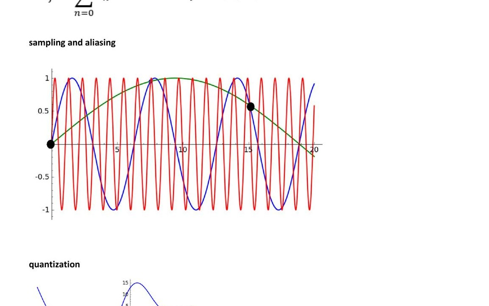

Campionare introduce un'ambiguità: da un insieme finito di campioni non si può distinguere univocamente quale segnale li ha generati. L'**aliasing** è la distorsione che si verifica quando il segnale rosso (alta frequenza) e il segnale blu (bassa frequenza) producono **identici campioni** (i punti neri). Il segnale a bassa frequenza è l'**alias** di quello ad alta frequenza: un'identità fantasma creata dal sottocampionamento. 

Se nel segnale originale sono presenti frequenze superiori a $f_{Nyquist}$, queste appaiono come frequenze più basse nello spettro discreto, rendendo impossibile la ricostruzione.

**Come prevenire l'aliasing:** si applica un **filtro anti-aliasing** (filtro passa-basso analogico) prima del campionatore, che elimina tutte le componenti con $f > f_c/2$. Solo dopo si campiona. Questo garantisce che il segnale digitale rappresenti fedelmente l'originale entro la banda di interesse.
Esempi: 
- Audio CD: frequenza di campionamento 44.1 kHz, per limiti uditivi di ~20 kHz.
- Telefonia: 8 kHz.
- WiFi e reti cellulari: i ricevitori campionano il segnale RF ad almeno $2 \times B_{canale}$.

### Quantizzazione

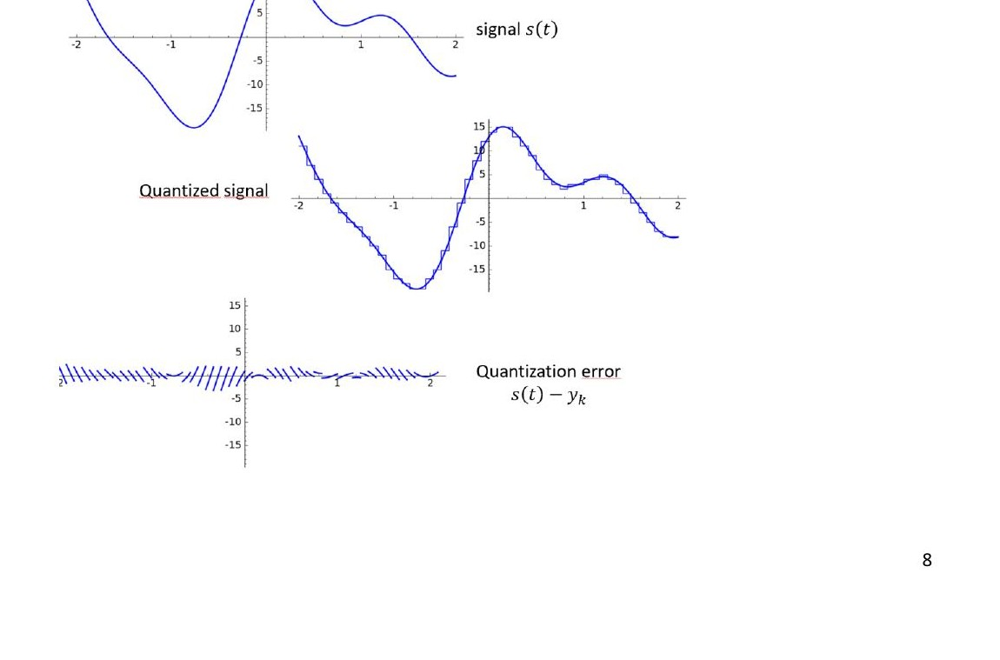

La **quantizzazione** è il secondo passo nella conversione analogico-digitale. Dopo aver campionato il segnale nel tempo, ogni campione deve essere approssimato al livello discreto più vicino tra un insieme finito di valori possibili (usando un numero finito di bit).

Dato un campione con valore reale, si sceglie il **livello di quantizzazione** $y_k$ più vicino e si assegna il codice binario. Se si usano $M$ bit per campione, si hanno $2^M$ livelli di quantizzazione, spaziati di un passo $\Delta = \frac{s_{max} - s_{min}}{2^M}$.

**L'errore di quantizzazione:** l'approssimazione introduce un errore inevitabile $e = s(t) - y_k$, che ha valore assoluto al massimo $\Delta/2$. Nel grafico in basso si vede chiaramente che l'errore è un segnale oscillante (dovuto all'arrotondamento al gradino) con ampiezza piccola ($\approx \Delta/2$) e frequenza elevata. Questo errore viene tipicamente modellato come rumore bianco uniforme.

**Trade-off:**
- Aumentare $M$ (più bit per campione) riduce $\Delta$ e quindi l'errore di quantizzazione, ma aumenta il **bitrate** richiesto: $\text{Bitrate} = f_c \times M$ bit/s.
- Il **SNR di quantizzazione** cresce approssimativamente di 6 dB per ogni bit aggiunto: $\text{SNR}_{dB} \approx 6.02 \cdot M + 1.76$ dB.

## Trasformata Discreta di Fourier (DFT)

La **Trasformata di Fourier Discreta** (DFT) è la versione *calcolabile da un computer* dell'analisi di Fourier: opera su un segnale discreto di lunghezza finita $N$ e produce $N$ coefficienti frequenziali.

**La formula:**
dato un segnale campionato $s_n$ (con $n = 0, 1, \ldots, N-1$), la DFT calcola il coefficiente $S_f$ per ogni frequenza discreta $f = 0, 1, \ldots, N-1$:
$$S_f = \sum_{n=0}^{N-1} s_n \, e^{-j\frac{2\pi f}{N}n}$$

**Interpretazione:**
- Ogni coefficiente $S_f$ è un numero complesso: il suo **modulo** $|S_f|$ è l'ampiezza del contributo alla frequenza $f$, la sua **fase** $\arg(S_f)$ è lo sfasamento della componente sinusoidale corrispondente.
- La DFT assume implicitamente che il segnale di $N$ campioni sia la ripetizione periodica di un pattern. È il corrispettivo discreto della serie di Fourier.

**L'algoritmo FFT:** 
Il calcolo diretto della DFT ha complessità $O(N^2)$. L'algoritmo **FFT** (*Fast Fourier Transform*) riduce la complessità a $O(N \log N)$ sfruttando la simmetria del fattore. Per $N = 1024$ punti, la FFT è ≈100 volte più veloce della DFT diretta.
**Applicazioni pratiche:** Analisi spettrale, filtraggio digitale (e compressione JPEG tramite DCT), e implementazione dell'**OFDM** (Orthogonal Frequency Division Multiplexing) in 4G/5G, che crea il segnale con una IFFT e lo demodula con una FFT.

```{=latex}
\newpage
```

# Lezione 5 - (Lab) Wireless

## Il Problema del Terminale Nascosto (Hidden Terminal Problem)

A causa dell'attenuazione con la distanza (o per la presenza di ostacoli fisici come montagne e palazzi), due nodi potrebbero non essere in grado di percepirsi a vicenda, pur essendo entrambi nel raggio di un terzo nodo intermedio. Se A e C vogliono comunicare con B, ma A e C sono fuori portata l'uno per l'altro, entrambi potrebbero iniziare a trasmettere contemporaneamente — inconsapevoli della reciproca interferenza — causando una collisione disastrosa al ricevitore B. Questo è il **Problema del Terminale Nascosto** (*Hidden Terminal Problem*), e non può essere rilevato dal classico meccanismo CSMA/CD.

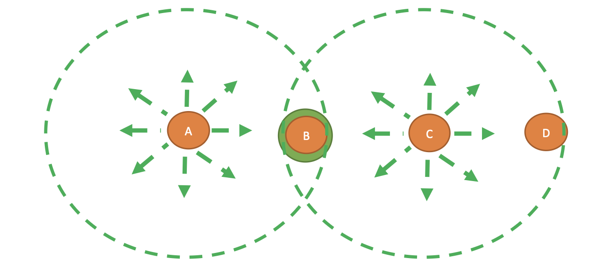

Il problema del **terminale nascosto** nasce da una limitazione fisica fondamentale delle reti wireless: la potenza del segnale radio cala con il quadrato della distanza, e la comunicazione può avvenire solo tra nodi sufficientemente vicini. In questo scenario, A e C vogliono entrambi trasmettere a B, ma A e C si trovano fuori dal raggio radio l'uno dell'altro.

Supponiamo che A stia già trasmettendo verso B. La stazione C, prima di trasmettere, esegue il **Carrier Sense**: ascolta il canale per verificare se è libero. Poiché C non riesce a sentire il segnale di A (sono fuori portata), C conclude erroneamente che il canale sia libero e inizia a trasmettere verso B (o verso D). Il risultato è che i segnali di A e di C si sovrappongono fisicamente nell'antenna di B, generando una **collisione** che B riceve come segnale incomprensibile. Né A né C rilevano la collisione, perché ciascuna sente solo il proprio segnale (che è enormemente più forte di qualsiasi segnale di ritorno).

Questo è il motivo per cui il protocollo **CSMA/CD**, standard nelle reti Ethernet cablate, non può essere usato nelle reti wireless: il meccanismo di rilevamento delle collisioni richiede che il trasmettitore possa ascoltare il canale mentre trasmette, il che è impossibile in radio (il self-signal del trasmettitore è ordini di grandezza più forte di qualsiasi segnale debole in arrivo).

> [!tip] Il punto chiave
>
> Con CSMA classico, il Carrier Sense viene eseguito dal trasmettitore, ma quello che conta è lo stato del canale **al ricevitore**. Il terminale nascosto è "nascosto" solo rispetto al trasmettitore corrente, non rispetto al ricevitore.

La soluzione a questo problema è il meccanismo **RTS/CTS**.

```{=latex}
\newpage
```

# Lezione 6 - (Lab) Protocolli MAC e Reti Wireless

## Le Reti Wireless: Sfide e Problemi Strutturali

Nelle reti cablate il rilevamento delle collisioni in fase di trasmissione funziona perfettamente, ma nelle reti wireless questo principio fallisce a causa della natura stessa del mezzo radio. Nelle trasmissioni senza fili, la potenza del segnale decade rapidamente, diminuendo in proporzione al quadrato della distanza.

A causa di questa attenuazione, il segnale emesso dall'antenna del trasmettitore (il _self-signal_) risulta infinitamente più forte rispetto a qualsiasi altro segnale debole in arrivo da una stazione distante. Questo "acceca" il trasmettitore, rendendogli impossibile rilevare una collisione mentre sta inviando dati. Inoltre, le condizioni del canale wireless sono spazialmente diverse tra chi trasmette e chi riceve. Una collisione rilevata dal trasmettitore potrebbe non essere una collisione al ricevitore, e viceversa. Nelle reti wireless, l'unica cosa che conta veramente è l'**interferenza al ricevitore**, non al mittente. Questa limitazione genera due problemi classici della comunicazione radio: il _Terminale Nascosto_ e il _Terminale Esposto_.

### Il Problema del Terminale Nascosto (Hidden Terminal)


> [!definition] Terminale Nascosto (Hidden Terminal)
>
> Si verifica quando due o più stazioni, reciprocamente fuori dal raggio radio l'una dell'altra, trasmettono simultaneamente verso un destinatario comune. Poiché nessuna delle due stazioni riesce a rilevare la trasmissione dell'altra, entrambe credono il canale libero e avviano l'invio, causando una collisione al ricevitore che nessuna delle sorgenti è in grado di percepire.

Immaginiamo quattro stazioni allineate: A, B, C e D. A è in raggio radio con B; B è nel raggio di A e C; C è nel raggio di B e D. Supponiamo che A stia attualmente trasmettendo dei dati a B. C, desiderando trasmettere, si mette in ascolto sul mezzo. Poiché C si trova fisicamente al di fuori del raggio di copertura radio di A, non percepirà alcuna trasmissione in corso. Credendo che il canale sia libero, C avvia una trasmissione (diretta a B o a D). Il risultato è disastroso: i segnali di A e di C si sovrapporranno fisicamente in corrispondenza dell'antenna di B, causando una collisione e distruggendo i dati. In questo scenario, C è incapace di rilevare il potenziale competitore (A) ed è quindi definito come **nascosto** (hidden) rispetto alla comunicazione da A verso B. Il problema del terminale nascosto si verifica quando due o più stazioni, reciprocamente fuori raggio, trasmettono simultaneamente a un destinatario comune. Anche A, per lo stesso motivo legato alla distanza, non si accorgerà della collisione provocata da C.

Questo è il motivo per cui il protocollo **CSMA/CD**, standard nelle reti Ethernet cablate, non può essere usato nelle reti wireless: il meccanismo di rilevamento delle collisioni richiede che il trasmettitore possa ascoltare il canale mentre trasmette, il che è impossibile in radio (il self-signal del trasmettitore è ordini di grandezza più forte di qualsiasi segnale debole in arrivo).

> [!tip] Il punto chiave
>
> Con CSMA classico, il Carrier Sense viene eseguito dal trasmettitore, ma quello che conta è lo stato del canale **al ricevitore**. Il terminale nascosto è "nascosto" solo rispetto al trasmettitore corrente, non rispetto al ricevitore.

La soluzione a questo problema è il meccanismo **RTS/CTS**.

### Il Problema del Terminale Esposto (Exposed Terminal)

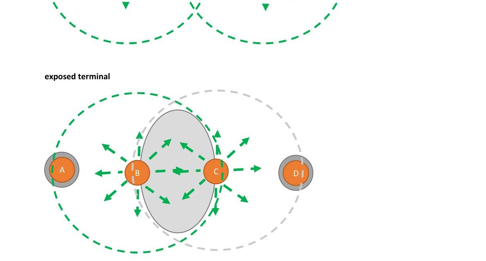

> [!definition] Terminale Esposto (Exposed Terminal)
>
> Si verifica quando una stazione rinuncia inutilmente a trasmettere perché rileva sul canale il segnale di un'altra stazione, pur non essendoci alcun rischio di collisione al ricevitore di destinazione. La stazione "esposta" è in grado di ascoltare una trasmissione vicina ma irrilevante, e ne viene erroneamente bloccata dall'invio di frame del tutto legittimi verso un destinatario distante.

Il problema del **terminale esposto** è speculare al precedente: questa volta, una stazione si astiene inutilmente dal trasmettere perché percepisce un segnale sul canale, anche se quel segnale non crea interferenza al suo ricevitore di destinazione.

Consideriamo la stessa topologia (A, B, C, D). Questa volta, B sta trasmettendo dati verso A, e parallelamente C desidera inviare un messaggio a D. C, mettendosi in ascolto, rileva forte e chiaro il segnale di B. Applicando ciecamente le regole del CSMA, C conclude erroneamente di non poter trasmettere verso D, per paura di creare una collisione. In realtà, se C iniziasse a trasmettere, il suo segnale raggiungerebbe D senza problemi, e le due trasmissioni (da B verso A, e da C verso D) potrebbero avvenire perfettamente in parallelo senza disturbarsi a vicenda (le loro "zone di interferenza" ai ricevitori non si sovrappongono in modo distruttivo). In questo caso, C è un terminale **esposto** alla comunicazione tra B e A. Il problema del terminale esposto impedisce a una stazione trasmittente di inviare frame del tutto legittimi a causa dell'ascolto di un'interferenza locale generata da un'altra stazione.

> [!warning] Attenzione
>
> Il terminale esposto non è un problema di collisione, ma di **sotto-utilizzo del canale**. È meno grave del terminale nascosto (che causa corruzioni di dati), ma riduce il throughput complessivo della rete.

Il fatto che non si possa verificare lo stato del canale al ricevitore semplicemente mettendosi in ascolto dal trasmettitore rende palese la necessità di progettare protocolli MAC sensibilmente diversi da quelli delle classiche reti LAN cablate. Il meccanismo RTS/CTS del protocollo MACA risolve anche questo problema.

## I Protocolli MACA e MACAW: Evitare le Collisioni

Per mitigare le problematiche descritte, nel 1990 Phil Karn presentò un protocollo rivoluzionario chiamato **MACA** (Multiple Access with Collision Avoidance), originariamente concepito per il "packet radio". L'idea fondante del MACA non è quella di rilevare le collisioni, ma di prevenirle stimolando il ricevitore a inviare un breve frame di controllo prima che inizi la trasmissione dei dati veri e propri (molto più lunghi). Le stazioni vicine, sentendo questo frame di controllo, si asterranno dal trasmettere durante il successivo invio dei dati.

### Il Meccanismo RTS / CTS

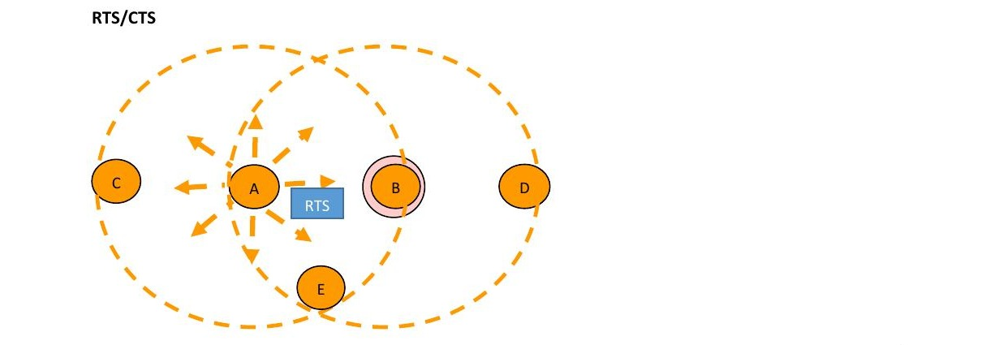

Il meccanismo **RTS/CTS** (*Request To Send / Clear To Send*) è il cuore del protocollo **MACA** e del successivo **MACAW**, ed è integrato nello standard **IEEE 802.11** (Wi-Fi). Risolve entrambi i problemi del terminale nascosto e del terminale esposto prenotando il canale in modo distribuito prima di trasmettere i dati.

Il funzionamento si basa su uno scambio di messaggi denominato RTS/CTS e si articola in tre fasi:

1. **Fase 1 — RTS (Request To Send):** Quando la stazione A desidera inviare dati a B, invia prima un breve pacchetto RTS (≈20 byte) indirizzato a B. Questo pacchetto non è generico, ma contiene l'ID della sorgente (A), l'ID della destinazione (B) e, fattore cruciale, la lunghezza (durata) del frame dati che seguirà. Tutte le stazioni nel raggio di A (ad esempio C ed E) riceveranno questo RTS.

2. **Fase 2 — CTS (Clear To Send):** Se B riceve l'RTS ed è pronto e libero per ricevere il messaggio, risponde trasmettendo un pacchetto CTS. Anche il CTS è un frame molto breve che copia e diffonde l'informazione sulla durata dei dati dichiarata nell'RTS. Questo CTS verrà ascoltato da A (che ottiene così il permesso di procedere), ma anche da tutte le stazioni nel raggio di B (ad esempio D ed E).

3. **Fase 3 — DATA:** Alla ricezione del frame CTS, la stazione A inizia a trasmettere il frame dati vero e proprio in condizioni sicure.

> [!tip] Insight chiave del meccanismo RTS/CTS
>
> Il meccanismo RTS/CTS risolve entrambi i problemi topologici in modo elegante: il terminale nascosto viene messo a tacere dal CTS del ricevitore (che esso sente, anche se non ha sentito l'RTS del mittente), mentre il terminale esposto viene liberato dall'obbligo di silenzio perché sente l'RTS ma non il CTS (e quindi deduce che la ricezione avviene fuori dalla sua area di influenza). Il canale viene così "prenotato" in modo distribuito, senza coordinamento centralizzato.

Vediamo in dettaglio come il MACA risolve i problemi topologici precedenti:

- **Come risolve il terminale esposto (C nel diagramma):** La stazione C ascolta l'RTS inviato da A, ma, essendo troppo lontana da B, non sentirà mai il relativo CTS di B. Da questo C deduce di essere un terminale esposto: comprende che la ricezione avviene lontano dalla sua area di influenza ed è quindi del tutto libera di iniziare una propria trasmissione senza creare interferenze.
- **Come risolve il terminale nascosto (D nel diagramma):** La stazione D non ascolta l'RTS di A (troppo lontano), ma riceve forte e chiaro il CTS di risposta inviato da B. D capisce immediatamente che B è in procinto di ricevere dati e che una sua trasmissione disturberebbe B. Pertanto, D si silenzia disciplinatamente per la durata indicata nel CTS, evitando di interferire con la ricezione di B.
- **Il caso E:** Se una stazione centrale come E si trova nella zona di sovrapposizione e ascolta sia l'RTS che il CTS, sa con certezza di dover rimanere in silenzio per tutta la durata della comunicazione per non disturbare l'operazione in corso.

> [!tip] Collisioni residue
>
> Con RTS/CTS le collisioni non scompaiono del tutto: possono ancora avvenire tra pacchetti RTS (es. se C e D inviano contemporaneamente RTS verso A). Ma in tal caso nessun dato applicativo viene perso (NO DATA information is lost), e lo spreco di canale è minimo dato che gli RTS sono brevissimi (circa 20 byte). I mittenti applicano il **Binary Exponential Backoff** prima di riprovare.

In 802.11, l'impiego di RTS/CTS è configurabile tramite una soglia di dimensione (*RTS Threshold*): sempre, mai, o solo per frame sopra una certa dimensione.

```{=latex}
\newpage
```

