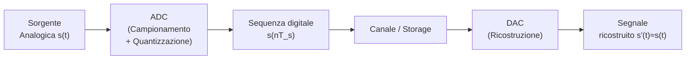

---
tags:
  - università/mobile-and-cyber-physical-systems
  - teoria-dei-segnali
  - fourier-transform
  - campionamento
  - DFT
  - FFT
  - aliasing
data: 2026-05-08
lezione: "26 - Teoria dei Segnali: Trasformata di Fourier, Campionamento e DFT"
professore: "Federica Paganelli"
---

# Teoria dei Segnali: Trasformata di Fourier, Campionamento e DFT

Questa lezione è la continuazione diretta della [[Lezione 25 - (Lab) Teoria dei Segnali - Introduzione e Serie di Fourier|Lezione 25]], che ha introdotto la classificazione dei segnali, la trasmissione, la serie di Fourier e lo spettro. Qui si affronta il salto concettuale fondamentale: estendere l'analisi in frequenza ai segnali **non periodici** mediante la Trasformata di Fourier, poi si passa al problema pratico della conversione analogico-digitale e all'analisi spettrale di segnali campionati tramite la DFT.

---

## Trasformata di Fourier

### Dal Discreto al Continuo: Passaggio dalla Serie alla Trasformata

La serie di Fourier, vista nella lezione precedente, funziona bene per segnali periodici: rappresenta il segnale come somma di armoniche a frequenze discrete $nF = n/T$. Ma la stragrande maggioranza dei segnali reali di interesse — impulsi, transitori, frammenti audio, burst radio — non sono periodici. Come estendere l'analisi in frequenza a questi segnali?

L'idea è elegante: si considera il segnale non periodico come il limite di un segnale periodico il cui periodo $T$ tende all'infinito. Quando $T$ cresce, la frequenza fondamentale $F = 1/T$ diminuisce, e le armoniche discrete $nF$ si avvicinano sempre di più tra loro. Nel limite $T \to \infty$, la spaziatura tra le armoniche $\Delta_f = 1/T \to 0$ e lo spettro discreto diventa uno **spettro continuo**.

*Fig. — Segnale periodico e relativo spettro discreto. All'aumentare di T, le righe spettrali si avvicinano. Prendendo il limite T→∞ si ottiene lo spettro continuo.*

*Fig. — Quando T→∞, il segnale "dimentica" la propria periodicità e lo spettro |X_D(f)| diventa una funzione continua della frequenza.*

> [!definition] Trasformata Continua di Fourier (CFT)
>
> Un segnale non periodico $s(t)$ può essere espresso come:
>
> $$s(t) = \int_{-\infty}^{+\infty} S(f)\, e^{j2\pi ft}\, df$$
>
> dove $S(f)$ è la **densità spettrale complessa**, data dalla trasformata diretta:
>
> $$S(f) = \mathcal{F}(s(t)) = \int_{-\infty}^{+\infty} s(t)\, e^{-j2\pi ft}\, dt$$
>
> Si scrive in forma compatta $s(t) \Longleftrightarrow S(f)$.

A differenza della serie di Fourier — che produce un insieme **discreto** di coefficienti $S_n$ — la CFT produce uno spettro **continuo** $S(f)$ definito su tutte le frequenze reali $f \in (-\infty, +\infty)$.

### Esempio: Segnale Pulsato

Consideriamo il segnale rettangolare:

$$s(t) = \begin{cases} 1 & \text{se } |t| \leq T/2 \\ 0 & \text{altrimenti} \end{cases}$$

La sua trasformata continua di Fourier si calcola analiticamente:

$$S(f) = \int_{-T/2}^{T/2} e^{-j2\pi ft}\, dt = T \cdot \text{sinc}(\pi f T) = \frac{\sin(\pi f T)}{\pi f}$$

Il risultato è una funzione **sinc** nel dominio della frequenza. Un fatto cruciale è che all'aumentare di $T$ (impulso più largo nel tempo), lo spettro si restringe in frequenza, e viceversa. Questo è il principio di **incertezza tempo-frequenza**: un segnale non può essere contemporaneamente concentrato sia nel tempo che in frequenza.

*Fig. — Spettri del segnale pulsato al variare della durata T. All'aumentare di T il lobo principale della sinc si restringe, riflettendo il principio di incertezza tempo-frequenza.*

*Fig. — Segnale pulsato con T=20: il segnale nel dominio del tempo (rettangolo di ampiezza 1 e durata 20) e il corrispondente spettro S(f)=sin(20πf)/(πf).*

### Banda di un Segnale e Filtraggio

Lo spettro di un segnale generico si estende su tutte le frequenze in $(-\infty, +\infty)$. Tuttavia, nella pratica non tutte le componenti frequenziali sono ugualmente utili o necessarie. Filtrare un segnale significa **selezionare un sottoinsieme delle sue componenti spettrali**. Le motivazioni principali sono:

- alcune frequenze contengono l'informazione rilevante, altre corrispondono a rumore o interferenze
- i canali di comunicazione hanno banda disponibile limitata
- si vuole separare segnali che si sovrappongono in frequenza

I filtri principali sono:
- **Filtro passa-basso** (*low-pass*): lascia passare le frequenze sotto una soglia $f_c$, blocca le alte frequenze
- **Filtro passa-alto** (*high-pass*): lascia passare le frequenze sopra $f_c$, blocca le basse
- **Filtro passa-banda** (*band-pass*): lascia passare le frequenze in un intervallo $[f_1, f_2]$

> [!example] Filtraggio del segnale pulsato
>
> Consideriamo il segnale rettangolare con $T=20$ e il suo spettro $S(f) = \sin(20\pi f)/(\pi f)$.

*Fig. — Filtro passa-basso (soglia 0.5 Hz): lo spettro viene troncato alle basse frequenze. La ricostruzione nel dominio del tempo riproduce approssimativamente la forma del rettangolo, con arrotondamento agli spigoli.*

*Fig. — Filtro passa-alto (soglia 0.5 Hz): rimangono solo le componenti ad alta frequenza dello spettro. Il segnale ricostruito ha una forma oscillatoria concentrata ai bordi del rettangolo originale.*

![Applicazione di un filtro passa-banda per f∈[0.1, 0.5]](images/lezione-27-lab-teoria-dei-segnali-trasformata-di-fourier-campionamento-e-dft-img-07.jpg)
*Fig. — Filtro passa-banda (intervallo [0.1, 0.5] Hz): vengono selezionate le componenti in una fascia di frequenze. Il risultato è un segnale oscillante.*

> [!tip] Intuizione sul filtraggio
>
> Applicare un filtro nel dominio della frequenza equivale a moltiplicare lo spettro $S(f)$ per la risposta del filtro $H(f)$. Nel dominio del tempo questo corrisponde a una convoluzione del segnale con la risposta impulsiva del filtro. Le basse frequenze determinano il "contorno grossolano" del segnale; le alte frequenze determinano i dettagli fini e gli spigoli.

### Confronto: Serie di Fourier vs Trasformata

| | Serie di Fourier | Trasformata di Fourier |
|---|---|---|
| Tipo di segnale | Periodico | Non periodico |
| Spettro | Discreto (coefficienti $S_n$) | Continuo ($S(f)$) |
| Output | Insieme di coefficienti | Funzione continua di frequenza |
| Esempi tipici | Onda quadra, sinusoidi | Impulsi, transienti, frammenti audio |

---

## Da Segnale Analogico a Digitale: Campionamento e Quantizzazione

I sistemi digitali moderni (computer, smartphone, dispositivi IoT) lavorano esclusivamente con dati discreti. Un segnale analogico continuo, come una voce o un sensore di temperatura, deve essere convertito in una sequenza di valori discreti. Questo processo si articola in due fasi: **campionamento** e **quantizzazione**.

*Fig. — Pipeline di conversione analogico-digitale e digitale-analogica. L'ADC introduce inevitabilmente un errore di quantizzazione; il DAC ricostruisce un'approssimazione del segnale originale.*

### Campionamento

**Campionare** un segnale $s(t)$ significa estrarre i valori che il segnale assume a istanti discreti regolarmente spaziati. Il parametro chiave è il **periodo di campionamento** $T_s$ (o equivalentemente la **frequenza di campionamento** $f_s = 1/T_s$):

$$g(nT_s) = s(nT_s), \quad n \in \mathbb{Z}$$

Il risultato è una sequenza di numeri reali. A differenza della quantizzazione, il campionamento — sotto opportune ipotesi — non introduce perdita di informazione.

### Quantizzazione

Mentre il campionamento opera sull'asse del tempo, la quantizzazione opera sull'asse dell'ampiezza: trasforma ogni campione reale $x \in \mathbb{R}$ in un valore intero $y \in [0, 2^R - 1]$, dove $R$ è il numero di bit del quantizzatore. Si usa un **quantizzatore scalare a $R$ bit**:

- la **risoluzione** per un segnale con valori in $[0, M]$ è $M / 2^R$
- il **bitrate** di una sorgente campionata a $f_s$ e quantizzata a $R$ bit è: $B = R \cdot f_s$ bit/s

> [!warning] Errore di quantizzazione
>
> La quantizzazione introduce un errore irreversibile: due valori analogici diversi possono essere mappati allo stesso livello digitale. Aumentare $R$ riduce l'errore (migliore fedeltà), ma aumenta il bitrate da trasmettere o memorizzare.

> [!example] Sistema telefonico analogico
>
> La voce umana ha un contenuto informativo utile fino a circa 4 kHz (limite telefonico accettabile). Quindi:
> - frequenza di campionamento: $f_s = 8$ kHz (doppio di 4 kHz, come vedremo con Nyquist)
> - quantizzazione su $R = 8$ bit per campione
> - bitrate risultante: $B = 8 \times 8000 = 64$ kbps

### Interpolazione e Ricostruzione

Dato un insieme di campioni, esistono vari metodi di ricostruzione del segnale analogico:
- **Zero-order hold**: ogni campione viene "tenuto" fino al successivo (segnale a gradini)
- **First-order hold**: interpolazione lineare tra campioni adiacenti
- **Interpolazione con seno cardinale** (*sinc interpolation*): metodo ottimale, usato nella dimostrazione del teorema di Nyquist

---

## Il Teorema di Campionamento di Nyquist-Shannon

La domanda centrale della conversione A/D è: **a quale frequenza minima devo campionare per poter ricostruire perfettamente il segnale originale?**

> [!theorem] Teorema di Nyquist-Shannon
>
> Sia $s(t)$ un segnale con spettro nullo per frequenze superiori a $f_M$ (segnale **a banda limitata**). Allora $s(t)$ è completamente determinato dai suoi campioni presi all'intervallo:
>
> $$T_s \leq \frac{1}{2f_M}$$
>
> ovvero con frequenza di campionamento $f_s \geq 2f_M$. La frequenza minima $f_N = 2f_M$ è chiamata **frequenza di Nyquist** o **tasso di Nyquist**.
>
> La ricostruzione esatta si ottiene tramite interpolazione con seno cardinale:
> $$s(t) = \sum_{n=-\infty}^{+\infty} s(nT_s) \cdot \frac{\sin(\pi f_s (t - nT_s))}{\pi f_s (t - nT_s)}$$

Il teorema richiede che il segnale sia **strettamente a banda limitata** — condizione che, come vedremo, non è mai soddisfatta dai segnali reali.

---

## Aliasing: Il Problema del Sottocampionamento

Per capire cosa succede quando si campiona troppo lentamente, bisogna guardare allo spettro del segnale campionato nel dominio della frequenza.

### FT del Segnale Campionato

Quando si campiona un segnale $s(t)$ con frequenza $f_s$, la trasformata di Fourier del segnale campionato **consiste in infinite repliche** dello spettro originale $S(f)$, centrate alle frequenze multiple di $f_s$:

$$S_c(f) = f_s \sum_{k=-\infty}^{+\infty} S(f - kf_s)$$

La spaziatura tra le repliche è pari a $f_s$: **più veloce è il campionamento, più distanti sono le repliche**.

*Fig. — Trasformata di Fourier di un segnale a banda limitata B. Quando il segnale viene campionato, lo spettro si "replica" attorno a multipli della frequenza di campionamento fs.*

*Fig. — Aumentando la frequenza di campionamento, le repliche dello spettro si allontanano. Con campionamento sufficientemente veloce (in basso), le repliche non si sovrappongono e il segnale originale è recuperabile applicando un filtro passa-basso.*

> [!definition] Aliasing
>
> L'**aliasing** è la distorsione che si verifica quando le repliche spettrali generate dal campionamento si **sovrappongono** tra loro. Quando c'è sovrapposizione, le componenti frequenziali si mescolano e il segnale originale non può più essere ricostruito univocamente.

*Fig. — Aliasing per frequenza di campionamento insufficiente: la spaziatura tra repliche è minore di 2B e le code degli spettri si sovrappongono, rendendo impossibile la ricostruzione.*

La condizione di Nyquist garantisce che **non ci sia sovrapposizione**: se $f_s \geq 2f_M$, le repliche distano almeno $2B$ e possono essere separate con un filtro passa-basso ideale.

*Fig. — Quando la condizione di Nyquist è soddisfatta (fs = 2B = 2fM), le repliche dello spettro si toccano esattamente senza sovrapporsi: il segnale originale è recuperabile con un filtro ideale.*

### Cosa Nyquist Non Ha Detto

Il teorema di Nyquist è spesso mal interpretato nella pratica. Ecco le trappole più comuni:

> [!warning] Limiti pratici del teorema di Nyquist
>
> 1. **Nessun segnale reale è strettamente a banda limitata.** Un segnale a banda strettamente limitata deve estendersi infinitamente nel tempo, il che è fisicamente impossibile. In pratica, i segnali hanno uno spettro che decade ma non si azzera mai.
>
> 2. **Campionare a $2f_M$ non basta se non si usa un filtro anti-aliasing perfetto.** I filtri reali non hanno una risposta rettangolare ideale: frequenze superiori a $f_M$ passano, seppur attenuate. Il risultato è un aliasing residuo non trascurabile.
>
> 3. **La soluzione pratica è l'oversampling**: campionare a una frequenza significativamente superiore a $2f_M$, e applicare un filtro anti-aliasing con taglio a $f_M$ (anche se non ideale, l'attenuazione supplementare è sufficiente).

> [!example] Oversampling nel telefono (old analog)
>
> Il telefono analogico tradizionale tagliava la voce a ~3 kHz (non 4 kHz) e campionava a 8 kHz: non il doppio del taglio (che sarebbe 6 kHz), ma un oversampling moderato. La differenza copre l'imperfezione del filtro e le componenti residue tra 3 e 4 kHz.

> [!note] Downsampling e segnali periodici
>
> Una curiosità: per segnali **strettamente periodici** e stabili, si può addirittura *sottocampionare* ($f_s < 2f_M$). Ogni campione cade in una fase diversa del ciclo (perché il periodo di campionamento non è un multiplo del periodo del segnale). Raccogliendo abbastanza campioni nel tempo, si coprono tutte le fasi del segnale e la ricostruzione diventa possibile. Questo funziona **solo** se il segnale non varia nel tempo.

---

## Trasformata Discreta di Fourier (DFT)

Nel contesto del **digital signal processing**, né la serie di Fourier (richiede un segnale periodico continuo) né la CFT (richiede un'integrazione continua) sono direttamente applicabili: si ha sempre un numero finito di campioni. La **DFT** è lo strumento adatto.

### Motivazione

Data una sequenza finita di $N$ campioni $s_k$ (con $k = 0, 1, \ldots, N-1$), ottenuta campionando un segnale a frequenza $f_s$ per un tempo $T = N/f_s$, si tratta il segnale discreto come se fosse **periodico con periodo $T$** e si calcola la serie di Fourier corrispondente. I coefficienti risultanti formano la DFT.

### Definizione della DFT

> [!definition] Trasformata Discreta di Fourier (DFT)
>
> Data una sequenza $s_k$ di $N$ valori ($k = 0, 1, \ldots, N-1$):
>
> **Trasformata diretta:**
> $$S_n = \sum_{k=0}^{N-1} s_k \, e^{-j2\pi nk/N}, \quad n = 0, 1, \ldots, N-1$$
>
> **Trasformata inversa:**
> $$s_k = \frac{1}{N} \sum_{n=0}^{N-1} S_n \, e^{j2\pi nk/N}$$
>
> La frequenza del bin $n$-esimo è $f_n = n \cdot \Delta f$, dove la **risoluzione in frequenza** è:
> $$\Delta f = \frac{f_s}{N} = \frac{1}{T}$$

La DFT prende in input un array di $N$ valori e restituisce un array di $N$ valori complessi: entrambe le operazioni sono **somme** (non integrali), quindi direttamente implementabili su un computer.

> [!example] Esempio DFT
>
> Sequenza di 8 campioni: $s[n] = 1$ per $n = 0,1,2,3$ e $s[n] = 0$ per $n = 4,5,6,7$.
>
> I coefficienti DFT risultano:
> - $S_0 = 4$ (componente DC)
> - $S_1 = 1 - j2.414$
> - $S_2 = 1 - j0.414$  
> - $S_3 = 1 + j0.414$
> - $S_4 = 1 + j2.414$
> - $S_5 = S_6 = S_7 = 0$ (per parità)

*Fig. — Spettro di ampiezza |S_n| della DFT dell'esempio. Il valore DC (n=0) vale 4, poi i bin hanno ampiezze che decrescono. La simmetria attorno a N/2 è caratteristica della DFT di segnali reali.*

### Fast Fourier Transform (FFT)

Il calcolo diretto della DFT richiede $O(N^2)$ operazioni. Per sequenze lunghe (audio HD: $N = 44100$ o più), questo è proibitivo. La **FFT** (Fast Fourier Transform) è una famiglia di algoritmi che sfruttano la struttura periodica dell'esponenziale complesso per ridurre la complessità a $O(N \log N)$.

> [!note] Condizione sulla lunghezza
>
> Per la FFT più efficiente (algoritmo di Cooley-Tukey), $N$ deve essere una potenza di 2: $N = 2^k$. Per questo le frequenze di campionamento standard come 44100 Hz vengono spesso arrotondate a $N = 32768$ o $65536$ campioni per la trasformazione.

### Commenti sulla DFT

**Risoluzione in frequenza.** La DFT non ha una risoluzione arbitraria: i "bin" sono spaziati di $\Delta f = f_s / N$. Se una componente del segnale cade tra due bin, la sua energia si spalma su più bin adiacenti (**spectral leakage**). Per migliorare la risoluzione si deve aumentare $N$ (osservare il segnale più a lungo).

**Frequenza di Nyquist nella DFT.** L'analisi spettrale affidabile tramite DFT è possibile solo per frequenze $f < f_s/2$: le componenti oltre la frequenza di Nyquist vengono mappate a frequenze errate (aliasing). Filtri anti-aliasing vengono applicati prima del campionamento per rimuovere le componenti fuori banda.

> [!question] Possibili domande d'esame
>
> - Qual è la differenza concettuale tra serie di Fourier e trasformata di Fourier?
> - Perché campionare un segnale genera repliche spettrali? Cosa succede se le repliche si sovrappongono?
> - Enunciare il teorema di Nyquist-Shannon. Quali sono le sue ipotesi e i suoi limiti pratici?
> - Cosa si intende per aliasing? Come si previene?
> - Cosa si intende per risoluzione della DFT? Come si può migliorarla?
> - Qual è la complessità computazionale della DFT e della FFT?
> - Perché nessun segnale reale è strettamente a banda limitata? Quali conseguenze ha questo per il campionamento?

---

> [!abstract] Riepilogo dei domini di Fourier
>
> | Strumento | Tipo di segnale | Tipo di spettro | Operatori |
> |---|---|---|---|
> | **Serie di Fourier** | Periodico continuo | Discreto (coefficienti $S_n$) | Integrale → Somma |
> | **CFT** | Non periodico continuo | Continuo $S(f)$ | Integrale → Integrale |
> | **DFT** | Discreto (N campioni) | Discreto (N coefficienti) | Somma → Somma |
>
> La DFT può essere vista come la serie di Fourier del segnale campionato, trattato come periodico con periodo $T = N/f_s$.
