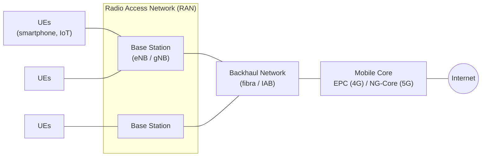
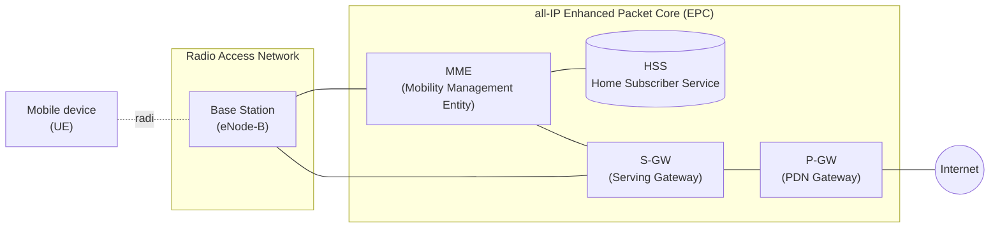
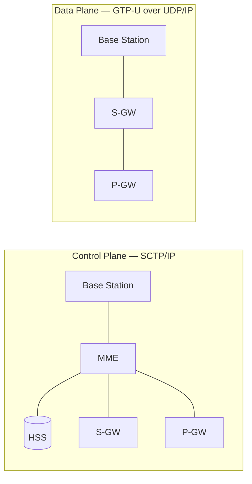
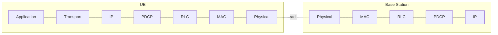
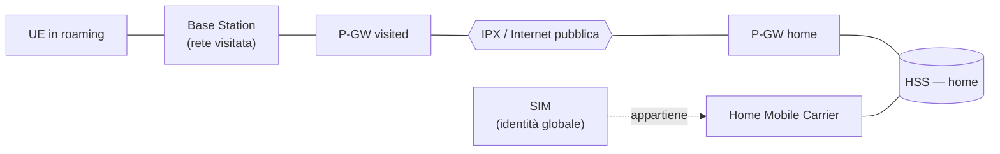
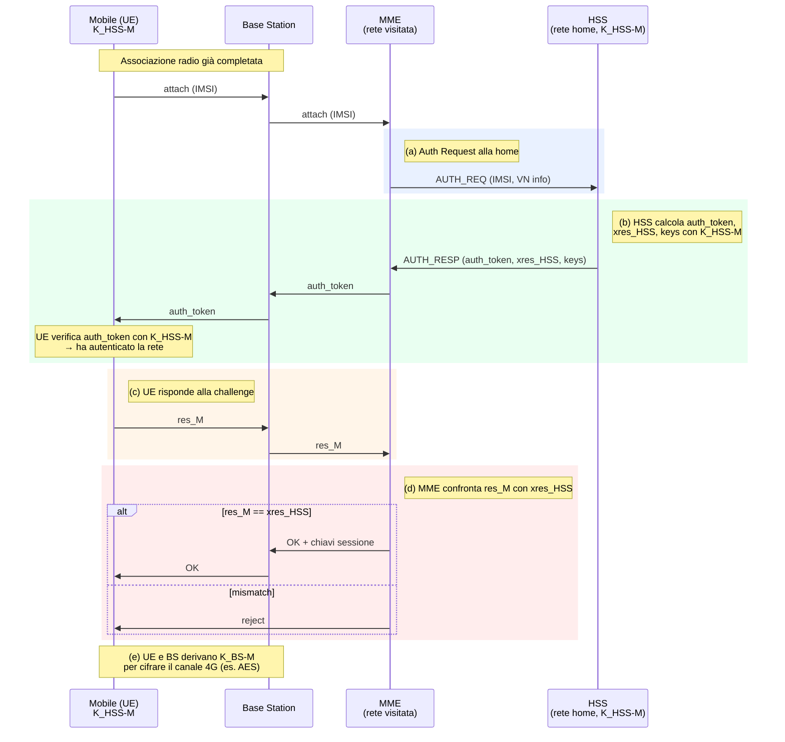

---
tags:
  - università/mobile-cyber-physical-systems
  - reti-cellulari
  - 4G-LTE
  - 5G-NR
  - mobilità
  - sicurezza
data: 2026-04-26
lezione: "7 - Mobile Networks"
professore: "Federica Paganelli"
---
# Mobile Networks: dalle reti cellulari al 4G/5G

Questa lezione introduce i fondamenti dell'architettura delle reti cellulari moderne, ripercorrendo l'evoluzione storica dal 1G fino al 5G e proiettandosi verso il 6G. Il filo conduttore è capire come ogni generazione abbia trasformato non solo la velocità di trasmissione, ma soprattutto il modello architetturale: dalla commutazione a circuito puramente analogica del 1G, alla **all-IP core** del 4G LTE, fino alla **Service Based Architecture** cloud-native del 5G. Lungo questo percorso emergono i meccanismi che rendono le reti cellulari peculiari rispetto a Internet cablata: la mobilità come servizio nativo di prima classe, il tunneling per preservare gli indirizzi IP durante gli spostamenti, l'autenticazione mutua basata sulla SIM e la separazione netta tra piano di controllo e piano dati.

> [!note] Riferimenti bibliografici
>
> Le slide sono un libero adattamento del libro **"Computer Networking: A Top-Down Approach"** (8ª edizione, 2020) di **James F. Kurose** e **Keith W. Ross**. Per l'architettura 5G il riferimento è **"5G Mobile Networks: A Systems Approach"** di **Larry Peterson** e **Oguz Sunay** (CC BY-NC-ND 4.0). Il quadro evolutivo verso il 6G riprende: Zakria Qadir et al., *"Towards 6G Internet of Things: Recent advances, use cases, and open challenges"*, ICT Express, Elsevier, Giugno 2023.

---

## L'evoluzione delle reti cellulari: dal 1G al 6G

Le reti cellulari hanno attraversato in quattro decenni una trasformazione che le ha portate da semplici sistemi di telefonia analogica a infrastrutture distribuite per l'Internet of Things globale. Ogni "generazione" non rappresenta solo un salto di velocità ma un ripensamento dell'architettura.

Il **1G** degli anni '80 (standard AMPS, TACS) trasportava solo voce in formato analogico, multiplexato in frequenza (FDMA), con copertura e sicurezza molto limitate. Negli anni '90 il **2G** introduce la voce digitale (GSM, CDMA) con multiplexing combinato TDM+FDM e gli SMS; con l'estensione **2.5G/GPRS** (General Packet Radio Service) si affaccia per la prima volta il concetto di **commutazione a pacchetto per i dati**, accanto alla commutazione a circuito che continua a gestire la voce. Il **3G** degli anni 2000 (UMTS, CDMA2000, HSPDA) porta l'accesso Web in mobilità: la rete voce resta a circuito ma in parallelo opera una rete dati a pacchetto.

La svolta architetturale arriva con il **4G** (LTE Advanced, anni 2010): tutto il traffico — voce inclusa — viaggia su un **All-IP core**, tunnelizzato come pacchetti IP dalla Base Station al gateway. Cade la separazione fra rete voce e rete dati e si introduce la separazione fra piano di controllo e piano dati. Il **5G** degli anni 2020 (5G NR) ridisegna il core in chiave cloud-native (**Service Based Architecture**), introduce il **network slicing** per partizionare logicamente la rete, e sfrutta sia frequenze sub-6 GHz sia onde millimetriche (mmWave). Il **6G**, atteso intorno al 2030, è già oggetto di ricerca e punta a un ecosistema "fully-connected" potenziato da AI con architetture *cell-less*.

| Gen | Anni | Standard | Velocità | Accesso | Voice switch | Data switch | Caratteristiche |
|---|---|---|---|---|---|---|---|
| **1G** | 1980s | AMPS, TACS | 2.4 kbps | FDMA | Circuit | Circuit | Voce analogica, copertura limitata |
| **2G** | 1990s | GSM, CDMA, EDGE | 64 kbps | TDM+FDM | Circuit | Circuit | Voce digitale + SMS |
| **2.5G** | fine '90s | GPRS | — | — | Circuit | Packet | Prima commutazione a pacchetto sui dati |
| **3G** | 2000s | UMTS, CDMA2000, HSPDA | fino a 2 Mbps | CDMA | Circuit | Packet | Web in mobilità |
| **4G** | 2010s | LTE Advanced | 100–1000 Mbps | OFDMA | Packet | Packet | All-IP core, tunneling, separazione control/data |
| **5G** | 2020s | 5G NR | fino a ~20 Gbps | OFDMA + mmWave | Packet | Packet | SBA, network slicing, sub-6 GHz + mmWave |
| **6G** | 2030s (prev.) | — | ~1 Tbps | — | — | — | Cell-less, AI-native, fully-connected |

> [!tip] La traiettoria di fondo
>
> A ogni generazione la rete diventa più simile a Internet: prima si introduce la commutazione a pacchetto sui dati (2.5G), poi anche sulla voce (4G), poi si modularizza il core in microservizi (5G). La direzione è quella di una rete cellulare **indistinguibile da un cloud distribuito**, dove la mobilità è una feature applicativa e non un'eccezione.

---

## Diffusione e standardizzazione delle reti 4G/5G

Le reti 4G/5G sono oggi la soluzione standard per l'Internet mobile su area geografica ampia. Già nel 2019 i dispositivi connessi via banda larga mobile superavano quelli a banda larga fissa con un rapporto di **5 a 1**. La disponibilità del 4G ha raggiunto il **97% del tempo in Corea** e il **90% negli Stati Uniti**, con velocità tipiche di **20 Mbps e oltre**. La standardizzazione tecnica è curata dal consorzio **3GPP** (3rd Generation Partnership Project), che definisce in particolare lo standard **LTE (Long-Term Evolution)** per il 4G e il **5G NR (New Radio)** per il 5G.

---

## Architettura di alto livello: RAN, Backhaul, Mobile Core

L'architettura di una rete cellulare 4G/5G si scompone in tre blocchi funzionali che collaborano per portare un pacchetto IP dal dispositivo dell'utente fino a Internet (e viceversa):

- **Radio Access Network (RAN)** — è la "rete d'accesso" radio: una collezione distribuita di **Base Station** (stazioni base) che gestiscono lo spettro radio condiviso fra i dispositivi all'interno della loro **cella** di copertura.
- **Backhaul Network** — interconnette la RAN con il Mobile Core. Tipicamente cablata in fibra ottica, ma sono in arrivo soluzioni wireless integrate (Integrated Access Backhaul, IAB).
- **Mobile Core Network** — fornisce connettività IP per dati e voce, garantisce i requisiti di **QoS**, traccia la mobilità per assicurare un servizio ininterrotto e gestisce billing & charging. Si chiama **Evolved Packet Core (EPC)** in 4G e **NG-Core** in 5G.

*Fig. — I tre blocchi dell'architettura cellulare. La RAN gestisce lo spettro, il backhaul è il "trasporto" verso l'interno della rete, il Mobile Core fa da gateway verso Internet e custodisce le funzioni di mobilità, autenticazione e charging.*

---

## Gli elementi dell'architettura 4G LTE

L'architettura 4G LTE è comunemente chiamata **all-IP Enhanced Packet Core (EPC)**. Vale la pena entrare nel dettaglio dei suoi componenti, perché molti concetti sopravvivono inalterati anche in 5G (cambiando solo nome o granularità).

### User Equipment (UE)

> [!definition] UE — User Equipment
>
> Con **UE** si intende qualsiasi dispositivo terminale dotato di radio 4G LTE: smartphone, tablet, laptop, dispositivo IoT. Implementa l'**intero stack Internet a 5 livelli**. La sua identità globale è l'**IMSI** (International Mobile Subscriber Identity), un codice a 64 bit memorizzato sulla **SIM** (Subscriber Identity Module). L'IMSI identifica univocamente l'abbonato nel sistema cellulare mondiale, codificando la nazione e il carrier "home".

### Base Station (eNode-B)

La Base Station si trova al "margine" (*edge*) della rete del carrier: gestisce le risorse radio wireless e i dispositivi all'interno della propria **cella**, e coordina l'autenticazione del dispositivo interfacciandosi con gli altri elementi del core. Rispetto a un Access Point Wi-Fi, però, il suo ruolo è molto più attivo:

- coordina gli **handover** del dispositivo tra celle adiacenti, mantenendo le sessioni in corso;
- collabora con le Base Station vicine per **minimizzare le interferenze radio**;
- crea **tunnel IP specifici per ogni dispositivo** verso i gateway del core;
- gestisce direttamente la mobilità intercella.

In gergo LTE è chiamata **eNode-B** (evolved NodeB).

### Mobility Management Entity (MME)

L'MME è il "cervello" del piano di controllo. Coordina l'**autenticazione bidirezionale** (dispositivo → rete e rete → dispositivo) interfacciandosi con l'HSS della rete *home* dell'utente. Si occupa inoltre della gestione del dispositivo: **handover** fra celle, **tracking/paging** della posizione, e setup dei percorsi (tunneling) verso S-GW e P-GW.

### Home Subscriber Service (HSS)

> [!definition] HSS — Home Subscriber Service
>
> Database centrale che contiene tutte le informazioni sugli abbonati. Memorizza i dati dei dispositivi per i quali la rete in cui si trova l'HSS è la **home network** ("rete di casa"), e collabora strettamente con l'MME nelle procedure di autenticazione.

### Serving Gateway (S-GW)

L'S-GW si trova **sul percorso dei dati** fra dispositivo mobile e Internet. Si occupa dell'inoltro dei pacchetti IP da/verso la RAN e funge da **Local Mobility Anchor**: quando un utente si sposta da un eNode-B a un altro all'interno della stessa rete, l'S-GW fa da "ancora locale" della sessione, cosicché l'handover risulti trasparente ai livelli superiori.

### PDN Gateway (P-GW)

Il **Packet Data Network Gateway** connette il core 4G alle reti dati esterne — tipicamente Internet o reti aziendali private. È **l'ultimo elemento LTE** che un datagramma incontra prima di entrare nella Internet pubblica. Si comporta come un router gateway "normale", ma con responsabilità aggiuntive: **NAT**, applicazione di policy, traffic shaping, charging.

> [!note] S-GW e P-GW co-locati
>
> Nelle implementazioni reali S-GW e P-GW possono essere co-localizzati sullo stesso nodo fisico. Le specifiche 3GPP permettono molte configurazioni: ad esempio un'unica coppia MME/P-GW può servire un'intera area metropolitana, mentre gli S-GW vengono distribuiti su ~10 siti edge cittadini, ciascuno a servizio di ~100 stazioni base.

*Fig. — Topologia logica del 4G LTE. In rosso scuro le interfacce di controllo (verso MME e HSS), il piano dati attraversa BS → S-GW → P-GW → Internet.*

---

## Separazione tra Control Plane e Data Plane

Una caratteristica distintiva dell'architettura LTE è la **netta separazione fra Piano di Controllo e Piano Dati**. Questa scelta — ereditata e amplificata in 5G — riflette principi di Software Defined Networking: chi prende le decisioni (MME, HSS) è disaccoppiato da chi inoltra i pacchetti (S-GW, P-GW).

La Base Station si trova esattamente sull'incrocio dei due piani, e inoltra **sia pacchetti di controllo sia pacchetti utente** fra Mobile Core e UE.

- Nel **Piano di Controllo**, i pacchetti viaggiano tunnellizzati su **SCTP/IP** (Stream Control Transmission Protocol, RFC 4960). SCTP è un'alternativa affidabile a TCP, progettata per trasportare la **segnalazione** delle reti telefoniche; gestisce le procedure di registrazione, tracking e autenticazione.
- Nel **Piano Dati**, i pacchetti utente sono incapsulati nei tunnel **GTP-U** (General Packet Radio Service Tunneling Protocol — User plane), un protocollo 3GPP che opera **sopra UDP**.

*Fig. — Separazione Control Plane / Data Plane in LTE. Il control plane (sopra) trasporta segnalazione su SCTP fra BS, MME, HSS e gateway; il data plane (sotto) trasporta i pacchetti utente in tunnel GTP-U attraverso BS → S-GW → P-GW.*

> [!tip] Perché la separazione è cruciale
>
> Disaccoppiare control e data plane permette di scalarli indipendentemente: si possono aggiungere S-GW per assorbire più traffico utente senza toccare MME/HSS. Inoltre apre la strada alla **virtualizzazione** delle funzioni di controllo (NFV), che in 5G diventa il principio architetturale dominante.

---

## Il tunneling GTP: come la rete supporta la mobilità

Il datagramma originario emesso dall'UE viene **incapsulato con GTP** e spedito dentro un datagramma **UDP** verso l'S-GW; l'S-GW lo *re-incapsula* e lo invia al P-GW, che lo "scarta" l'incapsulamento e lo immette su Internet. Le sessioni vengono identificate dal **TEID** (Tunnel Endpoint Identifier).

> [!tip] Perché il tunneling GTP abilita la mobilità
>
> Il tunneling GTP risolve il problema della mobilità IP in modo molto elegante: incapsulando il datagramma dell'utente dentro un nuovo pacchetto UDP/GTP, gli **indirizzi IP visibili a Internet rimangono fissi** (quelli dell'S-GW e del P-GW). Quando l'utente cambia cella o si sposta in un'altra area, basta **aggiornare gli endpoint del tunnel** — il dispositivo mantiene il suo indirizzo IP e le sessioni TCP attive non vengono interrotte.

*Fig. — Composizione degli header GTP nel doppio senso del traffico. **UE → Internet:** il pacchetto originale `Src=UE, Dst=Internet` viene incapsulato dall'eNB in un GTP+UDP+IP con `Src=eNB, Dst=S-GW, TEID=UL-S1-TEID` (tunnel S1); l'S-GW lo ri-incapsula con `Src=S-GW, Dst=P-GW, TEID=UL-S5-TEID` (tunnel S5); il P-GW rimuove gli incapsulamenti e immette il datagramma originale su Internet. **Internet → UE:** il P-GW riceve `Src=Internet, Dst=UE`, lo incapsula con `Src=P-GW, Dst=S-GW, TEID=DL-S5-TEID`; l'S-GW lo ri-incapsula verso l'eNB con `Src=S-GW, Dst=eNB, TEID=DL-S1-TEID`; l'eNB consegna il datagramma all'UE via radio.*

---

## Lo stack del Data Plane LTE

A livello radio (cioè fra UE e Base Station), lo stack del piano dati LTE è composto da quattro livelli specifici, che si frappongono fra il livello IP "ordinario" e l'aria:

1. **Packet Data Convergence Protocol (PDCP)** — compressione degli header e crittografia.
2. **Radio Link Control (RLC)** — frammentazione e riassemblaggio dei pacchetti IP, trasferimento affidabile a livello di collegamento (ACK/NACK).
3. **Medium Access Control (MAC)** — richiesta e uso degli slot di trasmissione radio, rilevazione e correzione degli errori.
4. **Physical Layer** — modulazione e accesso al canale: FDM e TDM, e in particolare **OFDM** (Orthogonal Frequency Division Multiplexing) in downlink, le cui sottoportanti "ortogonali" minimizzano l'interferenza fra canali. Ogni dispositivo attivo riceve **due o più time slot da 0.5 ms** distribuiti su **12 frequenze**; lo scheduler non è standardizzato (lo decide l'operatore) e rende possibili velocità nell'ordine di **centinaia di Mbps per dispositivo**.

*Fig. — Stack del data plane LTE sul primo hop UE↔BS. Sopra l'IP "classico" si innestano PDCP, RLC, MAC e Physical, che insieme forniscono compressione, crittografia, riassemblaggio, scheduling e modulazione OFDM.*

---

## Sleep modes e procedura di associazione

Per preservare la batteria, i dispositivi LTE — analogamente a Wi-Fi e Bluetooth — possono mettere la radio in **sleep**:

- **Light sleep** dopo centinaia di millisecondi di inattività; il dispositivo si risveglia periodicamente (ogni ~100 ms) per controllare se ci sono trasmissioni in arrivo.
- **Deep sleep** dopo 5–10 secondi di inattività. In deep sleep il dispositivo potrebbe **cambiare cella**, quindi al risveglio deve **ristabilire l'associazione** per ricevere i messaggi di **paging** broadcastati dall'MME quando qualcuno cerca di contattarlo (chiamata, SMS, dato in arrivo).

> [!note] Cos'è il paging
>
> Quando qualcuno tenta di chiamare o inviare un messaggio a un dispositivo, la rete deve prima localizzarlo. L'MME **broadcasta** messaggi di paging nell'area in cui il dispositivo è probabilmente presente (la "tracking area"). Il dispositivo, ricevuto il paging, esce dal deep sleep e si ri-associa per ricevere il dato.

La **procedura di associazione** a una rete avviene in più passi:

1. La BS broadcasta ogni 5 ms un **primary synch signal** su tutte le frequenze. Più carrier diversi possono star broadcastando in parallelo.
2. Il dispositivo individua il primary synch signal e poi il **secondary synch signal** sulla stessa frequenza.
3. Legge le informazioni broadcastate dalla BS: larghezza di banda, configurazioni, info sul carrier cellulare.
4. Il dispositivo **seleziona la BS** a cui associarsi (preferendo tipicamente il proprio carrier home).
5. Seguono altri passi per **autenticarsi**, stabilire stato e configurare il piano dati.

---

## La rivoluzione del 5G: prestazioni e use case

Mentre il 4G mirava a circa 10 Mbps e 10 ms di latenza, il 5G alza drasticamente l'asticella (proiezioni GAO e ITU):

- **10× il bitrate di picco** — 100 Mbps di "User experienced data rate" sostenuti, con picchi potenziali $> 10$ Gbps;
- **10× più bassa la latenza** — fino a **1 ms**;
- **100× più capacità di traffico**, e una **densità di connessione** che supporta **1 milione di dispositivi per km²**.

La nuova radio **5G NR (New Radio)** **non è retrocompatibile** con il 4G. Opera su due bande principali:

- **FR1** — 450 MHz – 6 GHz (microonde "tradizionali", buona copertura);
- **FR2** — 24 GHz – 52 GHz (**onde millimetriche**, mmWave).

Le frequenze millimetriche permettono velocità immense ma su distanze brevi: questo richiede antenne direzionali (**MIMO**, Multiple-Input Multiple-Output) e un'installazione **densissima** di nuove stazioni base, le **pico-cells**, con raggio di soli 10–100 m.

### I tre macro-scenari d'uso

> [!example] eMBB — Enhanced Mobile Broadband
>
> Larghezza di banda incrementata per applicazioni multimediali pesanti: realtà aumentata e virtuale, video streaming 4K/360°. Si punta a *data rate* multi-Gbps di picco, 100+ Mbps sostenuti, e capacità aggregata di 10 Tbps per km².

> [!example] URLLC — Ultra Reliable Low-Latency Communications
>
> Applicazioni mission-critical altamente sensibili alla latenza: automazione di fabbrica, **guida autonoma**. Richiede affidabilità "five nines" (99.999%), latenza **1 ms** e supporto della mobilità ad alta velocità (fino a 100 km/h).

> [!example] mMTC — Massive Machine Type Communications
>
> Accesso *narrowband* per pervasività sensoriale: metering, monitoring, IoT diffuso. Dispositivi **ultra-low-power** (10+ anni di batteria), ultra-low-complexity (decine di bit/s), ultra-high density (1M nodi/km²).

---

## La 5G Core e la Service Based Architecture

A livello architetturale il 5G Core (NG-Core) è profondamente riprogettato per integrarsi con Internet e con i servizi cloud. L'approccio è **cloud-native**: la rete è organizzata come un set di **Network Functions (NF)** indipendenti, riutilizzabili e implementabili come macchine virtuali o container su hardware generico (**Network Function Virtualization, NFV**). Le NF possono essere lanciate e rilasciate dinamicamente in base al carico.

Ogni Network Function espone i propri servizi tramite una **Service-Based Interface (SBI)**, un'interfaccia REST ben definita su **HTTP/2**. È un cambio paradigmatico: le funzioni di rete diventano **microservizi** che si chiamano tra loro come fossero API web.

Alcuni concetti rimangono comunque ereditati dal 4G — primo fra tutti l'incapsulamento dei pacchetti via **GTP-U** sul piano utente. La separazione fra control e user plane viene portata all'estremo, e i server vengono distribuiti **fino all'edge** della rete per ridurre la latenza.

### Mapping 4G → 5G delle funzioni

| **Componente 4G** | **Corrispettivo 5G** | **Funzione** |
|---|---|---|
| **eNB** | **gNB** | Radio 5G modulare e cloud-native, splittata in *Distributed Unit* e *Central Unit* per deployment flessibile |
| **S-GW + P-GW** | **UPF** (User Plane Function) | Inoltra il traffico fra RAN e Internet; gestisce packet inspection, QoS e reporting; può essere distribuita per Multi-Access Edge Computing (MEC) |
| **MME** | **AMF + SMF** | **AMF** (Access and Mobility Management Function): autenticazione, gestione connessione, mobilità, reachability. **SMF** (Session Management Function): gestione sessioni dati, allocazione IP, controllo QoS e routing user-plane |
| **HSS** | **AUSF + UDM** | **AUSF** (Authentication Server Function): procedure di autenticazione. **UDM** (Unified Data Management): identità degli utenti, credenziali, dati di abbonamento |
| **PCRF** | **PCF** | Policy Control Function — definisce le regole di policy che le altre NF di controllo applicano |

Il 5G introduce inoltre **Network Function di supporto** (helper) totalmente nuove, che rendono i servizi *stateless* e quindi facilmente scalabili:

- **SDSF** (Structured Data Storage Network Function) e **UDSF** (Unstructured Data Storage Network Function) — servizi di archiviazione dati centralizzati: estraendo lo stato dalle altre NF, queste possono restare stateless.
- **NEF** (Network Exposure Function) — espone in modo controllato e sicuro le capacità della rete a servizi di terze parti.
- **NRF** (NF Repository Function) — registry per la *service discovery* delle NF disponibili.
- **NSSF** (Network Slicing Selector Function) — seleziona la **Network Slice** appropriata per ogni UE, permettendo di partizionare logicamente la rete e differenziare il servizio fra utenti/tenant.

> [!tip] La logica cloud-native
>
> Avere storage separato (SDSF/UDSF) e un registry di servizi (NRF) non è un dettaglio tecnico: è esattamente lo stesso *pattern* di un'architettura a microservizi cloud (12-factor, Kubernetes-style). Permette di **scalare orizzontalmente** una NF aggiungendo istanze, di **sostituire un'istanza** in caso di guasto senza perdere stato, e di esporre a terzi (NEF) capacità di rete come API consumabili.

### UPF e Multi-Access Edge Computing

Particolarmente importante è il ruolo dell'**UPF**: corrispondente unificato di S-GW + P-GW, può essere replicato e distribuito in molteplici punti della rete, anche **all'edge** vicino agli utenti. Questa flessibilità abilita il **Multi-Access Edge Computing (MEC)**, in cui le **VNF** (Virtual Network Functions) e i workload applicativi possono essere co-locati con l'UPF stesso, riducendo drasticamente la latenza per scenari URLLC.

*Fig. — Architettura 5G User Plane (immagine NVIDIA/Mavenir). Il **gNodeB** dialoga con un'**I-UPF** (Intermediate UPF) all'edge tramite l'interfaccia N3, raggiungendo il core via N9 fino all'**UPF** centrale che si interfaccia col Data Network (N6). Il control plane (linee tratteggiate) — **AMF**, **SMF** — comunica con i nodi user-plane via N2, N4, N11. Le **VNF** all'edge realizzano il MEC.*

---

## Opzioni di deployment: Standalone vs Non-Standalone

Il passaggio da 4G a 5G non è atomico: gli operatori possono scegliere fra diverse strategie di deployment.

| Modalità | RAN | Core | Note |
|---|---|---|---|
| **Standalone 4G** | 4G | EPC | Rete 4G "pura" |
| **Non-Standalone (NSA)** | 4G + 5G | EPC (4G) | Le BS 5G affiancano quelle 4G per dare un *boost* di capacità; il **piano di controllo passa attraverso le BS 4G** verso il Core 4G, mentre le BS 5G veicolano **solo traffico utente** |
| **NSA su NG-Core** | 4G + 5G | NG-Core (5G) | Variante con BS 4G+5G ma core già migrato al 5G |
| **Standalone 5G** | 5G | NG-Core | 5G "puro": sia controllo che dati gestiti dal NG-Core |

> [!warning] Adozione del 5G SA molto disomogenea
>
> Secondo i dati Ookla 2025, l'adozione del 5G Standalone varia enormemente nel mondo: **80% in Cina**, **52% in India**, **24% negli Stati Uniti**, ma **solo 2% in Europa**. L'Europa è in forte ritardo sull'adozione del 5G "puro" e la maggioranza delle reti è ancora in modalità NSA.

---

## La rete cellulare come "rete di reti IP"

Le reti cellulari globali formano oggi una complessa "rete di reti IP" interconnesse tramite punti di interscambio chiamati **IPX** (IP eXchange). Pur condividendo molte tecnologie con Internet (HTTP, DNS, TCP/UDP, NAT, separazione control/data, SDN, Ethernet, tunneling), conservano alcune **specificità**:

|  | **Internet cablata** | **Reti cellulari 4G/5G** |
|---|---|---|
| Mobilità | non nativa | servizio di **prima classe** |
| Identità utente | varia (IP, account, ecc.) | fortemente legata alla **SIM card** |
| Modello di business | best-effort, peering | **abbonamento** a un carrier specifico |
| Home vs visited | non significativo | distinzione fondamentale, regola il **roaming** |
| Link di accesso | tipicamente cablato | **radio**, con tutti i suoi vincoli |

Il **roaming** — l'uso della rete da parte di un abbonato fuori dalla propria home network — è regolato dal **rapporto di fiducia commerciale** fra rete home e rete visitata: è la home network (che possiede l'HSS con i dati dell'abbonato) a "garantire" per l'utente, mentre la rete visitata fornisce l'accesso e poi regola economicamente i costi con la home.

*Fig. — Roaming in una rete globale di carrier interconnessi via IPX. La SIM lega l'utente alla home network; quando è in roaming, la rete visitata si appoggia all'HSS della home per autenticare e autorizzare l'utente.*

---

## Sicurezza e autenticazione in 4G LTE: il protocollo AKA

Quando un dispositivo arriva in una rete (anche visitata), deve compiere **due operazioni distinte**:

1. **Associarsi alla BS** — stabilire la comunicazione sul canale radio 4G;
2. **Autenticarsi alla rete** — e contemporaneamente **autenticare la rete** (mutua autenticazione).

A differenza del Wi-Fi, qui la **SIM card fornisce l'identità globale** dell'utente, e i servizi disponibili nella rete visitata dipendono da una **subscription pagata** nella home network. **MME nella rete visitata** e **HSS nella rete home** giocano insieme il ruolo dell'Authentication Server di un access point Wi-Fi: il vero "ultimate authenticator" è l'HSS, ma le decisioni passano dall'MME visitato.

> [!definition] AKA — Authentication and Key Agreement
>
> Protocollo di autenticazione **challenge-and-response** definito da 3GPP, basato su **chiave simmetrica** condivisa fra abbonato e home network. Garantisce **autenticazione** delle entità, **integrità** e **confidenzialità** dei messaggi. Dopo la mutua autenticazione, vengono derivate chiavi crittografiche per proteggere sia la signaling sia i dati del piano utente.

Vediamo passo-passo come funziona, con particolare attenzione al *perché* la mutua autenticazione regge.

*Fig. — Sequence diagram del protocollo AKA in 4G LTE. Le cinque fasi (a)…(e) corrispondono ai passi numerati delle slide.*

### I cinque passi di AKA, in dettaglio

**(a) Attach + AUTH_REQ.** L'UE invia un messaggio di *attach* contenente il proprio **IMSI**. La BS lo inoltra all'MME della rete visitata, che a sua volta gira IMSI + informazioni della rete visitata (`VN info`) all'**HSS** nella home network del dispositivo. L'IMSI identifica esplicitamente la home network, quindi l'MME sa a chi rivolgersi.

**(b) HSS genera la challenge.** L'HSS, usando la **chiave segreta pre-condivisa** $K_{HSS\text{-}M}$ (memorizzata in modo sicuro sulla SIM dal lato UE, e nel database dell'HSS dal lato rete), calcola:

- un **auth_token** che contiene informazioni cifrate con $K_{HSS\text{-}M}$;
- la **risposta attesa** $\text{xres}_{HSS}$ (la "verifica" della challenge);
- le **chiavi di sessione**.

<<<<<<< HEAD
Manda `(auth_token, xres_HSS, keys)` all'MME, che inoltra solo l'`auth_token` all'UE attraverso la BS. L'UE, possedendo lui pure $K_{HSS\text{-}M}$, **decifra e verifica matematicamente** l'auth-token: se torna, significa che l'altra parte conosce davvero la chiave segreta — quindi è la vera home network. **A questo punto l'UE ha autenticato la rete.** Nel frattempo l'MME tiene da parte $\text{xres}_{HSS}$ per il passo (d).
=======
Manda `(auth_token, xres_HSS, keys)` all'MME, che inoltra solo l'`auth_token` all'UE attraverso la BS. L'UE, possedendo lui pure $K_{HSS\text{-}M}$, **decifra e verifica matematicamente** l'auth_token: se torna, significa che l'altra parte conosce davvero la chiave segreta — quindi è la vera home network. **A questo punto l'UE ha autenticato la rete.** Nel frattempo l'MME tiene da parte $\text{xres}_{HSS}$ per il passo (d).
>>>>>>> origin/main

**(c) UE risponde.** L'UE esegue **lo stesso calcolo crittografico** che ha fatto l'HSS, usando la sua copia di $K_{HSS\text{-}M}$, ottenendo $\text{res}_{M}$. Lo invia all'MME via BS.

**(d) MME valida.** L'MME confronta $\text{res}_{M}$ (calcolato dall'UE) con $\text{xres}_{HSS}$ (calcolato dall'HSS). Se coincidono, **la rete ha autenticato l'UE** — perché solo chi possiede $K_{HSS\text{-}M}$ poteva ottenere quel valore. L'MME informa la BS dell'avvenuta autenticazione e genera le chiavi di sessione per la BS.

**(e) Derivazione delle chiavi radio.** UE e BS, a partire dal materiale crittografico scambiato, derivano la chiave $K_{BS\text{-}M}$ con cui cifrano dati e frame di controllo sul canale wireless 4G — tipicamente con **AES**.

> [!question] Perché il confronto $\text{res}_M = \text{xres}_{HSS}$ basta a dimostrare l'identità dell'UE?
>
> Perché la funzione che calcola la response è **deterministica e dipende dalla chiave segreta** $K_{HSS\text{-}M}$. Solo due entità la conoscono: la SIM dell'utente e l'HSS. Se il valore calcolato dall'UE coincide con quello calcolato dall'HSS, è praticamente impossibile (sotto le ipotesi crittografiche standard) che l'UE non possieda la chiave — quindi è autentico. La presenza di un *nonce* freschissimo nella challenge previene attacchi di replay.

---

## Sicurezza in 5G: cosa cambia rispetto al 4G

Il 5G mantiene la struttura concettuale di AKA ma ne irrobustisce due aspetti chiave, entrambi rivolti a chiudere falle di privacy/fiducia presenti in 4G.

| Aspetto | 4G | 5G |
|---|---|---|
| **Decisione di autenticazione** | Presa dall'**MME nella rete visitata** | Presa dalla **rete home**; l'AMF visitato fa da "middleman" (può comunque rifiutare la connessione) |
| **Trasmissione dell'IMSI** | Inviato **in chiaro** alla BS al momento dell'attach | Cifrato con **crittografia a chiave pubblica** prima di essere trasmesso |

> [!warning] L'IMSI in chiaro era un problema serio
>
> In 4G l'IMSI viaggiava in cleartext sulla prima porzione del protocollo di attach: questo permetteva attacchi noti come **IMSI catcher** ("Stingray"), apparati che si fingono BS legittime per intercettare gli IMSI dei dispositivi vicini e tracciare gli utenti. Il 5G chiude questa falla cifrando l'identificativo con una **chiave pubblica della home network**: solo l'home network può decifrarlo, la rete visitata e gli intercettatori vedono solo un identificativo "schermato" (SUCI — SUbscription Concealed Identifier).

> [!note] Centralizzare la decisione nella home
>
> Spostare la decisione finale di autenticazione dalla rete visitata alla rete home riduce la superficie di attacco: anche se un MME visitato viene compromesso, da solo non può "creare" abbonati validi. La rete visitata mantiene comunque potere di veto sulla connessione (può rifiutare per policy locali), ma non può approvarla autonomamente.

---

> [!abstract] Sintesi
>
> L'evoluzione dalle reti cellulari analogiche al 5G è una trasformazione architetturale, non solo un aumento di velocità. Il cuore della trasformazione è il passaggio a un **All-IP core** (introdotto in 4G con l'EPC) e poi a una **Service Based Architecture cloud-native** (in 5G con l'NG-Core), con netta separazione di control plane e data plane e con le funzioni di rete organizzate come **microservizi** indipendenti. Il **tunneling GTP** è il pilastro che abilita la mobilità trasparente: gli IP del traffico restano fissi, cambiano solo gli endpoint dei tunnel quando l'utente si sposta. Il protocollo **AKA** garantisce mutua autenticazione UE↔rete sfruttando una chiave simmetrica condivisa fra SIM e home HSS; il 5G rafforza la sicurezza spostando la decisione finale alla home network e cifrando l'IMSI con crittografia a chiave pubblica per prevenire attacchi di tracciamento. Sul fronte radio, **5G NR** combina sub-6 GHz e onde millimetriche con MIMO e densità di celle elevate, abilitando i tre macro-scenari **eMBB**, **URLLC** e **mMTC**.

> [!question] Possibili domande d'esame
>
> - Descrivi i tre blocchi dell'architettura cellulare 4G/5G (RAN, Backhaul, Mobile Core) e le rispettive responsabilità.
> - A cosa servono MME, HSS, S-GW e P-GW nel 4G LTE? Quale di questi sta sul piano dati e quale su quello di controllo?
> - Spiega in dettaglio come il tunneling GTP supporti la mobilità senza interrompere le sessioni TCP attive.
> - Confronta il modello 4G EPC con il 5G NG-Core: quale ruolo del 4G corrisponde a quale Network Function 5G?
> - Cos'è la Service Based Architecture? Perché il 5G la adotta?
> - Descrivi i passi del protocollo AKA in 4G. Perché basta confrontare $\text{res}_M$ con $\text{xres}_{HSS}$?
> - Quali sono le due differenze principali fra autenticazione 4G e 5G? Quale problema concreto risolvono?
> - Cosa distingue Standalone e Non-Standalone come opzioni di deployment 5G?
> - Perché l'UPF abilita il Multi-Access Edge Computing?
> - Confronta brevemente Wi-Fi e 4G LTE dal punto di vista dell'autenticazione.
