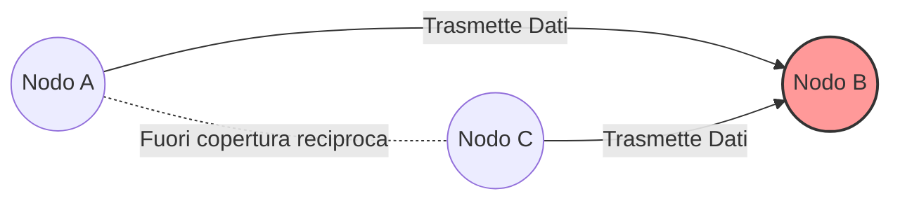

# 01 - Fondamenti Wireless e Protocolli MAC

L'introduzione alle reti senza fili segna un passaggio fondamentale nello studio delle telecomunicazioni, delineando il confine tra il mondo statico dei cavi e l'ubiquità della connettività mobile. Questo documento esplora le basi fisiche e architetturali delle reti wireless, le sfide intrinseche alla propagazione dei segnali radio, fino all'evoluzione dei protocolli MAC, partendo dal CSMA/CD cablato per arrivare alle complesse dinamiche del CSMA/CA e dello standard IEEE 802.11 (Wi-Fi).

***

## 1. Fondamenti delle Reti Wireless

### Perché le Reti Wireless
Tradizionalmente, i cavi nei computer sono stati impiegati per due scopi primari: comunicare e fornire energia. L'evoluzione tecnologica ha portato alla nascita dei **Sistemi Cyber-Fisici** (*Cyber-Physical Systems*), che integrano capacità di calcolo, sensori, meccanismi di controllo e funzionalità di rete direttamente all'interno di oggetti fisici. Poiché è materialmente impossibile cablare ogni singolo oggetto fisico, la tecnologia si è adattata: le reti wireless sostituiscono i cavi per le telecomunicazioni, mentre le batterie rimpiazzano i cavi per l'alimentazione elettrica.

### Elementi di una Rete Wireless
Una rete wireless è costituita da:
- **Host wireless**: dispositivi finali (*end-system*) che eseguono le applicazioni (smartphone, tablet, laptop, sensori, elettrodomestici smart, veicoli). Sono spesso a batteria e stazionari o mobili.
- **Stazione Base** (*Base Station* o Access Point): responsabile dell'invio e della ricezione dei dati da e verso gli host associati. Funge da relè, essendo tipicamente connessa a una rete cablata più ampia.
- **Collegamenti wireless** (*Wireless Links*): connettono i dispositivi alla stazione base e sono usati come collegamenti di backhaul. Poiché il canale è condiviso, un protocollo di accesso multiplo coordina l'accesso (FDMA, TDMA, CDMA, CSMA/CA). Un singolo dispositivo oggi ha diverse interfacce radio (WiFi, Bluetooth, 5G, ecc.).

> [!warning] Wireless ≠ Mobile
> È fondamentale sfatare un equivoco comune: **wireless non implica necessariamente mobilità** ($wireless \neq mobile$). Un dispositivo può essere connesso senza fili pur rimanendo fisso. Mobilità e assenza di cavi sono dimensioni ortogonali.

### Tassonomia e Prestazioni
Le reti wireless possono essere classificate incrociando la presenza/assenza di un'infrastruttura e il numero di salti (*hop*):

| Modalità | Infrastruttura | Hop | Esempi |
|---|---|---|---|
| **Single-hop con infrastruttura** | Sì | 1 | WiFi, 4G/5G |
| **Multi-hop con infrastruttura** | Sì | >1 | WiFi Mesh, TETRA |
| **Single-hop senza infrastruttura** | No | 1 | Bluetooth |
| **Multi-hop senza infrastruttura** | No | >1 | ZigBee, MANET, VANET |

Nella configurazione con infrastruttura, l'**Handoff** permette a un dispositivo di cambiare stazione base senza perdere la connessione.
Prestazionalmente, c'è un compromesso tra tasso di trasferimento e copertura (es. 802.11ax a corto raggio fino a 14 Gbps vs 4G/5G a lungo raggio).

***

## 2. Fisica dei Segnali Radio

### Onde Elettromagnetiche e Modulazione
La comunicazione wireless si basa sull'induzione di correnti tramite campi elettromagnetici. Le **onde elettromagnetiche** si propagano alla velocità della luce e sono caratterizzate da:
- **Lunghezza d'onda** ($\lambda$): distanza spaziale tra due picchi successivi.
- **Tempo di ciclo**: tempo intercorso tra due picchi successivi.
- **Frequenza**: inverso del tempo di ciclo (in Hz), calcolabile come $c/\lambda$.

Un concetto fondamentale è la **fase** (*Phase*), che indica la posizione del segnale nel suo ciclo a un dato istante $t$ (da 0° a 360°). Alterando la fase è possibile codificare informazioni binarie (es. **Phase Shift Keying**).

### Potenza, Banda e Capacità di Shannon
La forza del segnale è la sua **Potenza** (energia per unità di tempo). Si misura in scala lineare (mW) o logaritmica (dBm):
$$P_{dBm}=10\cdot \log_{10}\left(\frac{P_{mW}}{1\,\text{mW}}\right)$$
*(Es. 250 mW equivalenti a 24 dBm).*

L'occupazione dello spettro è la **Densità Spettrale di Potenza** (PSD). La **Larghezza di Banda** (*Bandwidth*) indica l'estensione in Hz del range di frequenze utilizzato attorno a una portante.

Il segnale deve scontrarsi con il rumore e l'interferenza. Il **Rapporto Segnale-Rumore** (*SNR*) si misura in dB:
$$SNR_{dB}=10\cdot \log_{10}\left(\frac{\text{received signal power}}{\text{noise power}}\right)$$

> [!note] La banda ISM 2.4 GHz e il problema dell'affollamento
> La banda a 2.4 GHz, nota come **banda ISM** (*Industrial, Scientific and Medical*), è non licenziata ed estremamente affollata: ospita dispositivi WiFi, Bluetooth, ZigBee, forni a microonde e droni. Questo la rende molto soggetta a interferenze.

> [!definition] Shannon Capacity
> Definisce il limite massimo teorico della velocità dati su un canale in funzione di banda e SNR:
> $$C = B \cdot \log_{2}\!\left(1 + \frac{\text{received signal power}}{\text{noise power}}\right)$$
> Dove $C$ è la capacità in bit/s e $B$ la larghezza di banda in Hz.

> [!tip] Il trade-off tra SNR e modulazione
> La capacità scala **linearmente** con la banda, ma solo **logaritmicamente** con l'SNR. Non conviene aumentare la potenza a dismisura; si preferisce adattare lo schema di modulazione all'SNR (es. BPSK robusta per SNR bassi, QAM-256 veloce per SNR elevati).

***

## 3. Le Sfide della Propagazione e Problemi Strutturali

La natura delle onde radio introduce severe sfide per il livello fisico e MAC, non presenti nel cavo.

### Path Loss e Multipath
1. **Path Loss** (o *fading*): Il segnale si attenua decadendo secondo la proporzione $1/(f \cdot d)^n$, dove $f$ è la frequenza e $d$ la distanza ($n$ va da 2 a 6 a seconda dell'ambiente). Frequenze più alte si attenuano più rapidamente.
   A causa dell'attenuazione, il segnale emesso (il *self-signal*) è infinitamente più forte di qualsiasi segnale in arrivo. Questo **acceca il trasmettitore**, impedendogli di rilevare collisioni mentre trasmette. Nelle reti wireless, l'unica interferenza che conta è quella **al ricevitore**.
2. **Multipath**: Il segnale si riflette, viene diffratto e disperso dagli ostacoli. Al ricevitore arrivano "echi" sfalsati temporalmente. Per evitare interferenze tra pacchetti consecutivi, serve una guardia temporale detta **Tempo di Coerenza** (*Coherence Time* — $T_c$), inversamente proporzionale alla frequenza e alla mobilità del nodo.

*Fonte: Wikimedia Commons — Il trasmettitore invia il segnale attraverso un percorso diretto e percorsi riflessi dagli edifici, causando echi.*

### Il Problema del Terminale Nascosto (Hidden Terminal)

> [!definition] Terminale Nascosto (Hidden Terminal)
> Si verifica quando due o più stazioni, reciprocamente fuori dal raggio radio, trasmettono simultaneamente a un destinatario comune, causando una collisione al ricevitore invisibile ai mittenti.

Se A e C vogliono comunicare con B, ma sono fuori portata tra loro, entrambi crederanno il canale libero, sovrapponendosi in B.

*Fonte: Wikimedia Commons — I nodi A e C non si trovano nel reciproco raggio di copertura, ma entrambi raggiungono B.*

### Il Problema del Terminale Esposto (Exposed Terminal)

> [!definition] Terminale Esposto (Exposed Terminal)
> Una stazione rinuncia inutilmente a trasmettere perché rileva il segnale di una stazione vicina, pur non essendoci alcun rischio di collisione ai rispettivi ricevitori.

Se B trasmette ad A, e C desidera trasmettere a D. C ascolta B e, applicando il CSMA ciecamente, non trasmette per paura di collidere. In realtà le due comunicazioni potrebbero avvenire in parallelo.

***

## 4. I Protocolli MAC: Dalle Reti Cablate al Wireless

### I Limiti del CSMA/CD Cablato
Nelle reti cablate (Ethernet 802.3) il protocollo base è il **CSMA/CD** (*Carrier Sense Multiple Access with Collision Detection*):
- **Carrier Sense**: si ascolta prima di trasmettere.
- **Collision Detection**: se avviene una collisione in fase di trasmissione, si interrompe subito l'invio, risparmiando banda.
- Per rilevare collisioni, il frame deve durare almeno il Round Trip Time ($2T$). (Es: a 10 Mbps per $2T = 51.2\,\mu s$ serve un frame di almeno 64 byte).
- Se avviene collisione, si applica il **Binary Exponential Backoff** (attesa casuale in contention slots incrementali).

Nel mondo wireless, non potendo "ascoltare mentre si parla" (a causa del Path Loss) ed essendoci i problemi di terminale nascosto/esposto, il CSMA/CD è inutilizzabile.

### I Protocolli MACA e MACAW (Collision Avoidance)
Phil Karn (1990) propose il **MACA** (*Multiple Access with Collision Avoidance*). Non mira a rilevare collisioni, ma a **prevenirle** prenotando il canale.

#### Il Meccanismo RTS / CTS
Si basa su un handshake preventivo:
1. **RTS (Request To Send)**: A invia a B un pacchetto breve indicando la durata della trasmissione dati futura. *Le stazioni nel raggio di A lo sentono.*
2. **CTS (Clear To Send)**: B risponde con un CTS che conferma la durata. *Le stazioni nel raggio di B lo sentono.*
3. A riceve il CTS e invia i dati con sicurezza.

Questa strategia risolve brillantemente le due criticità topologiche:
- **Gestione dell'Esposto**: Sente l'RTS ma non il CTS. Capisce che la ricezione avverrà lontano, ed è libero di trasmettere.
- **Gestione del Nascosto**: Non sente l'RTS ma sente il CTS del destinatario. Capisce che causerebbe interferenze e si zittisce disciplinatamente.

Le collisioni possono esserci solo tra RTS piccoli (nessun dato è perso). In seguito, il protocollo **MACAW** migliorò il MACA introducendo il frame di conferma esplicita **ACK** (vitale nei canali radio inclini a errori). Queste basi formano il moderno CSMA/CA.

***

## 5. Lo Standard IEEE 802.11 (Wi-Fi) e CSMA/CA

La famiglia **IEEE 802.11** (Wi-Fi) definisce le WLAN a livello MAC e Fisico (PHY). Le reti operano tipicamente nelle bande ISM (2.4 GHz) o U-NII (5, 6 GHz).

### L'Evoluzione della Famiglia 802.11
- **802.11 (Legacy)**: (1997) 1-2 Mbps, obsoleto.
- **802.11a/b/g**: tra il 1999 e 2003, coprono i 2.4 GHz e 5 GHz con velocità da 11 a 54 Mbps.
- **802.11n (WiFi 4)**: (2009) 600 Mbps. Introduce la tecnologia **MIMO** (più antenne in TX/RX).
- **802.11ac (WiFi 5)**: (2013) 3.47 Gbps massimi sui 5 GHz.
- **802.11ax (WiFi 6)**: (2020) Fino a 14 Gbps. Ottimizzato per alta densità, opera anche a 6 GHz.
- **802.11af / ah**: varianti a basse frequenze (TV, 900 MHz) per lungo raggio/IoT.

|**Standard**|**Anno**|**Max Data Rate**|**Frequenza**|
|---|---|---|---|
|**802.11b/g**|1999-2003|11 - 54 Mbps|2.4 GHz|
|**802.11n (WiFi 4)**|2009|600 Mbps|2.4, 5 GHz|
|**802.11ac (WiFi 5)**|2013|3.47 Gbps|5 GHz|
|**802.11ax (WiFi 6)**|2020|14 Gbps|2.4, 5, 6 GHz|

### Elementi Architetturali: BSS ed ESS
Il blocco logico fondamentale è il **BSS (Basic Service Set)**. Può operare come:
1. **Rete Ad-Hoc**: senza infrastruttura, i nodi sono peer-to-peer.
2. **Rete Infrastrutturata**: c'è un **AP (Access Point)**. Tutte le comunicazioni passano per l'AP.
Più BSS interconnessi formano un **ESS (Extended Service Set)** tramite un Distribution System (DS).

L'associazione host-AP avviene per **Scansione Passiva** (ascolto di beacon automatici) o **Scansione Attiva** (invio di Probe Request broadcast).

### Il Sottolivello MAC 802.11
Il livello MAC è governato da due funzioni:
- **PCF (Point Coordination Function)**: centralizzato e contention-free (opzionale).
- **DCF (Distributed Coordination Function)**: obbligatorio e universale, basato su CSMA/CA distribuito e contention-based.

#### Carrier Sensing: Fisico e Virtuale (NAV)
Nel CSMA/CA si usa il Carrier Sensing su due livelli prima di trasmettere:
1. **Sensore Fisico**: rileva l'energia elettromagnetica nel canale.
2. **Sensore Virtuale (NAV - Network Allocation Vector)**: timer logico che si basa sulla durata dichiarata all'interno dei pacchetti altrui (RTS/CTS/Dati). Quando il NAV è attivo, il canale è considerato virtualmente occupato per tutta la transazione in corso.
Basta che uno dei due sensori dia esito "occupato" per inibire la trasmissione.

#### Interframe Spaces (IFS) e Priorità
L'accesso al mezzo è regolato da tempi obbligatori di inattività:
- **DIFS (Distributed IFS)**: tempo di attesa "lungo" di default prima di avviare una trasmissione normale.
- **SIFS (Short IFS)**: tempo "brevissimo", usato esclusivamente prima di messaggi critici (CTS o ACK). Poiché rigorosamente **SIFS < DIFS**, chi ha appena ricevuto un pacchetto può inviare subito il suo ACK/CTS, rubando priorità a chiunque altro stia aspettando il termine del DIFS.

#### L'Algoritmo CSMA/CA in Azione
1. **Attesa**: Se il canale è ininterrottamente libero per un DIFS, l'host trasmette.
2. **Backoff**: Se è occupato, fa partire un timer casuale di backoff. Il timer decresce *solo* se il canale è libero; si congela se occupato. Quando arriva a zero (e trascorre un DIFS), trasmette.
3. **ACK**: Se i dati arrivano a destinazione intatti, il ricevitore aspetta un SIFS e risponde con un **ACK**.
4. **Collisione/Fallimento**: Se l'ACK non giunge, il mittente deduce il fallimento, innesca la penalità raddoppiando l'intervallo di backoff (Binary Exponential Backoff) e riprova l'invio.

#### RTS/CTS nel DCF
Il meccanismo RTS/CTS è un'opzione preziosa per evitare spreco di enormi pacchetti Dati (soggetti a collisioni). La sua attivazione (RTS Threshold) può essere impostata su *Mai* (traffico scarso), *Soglia* (solo per grandi payload) o *Sempre* (alta congestione/nodi nascosti).

***

> [!question] Possibili domande d'esame
> - Qual è la differenza tra rete single-hop e multi-hop con infrastruttura?
> - Perché il CSMA/CD non può essere applicato nelle reti wireless? Quale protocollo lo sostituisce e con quale logica?
> - Definire la Shannon Capacity e spiegare perché la capacità scala logaritmicamente con l'SNR e non linearmente.
> - Descrivere il problema del terminale nascosto ed esposto e come il meccanismo RTS/CTS li risolve.
> - Cosa si intende per Multipath e Coherence Time?
> - Come operano il Carrier Sensing Virtuale e il NAV?
> - Perché è essenziale che il tempo SIFS sia minore del DIFS?
> - Qual è il ruolo dell'ACK e del Backoff Esponenziale in CSMA/CA?
