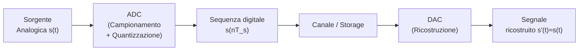

# 02 - Teoria dei Segnali: Introduzione, Fourier, Campionamento e DFT

## Perché la Teoria dei Segnali?

I sistemi moderni — reti mobili 4G/5G, dispositivi IoT, sistemi audio — elaborano **segnali** per rappresentare e trasmettere informazione. Capire come questi segnali sono strutturati, come vengono disturbati dal canale trasmissivo, e come possono essere analizzati e trasformati è il fondamento dell'ingegneria delle comunicazioni digitali.

La teoria dei segnali serve a quattro scopi pratici fondamentali. Il primo è **estrarre informazione**: identificare frequenze, pattern ed eventi rilevanti (es. riconoscimento vocale, analisi di segnali biomedici). Il secondo è **rimuovere effetti indesiderati**: filtrare il rumore, compensare distorsioni del canale, mitigare il fading multipath nelle reti wireless. Il terzo è **trasmettere efficientemente l'informazione**: codificare i segnali per il canale (es. OFDM in 4G/5G che distribuisce i dati su più frequenze). Il quarto è **abilitare l'elaborazione digitale**: convertire segnali analogici in forma digitale tramite campionamento e quantizzazione.

*Fig. — Dalla sorgente analogica ai bit: campionamento (discretizzazione nel tempo), quantizzazione (discretizzazione dell'ampiezza), codifica binaria.*

***

## Classificazione dei Segnali

> [!definition] Segnale
>
> Un segnale è una variazione di una grandezza fisica che porta informazione. Formalmente è una funzione $f(t): \mathfrak{D} \longrightarrow \mathfrak{C}$ dove il dominio $\mathfrak{D}$ può essere $\mathbb{R}$ (tempo continuo) o $\mathbb{Z}$ (tempo discreto), e il codominio $\mathfrak{C}$ può essere $\mathbb{R}$ (ampiezza continua) o un insieme discreto (ampiezza quantizzata).

Ci concentriamo su **segnali deterministici monodimensionali**: la variabile indipendente è il tempo, e il segnale è noto prima di essere prodotto (al contrario dei segnali aleatori, analizzati con metodi probabilistici).

### Segnali a Tempo Continuo

Quando il dominio è $\mathbb{R}$, il segnale è detto **analogico** (*analog*). Se anche il codominio è $\mathbb{R}$, l'ampiezza è continua; se il codominio è un insieme discreto (es. $\mathbb{Z}$), l'ampiezza è quantizzata.

*Fig. — In alto: segnale analogico, continuo in tempo e ampiezza. In basso: segnale continuo in tempo ma quantizzato in ampiezza (segnale a gradini).*

### Segnali a Tempo Discreto

Quando il dominio è $\mathbb{Z}(T) = \{nT, \forall n \in \mathbb{Z}, T \in \mathbb{R}\}$, il segnale è detto **discreto**. Ad esempio $\mathbb{Z}(2) = \{\ldots, -4, -2, 0, 2, 4, \ldots\}$. Un segnale discreto con ampiezza presa da un insieme finito di simboli è detto **digitale** (*digital*), o sequenza simbolica.

*Fig. — In alto: segnale discreto con ampiezza continua. In basso: segnale digitale, discreto sia nel tempo che nell'ampiezza.*

### Tabella Riepilogativa

| Tempo | Ampiezza | Tipo |
|---|---|---|
| Continuo ($\mathbb{R}$) | Continua ($\mathbb{R}$) | Segnale analogico |
| Continuo ($\mathbb{R}$) | Discreta ($\mathbb{Z}$) | Segnale quantizzato |
| Discreto ($\mathbb{Z}(T)$) | Continua ($\mathbb{R}$) | Segnale discreto |
| Discreto ($\mathbb{Z}(T)$) | Discreta (insieme finito) | Segnale digitale |

### Bitrate di una Sorgente Digitale

Quando un segnale analogico viene convertito in digitale con frequenza di campionamento $f_c$ campioni/secondo e ogni campione è codificato con $M$ bit:

$$\text{Bitrate} = f_c \cdot M \quad [\text{bit/secondo}]$$

Maggiori $f_c$ e $M$ producono migliore fedeltà ma richiedono maggiore capacità trasmissiva.

***

## Trasmissione e Canale

### Il Modello del Canale

Nella trasmissione di informazione, un trasduttore alla sorgente converte un messaggio in un segnale fisico (es. un'antenna converte energia elettrica in onde elettromagnetiche), il segnale si propaga attraverso il mezzo, e un trasduttore alla destinazione converte il segnale di ritorno in messaggio. Il **canale** non è un mezzo ideale: agisce come un sistema che modifica il segnale.

Le principali forme di degrado sono la **distorsione** (variazione della forma d'onda, es. attenuazione differenziata per frequenza), la **propagazione multipath** (il segnale raggiunge il ricevitore attraverso percorsi multipli con ritardi diversi, causando interferenza), e il **rumore** (segnale indesiderato sovrapposto a quello utile).

> [!definition] SNR — Signal-to-Noise Ratio
>
> Il rapporto segnale-rumore misura la qualità del segnale ricevuto rispetto al rumore di fondo:
> $$SNR_{dB} = 10 \log_{10} \frac{P_{signal}}{P_{noise}}$$

### Teorema di Shannon

Il risultato fondamentale della teoria dell'informazione stabilisce la capacità massima di un canale:

$$C = B \log_2 (1 + SNR)$$

dove $B$ è la banda disponibile in Hz, $SNR$ il rapporto segnale-rumore, e $C$ la capacità del canale in bit/secondo. Questo crea un trade-off inevitabile: ridurre la distorsione di quantizzazione alla sorgente aumenta la quantità di informazione da trasmettere, che deve rientrare entro la capacità $C$.

***

## Serie di Fourier: dal Tempo alla Frequenza

### L'Intuizione Fondamentale

Un segnale periodico può essere visto come una sovrapposizione di componenti sinusoidali, ciascuna con frequenza, ampiezza e fase specifiche. Questo cambio di prospettiva — dal dominio del tempo al **dominio della frequenza** — è cruciale perché il canale trasmissivo agisce in modo diverso su componenti a frequenza diversa. Per analizzare e predire tale comportamento, occorre identificare esplicitamente le componenti frequenziali di un segnale.

La serie di Fourier decompone una funzione come somma di infinite funzioni oscillanti a frequenze diverse. È formalmente un cambio di coordinate: dal dominio del tempo a quello della frequenza. La base di questa decomposizione è un insieme di funzioni $\varphi_n(t)$ ortogonali, analogamente alla decomposizione di un vettore in uno spazio vettoriale.

*Fig. — Un segnale si costruisce sommando componenti sinusoidali: la componente costante ($s_0$), la fondamentale ($s_1$) e le armoniche superiori ($s_2, s_3, s_4$). Cambiare i coefficienti cambia il segnale risultante.*

### Segnali Periodici Continui

Un segnale continuo $s(t): \mathbb{R} \to \mathbb{R}$ è **periodico con periodo $T$** se

$$s(t) = s(t + T) \quad \forall t \in \mathbb{R}$$

I segnali periodici si possono studiare interamente nell'intervallo $[0, T]$. La frequenza fondamentale è $f = 1/T$. Un segnale non periodico è detto **aperiodico**.

### Definizione della Serie di Fourier

> [!definition] Serie di Fourier (intervallo $[-\pi, \pi]$)
>
> Data una funzione continua $s(t): \mathbb{R} \to \mathbb{R}$ periodica in $[-\pi, \pi]$:
> $$s(t) = \frac{1}{2} a_0 + \sum_{n=1}^{\infty} \left( a_n \cos(nt) + b_n \sin(nt) \right)$$
> con coefficienti:
> $$a_0 = \frac{1}{\pi} \int_{-\pi}^{\pi} s(t)\, dt \qquad a_n = \frac{1}{\pi} \int_{-\pi}^{\pi} s(t) \cos(nt)\, dt \qquad b_n = \frac{1}{\pi} \int_{-\pi}^{\pi} s(t) \sin(nt)\, dt$$

Il termine $\frac{1}{2} a_0$ è la **componente continua** (media del segnale); i termini $a_n \cos(nt) + b_n \sin(nt)$ sono le **armoniche** di frequenza $n/T$.

### Condizioni di Dirichlet

La serie di Fourier non è definita per qualsiasi funzione. Non sono note le condizioni necessarie, ma esistono condizioni **sufficienti** (teorema di Dirichlet):

> [!theorem] Teorema di Dirichlet
>
> Se $s(t)$ è periodica e **piecewise continuous** (composta da un numero finito di pezzi continui su ogni sottointervallo finito, con limite finito nei punti di discontinuità), allora la serie di Fourier di $s(t)$ esiste e converge in $\mathbb{R}$.

### Esempio: Onda Quadra

Consideriamo il segnale periodico con periodo $2\pi$:

$$s(t) = \begin{cases} 2 & \text{se } -\pi < t < 0 \\ 1 & \text{se } 0 \le t \le \pi \end{cases}$$

Il calcolo dei coefficienti porta a:

$$a_0 = 3, \qquad a_n = 0, \qquad b_n = \begin{cases} 0 & \text{se } n \text{ pari} \\ -\frac{2}{n\pi} & \text{se } n \text{ dispari} \end{cases}$$

La serie risultante, ponendo $n = 2k-1$, è:

$$s(t) = \frac{3}{2} - \sum_{k=1}^{\infty} \frac{2}{(2k-1)\pi} \sin\bigl((2k-1)t\bigr)$$

Solo le armoniche **dispari** contribuiscono, e la loro ampiezza cala come $1/n$.

### Fenomeno di Gibbs

Quando la serie di Fourier approssima una funzione con discontinuità (come un'onda quadra), si osserva un **overshoot** intorno ai punti di salto che non scompare mai, per quanto si aumenti il numero di armoniche. Questo è il **fenomeno di Gibbs**: la serie converge in senso $L^2$, ma nelle vicinanze di ogni discontinuità l'errore rimane del ~9% del salto, indipendentemente dall'ordine di troncamento.

*Fig. — Fenomeno di Gibbs: aggiungere più armoniche riduce le oscillazioni nel tratto piatto, ma l'overshoot al salto rimane costante (~9% del salto).*

***

## Serie di Fourier con Periodo Arbitrario

La definizione si estende naturalmente a segnali con periodo generico $T$. Tramite la sostituzione $y = 2\pi t / T$, un segnale periodico in $[-T/2, T/2]$ si trasforma in uno periodico in $[-\pi, \pi]$, e i coefficienti diventano:

$$s(t) = \frac{1}{2} a_0 + \sum_{n=1}^{\infty} \left( a_n \cos\frac{2\pi n t}{T} + b_n \sin\frac{2\pi n t}{T} \right)$$

con

$$a_0 = \frac{2}{T} \int_{-T/2}^{T/2} s(t)\, dt \qquad a_n = \frac{2}{T} \int_{-T/2}^{T/2} s(t) \cos\frac{2\pi n t}{T}\, dt \qquad b_n = \frac{2}{T} \int_{-T/2}^{T/2} s(t) \sin\frac{2\pi n t}{T}\, dt$$

***

## Numeri Complessi e Formula di Eulero

Prima di passare alla forma esponenziale della serie, è necessario richiamare i **numeri complessi**. Un numero complesso $\bar{x} = a + jb$ ha parte reale $a$ e parte immaginaria $b$ (con $j = \sqrt{-1}$). Nel piano complesso è rappresentato come un vettore di modulo $|\bar{x}| = \sqrt{a^2 + b^2}$ e fase $\varphi = \tan^{-1}(b/a)$.

> [!definition] Formula di Eulero
>
> $$e^{\pm j\varphi} = \cos\varphi \pm j\sin\varphi$$
>
> Da cui si derivano le formule inverse:
> $$\cos\varphi = \frac{e^{j\varphi} + e^{-j\varphi}}{2} \qquad \sin\varphi = \frac{e^{j\varphi} - e^{-j\varphi}}{2j}$$

Usando l'esponenziale di Eulero, ogni numero complesso si scrive compattamente come $\bar{x} = |x| e^{j\varphi}$, che combina modulo e fase in un unico termine. Questo è particolarmente potente per rappresentare segnali: ampiezza e fase di ogni armonica vengono codificate in un unico coefficiente complesso.

***

## Serie di Fourier in Forma Esponenziale

### La Base Esponenziale

La serie di Fourier generalizzata al dominio complesso usa come base l'insieme di funzioni:

$$e^{j2\pi n F t} \quad \forall n \in \mathbb{Z}$$

poiché $e^{j2\pi n F t} = \cos(2\pi n F t) + j\sin(2\pi n F t)$, ogni elemento della base è una sinusoide complessa alla frequenza $nF$.

> [!definition] Serie di Fourier esponenziale
>
> Dato un segnale periodico $s(t) = s(t+T)$ con frequenza fondamentale $F = 1/T$:
> $$s(t) = \sum_{n=-\infty}^{+\infty} S_n \, e^{j2\pi n F t}$$
>
> dove i coefficienti $S_n$ (in generale complessi) si calcolano come:
> $$S_n = \frac{1}{T} \int_{0}^{T} s(t) \, e^{-j2\pi n F t}\, dt$$

I coefficienti $S_n$ codificano sia ampiezza che fase di ogni armonica: $S_n = |S_n| e^{j\phi_n}$, dove $|S_n|$ è l'ampiezza e $\phi_n = \arg(S_n)$ è la fase dell'armonica $n$-esima.

### Interpretazione Geometrica

Per $n = 0$: la componente continua (media del segnale), $S_0 = \frac{1}{T}\int_0^T s(t)\, dt$.  
Per $n = \pm 1$: frequenza fondamentale $F$, periodo $T$.  
Per $|n| > 1$: armoniche di frequenza $nF$, periodo $T/n$.

> [!tip] Perché la forma complessa?
>
> Con i numeri reali occorrono due coefficienti ($a_n$ e $b_n$) per descrivere ogni armonica. Con la forma complessa basta un solo coefficiente $S_n$ che ne racchiude entrambi. Questo semplifica enormemente la manipolazione matematica e consente di rappresentare segnali $s(t): \mathbb{R} \to \mathbb{C}$, generalizzando la serie per funzioni reali.

### Esempio: Onda Rettangolare con Base Esponenziale

Consideriamo il segnale di periodo $T$ e frequenza $F = 1/T$:

$$s(t) = \begin{cases} 1 & \text{se } |t| \le T/4 \\ 0 & \text{se } T/4 < |t| \le T/2 \end{cases}$$

Il calcolo dei coefficienti dà:

$$S_n = \begin{cases} 1/2 & n = 0 \\ 0 & n \text{ pari} \\ \dfrac{(-1)^k}{-(2k-1)\pi} & n = 2k-1 \end{cases}$$

La serie risultante è quindi:

$$s(t) = \frac{1}{2} + \sum_{k=-\infty}^{+\infty} -\frac{(-1)^k}{(2k-1)\pi} \cos\bigl(2\pi(2k-1)Ft\bigr)$$

Il grafico seguente mostra la convergenza della serie per $T=4$ con $k \in [-1,1]$ (verde), $k \in [-2,2]$ (rosso) e $k \in [-100,100]$ (blu):

*Fig. — Al crescere del numero di armoniche considerate (verde → rosso → blu) la serie converge all'onda rettangolare. La forma in blu con k=100 è quasi perfetta, con il solo fenomeno di Gibbs ai salti.*

***

## Lo Spettro di un Segnale

La sequenza ordinata dei coefficienti $\{S_n\}_{n=-\infty}^{+\infty}$ è chiamata **spettro** del segnale. Conoscere lo spettro equivale a conoscere il segnale (dove $s(t)$ è continua; nei punti di discontinuità vale la media dei limiti laterali, per il teorema di Dirichlet).

Poiché i coefficienti $S_n$ sono in generale numeri complessi anche quando $s(t)$ è reale, lo spettro non può essere rappresentato con un singolo grafico 2D. Si usano invece due diagrammi separati, sfruttando la rappresentazione $S_n = |S_n| e^{j\theta_n}$:

- **Spettro di ampiezza**: il grafico di $|S_n|$ in funzione di $n$ (o della frequenza $nF$)
- **Spettro di fase**: il grafico di $\theta_n = \arg(S_n)$ in funzione di $n$

> [!example] Spettro dell'onda quadra antisimmetrica
>
> Per il segnale $s(t) = -1$ se $0 < t \le T/2$, $s(t) = 1$ se $T/2 < t \le T$, i coefficienti sono:
> $$S_n = \begin{cases} 0 & n \text{ pari} \\ \dfrac{2}{n\pi} e^{j\pi/2} & n > 0, \text{ dispari} \\ -\dfrac{2}{n\pi} e^{-j\pi/2} & n < 0, \text{ dispari} \end{cases}$$
> Lo spettro di ampiezza decade come $2/(|n|\pi)$ per gli indici dispari; lo spettro di fase è costante a $+\pi/2$ per $n > 0$ e $-\pi/2$ per $n < 0$.

***

## Segnali Aperiodici e Supporto Limitato

Anche per i segnali aperiodici con supporto limitato a $[a, b)$ — cioè $s(t) = 0$ per $t \notin [a,b)$ — è possibile calcolare la serie di Fourier. Tuttavia, la serie assume implicitamente che il segnale sia periodico con periodo $T = b - a$. La conseguenza è che, invertendo la serie (da $S_n$ a $s(t)$), si ottiene l'**estensione periodica** del segnale originale, non il segnale aperiodico stesso.

$$s^*(t) = \sum_{n=-\infty}^{+\infty} s(t - nT)$$

Questo passaggio è cruciale: la serie di Fourier non può rappresentare segnali davvero aperiodici. Per questi occorre la **Trasformata di Fourier**, che è in un certo senso il limite della serie di Fourier per $T \to \infty$.

***

## Trasformata di Fourier

### Dal Discreto al Continuo: Passaggio dalla Serie alla Trasformata

La serie di Fourier funziona bene per segnali periodici: rappresenta il segnale come somma di armoniche a frequenze discrete $nF = n/T$. Ma la stragrande maggioranza dei segnali reali di interesse — impulsi, transitori, frammenti audio, burst radio — non sono periodici. Come estendere l'analisi in frequenza a questi segnali?

L'idea è elegante: si considera il segnale non periodico come il limite di un segnale periodico il cui periodo $T$ tende all'infinito. Quando $T$ cresce, la frequenza fondamentale $F = 1/T$ diminuisce, e le armoniche discrete $nF$ si avvicinano sempre di più tra loro. Nel limite $T \to \infty$, la spaziatura tra le armoniche $\Delta_f = 1/T \to 0$ e lo spettro discreto diventa uno **spettro continuo**.

*Fig. — Segnale periodico e relativo spettro discreto. All'aumentare di T, le righe spettrali si avvicinano. Prendendo il limite T→∞ si ottiene lo spettro continuo.*

*Fig. — Quando T→∞, il segnale "dimentica" la propria periodicità e lo spettro |X_D(f)| diventa una funzione continua della frequenza.*

> [!definition] Trasformata Continua di Fourier (CFT)
>
> Un segnale non periodico $s(t)$ può essere espresso come:
>
> $$s(t) = \int_{-\infty}^{+\infty} S(f)\, e^{j2\pi ft}\, df$$
>
> dove $S(f)$ è la **densità spettrale complessa**, data dalla trasformata diretta:
>
> $$S(f) = \mathcal{F}(s(t)) = \int_{-\infty}^{+\infty} s(t)\, e^{-j2\pi ft}\, dt$$
>
> Si scrive in forma compatta $s(t) \Longleftrightarrow S(f)$.

A differenza della serie di Fourier — che produce un insieme **discreto** di coefficienti $S_n$ — la CFT produce uno spettro **continuo** $S(f)$ definito su tutte le frequenze reali $f \in (-\infty, +\infty)$.

### Esempio: Segnale Pulsato

Consideriamo il segnale rettangolare:

$$s(t) = \begin{cases} 1 & \text{se } |t| \leq T/2 \\ 0 & \text{altrimenti} \end{cases}$$

La sua trasformata continua di Fourier si calcola analiticamente:

$$S(f) = \int_{-T/2}^{T/2} e^{-j2\pi ft}\, dt = T \cdot \text{sinc}(\pi f T) = \frac{\sin(\pi f T)}{\pi f}$$

Il risultato è una funzione **sinc** nel dominio della frequenza. Un fatto cruciale è che all'aumentare di $T$ (impulso più largo nel tempo), lo spettro si restringe in frequenza, e viceversa. Questo è il principio di **incertezza tempo-frequenza**: un segnale non può essere contemporaneamente concentrato sia nel tempo che in frequenza.

*Fig. — Spettri del segnale pulsato al variare della durata T. All'aumentare di T il lobo principale della sinc si restringe, riflettendo il principio di incertezza tempo-frequenza.*

*Fig. — Segnale pulsato con T=20: il segnale nel dominio del tempo (rettangolo di ampiezza 1 e durata 20) e il corrispondente spettro S(f)=sin(20πf)/(πf).*

### Banda di un Segnale e Filtraggio

Lo spettro di un segnale generico si estende su tutte le frequenze in $(-\infty, +\infty)$. Tuttavia, nella pratica non tutte le componenti frequenziali sono ugualmente utili o necessarie. Filtrare un segnale significa **selezionare un sottoinsieme delle sue componenti spettrali**. Le motivazioni principali sono:

- alcune frequenze contengono l'informazione rilevante, altre corrispondono a rumore o interferenze
- i canali di comunicazione hanno banda disponibile limitata
- si vuole separare segnali che si sovrappongono in frequenza

I filtri principali sono:
- **Filtro passa-basso** (*low-pass*): lascia passare le frequenze sotto una soglia $f_c$, blocca le alte frequenze
- **Filtro passa-alto** (*high-pass*): lascia passare le frequenze sopra $f_c$, blocca le basse
- **Filtro passa-banda** (*band-pass*): lascia passare le frequenze in un intervallo $[f_1, f_2]$

> [!example] Filtraggio del segnale pulsato
>
> Consideriamo il segnale rettangolare con $T=20$ e il suo spettro $S(f) = \sin(20\pi f)/(\pi f)$.

*Fig. — Filtro passa-basso (soglia 0.5 Hz): lo spettro viene troncato alle basse frequenze. La ricostruzione nel dominio del tempo riproduce approssimativamente la forma del rettangolo, con arrotondamento agli spigoli.*

*Fig. — Filtro passa-alto (soglia 0.5 Hz): rimangono solo le componenti ad alta frequenza dello spettro. Il segnale ricostruito ha una forma oscillatoria concentrata ai bordi del rettangolo originale.*

![Applicazione di un filtro passa-banda per f∈[0.1, 0.5]](images/lezione-27-lab-teoria-dei-segnali-trasformata-di-fourier-campionamento-e-dft-img-07.jpg)
*Fig. — Filtro passa-banda (intervallo [0.1, 0.5] Hz): vengono selezionate le componenti in una fascia di frequenze. Il risultato è un segnale oscillante.*

> [!tip] Intuizione sul filtraggio
>
> Applicare un filtro nel dominio della frequenza equivale a moltiplicare lo spettro $S(f)$ per la risposta del filtro $H(f)$. Nel dominio del tempo questo corrisponde a una convoluzione del segnale con la risposta impulsiva del filtro. Le basse frequenze determinano il "contorno grossolano" del segnale; le alte frequenze determinano i dettagli fini e gli spigoli.

### Confronto: Serie di Fourier vs Trasformata

| | Serie di Fourier | Trasformata di Fourier |
|---|---|---|
| Tipo di segnale | Periodico | Non periodico |
| Spettro | Discreto (coefficienti $S_n$) | Continuo ($S(f)$) |
| Output | Insieme di coefficienti | Funzione continua di frequenza |
| Esempi tipici | Onda quadra, sinusoidi | Impulsi, transienti, frammenti audio |

***

## Da Segnale Analogico a Digitale: Campionamento e Quantizzazione

I sistemi digitali moderni (computer, smartphone, dispositivi IoT) lavorano esclusivamente con dati discreti. Un segnale analogico continuo, come una voce o un sensore di temperatura, deve essere convertito in una sequenza di valori discreti. Questo processo si articola in due fasi: **campionamento** e **quantizzazione**.

### Campionamento

**Campionare** un segnale $s(t)$ significa estrarre i valori che il segnale assume a istanti discreti regolarmente spaziati. Il parametro chiave è il **periodo di campionamento** $T_s$ (o equivalentemente la **frequenza di campionamento** $f_s = 1/T_s$):

$$g(nT_s) = s(nT_s), \quad n \in \mathbb{Z}$$

Il risultato è una sequenza di numeri reali. A differenza della quantizzazione, il campionamento — sotto opportune ipotesi — non introduce perdita di informazione.

### Quantizzazione

Mentre il campionamento opera sull'asse del tempo, la quantizzazione opera sull'asse dell'ampiezza: trasforma ogni campione reale $x \in \mathbb{R}$ in un valore intero $y \in [0, 2^R - 1]$, dove $R$ è il numero di bit del quantizzatore. Si usa un **quantizzatore scalare a $R$ bit**:

- la **risoluzione** per un segnale con valori in $[0, M]$ è $M / 2^R$
- il **bitrate** di una sorgente campionata a $f_s$ e quantizzata a $R$ bit è: $B = R \cdot f_s$ bit/s

> [!warning] Errore di quantizzazione
>
> La quantizzazione introduce un errore irreversibile: due valori analogici diversi possono essere mappati allo stesso livello digitale. Aumentare $R$ riduce l'errore (migliore fedeltà), ma aumenta il bitrate da trasmettere o memorizzare.

> [!example] Sistema telefonico analogico
>
> La voce umana ha un contenuto informativo utile fino a circa 4 kHz (limite telefonico accettabile). Quindi:
> - frequenza di campionamento: $f_s = 8$ kHz (doppio di 4 kHz, come vedremo con Nyquist)
> - quantizzazione su $R = 8$ bit per campione
> - bitrate risultante: $B = 8 \times 8000 = 64$ kbps

### Interpolazione e Ricostruzione

Dato un insieme di campioni, esistono vari metodi di ricostruzione del segnale analogico:
- **Zero-order hold**: ogni campione viene "tenuto" fino al successivo (segnale a gradini)
- **First-order hold**: interpolazione lineare tra campioni adiacenti
- **Interpolazione con seno cardinale** (*sinc interpolation*): metodo ottimale, usato nella dimostrazione del teorema di Nyquist

***

## Il Teorema di Campionamento di Nyquist-Shannon

La domanda centrale della conversione A/D è: **a quale frequenza minima devo campionare per poter ricostruire perfettamente il segnale originale?**

> [!theorem] Teorema di Nyquist-Shannon
>
> Sia $s(t)$ un segnale con spettro nullo per frequenze superiori a $f_M$ (segnale **a banda limitata**). Allora $s(t)$ è completamente determinato dai suoi campioni presi all'intervallo:
>
> $$T_s \leq \frac{1}{2f_M}$$
>
> ovvero con frequenza di campionamento $f_s \geq 2f_M$. La frequenza minima $f_N = 2f_M$ è chiamata **frequenza di Nyquist** o **tasso di Nyquist**.
>
> La ricostruzione esatta si ottiene tramite interpolazione con seno cardinale:
> $$s(t) = \sum_{n=-\infty}^{+\infty} s(nT_s) \cdot \frac{\sin(\pi f_s (t - nT_s))}{\pi f_s (t - nT_s)}$$

Il teorema richiede che il segnale sia **strettamente a banda limitata** — condizione che, come vedremo, non è mai soddisfatta dai segnali reali.

***

## Aliasing: Il Problema del Sottocampionamento

Per capire cosa succede quando si campiona troppo lentamente, bisogna guardare allo spettro del segnale campionato nel dominio della frequenza.

### FT del Segnale Campionato

Quando si campiona un segnale $s(t)$ con frequenza $f_s$, la trasformata di Fourier del segnale campionato **consiste in infinite repliche** dello spettro originale $S(f)$, centrate alle frequenze multiple di $f_s$:

$$S_c(f) = f_s \sum_{k=-\infty}^{+\infty} S(f - kf_s)$$

La spaziatura tra le repliche è pari a $f_s$: **più veloce è il campionamento, più distanti sono le repliche**.

*Fig. — Trasformata di Fourier di un segnale a banda limitata B. Quando il segnale viene campionato, lo spettro si "replica" attorno a multipli della frequenza di campionamento fs.*

*Fig. — Aumentando la frequenza di campionamento, le repliche dello spettro si allontanano. Con campionamento sufficientemente veloce (in basso), le repliche non si sovrappongono e il segnale originale è recuperabile applicando un filtro passa-basso.*

> [!definition] Aliasing
>
> L'**aliasing** è la distorsione che si verifica quando le repliche spettrali generate dal campionamento si **sovrappongono** tra loro. Quando c'è sovrapposizione, le componenti frequenziali si mescolano e il segnale originale non può più essere ricostruito univocamente.

*Fig. — Aliasing per frequenza di campionamento insufficiente: la spaziatura tra repliche è minore di 2B e le code degli spettri si sovrappongono, rendendo impossibile la ricostruzione.*

La condizione di Nyquist garantisce che **non ci sia sovrapposizione**: se $f_s \geq 2f_M$, le repliche distano almeno $2B$ e possono essere separate con un filtro passa-basso ideale.

*Fig. — Quando la condizione di Nyquist è soddisfatta (fs = 2B = 2fM), le repliche dello spettro si toccano esattamente senza sovrapporsi: il segnale originale è recuperabile con un filtro ideale.*

### Cosa Nyquist Non Ha Detto

Il teorema di Nyquist è spesso mal interpretato nella pratica. Ecco le trappole più comuni:

> [!warning] Limiti pratici del teorema di Nyquist
>
> 1. **Nessun segnale reale è strettamente a banda limitata.** Un segnale a banda strettamente limitata deve estendersi infinitamente nel tempo, il che è fisicamente impossibile. In pratica, i segnali hanno uno spettro che decade ma non si azzera mai.
>
> 2. **Campionare a $2f_M$ non basta se non si usa un filtro anti-aliasing perfetto.** I filtri reali non hanno una risposta rettangolare ideale: frequenze superiori a $f_M$ passano, seppur attenuate. Il risultato è un aliasing residuo non trascurabile.
>
> 3. **La soluzione pratica è l'oversampling**: campionare a una frequenza significativamente superiore a $2f_M$, e applicare un filtro anti-aliasing con taglio a $f_M$ (anche se non ideale, l'attenuazione supplementare è sufficiente).

> [!example] Oversampling nel telefono (old analog)
>
> Il telefono analogico tradizionale tagliava la voce a ~3 kHz (non 4 kHz) e campionava a 8 kHz: non il doppio del taglio (che sarebbe 6 kHz), ma un oversampling moderato. La differenza copre l'imperfezione del filtro e le componenti residue tra 3 e 4 kHz.

> [!note] Downsampling e segnali periodici
>
> Una curiosità: per segnali **strettamente periodici** e stabili, si può addirittura *sottocampionare* ($f_s < 2f_M$). Ogni campione cade in una fase diversa del ciclo (perché il periodo di campionamento non è un multiplo del periodo del segnale). Raccogliendo abbastanza campioni nel tempo, si coprono tutte le fasi del segnale e la ricostruzione diventa possibile. Questo funziona **solo** se il segnale non varia nel tempo.

***

## Trasformata Discreta di Fourier (DFT)

Nel contesto del **digital signal processing**, né la serie di Fourier (richiede un segnale periodico continuo) né la CFT (richiede un'integrazione continua) sono direttamente applicabili: si ha sempre un numero finito di campioni. La **DFT** è lo strumento adatto.

### Motivazione

Data una sequenza finita di $N$ campioni $s_k$ (con $k = 0, 1, \ldots, N-1$), ottenuta campionando un segnale a frequenza $f_s$ per un tempo $T = N/f_s$, si tratta il segnale discreto come se fosse **periodico con periodo $T$** e si calcola la serie di Fourier corrispondente. I coefficienti risultanti formano la DFT.

### Definizione della DFT

> [!definition] Trasformata Discreta di Fourier (DFT)
>
> Data una sequenza $s_k$ di $N$ valori ($k = 0, 1, \ldots, N-1$):
>
> **Trasformata diretta:**
> $$S_n = \sum_{k=0}^{N-1} s_k \, e^{-j2\pi nk/N}, \quad n = 0, 1, \ldots, N-1$$
>
> **Trasformata inversa:**
> $$s_k = \frac{1}{N} \sum_{n=0}^{N-1} S_n \, e^{j2\pi nk/N}$$
>
> La frequenza del bin $n$-esimo è $f_n = n \cdot \Delta f$, dove la **risoluzione in frequenza** è:
> $$\Delta f = \frac{f_s}{N} = \frac{1}{T}$$

La DFT prende in input un array di $N$ valori e restituisce un array di $N$ valori complessi: entrambe le operazioni sono **somme** (non integrali), quindi direttamente implementabili su un computer.

> [!example] Esempio DFT
>
> Sequenza di 8 campioni: $s[n] = 1$ per $n = 0,1,2,3$ e $s[n] = 0$ per $n = 4,5,6,7$.
>
> I coefficienti DFT risultano:
> - $S_0 = 4$ (componente DC)
> - $S_1 = 1 - j2.414$
> - $S_2 = 1 - j0.414$  
> - $S_3 = 1 + j0.414$
> - $S_4 = 1 + j2.414$
> - $S_5 = S_6 = S_7 = 0$ (per parità)

*Fig. — Spettro di ampiezza |S_n| della DFT dell'esempio. Il valore DC (n=0) vale 4, poi i bin hanno ampiezze che decrescono. La simmetria attorno a N/2 è caratteristica della DFT di segnali reali.*

### Fast Fourier Transform (FFT)

Il calcolo diretto della DFT richiede $O(N^2)$ operazioni. Per sequenze lunghe (audio HD: $N = 44100$ o più), questo è proibitivo. La **FFT** (Fast Fourier Transform) è una famiglia di algoritmi che sfruttano la struttura periodica dell'esponenziale complesso per ridurre la complessità a $O(N \log N)$.

> [!note] Condizione sulla lunghezza
>
> Per la FFT più efficiente (algoritmo di Cooley-Tukey), $N$ deve essere una potenza di 2: $N = 2^k$. Per questo le frequenze di campionamento standard come 44100 Hz vengono spesso arrotondate a $N = 32768$ o $65536$ campioni per la trasformazione.

### Commenti sulla DFT

**Risoluzione in frequenza.** La DFT non ha una risoluzione arbitraria: i "bin" sono spaziati di $\Delta f = f_s / N$. Se una componente del segnale cade tra due bin, la sua energia si spalma su più bin adiacenti (**spectral leakage**). Per migliorare la risoluzione si deve aumentare $N$ (osservare il segnale più a lungo).

**Frequenza di Nyquist nella DFT.** L'analisi spettrale affidabile tramite DFT è possibile solo per frequenze $f < f_s/2$: le componenti oltre la frequenza di Nyquist vengono mappate a frequenze errate (aliasing). Filtri anti-aliasing vengono applicati prima del campionamento per rimuovere le componenti fuori banda.

***

> [!abstract] Riepilogo dei domini di Fourier
>
> | Strumento | Tipo di segnale | Tipo di spettro | Operatori |
> |---|---|---|---|
> | **Serie di Fourier** | Periodico continuo | Discreto (coefficienti $S_n$) | Integrale → Somma |
> | **CFT** | Non periodico continuo | Continuo $S(f)$ | Integrale → Integrale |
> | **DFT** | Discreto (N campioni) | Discreto (N coefficienti) | Somma → Somma |
>
> La DFT può essere vista come la serie di Fourier del segnale campionato, trattato come periodico con periodo $T = N/f_s$.

***

> [!question] Possibili domande d'esame
>
> - Quali sono le quattro classi di segnali secondo la classificazione tempo/ampiezza? Fai esempi.
> - Cos'è il bitrate di una sorgente digitale? Come dipende da frequenza di campionamento e bit per campione?
> - Enuncia il teorema di Shannon sulla capacità di canale. Come lega SNR, banda e bitrate?
> - Cos'è la serie di Fourier? Scrivi la formula generale e i coefficienti $a_0$, $a_n$, $b_n$.
> - Quali sono le condizioni sufficienti di Dirichlet per l'esistenza della serie di Fourier?
> - Cos'è il fenomeno di Gibbs? Perché non scompare aggiungendo più armoniche?
> - Come si passa dalla serie di Fourier reale a quella in forma esponenziale complessa?
> - Cos'è lo spettro di un segnale? Perché si rappresentano due diagrammi separati (ampiezza e fase)?
> - Perché la serie di Fourier di un segnale aperiodico produce la sua estensione periodica?
> - Calcola i coefficienti della serie di Fourier per un'onda quadra semplice (es. $s(t) = 1$ per $0 < t < T/2$, $s(t) = -1$ per $T/2 < t < T$).
> - Qual è la differenza concettuale tra serie di Fourier e trasformata di Fourier?
> - Perché campionare un segnale genera repliche spettrali? Cosa succede se le repliche si sovrappongono?
> - Enunciare il teorema di Nyquist-Shannon. Quali sono le sue ipotesi e i suoi limiti pratici?
> - Cosa si intende per aliasing? Come si previene?
> - Cosa si intende per risoluzione della DFT? Come si può migliorarla?
> - Qual è la complessità computazionale della DFT e della FFT?
> - Perché nessun segnale reale è strettamente a banda limitata? Quali conseguenze ha questo per il campionamento?
