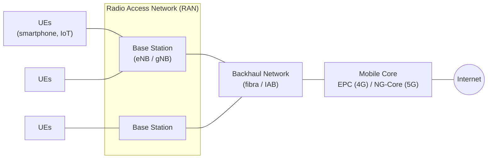
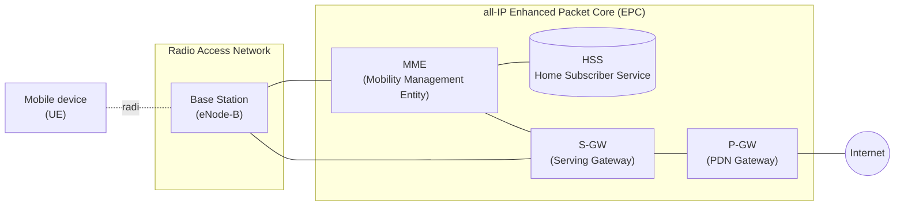
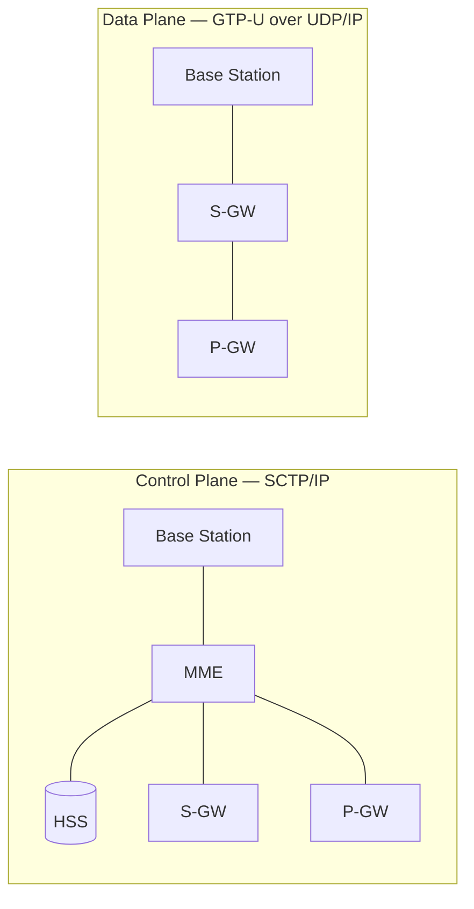
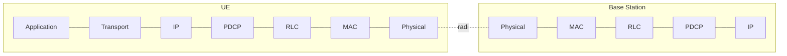
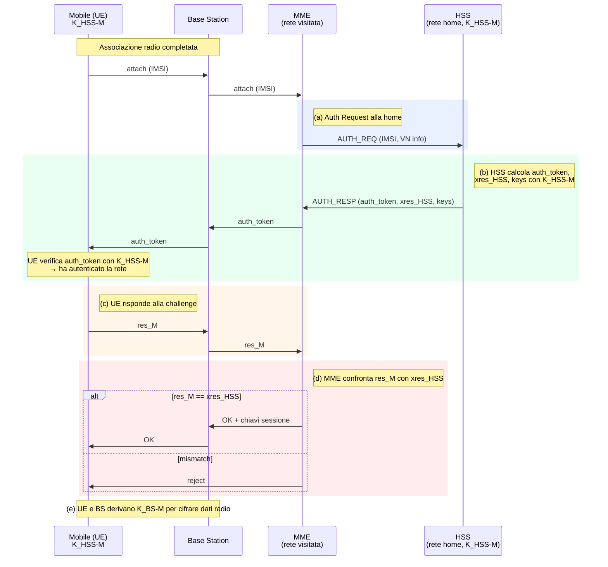

# 03 - Reti Mobili: Architettura e Mobilità dal 4G al 5G

Questa lezione introduce i fondamenti dell'architettura delle reti cellulari moderne, ripercorrendo l'evoluzione storica dal 1G fino al 5G e proiettandosi verso il 6G. Analizza come ogni generazione abbia trasformato il modello architetturale fino ad arrivare all'**all-IP core** del 4G LTE e alla **Service Based Architecture** del 5G. Esamineremo inoltre i meccanismi che rendono la mobilità un servizio nativo di prima classe, il tunneling GTP per il routing indiretto, l'autenticazione mutua (AKA) basata su SIM, e la separazione fra piano di controllo e piano dati.

> [!note] Riferimenti bibliografici
> Le slide sono un libero adattamento del libro **"Computer Networking: A Top-Down Approach"** (8ª edizione, 2020) di James F. Kurose e Keith W. Ross. Per l'architettura 5G il riferimento è **"5G Mobile Networks: A Systems Approach"** di Larry Peterson e Oguz Sunay. Il quadro evolutivo verso il 6G riprende: Zakria Qadir et al., *"Towards 6G Internet of Things: Recent advances, use cases, and open challenges"*, Elsevier, Giugno 2023.

***

## L'evoluzione delle reti cellulari: dal 1G al 6G

Le reti cellulari hanno attraversato una trasformazione da semplici sistemi di telefonia analogica a infrastrutture distribuite per l'Internet of Things globale.

Il **1G** degli anni '80 (AMPS, TACS) trasportava voce analogica multiplexata in frequenza (FDMA). Negli anni '90 il **2G** introduce voce digitale (GSM, CDMA) con TDM+FDM e SMS; con l'estensione **2.5G/GPRS** si affaccia la **commutazione a pacchetto per i dati**. Il **3G** (UMTS, HSPDA) porta l'accesso Web in mobilità: voce a circuito, dati a pacchetto.

La svolta architetturale arriva con il **4G** (LTE Advanced): tutto il traffico viaggia su un **All-IP core**, tunnelizzato come pacchetti IP dalla Base Station al gateway. Si introduce la separazione fra piano di controllo e piano dati. Il **5G** (5G NR) ridisegna il core in chiave cloud-native (**Service Based Architecture**), introduce il **network slicing** e sfrutta frequenze sub-6 GHz e onde millimetriche (mmWave). Il **6G**, atteso intorno al 2030, punta a un ecosistema "fully-connected" potenziato da AI con architetture *cell-less*.

| Gen | Anni | Standard | Velocità | Accesso | Voice switch | Data switch | Caratteristiche |
|---|---|---|---|---|---|---|---|
| **1G** | 1980s | AMPS, TACS | 2.4 kbps | FDMA | Circuit | Circuit | Voce analogica, copertura limitata |
| **2G** | 1990s | GSM, CDMA, EDGE | 64 kbps | TDM+FDM | Circuit | Circuit | Voce digitale + SMS |
| **2.5G** | fine '90s | GPRS | — | — | Circuit | Packet | Prima commutazione a pacchetto sui dati |
| **3G** | 2000s | UMTS, HSPDA | fino a 2 Mbps | CDMA | Circuit | Packet | Web in mobilità |
| **4G** | 2010s | LTE Advanced | 100–1000 Mbps | OFDMA | Packet | Packet | All-IP core, tunneling, separazione control/data |
| **5G** | 2020s | 5G NR | fino a ~20 Gbps | OFDMA + mmWave | Packet | Packet | SBA, network slicing, sub-6 GHz + mmWave |
| **6G** | 2030s (prev.) | — | ~1 Tbps | — | — | — | Cell-less, AI-native, fully-connected |

> [!tip] La traiettoria di fondo
> A ogni generazione la rete diventa più simile a Internet, modularizzando il core in microservizi (5G). La direzione è una rete cellulare **indistinguibile da un cloud distribuito**, dove la mobilità è una feature applicativa.

***

## Architettura di alto livello: RAN, Backhaul, Mobile Core

L'architettura di una rete cellulare 4G/5G si scompone in tre blocchi funzionali:

- **Radio Access Network (RAN)** — la rete d'accesso radio: una collezione distribuita di **Base Station** che gestiscono lo spettro radio condiviso all'interno della loro **cella**.
- **Backhaul Network** — interconnette la RAN con il Mobile Core. Tipicamente in fibra ottica, o soluzioni wireless (IAB).
- **Mobile Core Network** — fornisce connettività IP per dati/voce, garantisce QoS, traccia la mobilità e gestisce billing. Chiamato **Evolved Packet Core (EPC)** in 4G e **NG-Core** in 5G.

***

## Gli elementi dell'architettura 4G LTE

L'architettura 4G LTE è chiamata **all-IP Enhanced Packet Core (EPC)**. I concetti base sopravvivono in 5G:

- **User Equipment (UE)**: Qualsiasi dispositivo con radio LTE (smartphone, IoT). L'identità globale è l'**IMSI**, memorizzato sulla **SIM**.
- **Base Station (eNode-B)**: Gestisce le risorse radio wireless nella sua cella. A differenza del Wi-Fi, coordina gli **handover**, minimizza interferenze, crea tunnel IP verso il core e gestisce la mobilità intercella.
- **Mobility Management Entity (MME)**: "Cervello" del piano di controllo. Coordina l'autenticazione, handover, tracking/paging, e setup dei tunnel.
- **Home Subscriber Service (HSS)**: Database centrale con info sugli abbonati. Collabora con MME per l'autenticazione.
- **Serving Gateway (S-GW)**: Inoltra pacchetti dal/verso la RAN. Funge da **Local Mobility Anchor** durante gli handover inter-eNB.
- **PDN Gateway (P-GW)**: Connette il core 4G alle reti dati esterne (Internet). Svolge NAT, policy, traffic shaping e charging. S-GW e P-GW possono essere co-locati.

### Separazione tra Control Plane e Data Plane

L'LTE separa nettamente **Piano di Controllo** e **Piano Dati**, principio mutuato dall'SDN. La Base Station si trova sull'incrocio e inoltra entrambi.
- **Control Plane**: pacchetti tunnelizzati su **SCTP/IP** (protocollo affidabile per segnalazione).
- **Data Plane**: pacchetti incapsulati in tunnel **GTP-U** (GPRS Tunneling Protocol over UDP).

> [!tip] Perché la separazione è cruciale
> Disaccoppiare i piani permette di scalarli indipendentemente e abilita la virtualizzazione delle funzioni di controllo (NFV), dominante nel 5G.

***

## Lo Spettro della Mobilità e la Home Network

La mobilità non è una proprietà binaria. Per gestirla è indispensabile una **home network**: una fonte autorevole che registra la posizione del dispositivo.
Nelle reti cellulari la home network è l'operatore con cui l'utente ha il contratto (es. Vodafone, TIM), il cui database è l'HSS. Quando un dispositivo lascia la propria rete, entra in una **visited network** (*roaming*), basato su accordi commerciali.

![[Screenshot 2026-03-10 alle 14.37.18.png]]
*Fig. — Struttura della home network in un'architettura 4G/5G.*

![[Pasted image 20260313143711.png]]
*Fig. — Relazione tra home network e visited network in uno scenario di roaming.*

Le reti cellulari formano una "rete di reti IP" connesse via IPX (IP eXchange). A differenza di Internet cablata o del Wi-Fi (dove l'autenticazione è locale e la mobilità fluida è complessa), nelle reti cellulari la mobilità è un servizio nativo di prima classe e l'identità è legata alla SIM.

### Approcci alla Gestione della Mobilità: Registrazione e Routing

La home network deve sempre conoscere la posizione del dispositivo. Ciò avviene tramite **registrazione**: il dispositivo si associa a un *mobility manager* nella rete visitata (es. MME), che comunica la posizione all'HSS.

![[Pasted image 20260313143813.png]]
*Fig. — Procedura di registrazione tra visited network e home network.*

Per il recapito dei pacchetti, l'architettura sposta la complessità ai margini della rete, con due possibili tecniche:

1. **Routing Indiretto** (standard 4G LTE e Mobile IP): I pacchetti diretti al mobile sono inviati al gateway della home network, che li incapsula in un tunnel verso il gateway della rete visitata. Questo genera *triangle routing* ma rende la mobilità trasparente al nodo corrispondente. Servono tre protocolli: associazione, registrazione e tunneling.
2. **Routing Diretto**: Il corrispondente interroga l'HSS per il care-of-address del dispositivo e manda i datagrammi direttamente. Elimina il triangle routing, ma gestire un cambio di rete a sessione in corso è molto complesso.

### Il tunneling GTP: il pilastro della mobilità 4G/5G

Il 4G adotta il **routing indiretto** tramite tunneling **GTP-U**.
Il datagramma originario emesso dall'UE viene incapsulato con GTP e inviato dentro UDP all'S-GW, che lo re-incapsula per il P-GW.
Questo meccanismo mantiene gli **indirizzi IP visibili a Internet fissi** (quelli di S-GW e P-GW). Durante un cambio di cella, basta **aggiornare gli endpoint del tunnel GTP** (es. l'indirizzo della Base Station). L'IP dell'UE resta inalterato e le sessioni TCP non cadono.

*Fig. — Composizione degli header GTP nel doppio senso del traffico per preservare l'IP sorgente e destinazione.*

***

## Mobilità Pratica: Handover, Sleep Modes e Associazione

### Associazione e Sleep Modes
Per preservare la batteria, i dispositivi vanno in **sleep mode** (light o deep). In deep sleep, al risveglio, potrebbero aver cambiato cella e devono ristabilire l'associazione per ricevere messaggi di **paging** (broadcastati dall'MME).
L'associazione avviene leggendo i segnali di sincronizzazione (primary e secondary) e i dati di sistema broadcastati dalla BS ogni 5 ms.

### Handover tra Base Station
Quando la qualità del segnale degrada, il dispositivo si sposta su un'altra BS senza interrompere le connessioni (handover).

1. La **BS sorgente** decide l'handover e invia una *Handover Request* alla *target BS*.
2. La **target BS** pre-alloca risorse e risponde con *ACK*.
3. La **BS sorgente** notifica l'UE, che inizia a trasmettere sulla nuova cella.
4. La **BS sorgente** fa forward dei datagrammi in arrivo verso la target BS per non perderli.
5. La **target BS** informa l'**MME**.
6. L'**MME** istruisce l'**S-GW** di aggiornare l'endpoint del tunnel GTP alla nuova target BS.
7. Il traffico fluisce sul **nuovo tunnel**.

> [!tip] Decisione dell'handover
> La decisione dell'handover e la scelta della target BS spettano alla **BS sorgente**, non all'MME, il quale interviene solo alla fine per aggiornare il piano dati.

![[Pasted image 20260313145859.png]]
*Fig. — Sequenza di messaggi durante un handover tra due Base Station in 4G.*

***

## Lo stack del Data Plane LTE

Sul primo hop (UE ↔ BS), si aggiungono quattro livelli sotto l'IP:
1. **PDCP**: compressione header e crittografia.
2. **RLC**: frammentazione e link affidabile (ACK/NACK).
3. **MAC**: scheduling risorse radio, rilevazione errori.
4. **Physical Layer**: modulazione OFDM, distribuisce time slot da 0.5 ms su sottoportanti ortogonali, raggiungendo centinaia di Mbps.

***

## Sicurezza e autenticazione in 4G LTE: il protocollo AKA

Quando un UE arriva in una rete, deve **associarsi alla BS** e **autenticarsi mutamente** con la rete. La SIM fornisce l'identità globale e la chiave segreta $K_{HSS\text{-}M}$. L'HSS fa da "ultimate authenticator", ma in 4G la decisione passa per l'MME visitato.

Il protocollo **AKA** (Authentication and Key Agreement) è basato su challenge-response simmetrica.

1. **Attach**: L'UE invia l'IMSI all'MME, che lo gira all'HSS.
2. **Challenge**: L'HSS usa la chiave segreta $K_{HSS\text{-}M}$ per generare un `auth_token`, la risposta attesa `xres_HSS` e chiavi di sessione. Manda all'MME, che inoltra l'`auth_token` all'UE. L'UE lo decifra e lo verifica. **L'UE ha autenticato la rete.**
3. **Risposta UE**: L'UE calcola `res_M` con la sua $K_{HSS\text{-}M}$ e lo invia all'MME.
4. **Verifica**: L'MME confronta `res_M` con `xres_HSS`. Se coincidono, **la rete ha autenticato l'UE**.
5. **Derivazione chiavi**: UE e BS derivano una chiave di sessione (es. AES) per cifrare il canale radio.

> [!question] Perché $\text{res}_M = \text{xres}_{HSS}$ dimostra l'identità?
> Perché la funzione dipende dalla chiave segreta nota solo alla SIM e all'HSS. Se i valori coincidono, l'UE possiede certamente la chiave.

***

## La rivoluzione del 5G: prestazioni, architettura e sicurezza

Il 5G (New Radio) alza le prestazioni con bande **FR1** (sub-6 GHz) e **FR2** (mmWave fino a 52 GHz, richiede picocelle e antenne MIMO), gestendo tre scenari:
- **eMBB** (Enhanced Mobile Broadband): larghezza di banda estrema per video 4K, VR.
- **URLLC** (Ultra Reliable Low-Latency): latenza <1ms per guida autonoma, industria 4.0.
- **mMTC** (Massive Machine Type Comms): connessioni IoT massicce, ultra-low power, 1M nodi/km².

### 5G Core e Service Based Architecture (SBA)
La **NG-Core** del 5G è cloud-native. Basata su **Network Function Virtualization (NFV)**, le funzioni di rete sono microservizi (container/VM) che si parlano tramite **Service-Based Interface (SBI)** (REST HTTP/2).

| **Componente 4G** | **Corrispettivo 5G** | **Funzione** |
|---|---|---|
| **eNB** | **gNB** | Radio 5G modulare, divisa in Distributed e Central Unit. |
| **S-GW + P-GW** | **UPF** (User Plane Function) | Inoltra traffico RAN-Internet. Distribuibile all'edge. |
| **MME** | **AMF + SMF** | **AMF**: mobilità, autenticazione. **SMF**: gestione sessioni. |
| **HSS** | **AUSF + UDM** | **AUSF**: autenticazione. **UDM**: dati abbonamento/identità. |
| **PCRF** | **PCF** | Policy Control Function. |

Funzioni di supporto cloud-native (statelessness): **SDSF/UDSF** per archiviazione, **NRF** per service discovery, **NEF** per API verso terzi, e **NSSF** per il **Network Slicing**.

La distribuzione dell'**UPF** all'edge abilita il **Multi-Access Edge Computing (MEC)**, fondamentale per abbattere le latenze (URLLC).

*Fig. — Architettura 5G User Plane: l'UPF distribuito e il MEC all'edge abilitano elaborazione a bassissima latenza.*

### Opzioni di deployment
L'adozione varia fra **Non-Standalone (NSA)** (radio 5G per i dati, piano di controllo appoggiato sull'EPC 4G) e **Standalone (SA)** (rete 5G pura con NG-Core). In Europa domina ancora NSA.

### Sicurezza in 5G vs 4G
Il 5G risolve due falle storiche:
1. **Decisione di autenticazione**: In 5G la decisione finale è presa dalla **rete home** (AUSF), mentre l'AMF visitato è solo un tramite, riducendo l'impatto se una rete visitata viene compromessa.
2. **Trasmissione dell'IMSI**: In 4G l'IMSI viaggia in chiaro alla connessione (esponendo ad attacchi *IMSI catcher*). Il 5G cifra l'IMSI con la **chiave pubblica della home network** (creando il SUCI), schermando l'identità.

***

## Mobile IP e Impatto sui Protocolli di Trasporto

L'architettura **Mobile IP** (RFC 5944) fu uno standard teorico precedente che univa concetti simili al routing indiretto (con *home agent* e *foreign agent*), ma non ha avuto successo commerciale a differenza delle reti 4G.
Sui protocolli di trasporto (TCP), il canale radio mobile crea problemi. Perdite per interferenze o interruzioni transitorie in handover inducono TCP, nativo su fili, a ridurre drasticamente la *congestion window* interpretando gli errori radio come congestioni di rete, portando a cali inopportuni di throughput.

***

> [!abstract] Sintesi
> Dalle reti analogiche si è passati all'All-IP Core del 4G (con separazione control/data plane) e alla Service Based Architecture 5G basata su microservizi e network slicing. La mobilità è gestita tramite tunneling GTP (routing indiretto), mantenendo le sessioni IP attive durante il passaggio tra celle. L'autenticazione è garantita dal protocollo challenge-response AKA basato su SIM, reso più sicuro in 5G grazie alla crittografia a chiave pubblica per l'identità (IMSI) e all'accentramento delle decisioni di trust nella Home Network. Il 5G apre nuovi scenari a banda altissima e latenza ridotta (MEC) ma eredita, nei livelli superiori, i problemi di efficienza TCP su mezzi con errori frequenti.

> [!question] Possibili domande d'esame
> - Differenze tra routing indiretto e diretto, e concetto di triangle routing.
> - Tre protocolli necessari per implementare routing indiretto in 4G.
> - I ruoli di MME, HSS, S-GW, P-GW, e la loro mappatura in 5G (AMF, SMF, UPF, ecc.).
> - Come il tunneling GTP supporta la mobilità mantenendo le sessioni TCP attive.
> - La procedura di handover tra due Base Station e chi la decide.
> - Il protocollo AKA: descrizione, calcolo crittografico e mutua autenticazione.
> - Le due differenze di sicurezza cruciali tra 4G e 5G (IMSI catcher e trust model).
> - Cos'è la Service Based Architecture e perché il 5G usa NRF/UDSF.
> - I tre scenari applicativi del 5G (eMBB, URLLC, mMTC) e il ruolo dell'UPF/MEC.
> - Perché le perdite radio degradano le prestazioni TCP?
